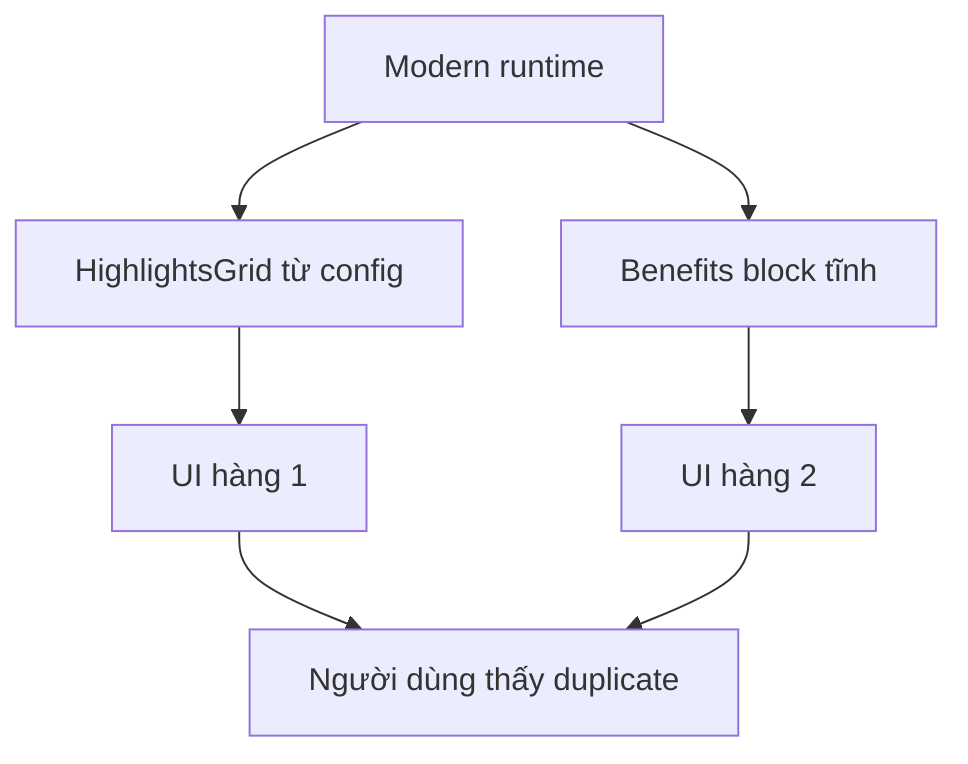

## Audit Summary
- Observation: Lỗi còn sót không nằm ở block hardcode `Điểm nổi bật` trong `heroStyle = split` nữa; block đó đã được bỏ nhưng site vẫn hiện 2 cụm vì còn một block khác ở runtime modern.
- Evidence 1: Trong `app/(site)/products/[slug]/page.tsx`, layout `modern` render `showHighlights && <HighlightsGrid ... />` quanh vùng line ~2144.
- Evidence 2: Ngay sau đó cùng layout `modern`, còn có một block benefits cố định trong `showStock` với 3 item: `Miễn phí vận chuyển`, `Bảo hành 12 tháng`, `Đổi trả 30 ngày` quanh vùng ~2146–2166.
- Evidence 3: Ảnh user gửi khớp chính xác: hàng trên là `HighlightsGrid`; hàng dưới là benefits cố định nên nhìn như duplicate highlights.
- Decision: Theo yêu cầu user, giữ `HighlightsGrid` làm nguồn hiển thị duy nhất và bỏ hẳn block benefits cố định trong modern runtime.

## Root Cause Confidence
**High** — duplicate hiện tại đến từ việc layout `modern` render đồng thời:
1. `HighlightsGrid` lấy từ config/highlights data
2. block benefits tĩnh nằm trong phần stock info
Không phải do editor config, không phải do `heroStyle = split` nữa, và không phải do preview component (grep preview không còn các text benefits tĩnh này).

## TL;DR kiểu Feynman
- Modern đang có 2 hàng thông tin gần giống nhau.
- Hàng 1 là Highlights thật lấy từ config.
- Hàng 2 là benefits viết cứng trong code site.
- Vì cả hai cùng hiện nên trông bị lặp.
- Sửa đúng là xóa hàng benefits viết cứng, giữ lại Highlights thật.

## Files Impacted
- **Sửa:** `app/(site)/products/[slug]/page.tsx`
  - Vai trò hiện tại: runtime trang chi tiết sản phẩm cho classic/modern/minimal.
  - Thay đổi: bỏ block benefits cố định trong nhánh `modern` (các item `Miễn phí vận chuyển`, `Bảo hành 12 tháng`, `Đổi trả 30 ngày`) để modern chỉ còn `HighlightsGrid`.

- **Rà, khả năng không cần sửa:** `components/experiences/previews/ProductDetailPreview.tsx`
  - Vai trò hiện tại: preview product-detail trong experience editor.
  - Audit hiện tại không thấy benefits block tĩnh tương tự theo text search; chỉ cần xác nhận preview vẫn còn đúng 1 cụm highlights và không cần chỉnh thêm.

## Execution Preview
1. Mở `app/(site)/products/[slug]/page.tsx` tại nhánh render `ModernStyle`.
2. Xóa block benefits cố định ngay dưới `showHighlights && <HighlightsGrid ... />` trong phần `showStock` của modern.
3. Giữ nguyên stock status text nếu đang được dùng ở vị trí khác; chỉ bỏ 3 benefit items tĩnh.
4. Rà `components/experiences/previews/ProductDetailPreview.tsx` để đảm bảo preview không còn pattern duplicate tương tự.
5. Static review: kiểm tra modern/full, modern/split, modern/minimal không còn 2 hàng tương tự nhau; classic/minimal không bị ảnh hưởng.
6. Sau khi code: chạy `bunx tsc --noEmit`, rồi commit local theo rule repo.

## Acceptance Criteria
- Ở `/products/[slug]` với layout `modern`, chỉ còn 1 cụm highlights.
- Các item `Miễn phí vận chuyển`, `Bảo hành 12 tháng`, `Đổi trả 30 ngày` không còn render như một hàng riêng trong modern.
- `HighlightsGrid` vẫn render bình thường khi `showHighlights = true`.
- Classic và minimal không đổi behavior.
- Preview/editor không bị lệch so với runtime về số cụm highlights trong modern.

## Verification Plan
- **Static review:** xác nhận block benefits cố định đã bị bỏ đúng chỗ và `HighlightsGrid` vẫn còn.
- **Typecheck:** `bunx tsc --noEmit` sau khi sửa vì có thay đổi TSX.
- **Manual repro cho tester:** mở `http://localhost:3000/products/website-giay-thanshoesvn` khi layout đang là modern; xác nhận không còn hàng benefits thứ hai như ảnh.

## Audit theo 8 câu bắt buộc
1. Triệu chứng: expected là modern có 1 cụm highlights; actual là site vẫn hiện 2 hàng tương tự nhau.
2. Phạm vi: runtime product detail layout modern.
3. Tái hiện: có, ổn định; mở product detail khi layout là modern.
4. Mốc thay đổi gần nhất: fix trước đã bỏ 1 nguồn duplicate nhưng chưa chạm benefits block tĩnh trong modern runtime.
5. Dữ liệu thiếu: không thiếu gì để làm fix tối thiểu.
6. Giả thuyết thay thế đã loại trừ: không phải preview; không phải config dùng chung; không phải block `Điểm nổi bật` trong split hero nữa.
7. Rủi ro nếu fix sai nguyên nhân: có thể làm mất thông tin stock phụ hoặc vẫn còn duplicate.
8. Pass/fail: pass khi modern runtime chỉ còn 1 cụm highlights quan sát được.

## Out of Scope
- Không đổi cấu trúc config highlights.
- Không thêm setting riêng cho benefits.
- Không refactor toàn bộ modern info section.

## Risk / Rollback
- Rủi ro thấp vì chỉ bỏ một block UI tĩnh trong modern runtime.
- Rollback dễ: revert file `app/(site)/products/[slug]/page.tsx`.

<!-- B = highlights thật, C = benefits hardcode -->