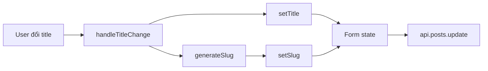

## Audit Summary
- Observation: Route người dùng nêu `http://localhost:3000/admin/posts/.../edit` map tới `app/admin/posts/[id]/edit/page.tsx`.
- Observation: Trang edit hiện nạp `slug` từ dữ liệu cũ một lần (`setSlug(postData.slug)`), nhưng khi đổi `title` thì không có logic regenerate slug.
- Observation: Trang create posts đã có pattern generate slug từ title, còn edit thì thiếu.
- Observation: User đã chốt yêu cầu UX: khi sửa tiêu đề thì slug phải luôn cập nhật theo title; với bài viết cũ cũng phải đồng bộ lại theo title mới.
- Decision: Sửa tối thiểu ngay tại edit page, bám pattern trang create và các resource edit khác trong repo đang auto-sync slug theo title.

## Root Cause Confidence
**High** — nguyên nhân trực tiếp là `app/admin/posts/[id]/edit/page.tsx` không có `handleTitleChange`/`generateSlugFromTitle` để cập nhật `slug` khi `title` thay đổi, trong khi create page có. Counter-hypothesis đã được rà:
- Không phải backend tự khóa slug: backend `update` chỉ nhận slug client gửi lên và check unique.
- Không phải route khác: state `title/slug` và submit mutation đều nằm ngay trong page edit posts.
- Không phải pattern toàn hệ thống cấm auto-sync: products/services/categories edit đều đã auto-sync slug theo title/name.

## TL;DR kiểu Feynman
- Trang sửa bài viết đang nhớ slug cũ rồi đứng im.
- Vì vậy đổi tiêu đề xong, slug không đổi theo.
- Ta chỉ cần cho ô tiêu đề gọi cùng hàm tạo slug như trang tạo mới.
- Mỗi lần title đổi, slug sẽ đổi theo ngay.
- Backend vẫn giữ check trùng slug như cũ, nên scope sửa nhỏ.

## Files Impacted
- **Sửa:** `app/admin/posts/[id]/edit/page.tsx`
  - Vai trò hiện tại: trang edit bài viết, quản lý form state và gọi mutation update.
  - Thay đổi: thêm hàm slugify/handler đổi title để `slug` luôn regenerate từ `title`, đồng thời thay input title từ inline setter sang handler dùng chung.

## Execution Preview
1. Đọc lại `app/admin/posts/[id]/edit/page.tsx` và đối chiếu `app/admin/posts/create/page.tsx` để copy đúng công thức slug hiện có.
2. Thêm `generateSlugFromTitle` cục bộ hoặc tái dùng logic cùng biểu thức hiện tại để tránh lệch format.
3. Tạo `handleTitleChange(value)` trong edit page: cập nhật `title` và `slug` cùng lúc.
4. Nối `onChange` của input title sang handler mới; giữ input slug và submit flow hiện tại.
5. Static review: kiểm tra typing, null-safety, submit payload, trạng thái initial load/edit existing post.
6. Sau khi code xong: chạy `bunx tsc --noEmit` theo rule repo vì có thay đổi TS, rồi commit local, không push.

## Acceptance Criteria
- Khi đổi tiêu đề trong `/admin/posts/[id]/edit`, giá trị slug trên form đổi ngay theo title mới.
- Với bài viết cũ có slug khác title trước đó, sau khi đổi title thì slug cũng đổi theo title mới.
- Submit update vẫn gửi slug mới lên mutation `api.posts.update`.
- Không làm đổi các field khác hoặc flow tải dữ liệu ban đầu.
- Nếu backend phát hiện slug trùng, hành vi lỗi hiện tại vẫn giữ nguyên.

## Verification Plan
- **Typecheck:** `bunx tsc --noEmit` sau khi sửa vì có thay đổi code TypeScript.
- **Static review:** so khớp regex slugify giữa create/edit; kiểm tra không còn inline `setTitle(...)` làm bypass sync; xác nhận payload submit dùng state `slug` mới.
- **Manual repro cho tester:** mở route edit post, đổi title, quan sát slug cập nhật tức thì; lưu bài viết; reload lại và xác nhận slug mới đã được persist.

## Audit theo 8 câu bắt buộc
1. Triệu chứng: expected là đổi title thì slug đổi theo; actual là title đổi nhưng slug giữ nguyên.
2. Phạm vi: ảnh hưởng trang admin edit post, cụ thể module posts.
3. Tái hiện: có, ổn định; chỉ cần mở trang edit bài viết bất kỳ và đổi title.
4. Mốc thay đổi gần nhất: chưa cần quy về commit cụ thể vì evidence code hiện tại đã đủ rõ ở route edit vs create.
5. Dữ liệu thiếu: không thiếu gì quan trọng để làm fix tối thiểu.
6. Giả thuyết thay thế: backend, mutation, uniqueness check đã bị loại trừ vì không tự sinh slug.
7. Rủi ro nếu fix sai nguyên nhân: slug vẫn stale hoặc format slug lệch create page.
8. Pass/fail: pass khi slug update live theo title trên edit page và submit đúng payload.

## Out of Scope
- Không đổi behavior của create page.
- Không refactor dùng chung slug util toàn module.
- Không thêm cơ chế “giữ slug chỉnh tay” vì user đã chốt luôn auto-sync.

## Risk / Rollback
- Rủi ro thấp vì chỉ chạm một page UI và không đổi schema/backend.
- Rollback dễ: revert duy nhất file `app/admin/posts/[id]/edit/page.tsx`.

<!-- U=user, H=handler, M=Convex mutation -->