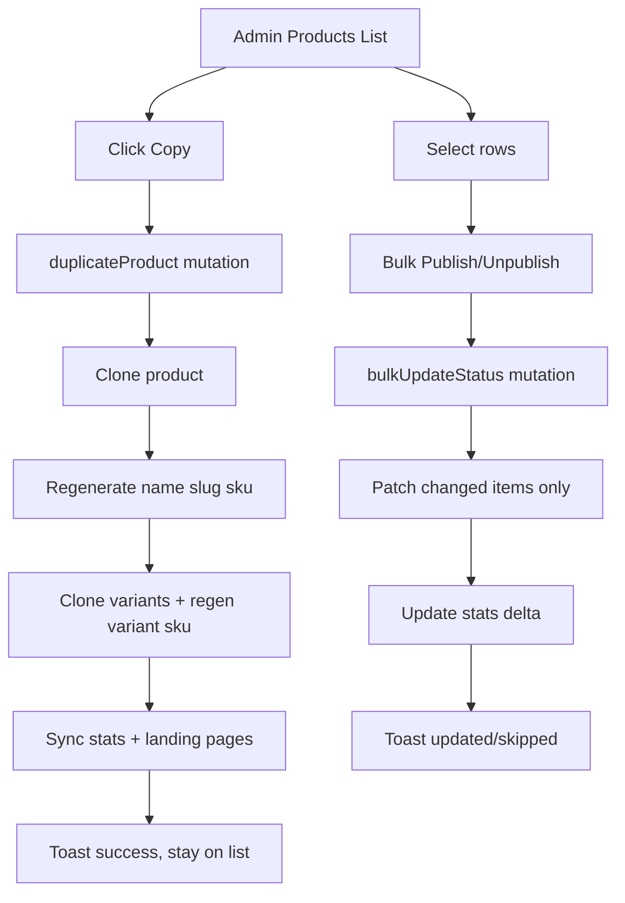

## Audit Summary
- Observation:
  - `app/admin/products/page.tsx` hiện có row actions: xem web, quản lý biến thể, sửa, xóa; chưa có action copy sản phẩm.
  - `BulkActionBar` trong `app/admin/components/TableUtilities.tsx` hiện mới wired cho xóa hàng loạt qua `onDelete`, chưa hỗ trợ nhóm action khác như publish/unpublish.
  - `convex/products.ts` đã có `create`, `update`, `remove`, `bulkRemove`, `listAdminIds`, `countAdmin`; chưa có mutation chuyên cho duplicate hoặc bulk đổi status.
  - `convex/products.ts` và `convex/schema.ts` đang enforce uniqueness cho `slug` và `sku`; `convex/productVariants.ts` cũng enforce unique `sku` cho biến thể.
- Inference:
  - Muốn copy sản phẩm đúng nghiệp vụ phải xử lý clone product + clone variants + regenerate các trường unique để không đụng validation hiện có.
  - Muốn bulk action “giống SaaS lớn” thì nên ưu tiên publish/unpublish ở level list, không đẩy người dùng vào từng form edit.
- Decision:
  - Triển khai 2 phần trong cùng scope:
    1. Thêm row action `Copy sản phẩm`.
    2. Mở rộng bulk actions với `Publish` và `Unpublish` ngoài `Xóa`.

## Root Cause Confidence
- High — vì evidence trong code đã rõ: UI list chưa có affordance cho duplicate, backend chưa có mutation duplicate/bulk-status, và uniqueness của `slug`/`sku`/variant SKU khiến không thể chỉ gọi lại create/update theo dữ liệu cũ.

## TL;DR kiểu Feynman
- Mỗi dòng sản phẩm sẽ có thêm nút `Copy` để tạo bản sao nhanh.
- Bản sao giữ nguyên dữ liệu chính và giữ nguyên trạng thái cũ theo yêu cầu của anh.
- Tên bản sao sẽ thành `Tên cũ (copy)`.
- Các trường phải duy nhất như `slug`, `sku`, SKU của biến thể sẽ được tự sinh phiên bản mới để không bị trùng.
- Nếu sản phẩm có biến thể thì sẽ copy cả biến thể.
- Bulk actions sẽ có thêm `Publish` và `Unpublish`, giống pattern quản trị quen thuộc của các SaaS lớn.

## Audit Questions
1. Triệu chứng observed?
   - Expected: ở `/admin/products` có thể duplicate nhanh một sản phẩm và đổi trạng thái hàng loạt.
   - Actual: chỉ có edit/delete từng dòng và bulk delete.
2. Phạm vi ảnh hưởng?
   - Admin products list + Convex product mutations + variant duplication path.
3. Có tái hiện ổn định không?
   - Có. File list hiện tại không render copy action và bulk bar chưa expose status actions.
4. Mốc thay đổi gần nhất?
   - Không cần truy commit để kết luận root cause; code hiện tại đã đủ evidence.
5. Dữ liệu còn thiếu?
   - Không còn ambiguity nghiệp vụ chính; anh đã chốt giữ nguyên trạng thái, ở lại list + toast, unique fields phải tự xử lý, và copy cả biến thể.
6. Có giả thuyết thay thế nào chưa bị loại trừ?
   - Có: mở form create prefill thay vì duplicate ngay. Đã loại vì anh muốn hành động copy trực tiếp từ cột action và ở lại list.
7. Rủi ro nếu fix sai nguyên nhân?
   - Nếu clone mà không regenerate unique fields sẽ lỗi duplicate slug/SKU.
   - Nếu bulk status update quên sync stats thì số liệu dashboard/list lệch.
8. Tiêu chí pass/fail sau khi sửa?
   - Copy thành công tạo sản phẩm mới + tên ` (copy)` + không đụng unique conflicts.
   - Bulk publish/unpublish đổi đúng trạng thái cho selection hiện tại và count/stats không lệch.

## Counter-Hypothesis
- H1: Chỉ thêm nút “copy” ở UI rồi điều hướng sang create form đã điền sẵn.
  - Không recommend vì dài thao tác hơn, không đúng flow anh chốt “ở lại list và toast thành công”.
- H2: Copy sản phẩm nhưng bỏ qua variants để giảm phức tạp.
  - Không phù hợp vì anh đã chốt copy cả biến thể.
- H3: Bulk action chỉ thêm active/inactive toggle ở client bằng loop từng item.
  - Không recommend vì sẽ chậm, khó rollback theo batch, và khó giữ stats nhất quán.

## Proposal
### Nghiệp vụ copy sản phẩm
- Thêm action `Copy` ở cột hành động của mỗi row.
- Khi bấm:
  1. Backend đọc product gốc.
  2. Tạo product mới với toàn bộ field business hợp lệ được clone.
  3. `name` mới = `${name cũ} (copy)`.
  4. Giữ nguyên `status` của sản phẩm gốc theo yêu cầu.
  5. Tự sinh `slug` mới từ slug gốc, ưu tiên pattern ổn định kiểu:
     - `slug-cu-copy`
     - nếu trùng tiếp: `slug-cu-copy-2`, `slug-cu-copy-3`...
  6. Tự sinh `sku` mới cho product, pattern tương tự:
     - `sku-cu-copy`
     - nếu trùng: `sku-cu-copy-2`, ...
  7. `sales` reset về `0`.
  8. `order` lấy next order như luồng create hiện tại.
  9. Clone media/meta/content fields nếu có.
  10. Nếu `hasVariants=true`, clone toàn bộ variants sang product mới và regenerate variant SKU theo pattern tương tự.
- UX sau khi copy:
  - Ở lại list.
  - Toast thành công, ví dụ: `Đã tạo bản sao sản phẩm`.
  - Không tự redirect.

### Nghiệp vụ bulk actions
- Ngoài `Xóa`, thêm tối thiểu 2 action:
  - `Publish` → set status = `Active`
  - `Unpublish` → set status = `Draft`
- Lý do chọn như SaaS lớn:
  - Pattern quản trị phổ biến là hàng loạt publish/unpublish từ list view.
  - `Draft` là trạng thái an toàn hơn `Archived` cho tác vụ unpublish vì còn quay lại chỉnh sửa/publish lại nhanh.
- Rule xử lý:
  - Chỉ update các item cần đổi thật sự; item đã ở trạng thái đích thì bỏ qua.
  - Trả về count `updated/skipped` để toast rõ ràng.
  - Update stats counters chuẩn theo status transition.

## Root Cause -> Fix mapping
- Root cause 1: List UI chưa expose hành động copy.
  - Fix: thêm button/icon copy ở row actions.
- Root cause 2: Backend chưa có duplication contract.
  - Fix: thêm mutation duplicate chuyên biệt ở `convex/products.ts`.
- Root cause 3: Bulk bar đang chỉ xoay quanh delete.
  - Fix: mở rộng BulkActionBar để render nhiều actions, trong đó có publish/unpublish.
- Root cause 4: Stats có thể lệch nếu bulk status/copy không đi qua update logic phù hợp.
  - Fix: reuse/encapsulate `updateStats` cho status transitions và create path.

## Files Impacted
### UI
- Sửa: `app/admin/products/page.tsx`
  - Vai trò hiện tại: trang list sản phẩm admin với filter, selection, excel actions, row actions, bulk delete.
  - Thay đổi: thêm row action copy, wire mutations `duplicate` + `bulkUpdateStatus`, thêm toast/loading state, mở rộng bulk action menu/buttons.

- Sửa: `app/admin/components/TableUtilities.tsx`
  - Vai trò hiện tại: shared table helpers, gồm `BulkActionBar` đang chỉ nhận `onDelete` như destructive action chính.
  - Thay đổi: refactor `BulkActionBar` để nhận thêm secondary bulk actions hoặc action slots cho `Publish`/`Unpublish` mà vẫn giữ delete.

### Server
- Sửa: `convex/products.ts`
  - Vai trò hiện tại: query/mutation chính cho products, gồm create/update/remove/bulkRemove/count/list admin.
  - Thay đổi:
    - thêm helper sinh unique `slug`/`sku` theo hậu tố `copy`, `copy-2`, ...
    - thêm mutation `duplicate` cho clone product + variants.
    - thêm mutation `bulkUpdateStatus` cho Active/Draft.
    - đảm bảo update `productStats` và `landingPages.syncProgrammaticFromSourceChange` sau duplicate/bulk-status.

- Sửa: `convex/productVariants.ts` hoặc giữ nguyên nếu logic clone nằm trọn trong `convex/products.ts`
  - Vai trò hiện tại: quản lý CRUD variant và unique SKU cho variants.
  - Thay đổi: có thể chỉ đọc shape/validation để clone đúng contract; chỉ sửa nếu cần extract helper clone variant dùng chung.

### Shared/Generated
- Không dự kiến sửa schema nếu không cần field mới.
- Không dự kiến thêm dependency mới.

## Execution Preview
1. Đọc kỹ contract product + variant để xác định các field clone được và field phải reset.
2. Thiết kế helper sinh unique name/slug/sku hậu tố `copy` ổn định, deterministic.
3. Thêm mutation duplicate ở `convex/products.ts`, clone product trước rồi clone variants.
4. Thêm mutation bulkUpdateStatus trong `convex/products.ts` với count updated/skipped.
5. Refactor `BulkActionBar` để hỗ trợ thêm action ngoài delete mà không phá các page khác.
6. Wire `app/admin/products/page.tsx` với nút copy ở row và nút Publish/Unpublish ở bulk bar.
7. Static review typing/null-safety/edge cases; sau đó commit.

## Chi tiết implement đề xuất
### 1) Duplicate helper
- Tạo helper kiểu `buildCopySuffix(base: string, n?: number)`.
- Tạo helper `generateUniqueProductSlug(ctx, baseSlug)` và `generateUniqueProductSku(ctx, baseSku)`.
- Tạo helper tương tự cho variant SKU.
- Name không cần unique cứng, nhưng vẫn chuẩn hóa theo:
  - copy đầu: `Tên A (copy)`
  - copy tiếp: `Tên A (copy 2)` nếu muốn đồng bộ UX với slug/sku.
- Recommend:
  - UI name dùng `(copy)` cho bản đầu, `(copy 2)` từ bản thứ 2.
  - slug/sku dùng `-copy`, `-copy-2`.

### 2) Duplicate mutation contract
- Input: `{ id: Id<"products"> }`
- Output: `{ id: Id<"products">, name: string }`
- Steps:
  - fetch product gốc; throw nếu không tồn tại.
  - lấy next order.
  - generate unique name/slug/sku.
  - insert product mới với `sales: 0`.
  - query tất cả variants theo `productId` nếu có; insert variants mới với `productId` mới và regenerated SKU.
  - giữ nguyên status cũ.
  - gọi `updateStats({ new: copied.status })`.
  - gọi `landingPages.syncProgrammaticFromSourceChange` một lần cuối.

### 3) Bulk status mutation contract
- Input: `{ ids: Id<"products">[], status: "Active" | "Draft" }`
- Output: `{ updated: number, skipped: number }`
- Steps:
  - limit batch hợp lý theo pattern hiện có.
  - load products song song.
  - chỉ patch item có status khác target.
  - mỗi transition gọi update stats old/new.
  - sync landing pages sau batch hoàn tất.

### 4) UI bulk actions pattern
- Recommend dùng layout:
  - trái: message selection scope như hiện tại
  - phải: nhóm actions `Publish`, `Unpublish`, `Xóa`
- `Publish` dùng variant secondary/success nhẹ.
- `Unpublish` dùng outline/secondary.
- `Xóa` vẫn là destructive.
- Disable button khi selection rỗng hoặc loading.

### 5) Toast copy/bulk
- Copy:
  - success: `Đã tạo bản sao: {name}`
  - error: `Không thể copy sản phẩm`
- Bulk status:
  - success: `Đã cập nhật 12 sản phẩm, bỏ qua 3 sản phẩm`
  - nếu updated=0: toast info `Không có sản phẩm nào cần cập nhật`

## Acceptance Criteria
- Ở `/admin/products`, mỗi row có thêm action copy.
- Bấm copy tạo sản phẩm mới với tên `Tên cũ (copy)` ở lần đầu.
- Product copy giữ nguyên status gốc.
- Product copy có `slug`/`sku` khác bản gốc và không trùng DB.
- Nếu product gốc có variants thì variants cũng được copy sang product mới, với variant SKU không trùng.
- Sau copy, user vẫn ở trang list và thấy toast thành công.
- Bulk bar có thêm `Publish` và `Unpublish` ngoài `Xóa`.
- Chọn nhiều dòng rồi publish/unpublish sẽ cập nhật đúng status và phản ánh đúng count/stat.
- Các action không làm hỏng flow select page/select all hiện có.

## Verification Plan
- Typecheck: `bunx tsc --noEmit`
- Static review checklist:
  1. Không có đường nào clone product mà giữ nguyên slug/SKU cũ.
  2. Variant SKU clone luôn regenerate.
  3. `updateStats` được gọi đúng khi create copy và khi status transition bulk.
  4. `landingPages.syncProgrammaticFromSourceChange` vẫn được trigger sau thay đổi nguồn product.
  5. UI loading state chặn double-submit cho copy và bulk status.
  6. Toast message khớp result `updated/skipped`.
- Repro thủ công cho tester:
  1. Copy sản phẩm không có variants.
  2. Copy sản phẩm có variants.
  3. Copy liên tiếp cùng 1 sản phẩm nhiều lần để kiểm tra suffix tăng dần.
  4. Bulk publish selection mixed statuses.
  5. Bulk unpublish selection mixed statuses.
  6. Kiểm tra dashboard/list stats không lệch sau các thao tác trên.

## Risk / Rollback
- Rủi ro chính:
  - suffix generation không bao phủ hết case trùng nhiều lần.
  - clone variants nhưng bỏ sót field business đặc thù.
  - bulk status update làm lệch stats nếu transition không được tính đúng.
- Rollback:
  - rollback gọn trong 2 khu vực `app/admin/products/page.tsx` và `convex/products.ts` + refactor nhỏ ở `TableUtilities.tsx`.
  - không đụng schema nên rollback tương đối an toàn.

## Out of Scope
- Không thêm archive/restore bulk trong scope này.
- Không thay đổi flow create/edit form.
- Không redesign toàn bộ products table ngoài các action được yêu cầu.
- Không rollout bulk publish/unpublish sang module khác trong cùng task nếu anh chưa yêu cầu.

## Recommend
- Option A (Recommend) — Confidence 90%: làm đúng scope ở products list, gồm copy row action + bulk publish/unpublish + clone variants.
  - Tốt nhất vì khớp yêu cầu hiện tại, thay đổi nhỏ, dễ rollback, không mở rộng ngoài products.
- Option B — Confidence 68%: refactor `BulkActionBar` theo hướng generic hơn để dùng lại cho nhiều module ngay.
  - Phù hợp khi anh muốn rollout bulk status pattern cho orders/posts/... nhưng blast radius lớn hơn.

Nếu anh duyệt, bước implement sẽ đi theo Option A trước.