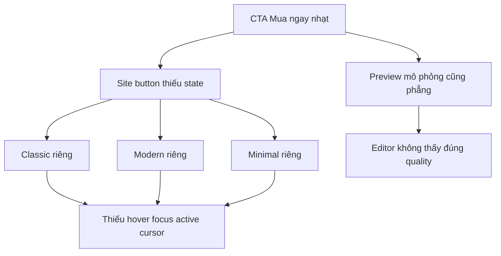

## Audit Summary

### TL;DR kiểu Feynman
- Trang sản phẩm thật đang render nút “Mua ngay” riêng ở cả 3 layout: classic, modern, minimal.
- Nút này gần như chỉ có viền + chữ, thiếu hover, focus, active nên cảm giác “không bấm được” hoặc quá nhạt.
- Preview `/system/experiences/product-detail` cũng đang mô phỏng nút khá phẳng, nên không giúp phát hiện lệch chất lượng CTA.
- Trong code đã có sẵn token `ctaSecondaryHoverBg` và `inputRing`, tức là nền tảng để làm CTA tốt hơn đã có.
- Hướng sửa tốt nhất là thống nhất interaction state cho nút “Mua ngay” ở site thật trước, rồi mirror lại preview để editor nhìn ra đúng cảm giác.

### Observation
1. Route site thật chọn 3 layout tại `app/(site)/products/[slug]/page.tsx`:
   - `ClassicStyle` quanh line 813+
   - `ModernStyle` quanh line 850+
   - `MinimalStyle` quanh line 887+
2. Nút “Mua ngay” thực tế đang render riêng trong từng layout:
   - Classic: `app/(site)/products/[slug]/page.tsx:1641-1648`
   - Modern: `app/(site)/products/[slug]/page.tsx:2114-2121`
   - Minimal: `app/(site)/products/[slug]/page.tsx:2469-2476`
3. Các nút này chỉ có `border` + `transition-all/transition-colors`; khi enabled không có hover/focus/active rõ ràng. Chỉ trạng thái disabled mới thêm `cursor-not-allowed`.
4. Trong cùng file, nút “Thêm vào giỏ” lại đã có affordance tốt hơn (`hover:shadow`, `hover:scale`) ở classic/modern:
   - `app/(site)/products/[slug]/page.tsx:1632`
   - `app/(site)/products/[slug]/page.tsx:2105`
5. Preview 3 layout cũng render CTA khá phẳng tại `components/experiences/previews/ProductDetailPreview.tsx`:
   - Classic CTA block: quanh `571-602`
   - Modern CTA block: quanh `822-855`
   - Minimal CTA block: quanh `999-1020`
6. Token hỗ trợ đã tồn tại trong `components/site/products/detail/_lib/colors.ts`:
   - `ctaSecondaryHoverBg`: line `253`
   - `inputRing`: line `285`

### Inference
- Root cause chính không phải thiếu wiring hành vi mua ngay; wiring `onBuyNow` vẫn có đủ.
- Vấn đề là thiếu **interaction design** cho CTA chốt đơn: hover, focus-visible, active, cursor và hierarchy thị giác chưa đủ mạnh.
- Do mỗi layout tự viết nút riêng nên cùng một vấn đề lặp lại 3 lần, preview cũng lệch cùng kiểu.

### Counter-hypothesis
- Có thể UX nhạt là do màu token quá yếu, không chỉ do thiếu hover. Tuy nhiên evidence hiện tại cho thấy ngay cả khi màu ổn, việc không có hover/focus/active vẫn làm nút “chết”. Vì vậy fix interaction state là bước nhỏ nhất, chắc ăn nhất trước.

## Root Cause Confidence
**High** — vì cả 3 layout site thật đều có cùng pattern class thiếu state tương tác, trong khi CTA khác ngay cạnh đã có hover rõ; đồng thời token phục vụ hover/focus đã tồn tại sẵn nên mismatch nằm ở lớp render, không phải thiếu config hay module.

## Problem Graph

## Proposal

### Option A (Recommend) — Confidence 90%
Sửa đồng bộ interaction state cho nút “Mua ngay” ở 3 layout site thật, rồi mirror sang preview.

Vì sao recommend:
- Đúng trọng tâm user phản ánh: nút chốt đơn phải “thực sự tốt”.
- Thay đổi nhỏ, rollback dễ, không đổi data flow hay business logic.
- Tận dụng token sẵn có, giữ đúng pattern hiện tại của repo.

### Option B — Confidence 65%
Tạo helper/class dùng chung cho secondary CTA rồi thay 3 layout + preview cùng lúc.

Phù hợp khi:
- Muốn chặn lệch style về sau.
Tradeoff:
- Sạch hơn nhưng scope lớn hơn một chút; không cần nếu mục tiêu là fix nhanh và an toàn.

## Files Impacted

### UI site
- `Sửa: app/(site)/products/[slug]/page.tsx`
  - Vai trò hiện tại: render product detail thật cho 3 layout và bind hành vi `onBuyNow`.
  - Thay đổi: thêm state hover/focus-visible/active/cursor cho nút “Mua ngay” trong classic, modern, minimal; giữ nguyên disable logic hiện có.

### Preview/editor
- `Sửa: components/experiences/previews/ProductDetailPreview.tsx`
  - Vai trò hiện tại: mô phỏng 3 layout trong `/system/experiences/product-detail`.
  - Thay đổi: mirror interaction styling của nút “Mua ngay” để preview phản ánh đúng quality của site thật.

### Shared tokens
- `Đọc lại, có thể không cần sửa: components/site/products/detail/_lib/colors.ts`
  - Vai trò hiện tại: cung cấp token màu CTA/focus cho product detail.
  - Thay đổi dự kiến: ưu tiên tái sử dụng `ctaSecondaryHoverBg` và `inputRing`; chỉ sửa file này nếu review tĩnh cho thấy token hiện tại quá yếu.

## Execution Preview
1. Đọc lại 3 block CTA trong `page.tsx` và gom pattern state mong muốn cho secondary CTA.
2. Thêm class/state cho nút “Mua ngay” ở classic.
3. Áp dụng cùng pattern cho modern.
4. Áp dụng cùng pattern cho minimal.
5. Mirror state tương tự ở `ProductDetailPreview.tsx` cho 3 layout preview.
6. Static review: check disabled state, null-safety token usage, consistency giữa cart/contact mode, mobile/desktop.
7. Nếu có thay đổi code TS/TSX thì chạy `bunx tsc --noEmit` trước khi commit theo guideline repo.
8. Commit local, không push.

## Chi tiết implementation đề xuất
- Với nút enabled, thêm các affordance sau:
  - `cursor-pointer`
  - `hover:bg-[token secondary hover]` hoặc style inline dùng `tokens.ctaSecondaryHoverBg`
  - `hover:shadow-md` mức nhẹ, không lòe loẹt
  - `active:scale-[0.99]` hoặc active shadow nhỏ để có phản hồi khi click
  - `focus-visible:outline-none focus-visible:ring-2` với `tokens.inputRing`
  - có thể thêm `focus-visible:ring-offset-2` nếu surrounding surface cần tách lớp rõ hơn
- Với nút disabled:
  - giữ `opacity-50 cursor-not-allowed`
  - không áp hover/active
- Không đổi label, không đổi business logic `onBuyNow`, không chạm flow checkout/orders.

## Acceptance Criteria
- Ở cả 3 layout site thật, khi nút “Mua ngay” enabled:
  - rê chuột thấy phản hồi thị giác rõ ràng
  - con trỏ thể hiện nút có thể bấm
  - tab bằng bàn phím thấy focus ring rõ
  - nhấn chuột có cảm giác active nhẹ
- Khi disabled, nút vẫn mờ + `cursor-not-allowed`, không nhận interaction state gây hiểu lầm.
- Preview `/system/experiences/product-detail` phản ánh cùng cảm giác CTA với site thật ở cả 3 layout.
- Không làm thay đổi hành vi `onBuyNow`, `saleMode`, stock gating hay logic module Orders/Checkout.

## Verification Plan
- **Static verify:** so khớp 3 layout site + 3 layout preview, đảm bảo state class không áp vào disabled branch.
- **Typecheck:** `bunx tsc --noEmit` vì có thay đổi code TS/TSX.
- **Repro checklist:**
  1. Mở product detail thật.
  2. Hover/tab/click thử nút “Mua ngay” ở layout classic/modern/minimal.
  3. Vào `/system/experiences/product-detail`, chuyển cả 3 layout, xác nhận preview match tinh thần interaction.
- Theo guideline repo, không chạy lint/unit/runtime test.

## Out of Scope
- Không redesign toàn bộ cụm CTA.
- Không đổi token brand system trên diện rộng.
- Không refactor sang shared component nếu chưa cần.
- Không sửa checkout/cart/order flow.

## Risk / Rollback
- Rủi ro thấp: chủ yếu là style regression cục bộ ở product detail CTA.
- Rollback đơn giản: revert các thay đổi trong `page.tsx` và `ProductDetailPreview.tsx`.

Nếu duyệt plan này, tôi sẽ triển khai theo Option A: sửa nhỏ, tập trung đúng vào nút chốt đơn để nó có cảm giác premium hơn nhưng vẫn bám pattern sẵn có của repo.