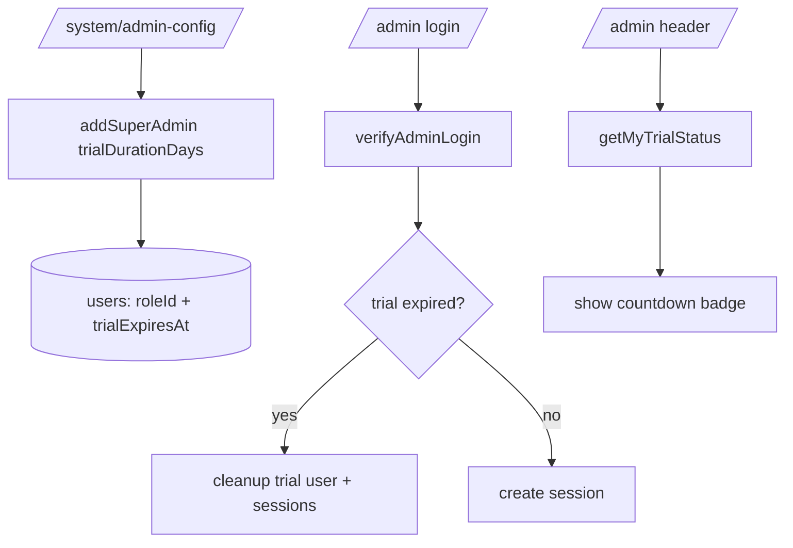

## TL;DR kiểu Feynman
- Hiện tại Super Admin trong hệ thống là quyền **không có hạn**, nên không phù hợp cho tài khoản cho khách test ngắn ngày.
- Mình sẽ thêm cơ chế **trial Super Admin có TTL** (1 ngày / 1 tuần / 1 tháng / 3 tháng) ngay tại `/system/admin-config`.
- Khi hết hạn, hệ thống sẽ **xóa hẳn user trial** (theo yêu cầu của anh), không chỉ demote hay khóa.
- Ở `/admin`, chỉ user trial mới thấy **đồng hồ đếm ngược** thời gian còn lại (badge trên header).
- Mô hình giống SaaS lớn: cấp quyền tạm thời, có thời điểm hết hạn rõ ràng, tự thu hồi tự động.

## Audit Summary
### Observation
1. `app/system/admin-config/page.tsx` đang có 2 luồng cấp Super Admin: `Nâng quyền user` và `Tạo mới`, nhưng **không có chọn thời hạn**.
2. `convex/auth.ts` `addSuperAdmin` hiện chỉ đổi `roleId` hoặc tạo user mới, **không lưu metadata trial**.
3. Session admin (`userSessions`) đang kiểm tra `expiresAt` của session, chưa có kiểm tra “quyền super admin trial đã hết hạn”.
4. Header admin ở `app/admin/components/Header.tsx` là vị trí nhẹ nhất để gắn badge countdown.
5. Chưa thấy cron/scheduler sẵn cho cleanup user trial; codebase đang dùng mutation/query truyền thống.

### Inference
- Root issue là thiếu lớp dữ liệu “entitlement có hạn” cho Super Admin trial.
- Nếu chỉ kiểm tra trên login mà không cleanup định kỳ thì user hết hạn vẫn còn bản ghi.
- Nếu xóa ngay lúc request bất kỳ thì cần cơ chế cleanup opportunistic để không phụ thuộc cron.

### Decision
- Thêm metadata trial ngay trên bảng `users` (ít xâm lấn nhất).
- Cập nhật login/session verify để hard-block khi trial hết hạn.
- Tạo cleanup mutation để xóa trial hết hạn, gọi opportunistic từ các điểm auth/system liên quan.
- UI: dropdown TTL ở `/system/admin-config`; countdown badge ở `/admin` header chỉ cho trial user.

## Root Cause Confidence
**High** — vì hiện trạng code cho thấy toàn bộ flow `addSuperAdmin` và `verifyAdminSession` không có field hoặc logic nào cho trial expiry; symptom “chỉ vĩnh viễn” khớp trực tiếp với implementation hiện tại.

## Web research (SaaS lớn làm gì)
- Google Cloud IAM PAM: cấp quyền tạm thời theo grant duration, tự expire.
- Microsoft Entra PIM: role assignment có expiration + renew/extend.
- AWS IAM Identity Center: temporary elevated access (JIT permissions).

### Pattern rút ra áp dụng
1. Time-bound privilege (có `expiresAt` rõ ràng).
2. Auto-revoke khi hết hạn.
3. Hiển thị remaining time cho người đang có quyền tạm.
4. Auditability (gắn metadata trial source/duration).

## Files Impacted
### Server / schema
- **Sửa: `convex/schema.ts`**  
  Vai trò hiện tại: định nghĩa bảng users/sessions.  
  Thay đổi: thêm optional fields cho trial super admin trên `users`, ví dụ:
  - `superAdminTrialExpiresAt?: number`
  - `superAdminTrialDurationDays?: number`
  - `superAdminTrialCreatedAt?: number`

- **Sửa: `convex/auth.ts`**  
  Vai trò hiện tại: login/session + add/demote super admin.  
  Thay đổi:
  1. Mở rộng `addSuperAdmin` nhận `trialDurationDays?: 1|7|30|90` cho cả `existingUserId` và tạo mới.
  2. Nếu có trialDurationDays → set `superAdminTrial*` tương ứng.
  3. Nếu không có trialDurationDays → clear trial fields (vĩnh viễn như cũ).
  4. Thêm guard trong `verifyAdminLogin` + `verifyAdminSession`: nếu user là super admin trial và đã hết hạn => fail + trigger cleanup.
  5. Thêm mutation cleanup trial users hết hạn (xóa user + session liên quan).
  6. Thêm query nhỏ trả về trial countdown cho user hiện tại (nhận token) để UI header dùng.

### UI
- **Sửa: `app/system/admin-config/page.tsx`**  
  Vai trò hiện tại: form nâng quyền/tạo Super Admin.  
  Thay đổi:
  1. Thêm dropdown “Thời hạn” với options: 1 ngày / 1 tuần / 1 tháng / 3 tháng.
  2. Gửi `trialDurationDays` vào `addSuperAdmin` cho cả 2 mode (theo yêu cầu anh).
  3. Cập nhật danh sách super admin để hiển thị trạng thái `Vĩnh viễn` hoặc `Còn X ngày`.

- **Sửa: `app/admin/components/Header.tsx`**  
  Vai trò hiện tại: header chung của `/admin`.  
  Thay đổi: thêm badge countdown nhỏ (ví dụ `Trial: 6d 04h`) chỉ hiện khi user hiện tại là trial account còn hạn.

- **Sửa: `app/admin/auth/context.tsx`**  
  Vai trò hiện tại: giữ user session và permission client-side.  
  Thay đổi: lấy thêm dữ liệu trial còn hạn (query mới), expose cho Header; nếu session invalid do hết trial thì flow logout/redirect giữ nguyên pattern cũ.

## Data Flow (Mermaid)

## Execution Preview
1. Đọc schema/users/auth liên quan trial + session.  
2. Thêm field trial vào schema users.  
3. Mở rộng mutation/query trong `convex/auth.ts` (add, verify, cleanup, trial-status).  
4. Nối dropdown TTL vào `/system/admin-config` cho cả 2 luồng tạo/nâng quyền.  
5. Nối countdown badge vào `Header` qua `AdminAuthContext`.  
6. Static review: typing, null-safety, edge cases (hết hạn đúng thời điểm, user bị xóa giữa phiên).

## Acceptance Criteria
1. `/system/admin-config` có dropdown thời hạn đúng 4 option: 1/7/30/90 ngày.  
2. Cả “Nâng quyền user” và “Tạo mới” đều cấp được trial Super Admin theo thời hạn đã chọn.  
3. Trial account đăng nhập `/admin` thấy countdown ở header; non-trial không thấy.  
4. Khi quá hạn: user trial bị xóa, không đăng nhập lại được, session cũ bị invalid.  
5. Super Admin vĩnh viễn vẫn hoạt động như hiện tại, không regress luồng cũ.

## Verification Plan
- Repro logic tĩnh theo checklist:
  1. Cấp trial 1 ngày cho user có sẵn, xác nhận trial fields set đúng.
  2. Cấp trial cho user mới, xác nhận login được và header có countdown.
  3. Mô phỏng expired timestamp (< now), gọi verify session/login, xác nhận cleanup + deny access.
  4. Cấp tài khoản không trial, xác nhận không có countdown.
- Theo rule repo: **không chạy lint/unit test/build** trong bước này.

## Out of Scope
- Không thêm luồng “gia hạn trial” riêng (renew/extend UI).
- Không thêm job scheduler nền riêng (dùng cleanup opportunistic theo request path).
- Không thay đổi UX ở `/admin/users` ngoài behavior hiện có.

## Risk / Rollback
- Risk: xóa nhầm user nếu gán trial metadata sai.  
  Mitigation: chỉ xóa khi `role.isSuperAdmin === true` và `trialExpiresAt < now`.
- Risk: race condition khi nhiều request đồng thời cleanup.  
  Mitigation: idempotent delete pattern (check tồn tại trước khi delete).
- Rollback: bỏ trial fields + bỏ guard cleanup, giữ lại flow Super Admin vĩnh viễn hiện tại.

## Post-audit 5/8 câu bắt buộc
1. Triệu chứng: hiện chỉ có super admin vĩnh viễn; thiếu trial TTL (Observed từ `admin-config` + `auth.ts`).  
2. Phạm vi: `/system/admin-config`, auth `/admin`, header `/admin`.  
3. Repro: ổn định 100%, tạo/nâng quyền hiện không có expiry input.  
4. Mốc thay đổi gần nhất: đã từng mở rộng multiple super admin, chưa có trial metadata.  
5. Thiếu data: chưa có yêu cầu renew trial (đã chốt out-of-scope).  
6. Giả thuyết thay thế: dùng session expiry thay role expiry; bị loại vì không thu hồi quyền thực tế.  
7. Rủi ro fix sai: xóa nhầm account hoặc khóa nhầm super admin thường.  
8. Pass/fail: đạt khi trial hết hạn bị xóa + countdown hoạt động đúng đối tượng.