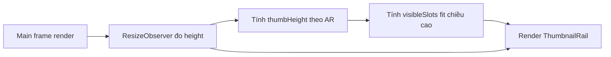

## TL;DR kiểu Feynman
- Lệch xảy ra vì cột ảnh phụ đang dùng `visibleSlots=6` cố định, còn ảnh chính đổi chiều cao theo AR.
- Khi AR không phải 1:1, chiều cao ảnh chính đổi mạnh nhưng rail ảnh phụ không đổi theo, nên nhìn bị lệch.
- Cách sửa: đo chiều cao ảnh chính runtime, rồi tính số thumbnail hiển thị theo chiều cao đó.
- Áp dụng cùng một công thức cho **site thật** và **experience preview** để đồng bộ.
- Giữ thay đổi nhỏ, không đụng business logic sản phẩm.

## Audit Summary
- Observation:
  - `app/(site)/products/[slug]/page.tsx` (layout minimal) dùng thumbnail dọc với `visibleSlots={6}` cố định.
  - `components/experiences/previews/ProductDetailPreview.tsx` cũng dùng `visibleSlots={6}` cố định cho minimal preview.
  - `components/site/products/detail/_lib/image-aspect-ratio.ts` cho phép 7 AR; `thumbnailAspectRatio` có thể khác `frameAspectRatio` theo layout.
- Inference:
  - Chiều cao ảnh chính phụ thuộc AR + frame width class.
  - Chiều cao rail phụ thuộc số slot cố định + AR thumbnail + gap/arrow => không co giãn theo ảnh chính.
- Decision:
  - Dùng cơ chế dynamic slots theo chiều cao ảnh chính để đạt pixel-perfect cho mọi AR trên desktop minimal.

## Root Cause Confidence
**High** — vì cả site và preview đều hardcode `visibleSlots=6` ở layout minimal, trong khi chiều cao khung ảnh chính thay đổi theo AR (evidence trực tiếp từ 3 file trên).

## Mermaid (data flow tính chiều cao rail)

<!-- A: khung ảnh chính, E: rail ảnh phụ -->

## Files Impacted
- **Sửa:** `components/site/products/detail/_lib/image-aspect-ratio.ts`  
  Vai trò hiện tại: chứa map AR và hàm config frame/thumb.  
  Thay đổi: thêm helper parse ratio + helper tính `visibleSlots` dọc theo chiều cao mục tiêu (shared cho site + preview).

- **Sửa:** `app/(site)/products/[slug]/page.tsx`  
  Vai trò hiện tại: render product detail site thật cho 3 layout.  
  Thay đổi: ở **minimal desktop**, đo chiều cao khung ảnh chính bằng `ResizeObserver`, tính `visibleSlots` động, truyền vào `ThumbnailRail` (fallback 6 khi chưa đo xong).

- **Sửa:** `components/experiences/previews/ProductDetailPreview.tsx`  
  Vai trò hiện tại: render preview trong Experience Editor.  
  Thay đổi: áp dụng cùng cơ chế đo chiều cao + tính `visibleSlots` động cho minimal desktop để preview khớp site thật.

## Execution Preview
1. Đọc và tái dùng pattern hiện có của `getProductImageFrameConfig`.
2. Thêm helper tính dynamic vertical slots trong `_lib/image-aspect-ratio.ts`.
3. Nối logic đo chiều cao ảnh chính vào minimal site (`page.tsx`) và truyền `visibleSlots` mới.
4. Nối logic tương tự vào minimal preview (`ProductDetailPreview.tsx`).
5. Static review: typing, null-safety, SSR/client safety, fallback khi ResizeObserver chưa có số đo.
6. Trước commit (vì có đổi TS): chạy `bunx tsc --noEmit` theo quy ước repo.

## Acceptance Criteria
- Với 7 AR tại `/system/experiences/product-detail`, preview minimal hiển thị cột thumbnail dọc có tổng chiều cao khớp khung ảnh chính (không lệch top/bottom khó chịu).
- Site thật `/products/[slug]` (minimal desktop) có hành vi tương tự preview cho cùng AR.
- AR 1:1 không bị regression.
- Không ảnh hưởng layout classic/modern.
- Nếu chưa đo được chiều cao (initial render), UI vẫn ổn định với fallback slots.

## Verification Plan
- Typecheck: `bunx tsc --noEmit` (do có thay đổi code TS).
- Repro manual (tester):
  1) Chuyển lần lượt 7 AR trong system experience product-detail.
  2) So sánh preview vs site thật cùng product + cùng layout minimal.
  3) Kiểm tra desktop breakpoint nơi rail dọc xuất hiện.
  4) Xác nhận không ảnh hưởng classic/modern.

## Out of Scope
- Không thay đổi thiết kế UI/spacing tổng thể của trang product-detail.
- Không đổi logic load ảnh, zoom, carousel mobile, hay business flow cart/checkout.

## Risk / Rollback
- Risk: `ResizeObserver` cập nhật liên tục khi resize có thể gây re-render dư.
- Mitigation: chỉ set state khi giá trị height/slots thay đổi thực sự.
- Rollback: revert 3 file trên về `visibleSlots=6` cố định là an toàn, phạm vi nhỏ.