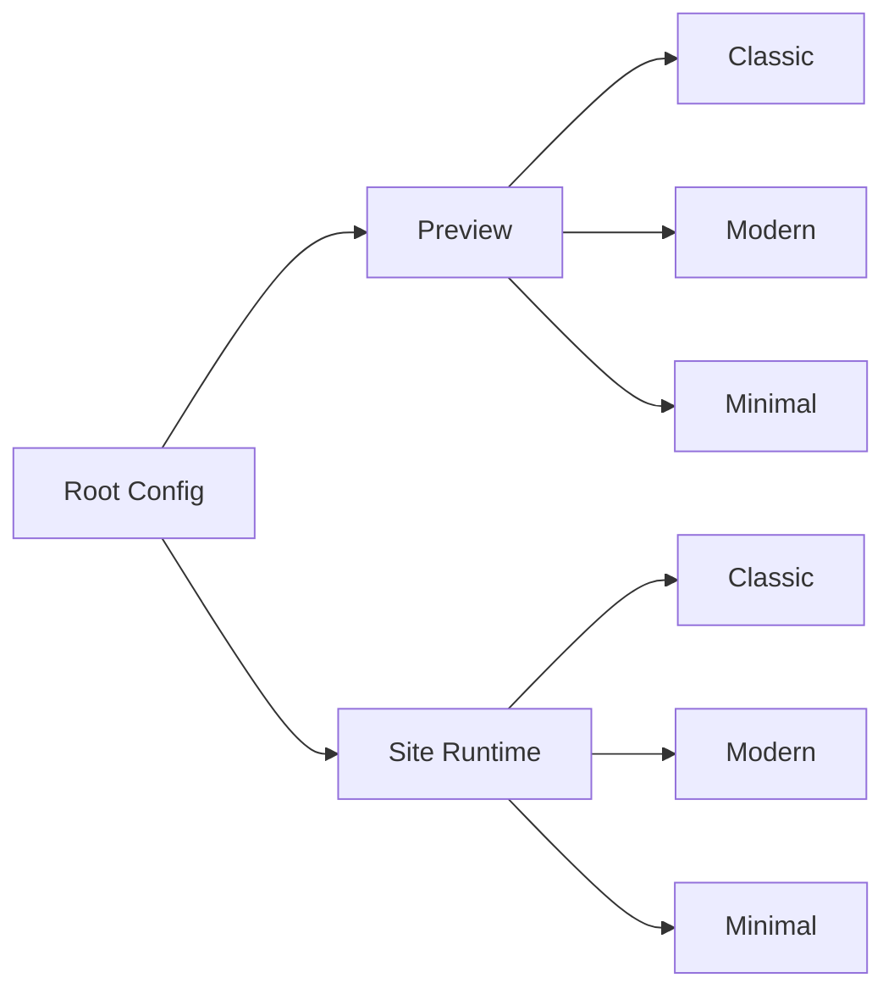

## Audit Summary
- Observation: hiện `imageAspectRatio` đang được lưu trong từng layout config riêng (`layouts.classic.imageAspectRatio`, `layouts.modern.imageAspectRatio`, `layouts.minimal.imageAspectRatio`). Evidence: `app/system/experiences/product-detail/page.tsx` lines quanh 334/341/348.
- Observation: UI editor cũng đang bind dropdown theo `currentLayoutConfig.imageAspectRatio`, nên khi đổi tab layout thì AR có thể khác nhau giữa 3 layout. Evidence: `app/system/experiences/product-detail/page.tsx` lines quanh 474, 668, 670.
- Observation: site runtime vẫn có fallback `raw?.imageAspectRatio`, nhưng ưu tiên `layoutConfig?.imageAspectRatio`, nên behavior thực tế vẫn đang là per-layout trước, global sau. Evidence: `app/(site)/products/[slug]/page.tsx` lines quanh 213, 250.
- Decision: nếu mục tiêu là “dùng chung cho tiện”, ta nên chuyển `imageAspectRatio` thành **config global ở root** của `ProductDetailExperienceConfig`, không thuộc từng layout nữa.

## Root Cause Confidence
**High** — root cause là do thiết kế dữ liệu ban đầu đặt `imageAspectRatio` trong từng layout object, rồi editor/runtime đều đọc theo `currentLayoutConfig/layoutConfig`, nên vô tình biến AR thành config riêng cho mỗi layout thay vì shared config.

## TL;DR kiểu Feynman
- Bây giờ mỗi layout đang giữ một tỉ lệ ảnh riêng.
- Nên đổi thành chỉ có **1 tỉ lệ ảnh chung** cho toàn bộ Product Detail.
- Editor sẽ chỉ lưu 1 field root-level, không lưu trong `classic/modern/minimal` nữa.
- Preview và site đều đọc từ field chung này.
- Data cũ vẫn migrate mềm: nếu chưa có field chung thì lấy từ layout cũ hoặc fallback `1:1`.

## Proposal
### Mục tiêu
Gom `imageAspectRatio` thành 1 config dùng chung cho cả 3 layout `classic/modern/minimal`, để admin chỉnh 1 nơi và mọi layout cùng dùng.

### Thay đổi dữ liệu
#### Hiện tại
```ts
{
  layoutStyle,
  layouts: {
    classic: { imageAspectRatio, ... },
    modern: { imageAspectRatio, ... },
    minimal: { imageAspectRatio, ... },
  }
}
```

#### Sau khi đổi
```ts
{
  layoutStyle,
  imageAspectRatio,
  layouts: {
    classic: { ... },
    modern: { ... },
    minimal: { ... },
  }
}
```

### Rule migrate tương thích ngược
- Ưu tiên `raw.imageAspectRatio` nếu có.
- Nếu chưa có root-level field, lấy theo thứ tự mềm:
  1. `raw.layouts.classic.imageAspectRatio`
  2. `raw.layouts.modern.imageAspectRatio`
  3. `raw.layouts.minimal.imageAspectRatio`
  4. fallback `DEFAULT_PRODUCT_IMAGE_ASPECT_RATIO`
- Khi save lần tiếp theo từ editor, chỉ persist `root.imageAspectRatio`.
- Không cần xóa mạnh dữ liệu cũ trong DB; chỉ cần ngừng đọc/ngừng ghi per-layout là đủ.

### Thay đổi UI editor
- Dropdown `Tỉ lệ ảnh sản phẩm` vẫn giữ trong khối hiển thị hiện tại.
- Nhưng value sẽ bind vào `config.imageAspectRatio` thay vì `currentLayoutConfig.imageAspectRatio`.
- onChange sẽ set root config:
  - `setConfig(prev => ({ ...prev, imageAspectRatio: value }))`
- Khi đổi tab layout, dropdown không đổi theo tab nữa.

### Thay đổi preview
- `getPreviewProps()` truyền `imageAspectRatio: config.imageAspectRatio`.
- `ProductDetailPreview` không cần đổi contract hiển thị; chỉ nguồn dữ liệu thay đổi từ shared root field.

### Thay đổi site runtime
- `useProductDetailExperienceConfig()` sẽ resolve `imageAspectRatio` từ root-level trước.
- Không đọc `layoutConfig.imageAspectRatio` như source of truth nữa.
- 3 style `ClassicStyle/ModernStyle/MinimalStyle` tiếp tục nhận cùng 1 prop `imageAspectRatio` như hiện tại.

## Mermaid

<!-- Cfg = imageAspectRatio dùng chung ở root ProductDetailExperienceConfig -->

## Files Impacted
- `Sửa: app/system/experiences/product-detail/page.tsx`
  - Vai trò hiện tại: editor config + save payload + preview props.
  - Thay đổi: chuyển `imageAspectRatio` ra root config, update parse/save/default UI binding, migrate mềm từ dữ liệu per-layout cũ.

- `Sửa: app/(site)/products/[slug]/page.tsx`
  - Vai trò hiện tại: parse config runtime và truyền props cho 3 layout site.
  - Thay đổi: resolve `imageAspectRatio` từ root-level shared config, bỏ ưu tiên per-layout.

- `Giữ nguyên logic chính: components/experiences/previews/ProductDetailPreview.tsx`
  - Vai trò hiện tại: render theo prop `imageAspectRatio` đã được truyền vào.
  - Thay đổi: có thể không cần đổi hoặc chỉ đổi rất nhỏ nếu typing cần khớp lại.

- `Giữ nguyên: components/site/products/detail/_lib/image-aspect-ratio.ts`
  - Vai trò hiện tại: helper map AR -> frame/thumbnail rules.
  - Thay đổi: không cần đổi vì contract AR không đổi, chỉ đổi nguồn config.

## Execution Preview
1. Đọc lại shape hiện tại của `ProductDetailExperienceConfig` ở editor + site.
2. Dời `imageAspectRatio` từ `layouts.*` ra root config type/default.
3. Cập nhật parser editor để migrate mềm từ dữ liệu cũ.
4. Cập nhật dropdown editor bind vào root field dùng chung.
5. Cập nhật runtime site để ưu tiên root field và không xem per-layout là source chính nữa.
6. Review tĩnh + `bunx tsc --noEmit`.
7. Commit local theo rule repo.

## Acceptance Criteria
- Chỉ có **1 dropdown AR chung** cho Product Detail, không đổi theo tab layout.
- Đổi AR ở editor sẽ ảnh hưởng đồng thời `classic`, `modern`, `minimal` trong preview.
- Site runtime dùng cùng AR cho cả 3 layout.
- Data cũ vẫn render đúng nhờ migrate mềm.
- Save mới không còn phụ thuộc `layouts.classic/modern/minimal.imageAspectRatio`.

## Verification Plan
- Typecheck: `bunx tsc --noEmit`.
- Static review:
  - kiểm tra editor không còn bind AR vào `currentLayoutConfig`.
  - kiểm tra parser site/editor đều ưu tiên root-level `imageAspectRatio`.
  - kiểm tra preview/site vẫn nhận prop AR như trước.
- Repro checklist cho tester:
  1. Chọn 1 AR bất kỳ rồi đổi qua lại 3 tab layout trong `/system/experiences/product-detail`.
  2. Xác nhận dropdown không đổi theo tab.
  3. Xác nhận cả 3 layout preview cùng phản ánh một AR.
  4. Xác nhận trang site product detail cũng dùng cùng AR đó.

## Risk / Rollback
- Risk thấp: chủ yếu là thay đổi shape config và parser fallback.
- Rollback dễ: khôi phục parser/editor binding về per-layout nếu cần.

## Decision
Tôi recommend đổi sang **1 field root-level dùng chung** vì đây là hướng đúng với nhu cầu “cho tiện”, ít file phải chạm, ít phá logic render nhất, và vẫn giữ backward compatibility với data cũ.