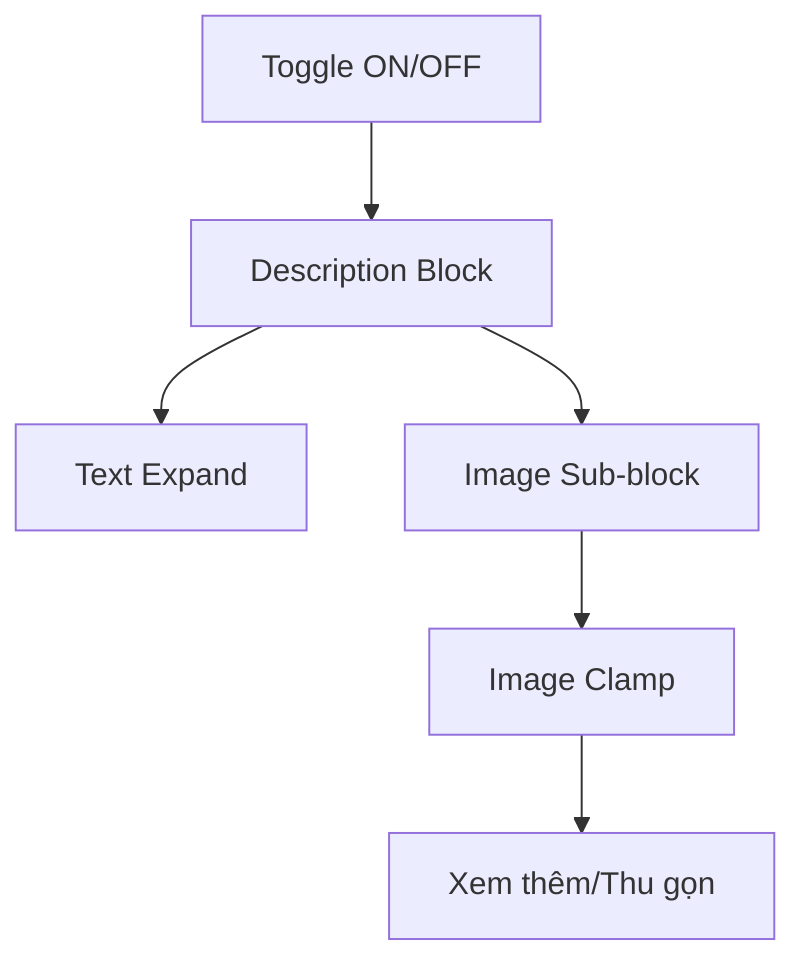

## Audit Summary
- Observation: `Section toàn bộ ảnh` hiện đang render như một section độc lập ngay sau mô tả (tách khối), không cùng tầng index với `Mô tả sản phẩm` như bạn muốn.
- Observation: `Mô tả sản phẩm` đang dùng pattern expand/collapse có sẵn (`ExpandableDescription` ở site, `ExpandablePreviewText` ở preview).
- Observation: current `ProductAllImagesSection` render danh sách ảnh đầy đủ, không có clamp + nút `Xem thêm/Thu gọn`.
- Decision: gom “Toàn bộ ảnh” vào cùng block “Mô tả sản phẩm” (cùng tầng), và thêm cơ chế “Xem thêm/Thu gọn” cho danh sách ảnh để tránh kéo trang quá dài.

## Root Cause Confidence
**High** — vấn đề do cấu trúc render hiện tại tách section ảnh thành block riêng, và thiếu cơ chế clamp/expand cho danh sách ảnh như yêu cầu UX.

## TL;DR kiểu Feynman
- Hiện ảnh đang ở block riêng bên ngoài mô tả.
- Ta sẽ nhét phần ảnh vào chung card mô tả luôn.
- Ảnh dài quá sẽ bị thu gọn ban đầu, có nút `Xem thêm/Thu gọn` giống mô tả.
- Toggle ở Experience vẫn giữ nguyên: tắt thì không hiện ảnh, bật mới hiện.
- Áp dụng đồng bộ cho site + preview ở cả 3 layout.

## Proposal
### 1) Giữ nguyên config/toggle hiện có
Không đổi API config hiện tại:
- `showAllProductImagesSection` vẫn là root-level boolean, default `false`.
- route `/system/experiences/product-detail` giữ toggle như hiện tại.

### 2) Đổi cấu trúc render: ảnh cùng khối với mô tả
Thay vì render `ProductAllImagesSection` như section độc lập, đổi thành “sub-block” nằm trong cùng card mô tả:
- Khối mô tả:
  - heading `Mô tả sản phẩm`
  - nội dung mô tả + nút `Xem thêm` hiện tại
  - divider nhẹ
  - sub-heading `Toàn bộ ảnh sản phẩm` (khi toggle bật)
  - danh sách ảnh (có clamp)

Áp dụng cho:
- `ClassicStyle`
- `ModernStyle`
- `MinimalStyle`
- `ProductDetailPreview`

### 3) Thêm cơ chế xem thêm cho danh sách ảnh
Tạo pattern mới cho images list (site + preview parity):
- Mặc định chỉ hiển thị N ảnh đầu:
  - đề xuất `N=2` mobile, `N=3` desktop (hoặc thống nhất `N=3` để đơn giản)
- Nếu `images.length > N` thì hiển thị nút `Xem thêm ảnh` / `Thu gọn ảnh`.
- Khi expand: hiển thị toàn bộ ảnh.

Cách triển khai gọn:
- Site: thêm component `ExpandableImageList` dùng state local tương tự `ExpandableDescription`.
- Preview: thêm `ExpandablePreviewImageList` dùng cùng behavior.

### 4) Không tách section riêng nữa
- Bỏ render call độc lập kiểu:
  - `{showAllProductImagesSection && <ProductAllImagesSection .../>}`
- Thay bằng render nội bộ ngay trong khối mô tả.

## Mermaid

<!-- Desc = card mô tả; Img là phần ảnh cùng tầng, không phải section riêng -->

## Files Impacted
- `Sửa: app/(site)/products/[slug]/page.tsx`
  - Vai trò hiện tại: render mô tả và section ảnh độc lập cho 3 layout.
  - Thay đổi: gom ảnh vào cùng khối mô tả + thêm expand/collapse cho ảnh, bỏ call section tách rời.

- `Sửa: components/experiences/previews/ProductDetailPreview.tsx`
  - Vai trò hiện tại: preview mô tả và section ảnh độc lập.
  - Thay đổi: gom ảnh vào block mô tả + thêm preview expand/collapse danh sách ảnh.

- `Giữ nguyên: app/system/experiences/product-detail/page.tsx`
  - Vai trò hiện tại: config toggle.
  - Thay đổi: không bắt buộc; chỉ giữ wiring hiện có.

## Execution Preview
1. Đọc lại 3 điểm render mô tả trong classic/modern/minimal + preview.
2. Tạo helper/component ảnh dạng expand/collapse.
3. Chuyển vị trí render ảnh vào trong block mô tả.
4. Bỏ render section ảnh độc lập bên ngoài block mô tả.
5. Đảm bảo toggle off => không render ảnh; toggle on => render ảnh trong block mô tả.
6. Rà typing + `bunx tsc --noEmit` + commit.

## Acceptance Criteria
- `Toàn bộ ảnh sản phẩm` nằm trong cùng card/khối với `Mô tả sản phẩm` (cùng tầng, không tách section riêng).
- Khi danh sách ảnh dài, có nút `Xem thêm ảnh` / `Thu gọn ảnh`.
- Toggle off: behavior giữ như hiện tại (không hiện ảnh).
- Toggle on: ảnh hiện trong block mô tả ở cả 3 layout và preview parity.

## Verification Plan
- Typecheck: `bunx tsc --noEmit`.
- Static review:
  - không còn call `ProductAllImagesSection` ở ngoài block mô tả.
  - có clamp + button cho ảnh khi vượt ngưỡng.
- Repro checklist:
  1. Bật/tắt toggle trong `/system/experiences/product-detail`.
  2. Với nhiều ảnh: thấy nút `Xem thêm ảnh`.
  3. Với ít ảnh: không hiện nút, hiển thị full.
  4. Kiểm tra classic/modern/minimal và preview đều giống nhau.

## Risk / Rollback
- Risk thấp: thay đổi chủ yếu ở UI structure.
- Rollback dễ: phục hồi render section ảnh độc lập cũ nếu cần.