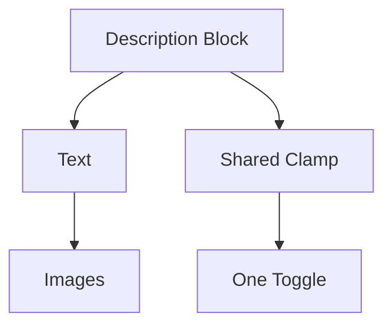

## Audit Summary
- Observation: hiện tại đang có 2 cơ chế expand riêng:
  - text dùng `ExpandableDescription` / `ExpandablePreviewText`
  - ảnh dùng `ExpandableImageList` / `renderInlineAllImages`
- Observation: dù ảnh đã nằm trong cùng block mô tả, UX vẫn còn 2 nút khác nhau (`Xem thêm` cho text và `Xem thêm ảnh` cho ảnh), chưa đúng ý user.
- Observation: yêu cầu mới là xem ảnh như **một phần của mô tả sản phẩm**, nằm dưới mô tả và dùng **một cơ chế expand chung**.
- Decision: bỏ expand riêng cho ảnh và bỏ expand riêng cho text trong block này; thay bằng 1 wrapper expand chung bao trọn cả mô tả + ảnh.

## Root Cause Confidence
**High** — vấn đề cốt lõi là logic expand đang được chia theo từng phần con (text/ảnh), trong khi user muốn coi ảnh là continuation của mô tả, tức cùng một nội dung và cùng một nút mở rộng.

## TL;DR kiểu Feynman
- Mô tả và ảnh vẫn nằm trong cùng block.
- Nhưng thay vì 2 nút riêng, sẽ chỉ còn **1 nút Xem thêm/Thu gọn chung**.
- Khi thu gọn: cả mô tả và phần ảnh bên dưới đều bị giới hạn cùng nhau.
- Khi mở rộng: hiện full mô tả + full ảnh.
- Toggle `Section toàn bộ ảnh` vẫn giữ nguyên, chỉ đổi cách hiển thị bên trong block mô tả.

## Proposal
### 1) Giữ nguyên config hiện có
- Không đổi `showAllProductImagesSection`.
- Không đổi toggle ở `/system/experiences/product-detail`.

### 2) Bỏ 2 helper expand riêng
#### Site
- Không dùng `ExpandableDescription` trong block mô tả product-detail này nữa.
- Không dùng `ExpandableImageList` riêng nữa.
- Thay bằng 1 helper mới, ví dụ `ExpandableProductDescriptionBlock`.

#### Preview
- Không dùng `ExpandablePreviewText` + `renderInlineAllImages` theo kiểu tách riêng nữa.
- Thay bằng 1 helper preview tương ứng, ví dụ `ExpandablePreviewDescriptionBlock`.

### 3) Cấu trúc block mới
Khối “Mô tả sản phẩm” sẽ gồm:
- heading `Mô tả sản phẩm`
- nội dung mô tả rich text / preview text
- nếu toggle bật: phần `Toàn bộ ảnh sản phẩm` nằm **bên dưới mô tả, cùng block**
- toàn bộ phần trên được bọc trong **1 wrapper expand chung**
- chỉ có **1 nút** ở cuối block:
  - `Xem thêm`
  - `Thu gọn`

### 4) Cách clamp/expand chung
Vì block chứa cả rich text và image list, cách ổn nhất là dùng wrapper với `max-height + overflow-hidden`:
- collapsed:
  - mobile: max-height khoảng 560–720px
  - desktop: max-height khoảng 720–920px
- expanded: bỏ giới hạn chiều cao
- button chỉ hiện khi wrapper thực sự overflow

Điểm mạnh của cách này:
- text + ảnh được coi là **một mạch nội dung duy nhất**
- không phải đồng bộ 2 state riêng
- đúng ý “ảnh là một phần của mô tả sản phẩm”

### 5) Vị trí phần ảnh
- Ảnh vẫn nằm dưới đoạn mô tả text.
- Không còn tạo cảm giác là section ngang hàng độc lập.
- Có thể giữ sub-label nhỏ `Toàn bộ ảnh sản phẩm`, nhưng về cấu trúc vẫn là một phần bên trong block mô tả.

## Mermaid

<!-- Wrap = 1 wrapper expand/collapse bao trọn text + images -->

## Files Impacted
- `Sửa: app/(site)/products/[slug]/page.tsx`
  - Vai trò hiện tại: dùng `ExpandableDescription` và `ExpandableImageList` riêng.
  - Thay đổi: thay bằng 1 helper expand chung cho block mô tả + ảnh, áp dụng cho classic/modern/minimal.

- `Sửa: components/experiences/previews/ProductDetailPreview.tsx`
  - Vai trò hiện tại: dùng `ExpandablePreviewText` và ảnh expand riêng.
  - Thay đổi: thay bằng 1 helper expand chung cho preview block mô tả + ảnh.

- `Giữ nguyên: app/system/experiences/product-detail/page.tsx`
  - Vai trò hiện tại: config toggle.
  - Thay đổi: không cần sửa nếu chỉ đổi render behavior.

## Execution Preview
1. Đọc lại khối mô tả ở classic/modern/minimal + preview.
2. Tạo helper expand chung bằng `max-height + overflow-hidden + detect overflow`.
3. Nhúng text mô tả và image list vào cùng helper.
4. Bỏ nút `Xem thêm ảnh` / `Thu gọn ảnh` riêng.
5. Giữ chỉ 1 nút `Xem thêm` / `Thu gọn` cho cả block.
6. Rà typing + `bunx tsc --noEmit` + commit.

## Acceptance Criteria
- Chỉ còn **1 nút expand/collapse chung** cho cả mô tả + ảnh.
- Ảnh nằm dưới mô tả và được xem là một phần của mô tả sản phẩm.
- Toggle off: block chỉ còn mô tả như trước.
- Toggle on: block mô tả mở rộng gồm cả text + ảnh, cùng một state expand.
- Áp dụng đúng cho preview + site, cả 3 layout.

## Verification Plan
- Typecheck: `bunx tsc --noEmit`.
- Static review:
  - không còn nút `Xem thêm ảnh` riêng.
  - không còn 2 state expand tách biệt cho text và ảnh trong product-detail block.
- Repro checklist:
  1. Toggle off: chỉ thấy mô tả + 1 nút expand chung nếu mô tả dài.
  2. Toggle on: thấy mô tả + ảnh trong cùng block.
  3. Khi bấm `Xem thêm`, cả text và ảnh cùng mở rộng.
  4. Kiểm tra classic/modern/minimal + preview parity.

## Risk / Rollback
- Risk thấp đến trung bình: thay đổi behavior expand chung có thể cần tinh chỉnh `max-height` để cảm giác mở/đóng mượt và hợp lý.
- Rollback dễ: quay lại mô hình 2 phần expand riêng hiện tại nếu UX không đạt.