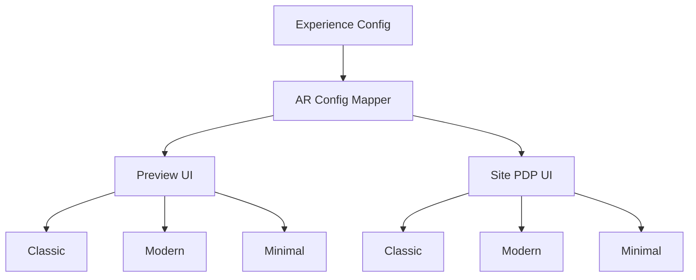

## Audit Summary
- Observation: route `app/system/experiences/product-detail/page.tsx` là trang editor + preview, không phải gallery render thực ngoài site. Evidence: file route chỉ chứa controls, preview props và `<ProductDetailPreview {...getPreviewProps()} />`.
- Observation: preview hiện đã có logic rail/thumbnail nhưng mới hardcode theo từng layout và gần như chỉ tối ưu cho ảnh vuông `1:1`. Evidence: `components/experiences/previews/ProductDetailPreview.tsx` đang dùng `aspect-square` cho ảnh chính và thumbnail ở cả `classic`, `modern`, `minimal`.
- Observation: desktop rails hiện khác nhau giữa 3 layout: `classic` rail ngang `visibleSlots=6`, `modern` rail ngang `visibleSlots=5`, `minimal` rail dọc `visibleSlots=6`. Điều này tốt cho “cá tính layout”, nhưng chưa có contract rõ cho nhiều AR khác nhau.
- Observation: user yêu cầu websearch trước để lấy 7 AR phổ biến nhất và tối ưu UI cho cả 3 layout. User đã chốt: `Preview + site parity`, `Bộ AR đa dụng ecommerce`, `Giữ cá tính từng layout`.
- Research evidence tổng hợp từ SaaS/ecommerce lớn:
  - Shopify Help Center nhấn mạnh product media nên nhất quán ratio, square là pattern phổ biến cho catalog/listing, và store có thể dùng nhiều media types. Evidence: kết quả websearch `help.shopify.com`.
  - BigCommerce support nhấn mạnh tính nhất quán ratio quan trọng hơn ép 1 ratio duy nhất; square/portrait/landscape đều là pattern hợp lệ tùy bối cảnh. Evidence: kết quả websearch `support.bigcommerce.com`.
  - Các guide 2025–2026 về Shopify/BigCommerce/Amazon/Etsy lặp lại cùng nhóm ratio phổ biến: `1:1`, `4:5`, `3:4`, `2:3`, `3:2`, `4:3`, `16:9`.

## Root Cause Confidence
**High** — vấn đề cốt lõi không phải thiếu thumbnail rail, mà là thiếu một **AR contract chung** cho product-detail. Hiện code đang “square-first” (`aspect-square`) nên khi muốn support 7 AR phổ biến sẽ bị: (1) crop/contain thiếu nhất quán, (2) chiều cao gallery dao động khó kiểm soát, (3) preview và site dễ lệch nhau nếu mỗi nơi tự xử lý khác. Evidence đến từ preview hiện tại + requirement parity của user.

## TL;DR kiểu Feynman
- Hiện trang chi tiết sản phẩm đang nghĩ theo ảnh vuông là chính.
- Nhưng ngoài thực tế shop lớn thường cần nhiều khung ảnh: vuông, dọc, ngang, rất ngang.
- Tôi sẽ định nghĩa 1 bộ 7 tỉ lệ ảnh phổ biến rồi cho cả preview và site dùng chung.
- Mỗi layout vẫn giữ “tính cách” riêng, nhưng cách xử lý ảnh sẽ cùng luật nên không bị lệch.
- Mục tiêu là ảnh nào cũng nhìn gọn, không nhảy layout, thumbnail dễ dùng, và editor phản ánh đúng UI thật.

## Proposal
### 1) Bộ 7 AR phổ biến nhất để support
Theo bộ “đa dụng ecommerce” từ pattern Shopify/BigCommerce/Amazon/Etsy + SaaS storefront lớn, contract đề xuất là:
1. `1:1` — Square catalog, an toàn nhất cho listing/grid
2. `4:5` — Portrait commerce, rất phổ biến cho thời trang/beauty
3. `3:4` — Portrait cân bằng, ít cao hơn 4:5
4. `2:3` — Portrait cao cho lifestyle/editorial
5. `3:2` — Landscape cân bằng cho electronics/furniture
6. `4:3` — Landscape truyền thống, an toàn cho sản phẩm + context
7. `16:9` — Wide hero / cover / campaign media

### 2) Contract dữ liệu và hành vi UI
Không ép ảnh backend phải đổi thật; thay vào đó UI sẽ support `imageAspectRatio` ở layer experience/site.

Đề xuất enum:
- `square` -> `1:1`
- `portrait45` -> `4:5`
- `portrait34` -> `3:4`
- `portrait23` -> `2:3`
- `landscape32` -> `3:2`
- `landscape43` -> `4:3`
- `wide169` -> `16:9`

Rule hiển thị chung:
- Ảnh chính luôn `object-contain` bên trong frame theo AR đã chọn.
- Nền frame dùng `surface/surfaceMuted`; chỉ dùng blur background khi thật sự cần cân bằng vùng trống với AR quá lệch.
- Thumbnail luôn giữ ratio đồng nhất với frame chính theo layout contract, không để thumbnail méo khác frame chính.
- Khi overflow thumbnail: giữ logic arrows hiện có, nhưng slot size sẽ theo AR mới.
- Mọi layout phải chống CLS: frame chính cần có chiều cao dự đoán được, không phụ thuộc ảnh tải xong.

### 3) Tối ưu cho 3 layout nhưng vẫn giữ cá tính riêng
#### Classic
- Mục tiêu: PDP thương mại truyền thống, ưu tiên so sánh thumbnail rõ.
- Desktop:
  - `1:1`, `4:5`, `3:4`: dùng gallery 2 cột cân bằng như hiện tại.
  - `2:3`: giới hạn max-height frame để cột info không bị đẩy quá thấp.
  - `3:2`, `4:3`, `16:9`: giữ chiều rộng cột ảnh, nhưng giới hạn frame bằng `max-h` + căn giữa để tránh ảnh quá lùn.
- Tablet/mobile:
  - carousel swipe cho ảnh chính giữ nguyên, nhưng frame ratio chuyển theo config chứ không fixed square.
- Rail:
  - desktop horizontal rail giữ `visibleSlots=6`.
  - thumbnail item dùng “micro-frame” đồng nhất ratio với ảnh chính hoặc fallback `1:1` nếu AR quá cực đoan như `16:9` để tránh rail quá thấp.
- Recommend cho classic: ưu tiên `1:1`, `4:5`, `3:4`, `3:2`, `4:3`; với `2:3` và `16:9` cần guard height.

#### Modern
- Mục tiêu: hero/landing feel, ảnh cần nổi bật và cinematic hơn.
- Desktop:
  - `16:9`, `4:3`, `3:2` hợp nhất với modern nhất.
  - `1:1`, `4:5`, `3:4`, `2:3` vẫn support nhưng phải tăng padding và contain để tránh “poster stuck in hero”.
- `heroStyle=full/split/minimal`:
  - `full`: ưu tiên wide/landscape nhưng vẫn contain được portrait.
  - `split`: ổn nhất cho `1:1`, `4:5`, `3:4`, `3:2`.
  - `minimal`: chỉ nên cho rail xuất hiện khi AR không quá cao; với portrait cao dùng spacing lớn hơn để tránh dồn.
- Rail desktop giữ `visibleSlots=5`, horizontal.
- Optional overlay blur/background nên bật mạnh hơn classic cho `16:9` và `2:3` để hero nhìn premium mà không rỗng.

#### Minimal
- Mục tiêu: tối giản, editorial, tập trung vào sản phẩm.
- Desktop:
  - rail dọc là signature, giữ nguyên.
  - `1:1`, `4:5`, `3:4` rất hợp.
  - `2:3` support tốt nhưng phải khóa max-height mềm.
  - `3:2`, `4:3`, `16:9` cần tránh làm vùng ảnh quá bẹt; khi AR quá ngang nên giảm width cột ảnh hoặc bọc frame bằng surface để vẫn đủ hiện diện.
- Rail dọc giữ `visibleSlots=6`.
- Với `16:9`, thumbnail rail có thể vẫn dùng thumb vuông để tránh rail dọc bị quá mỏng; ảnh chính vẫn đúng AR.

## Ma trận khuyến nghị theo layout
| AR | Classic | Modern | Minimal | Ghi chú |
|---|---|---|---|---|
| 1:1 | Rất tốt | Tốt | Rất tốt | baseline chung |
| 4:5 | Rất tốt | Tốt | Rất tốt | tốt cho fashion/beauty |
| 3:4 | Rất tốt | Tốt | Rất tốt | portrait cân bằng |
| 2:3 | Tốt | Khá | Tốt | cần guard max-height |
| 3:2 | Rất tốt | Rất tốt | Khá | tốt cho electronics |
| 4:3 | Rất tốt | Rất tốt | Khá | landscape an toàn |
| 16:9 | Khá | Rất tốt | Trung bình | nên optimize hero hơn là minimal |

### 4) Wiring đề xuất cho experience config
Thêm setting mới vào `ProductDetailExperienceConfig`:
- `imageAspectRatio: ProductImageAspectRatio`

Editor `/system/experiences/product-detail`:
- thêm 1 `SelectRow` ở nhóm hiển thị/galleries với 7 option AR.
- helper label gọn:
  - Vuông (1:1)
  - Dọc 4:5
  - Dọc 3:4
  - Dọc 2:3
  - Ngang 3:2
  - Ngang 4:3
  - Rộng 16:9
- Preview nhận prop `imageAspectRatio` và dùng chung helper map AR -> class/tokens.

Preview + site parity:
- tách 1 helper/shared module dạng `getProductImageFrameConfig(aspectRatio, layoutStyle, device)`.
- helper trả về:
  - frame class/style
  - max height policy
  - thumbnail strategy
  - blur background intensity (nếu có)

## Mermaid

<!-- Cfg = settings lưu trong experience; Map = helper dùng chung để tránh preview/site lệch nhau -->

## Files Impacted
### Shared
- `Sửa: app/system/experiences/product-detail/page.tsx`
  - Vai trò hiện tại: editor cấu hình Product Detail experience và truyền props xuống preview.
  - Thay đổi: thêm lựa chọn `imageAspectRatio` vào config, UI select, normalize default/migration và truyền prop mới cho preview.

- `Sửa: components/experiences/previews/ProductDetailPreview.tsx`
  - Vai trò hiện tại: render preview cho 3 layout classic/modern/minimal.
  - Thay đổi: thay `aspect-square` hardcoded bằng helper AR chung, tối ưu frame/thumbnail/overflow cho đủ 7 AR trên 3 layout.

### Site
- `Sửa: component/site render product detail thực tế` (cần locate đúng file khi implement; nhiều khả năng trong `components/site/products/detail/**` hoặc route site product page đang dùng các component ở đó)
  - Vai trò hiện tại: render giao diện chi tiết sản phẩm cho user cuối.
  - Thay đổi: áp cùng contract AR như preview để đạt parity preview = site.

- `Thêm hoặc sửa: helper shared cho AR mapping` (ví dụ trong `components/site/products/detail/_lib` hoặc `lib/experiences`)
  - Vai trò hiện tại: chưa có contract AR chung.
  - Thay đổi: map enum -> class/style/rule theo layout/device, tránh duplicate logic.

## Execution Preview
1. Đọc và locate đúng site product-detail renderer đang dùng ngoài preview.
2. Xác định shape config hiện tại và thêm `imageAspectRatio` với default `1:1` để backward compatible.
3. Tạo helper/shared contract map 7 AR theo `layoutStyle + device`.
4. Refactor preview dùng helper mới, bỏ hardcode `aspect-square` ở vùng ảnh chính/thumbnails cần thiết.
5. Áp cùng helper/contract sang site renderer để đạt parity.
6. Review tĩnh: null-safety, fallback khi setting cũ chưa có field mới, guard cho thumbnail overflow, guard max-height với portrait/wide extreme.
7. Sau khi user duyệt và implement xong: typecheck `bunx tsc --noEmit`, rồi commit theo rule repo.

## Acceptance Criteria
- Trong editor `/system/experiences/product-detail`, admin chọn được 7 AR phổ biến bằng dropdown rõ ràng.
- Preview của cả `classic`, `modern`, `minimal` hiển thị đúng theo AR đã chọn, không méo ảnh, không crop bất ngờ.
- UI thật của product-detail dùng cùng contract nên không lệch với preview.
- Thumbnail rail vẫn hoạt động đúng khi overflow, không làm vỡ layout.
- `1:1` vẫn là default an toàn cho data cũ; config cũ không có field mới vẫn render bình thường.
- Với `2:3` và `16:9`, layout không bị kéo quá dài hoặc quá bẹt nhờ guard max-height/max-width.

## Verification Plan
- Typecheck: `bunx tsc --noEmit` sau khi có thay đổi code TS/TSX.
- Static review:
  - kiểm tra tất cả chỗ đang dùng `aspect-square` trong product-detail preview/site.
  - kiểm tra default config + migration cho setting cũ.
  - kiểm tra preview/site dùng cùng helper contract.
- Repro checklist cho tester:
  1. Chuyển lần lượt 7 AR ở editor và xác nhận 3 layout đều đổi frame đúng.
  2. Đối chiếu preview với product page thật cho cùng layout + cùng AR.
  3. Test desktop/tablet/mobile để chắc không có CLS lớn hoặc overflow xấu.
  4. Test nhiều ảnh để rail arrows vẫn ổn.

## Out of Scope
- Không đổi schema ảnh backend hay ép crop/generate ảnh server-side.
- Không thêm AI crop, focal point editor, smart art direction.
- Không redesign toàn bộ product-detail ngoài phạm vi gallery/frame ratio.

## Risk / Rollback
- Risk chính: nếu site renderer có nhiều nhánh layout khác preview, parity có thể cần chạm thêm vài file hơn dự kiến.
- Risk phụ: `16:9` trong minimal và `2:3` trong modern có thể cần tuning spacing riêng.
- Rollback đơn giản: giữ helper AR mới nhưng fallback toàn bộ về `1:1`, hoặc revert field `imageAspectRatio` mà không ảnh hưởng data cũ.

## Decision
Tôi recommend triển khai đúng hướng này vì nó giải quyết tận gốc: thay vì vá từng layout, ta đưa vào 1 contract 7 AR dùng chung cho preview + site. Cách này phù hợp với yêu cầu parity, giữ thay đổi nhỏ, dễ rollback, và vẫn tôn trọng cá tính của `classic/modern/minimal`.