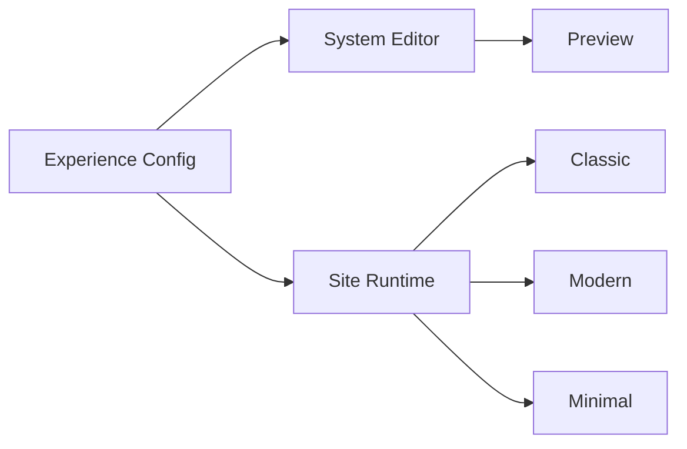

## Audit Summary
- Observation: hiện Product Detail chưa có section riêng để hiển thị toàn bộ ảnh ở phía dưới mô tả; ảnh đang tập trung ở gallery đầu trang theo từng layout.
- Observation: route `/system/experiences/product-detail` đã có cơ chế toggle nhiều khối hiển thị (rating, wishlist, share, comments...), nên phù hợp để thêm 1 toggle mới cùng pattern hiện có.
- Observation: config hiện đang quản lý ở `product_detail_ui` và đã có root-level fields dùng chung (như `imageAspectRatio`, `showBuyNow`), nên toggle mới nên đặt root-level để áp dụng chung 3 layout.
- Decision: thêm 1 cấu hình mới mặc định tắt, bật thì render section “toàn bộ ảnh sản phẩm” dạng full-width, đặt sau mô tả như yêu cầu.

## Root Cause Confidence
**High** — thiếu một khối hiển thị “all images section” độc lập và thiếu cờ cấu hình bật/tắt trong Experience config, nên hiện không thể hiển thị toàn bộ ảnh ở vị trí dưới mô tả theo ý user.

## TL;DR kiểu Feynman
- Mình thêm 1 công tắc mới trong `/system/experiences/product-detail`.
- Mặc định công tắc này tắt, nên UI giữ nguyên như hiện tại.
- Khi bật, trang chi tiết sản phẩm sẽ có thêm 1 section dưới mô tả để show toàn bộ ảnh.
- Section này full-width trong khung content của layout và người dùng lăn xuống sẽ thấy rõ tất cả ảnh.
- Áp dụng đồng nhất cho cả classic, modern, minimal.

## Proposal
### 1) Cấu hình mới (mặc định tắt)
Thêm root-level field vào `ProductDetailExperienceConfig`:
- `showAllProductImagesSection: boolean` (default `false`).

Parser/migration:
- Nếu setting cũ chưa có field thì fallback `false`.
- Không ảnh hưởng dữ liệu cũ.

### 2) Editor `/system/experiences/product-detail`
Trong `ControlCard title="Khối hiển thị"`, thêm toggle mới:
- Label: `Section toàn bộ ảnh`
- Description: `Hiển thị toàn bộ ảnh sản phẩm dưới mô tả`
- Bind: `config.showAllProductImagesSection`
- `onChange`: cập nhật root config.

Preview props:
- `getPreviewProps()` truyền thêm `showAllProductImagesSection`.

### 3) Site runtime `/app/(site)/products/[slug]/page.tsx`
Trong `useProductDetailExperienceConfig()`:
- parse thêm `showAllProductImagesSection` với fallback `false`.
- truyền prop này vào cả `ClassicStyle`, `ModernStyle`, `MinimalStyle`.

### 4) Render section ảnh full-width dưới mô tả
Tạo 1 component shared trong file site page (hoặc helper render nội bộ):
- Input: `images`, `tokens`.
- Chỉ render khi:
  - `showAllProductImagesSection === true`
  - `images.length > 0`
- Vị trí render: **ngay sau block mô tả** của từng layout, trước comments/related.
- UI:
  - title ngắn gọn: `Tất cả ảnh sản phẩm`
  - container full-width theo content wrapper của layout
  - danh sách ảnh xếp dọc (mỗi ảnh full-width) để “lăn xuống” xem tuần tự
  - ảnh giữ `object-contain`, nền `surfaceMuted`, bo góc nhẹ

### 5) Preview parity
Trong `ProductDetailPreview`:
- nhận prop `showAllProductImagesSection`.
- render section tương tự dưới mô tả, dùng `PREVIEW_IMAGES` để mô phỏng.
- khi toggle off: preview giữ nguyên như hiện tại.

## Mermaid

<!-- Cfg gồm showAllProductImagesSection; bật/tắt ở editor và áp dụng cho preview + 3 layout site -->

## Files Impacted
- `Sửa: app/system/experiences/product-detail/page.tsx`
  - Vai trò hiện tại: quản lý config/toggle và preview props cho Product Detail.
  - Thay đổi: thêm field `showAllProductImagesSection`, toggle UI, parser default false, truyền prop sang preview.

- `Sửa: app/(site)/products/[slug]/page.tsx`
  - Vai trò hiện tại: parse config runtime và render 3 layout product detail.
  - Thay đổi: parse field mới, truyền prop vào style components, render section toàn bộ ảnh dưới mô tả cho classic/modern/minimal.

- `Sửa: components/experiences/previews/ProductDetailPreview.tsx`
  - Vai trò hiện tại: preview 3 layout trong Experience editor.
  - Thay đổi: thêm prop và render section ảnh dưới mô tả khi toggle bật để parity với site.

## Execution Preview
1. Bổ sung type + default config cho `showAllProductImagesSection`.
2. Cập nhật parser editor/site để fallback `false`.
3. Thêm toggle trong editor và wiring preview props.
4. Thêm component/khối render “Tất cả ảnh sản phẩm” dưới mô tả cho 3 layout site.
5. Đồng bộ preview render theo cùng rule.
6. Rà typing/null-safety + chạy `bunx tsc --noEmit`.
7. Commit local theo convention repo.

## Acceptance Criteria
- Mặc định (toggle off): UI không thay đổi so với hiện tại.
- Bật toggle ở `/system/experiences/product-detail`: preview và site đều xuất hiện section ảnh mới.
- Section mới nằm dưới mô tả và hiển thị toàn bộ ảnh sản phẩm theo dạng cuộn dọc, full-width trong vùng nội dung.
- Áp dụng cho cả 3 layout classic/modern/minimal.

## Verification Plan
- Typecheck: `bunx tsc --noEmit`.
- Static review:
  - đảm bảo field mới là root-level, default false.
  - đảm bảo chỉ render section khi toggle bật + có ảnh.
  - đảm bảo vị trí section ở dưới mô tả theo từng layout.
- Repro checklist cho tester:
  1. Vào `/system/experiences/product-detail`, để toggle off -> preview giữ nguyên.
  2. Bật toggle -> preview thấy section mới dưới mô tả.
  3. Mở trang site product detail -> section xuất hiện tương ứng.
  4. Chuyển 3 layout và xác nhận behavior nhất quán.

## Out of Scope
- Không đổi thuật toán crop/media backend.
- Không thêm lightbox/zoom/fancybox cho section mới.

## Risk / Rollback
- Risk thấp: thay đổi chủ yếu ở tầng config + render UI.
- Rollback đơn giản: revert field/toggle mới, vì default tắt và tách biệt logic hiện có.