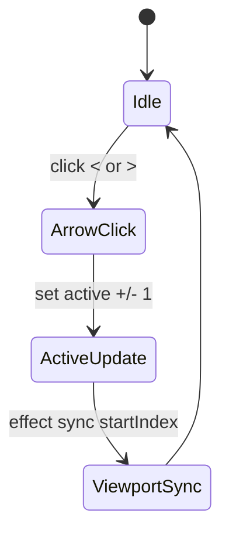

## TL;DR kiểu Feynman
- Hiện tại nút `<` `>` chỉ kéo dải thumbnail, không đổi ảnh đang active.
- Vì active không đổi, effect auto-canh viewport kéo ngược lại nên nhìn bị giựt.
- Sửa đúng UX: bấm mũi tên phải đổi luôn ảnh active sang trước/sau.
- Áp dụng đồng nhất cho site thật và preview để trải nghiệm giống nhau.
- Không đổi giao diện tổng thể, chỉ sửa logic điều hướng ảnh.

## Audit Summary
- Observation:
  - `app/(site)/products/[slug]/page.tsx` → `ThumbnailRail` arrow handlers chỉ `setStartIndex(...)`.
  - `ThumbnailRail` có effect luôn sync `startIndex` để giữ `selectedIndex` trong viewport.
  - `components/experiences/previews/ProductDetailPreview.tsx` → `PreviewThumbnailRail` cũng chỉ `setStartIndex(...)`; các nơi dùng đang truyền `activeIndex={0}` cố định.
- Inference:
  - Arrow click đổi viewport nhưng không đổi active index ⇒ effect kéo viewport lại để bám active cũ ⇒ giựt.
  - Preview còn rõ hơn vì active index cố định 0.
- Decision:
  - Arrow click sẽ đổi active index (prev/next) với clamp biên; viewport để effect tự sync theo active mới.

## Root Cause Confidence
**High** — bằng chứng trực tiếp từ handlers + effect trong cả 2 component rail cho thấy mismatch giữa state viewport (`startIndex`) và state active (`selectedIndex/activeIndex`).

## Mermaid (state transition)

<!-- ActiveUpdate: đổi ảnh active; ViewportSync: đảm bảo ảnh active luôn nằm trong rail -->

## Files Impacted
- **Sửa:** `app/(site)/products/[slug]/page.tsx`  
  Vai trò hiện tại: chứa `ThumbnailRail` dùng cho gallery site thật.  
  Thay đổi: cập nhật arrow handlers để gọi `onSelect(nextIndex)` thay vì chỉ `setStartIndex`, đồng thời disable theo biên active để hành vi rõ ràng.

- **Sửa:** `components/experiences/previews/ProductDetailPreview.tsx`  
  Vai trò hiện tại: chứa `PreviewThumbnailRail` và usage trong preview editor.  
  Thay đổi: thêm `onActiveIndexChange` (hoặc internal active state) để arrow đổi active index; cập nhật các usage hiện truyền `activeIndex={0}` sang state thật để preview không bị giựt.

## Execution Preview
1. Chỉnh `ThumbnailRail` (site): tạo `goPrev/goNext` dựa trên `selectedIndex` + clamp, gọi `onSelect`.
2. Giữ effect sync viewport như cũ để tránh duplicate logic.
3. Chỉnh `PreviewThumbnailRail`: thêm callback/state active, arrow dùng active hiện tại để đổi index.
4. Cập nhật các chỗ gọi `PreviewThumbnailRail` trong classic/modern/minimal để dùng state active tương ứng.
5. Static review: boundary (0, last), overflow/no-overflow, tránh re-render thừa.
6. Sau khi code xong sẽ chạy `bunx tsc --noEmit` trước commit (theo rule repo khi có đổi TS).

## Acceptance Criteria
- Khi bấm `<`/`>` trên rail (có overflow), ảnh chính chuyển sang ảnh trước/sau ngay lập tức.
- Không còn hiện tượng giựt/nhảy ngược viewport khi active đang ở giữa danh sách.
- Ở ảnh đầu/cuối, nút tương ứng disabled đúng và không gây nhấp nháy.
- Hành vi đồng nhất giữa site thật và preview cho cùng layout/AR.
- Không ảnh hưởng luồng click trực tiếp vào thumbnail.

## Verification Plan
- Typecheck: `bunx tsc --noEmit`.
- Repro manual (tester):
  1) Chọn sản phẩm có > visibleSlots ảnh để xuất hiện `<` `>`.
  2) Test cả `classic`, `modern`, `minimal` ở desktop.
  3) Liên tục bấm `>` rồi `<` khi active ở giữa và ở biên.
  4) So sánh preview với site thật: active + viewport phải cùng behavior.

## Out of Scope
- Không thay đổi style/icon/kích thước rail hoặc animation tổng thể.
- Không đổi logic tải ảnh/carousel mobile ngoài hành vi mũi tên rail.

## Risk / Rollback
- Risk: nếu cập nhật cả `startIndex` và `active` cùng lúc có thể double-update.
- Mitigation: arrow chỉ đổi active; để effect hiện có sync viewport.
- Rollback: revert logic arrow trong 2 file trên về phiên bản trước.