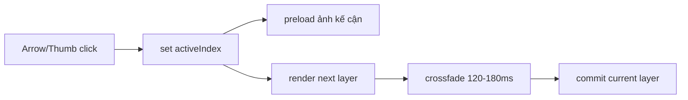

## TL;DR kiểu Feynman
- Mũi tên đã đổi đúng ảnh active, nhưng cảm giác vẫn hơi giựt vì ảnh chính đang bị thay src tức thời.
- Cách mượt, ít rủi ro nhất là chồng 2 layer ảnh và crossfade rất nhẹ khi đổi ảnh.
- Đồng thời preload ảnh kế cận để lần đổi tiếp theo không bị khựng do decode/network.
- Dùng CSS transition ngắn 120–180ms, không cần thêm thư viện mới.
- Áp dụng giống nhau cho site thật và preview để cảm giác đồng bộ.

## Audit Summary
- Observation:
  - `BlurredProductImage` trong `app/(site)/products/[slug]/page.tsx` render trực tiếp 1 ảnh foreground + 1 background blur từ cùng `src`.
  - `BlurredPreviewImage` trong `components/experiences/previews/ProductDetailPreview.tsx` cũng render tức thời 1 ảnh active duy nhất.
  - Hiện chưa có layer transition, chưa có preload ảnh kế bên, và khi đổi active index React thay source ngay.
- Inference:
  - Dù logic thumbnail đã đúng, việc thay `src` ngay lập tức dễ gây cảm giác “snap” hoặc “giựt nhẹ”, nhất là với ảnh contain + blur background.
  - Một phần giật có thể đến từ decode/repaint khi ảnh kế tiếp chưa được preload sẵn.
- Decision:
  - Dùng pattern `current + next` overlay để crossfade opacity ngắn và preload ảnh liền kề; không dùng thư viện animation mới.

## Root Cause Confidence
**High** — code hiện tại chưa có bất kỳ cơ chế transition ảnh active nào; WebSearch cũng cho thấy crossfade + preload là pattern production-safe, hiệu quả và nhẹ nhất cho image gallery React/Next hiện đại.

## Mermaid (data flow đổi ảnh mượt)

<!-- D: layer ảnh mới chồng lên ảnh cũ; F: kết thúc transition -->

## Files Impacted
- **Sửa:** `app/(site)/products/[slug]/page.tsx`  
  Vai trò hiện tại: chứa `BlurredProductImage` và các vị trí render ảnh chính của site.  
  Thay đổi: thay từ render ảnh đơn sang component/pattern crossfade 2 lớp; preload ảnh active kế cận trong gallery site.

- **Sửa:** `components/experiences/previews/ProductDetailPreview.tsx`  
  Vai trò hiện tại: chứa `BlurredPreviewImage` và gallery preview.  
  Thay đổi: áp dụng crossfade nhẹ tương tự site và preload ảnh preview kế cận để editor cảm giác giống site.

- **Có thể sửa nhỏ:** shared helper ngay trong 1 trong 2 file hoặc tách helper cục bộ nếu cần tránh lặp quá nhiều.  
  Vai trò hiện tại: chưa có helper preload/transition cho main image.  
  Thay đổi: thêm helper nhỏ để preload `activeIndex ± 1` và giữ logic gọn.

## Execution Preview
1. Audit các điểm render ảnh chính ở classic/modern/minimal trên site để gom về cùng pattern crossfade.
2. Tạo component nội bộ kiểu `TransitioningProductImage`/`TransitioningPreviewImage` hoặc refactor nhẹ từ `BlurredProductImage`/`BlurredPreviewImage`.
3. Dùng 2 layer absolute: layer cũ giữ nguyên, layer mới fade-in bằng `opacity` + transform rất nhẹ (`scale` hoặc `translateY` cực nhỏ nếu cần, ưu tiên opacity).
4. Thêm preload cho ảnh `activeIndex`, `activeIndex + 1`, `activeIndex - 1` bằng `new Image()` trong effect client-only.
5. Thêm guard reduced motion ở mức CSS/JS fallback để nếu cần thì chỉ đổi tức thời hoặc giảm duration về gần 0.
6. Rà static typing/null-safety rồi chạy `bunx tsc --noEmit` sau khi code xong.

## Acceptance Criteria
- Khi bấm thumbnail hoặc mũi tên, ảnh chính chuyển mượt hơn rõ rệt so với hiện tại, không còn cảm giác snap/giật nhẹ đáng kể.
- Duration subtle khoảng 120–180ms, không làm UX chậm đi.
- Thumbnail rail behavior giữ nguyên: active đổi đúng, viewport sync đúng.
- Preview và site thật cho cảm giác chuyển ảnh tương tự nhau.
- Không ảnh hưởng layout/aspect ratio/blur background hiện có.

## Verification Plan
- Typecheck: `bunx tsc --noEmit`.
- Repro manual (tester):
  1) Test sản phẩm có nhiều ảnh, bấm nhanh thumbnail và nút `<` `>`.
  2) Test classic, modern, minimal trên desktop.
  3) So sánh trước/sau ở ảnh đã cache và ảnh mới mở lần đầu.
  4) Kiểm tra preview `/system/experiences/product-detail` có cùng độ mượt với site.

## Evidence from Web Search
- React/View Transition/Motion đều có thể làm mượt, nhưng với repo hiện tại chưa có dependency animation phù hợp và user ưu tiên hướng nhẹ.
- Pattern được recommend nhất cho case này là `CSS crossfade + preload`, vì:
  - không thêm dependency,
  - ít xâm lấn code,
  - dễ rollback,
  - đủ mượt cho image gallery đổi state nội bộ.

## Out of Scope
- Không redesign gallery, không thêm zoom/drag/swipe mới.
- Không thay thumbnail rail structure hay icon/style tổng thể.
- Không đưa thêm dependency animation vào dự án ở bước này.

## Risk / Rollback
- Risk: nếu quản lý layer cũ/mới không chặt có thể lóe ảnh sai hoặc chồng layer quá lâu.
- Mitigation: transition state tối giản, chỉ giữ previous src trong thời gian animation ngắn rồi cleanup.
- Rollback: revert về render ảnh đơn hiện tại, giữ nguyên phần arrow UX đã sửa.