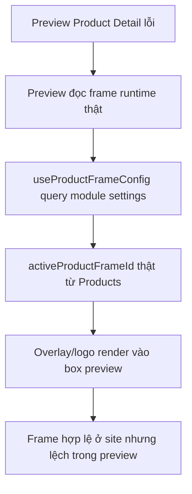

## Audit Summary
- Observation: Ảnh bạn gửi cho thấy overlay khung/logo đang xuất hiện trong preview `/system/experiences/product-detail`, và phần logo bị “lòi” ra ngoài container preview ở nhiều block, đặc biệt card Preview phía dưới. Evidence: hai screenshot tại `C:\Users\VTOS\Downloads\screencapture-localhost-3000-system-experiences-product-detail-2026-04-07-01_30_13.png` và `...01_29_29.png`.
- Observation: Preview hiện đang đọc frame thật từ setting module Products thay vì state preview-local. Evidence: `components/experiences/previews/ProductDetailPreview.tsx:526` có `const { frame } = useProductFrameConfig();`.
- Observation: `useProductFrameConfig()` đang query trực tiếp `enableProductFrames` + `activeProductFrameId` và lấy frame thật từ Convex. Evidence: `components/shared/ProductImageFrameBox.tsx`.
- Observation: Overlay được render trực tiếp trong các wrapper ảnh của preview (`ProductImageFrameOverlay frame={frame}`), nên khi frame thật có kích thước/vị trí logo lớn hoặc lệch, preview sẽ ăn theo runtime config. Evidence: `components/experiences/previews/ProductDetailPreview.tsx:667, 714, 941, 986, 1210`.
- Observation: Dù nhiều wrapper có `overflow-hidden`, preview vẫn không có contract riêng để giới hạn frame chỉ trong phạm vi preview; nó phụ thuộc hoàn toàn vào dữ liệu frame thật. Với logo frame dùng `%` theo kích thước box (`components/shared/ProductImageFrameBox.tsx`), khi config thật không phù hợp cho preview mock, kết quả nhìn như “lòi”/nhiễu ở editor.

## Root Cause Confidence
**High** — nguyên nhân chính là preview đang dùng `useProductFrameConfig()` nên bị leak dữ liệu runtime từ `/admin/settings/product-frames` vào environment preview. Đây không hợp lý vì preview editor cần state cô lập. Vấn đề overflow/"lòi" hiện tại là hệ quả thứ cấp của việc dùng frame thật trong preview, không phải do route settings tự inject CSS toàn cục.

## TL;DR kiểu Feynman
- Preview trang cấu hình đang mượn luôn “khung sản phẩm thật” của website.
- Khung thật được thiết kế cho trang bán hàng, không phải cho box preview nhỏ trong editor.
- Vì vậy khi logo/frame ngoài site hợp lệ, trong preview nó có thể trông lệch hoặc lòi ra ngoài.
- Cách đúng là: preview có cơ chế riêng để chỉ hiển thị khung bên trong preview, không phụ thuộc trực tiếp setting runtime.
- Site thật vẫn giữ behavior hiện tại; chỉ editor preview được cô lập lại.

## Elaboration & Self-Explanation
Hiện tại component preview của Product Detail đang tự đi hỏi backend: “frame nào đang active ở module Products?”. Điều đó làm cho preview editor không còn là môi trường mô phỏng độc lập nữa, mà trở thành bản thu nhỏ của site runtime. Khi admin đổi khung ở `/admin/settings/product-frames`, preview ở `/system/experiences/product-detail` đổi theo ngay.

Bản thân việc “có hiển thị khung trong preview” không sai. Cái sai là preview đang lấy khung từ nguồn dữ liệu thật và không có lớp kiểm soát riêng cho editor. Kết quả là một frame/logo hợp lý trên site thật có thể nhìn lỗi trong preview nhỏ, vì preview có layout, kích thước và box chứa khác.

Nói chậm hơn: editor preview nên có quyền quyết định “có render khung không, và nếu có thì phải bị nhốt gọn trong box preview”. Còn site runtime mới là nơi được đọc setting thật của module. Hai môi trường này hiện đang bị dính vào nhau.

## Concrete Examples & Analogies
### Ví dụ cụ thể theo repo
- Ở `components/experiences/previews/ProductDetailPreview.tsx`, main image đang render:
  - ảnh preview
  - rồi `ProductImageFrameOverlay frame={frame}`
- Nhưng `frame` lại đến từ `useProductFrameConfig()` trong shared layer.
- Hook này đọc `activeProductFrameId` thật từ module Products.
- Nghĩa là chỉ cần đổi khung ở `/admin/settings/product-frames`, preview editor đổi theo ngay, kể cả khi editor chưa hề có setting nào về khung.

### Analogy đời thường
Giống như bạn đang thiết kế mockup trong Figma nhưng phần watermark/layer lại lấy trực tiếp từ billboard ngoài đường. Billboard ngoài đời có thể đúng kích thước, nhưng khi nhét nguyên vào khung mockup nhỏ thì nó sẽ bị tràn hoặc nhìn sai. Không phải billboard sai; sai ở chỗ mockup không có lớp cô lập riêng.

## Problem Graph

## Files Impacted
### UI / preview
1. `components/experiences/previews/ProductDetailPreview.tsx`
   - Vai trò hiện tại: render preview cho 3 layout product detail trong editor.
   - Sửa: bỏ phụ thuộc trực tiếp vào `useProductFrameConfig()`, thêm contract preview-local để frame chỉ hiển thị trong phạm vi preview và không bị leak từ admin settings.

2. `app/system/experiences/product-detail/page.tsx`
   - Vai trò hiện tại: quản lý state/config của experience và truyền props cho `ProductDetailPreview`.
   - Sửa: truyền thêm preview frame behavior rõ ràng (ví dụ `previewFrameMode`, `frameOverride`, hoặc `constrainFrameToPreview`) để editor kiểm soát độc lập.

### Shared frame layer
3. `components/shared/ProductImageFrameBox.tsx`
   - Vai trò hiện tại: chứa hook đọc frame runtime và renderer overlay.
   - Sửa: tách rõ 2 concern: (1) hook đọc runtime settings, (2) renderer thuần cho overlay/frame; có thể bổ sung prop constrain/clamp để overlay logo luôn bị giới hạn trong box preview khi dùng trong editor.

## Execution Preview
1. Audit lại contract hiện tại giữa `ProductDetailExperiencePage` và `ProductDetailPreview`.
2. Đưa frame của preview về một nguồn explicit từ page thay vì `ProductDetailPreview` tự query runtime settings.
3. Thêm mode dành riêng cho editor preview: vẫn cho phép hiển thị khung, nhưng chỉ bên trong preview box và không để ảnh hưởng/lòi ra ngoài.
4. Giữ site runtime (`app/(site)/products/**`) tiếp tục dùng `useProductFrameConfig()` như hiện tại.
5. Static review: rà tất cả điểm render `ProductImageFrameOverlay` trong preview để đảm bảo cùng contract mới.

## Đề xuất implement
### Option A (Recommend) — Preview-local frame contract + constrain overlay
**Confidence 90%** vì ít rủi ro, đúng với mong muốn của bạn: “có bật nhưng chỉ trong preview thôi, đừng lòi ra ngoài”.

Cách làm:
- `ProductDetailPreview` nhận thêm props kiểu:
  - `previewFrame?: ProductImageFrame | null`
  - `enablePreviewFrame?: boolean`
  - `constrainFrameToPreview?: boolean`
- `app/system/experiences/product-detail/page.tsx` sẽ là nơi quyết định preview có dùng frame hay không.
- `ProductDetailPreview` không gọi `useProductFrameConfig()` nữa.
- `ProductImageFrameOverlay`/renderer được tăng cường để clamp logo/overlay trong phạm vi box preview khi `constrainFrameToPreview=true`.

Tradeoff:
- Chạm 2–3 file nhưng boundary rõ.
- Preview tách khỏi runtime nhưng vẫn có thể tái sử dụng frame renderer.

### Option B — Keep runtime hook nhưng patch CSS/overflow ở preview
**Confidence 45%** chỉ phù hợp nếu muốn vá nhanh UI.

Cách làm:
- Giữ nguyên `useProductFrameConfig()` trong preview.
- Thêm wrapper/crop/clip mạnh hơn quanh image box để che phần tràn.

Tradeoff:
- Không xử lý đúng root cause leak dữ liệu.
- Dễ tái lỗi khi frame config mới xuất hiện.
- Preview vẫn bị phụ thuộc admin settings.

## Recommend
Chọn **Option A**. Đây là hướng tốt nhất vì giải quyết đúng gốc: tách preview editor khỏi dữ liệu runtime, đồng thời vẫn đáp ứng yêu cầu của bạn là preview có thể hiển thị khung nhưng chỉ gói gọn bên trong preview, không “lòi” ra ngoài.

## Acceptance Criteria
- Khi đổi frame ở `/admin/settings/product-frames`, preview `/system/experiences/product-detail` không còn bị ảnh hưởng ngoài contract preview đã định.
- Nếu preview bật frame, overlay/logo luôn nằm gọn trong box ảnh preview; không xuất hiện artifact tràn ra ngoài card/section.
- Main image, thumbnail, all-images section và các layout `classic/modern/minimal` dùng cùng rule constrain.
- Site runtime `/products/[slug]` vẫn giữ behavior product frame theo settings thật, không bị thay đổi ngoài ý muốn.
- Không tạo dependency mới và không đổi schema/settings nếu chưa thực sự cần.

## Verification Plan
- Static verify: rà `ProductDetailPreview.tsx` để chắc không còn `useProductFrameConfig()` bên trong preview component.
- Repro manual sau khi implement:
  1. Bật/tắt/đổi nhiều loại frame ở `/admin/settings/product-frames`.
  2. Mở `/system/experiences/product-detail`.
  3. Xác nhận frame trong preview chỉ hiển thị theo contract preview-local và không bị tràn/lòi ra ngoài.
  4. Mở site product detail thật để xác nhận runtime vẫn đọc settings thật.
- Typecheck planned only nếu có đổi TS/code: `bunx tsc --noEmit`.
- Không chạy lint/build/test theo rule repo hiện tại.

## Out of Scope
- Refactor toàn bộ hệ thống product frames cho home components/listing khác.
- Đổi UX của trang `/admin/settings/product-frames`.
- Thêm setting database mới nếu có thể giải quyết bằng preview-local contract.

## Risk / Rollback
- Risk chính: nếu tách contract không khéo, preview có thể mất parity với site thật ở phần frame.
- Giảm rủi ro bằng cách chỉ tách nguồn dữ liệu, không đổi renderer runtime của site.
- Rollback đơn giản: revert các thay đổi ở `ProductDetailPreview`, page editor và helper constrain nếu có.

## Post-Audit
- Counter-hypothesis đã loại trừ: không thấy evidence của CSS bleed/global stylesheet từ route settings.
- Kết luận: đây là issue boundary giữa preview editor và runtime settings, kèm thiếu constrain cho overlay trong môi trường preview.

Nếu bạn duyệt spec này, tôi sẽ implement theo Option A: vẫn cho preview có frame, nhưng frame bị cô lập trong preview và không còn lòi/ăn theo lỗi như hiện tại.