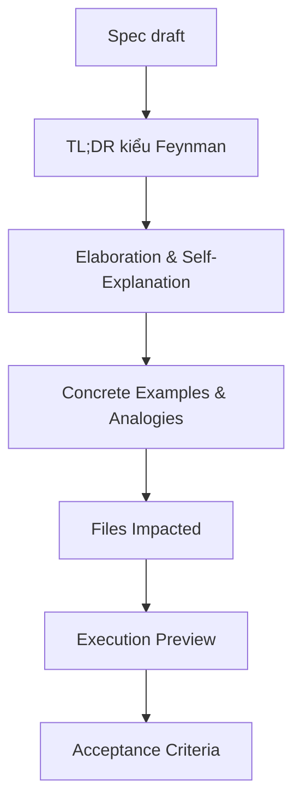

## Audit Summary
- Observation: `AGENTS.md` đã có `TL;DR kiểu Feynman`, giúp rút gọn ý chính cho người mới.
- Observation: Tuy vậy, `TL;DR` chỉ trả lời mức “nói ngắn cho dễ nuốt”, chưa bắt buộc người viết phải giải thích lại theo chiều sâu hoặc đưa ví dụ đời thường/case cụ thể.
- User decision: Thêm cả **Elaboration & Self-Explanation** và **Concrete Examples & Analogies**.
- User decision: Hai section mới sẽ là **bắt buộc cho mọi spec**, không chỉ task phức tạp.
- Inference: Mục tiêu không còn chỉ là “tóm tắt dễ hiểu”, mà là “giải thích đủ để người gần như chưa biết gì vẫn theo được”.

## Root Cause Confidence
**High** — Vì evidence trong guideline hiện tại cho thấy spec output mới bắt buộc `TL;DR kiểu Feynman`, nhưng chưa có block nào ép người viết: (1) giải thích lại cơ chế theo ngôn ngữ chậm hơn, dễ hơn; (2) neo khái niệm trừu tượng vào ví dụ cụ thể hoặc analogy. Đây là gap thật sự nếu audience là người mới.

## TL;DR kiểu Feynman
- `TL;DR kiểu Feynman` là tốt, nhưng vẫn hơi “nén” với người mới hoàn toàn.
- Mình sẽ thêm 2 block bắt buộc cho mọi spec:
  - `Elaboration & Self-Explanation`
  - `Concrete Examples & Analogies`
- `Elaboration` buộc người viết giải thích lại cơ chế bằng ngôn ngữ chậm, rõ, ít jargon.
- `Concrete Examples & Analogies` buộc người viết gắn ý tưởng với ví dụ thật hoặc so sánh đời thường.
- Kết quả là spec sẽ vừa có bản ngắn, vừa có bản giải thích sâu hơn cho người chưa có nền.

## Proposal
### 1) Mở rộng output contract trong `Spec Mode Rules`
Hiện tại guideline có các block bắt buộc như:
- `Audit Summary`
- `Root Cause Confidence`
- `Verification Plan`
- `TL;DR kiểu Feynman`
- `Files Impacted`
- `Execution Preview`
- `Acceptance Criteria`

Đề xuất bổ sung thêm 2 block bắt buộc cho mọi spec:
- `Elaboration & Self-Explanation`
- `Concrete Examples & Analogies`

### 2) Ý nghĩa của từng block mới
#### `Elaboration & Self-Explanation`
Mục đích:
- Ép người viết giải thích lại vấn đề và hướng sửa theo kiểu “dạy lại cho người mới”.
- Giảm tình trạng spec đúng kỹ thuật nhưng khó theo vì quá nén hoặc quá nhiều shorthand.

Rule đề xuất:
- Viết 1 đoạn ngắn hoặc 3–5 bullet.
- Trả lời rõ:
  - vấn đề cốt lõi là gì,
  - vì sao giải pháp này xử lý đúng nguyên nhân,
  - điều gì sẽ thay đổi trước/sau khi làm.
- Hạn chế jargon; nếu dùng thuật ngữ thì giải thích ngay trong cùng block.
- Viết như thể người đọc sẽ phải tự giải thích lại cho người khác sau 5 phút.

#### `Concrete Examples & Analogies`
Mục đích:
- Neo ý tưởng trừu tượng vào tình huống thực tế.
- Giúp người mới có “móc treo nhận thức” thay vì chỉ nhớ định nghĩa.

Rule đề xuất:
- Bắt buộc có ít nhất 1 ví dụ cụ thể.
- Nếu phù hợp, thêm 1 analogy đời thường.
- Ví dụ phải bám sát task/repo, không nói chung chung.
- Analogy chỉ dùng để làm rõ, không thay thế giải thích kỹ thuật.

### 3) Điều chỉnh wording hiện có để tránh chồng chéo
Không bỏ `TL;DR kiểu Feynman`, vì nó vẫn có giá trị riêng:
- `TL;DR kiểu Feynman` = bản siêu ngắn, nắm ý nhanh.
- `Elaboration & Self-Explanation` = bản giải thích chậm hơn, có logic nhân-quả.
- `Concrete Examples & Analogies` = bản neo bằng ví dụ thật / so sánh dễ hình dung.

Ba lớp này bổ sung nhau, không trùng vai trò.

## Mermaid minh họa structure mới của spec

Legend:
- B = hiểu nhanh
- C = hiểu sâu hơn bằng lời giải thích chậm
- D = gắn với ví dụ thật/so sánh đời thường

## Files Impacted
- `AGENTS.md`
  - Vai trò hiện tại: guideline chính, định nghĩa output contract của spec mode.
  - Sửa: bổ sung 2 block bắt buộc mới trong `Spec Mode Rules` và mô tả ngắn nhiệm vụ của từng block để người viết spec dùng nhất quán.

## Execution Preview
1. Đọc lại `Spec Mode Rules` trong `AGENTS.md` để đặt rule mới sát block `TL;DR kiểu Feynman`.
2. Cập nhật dòng “Output spec bắt buộc...” hoặc thêm các bullet mới để phản ánh 2 section bắt buộc.
3. Thêm guideline ngắn mô tả cách viết `Elaboration & Self-Explanation`.
4. Thêm guideline ngắn mô tả cách viết `Concrete Examples & Analogies`.
5. Tự review tĩnh để bảo đảm 2 block mới bổ sung, không lặp vai với `TL;DR kiểu Feynman`.

## Nội dung đề xuất chèn vào AGENTS.md
Có thể chèn wording gần như sau trong `# Spec Mode Rules`:

> - Spec output bắt buộc có `TL;DR kiểu Feynman` (3–6 bullet, nói như cho người mới vào dự án).
> - Spec output bắt buộc có `Elaboration & Self-Explanation`: giải thích lại vấn đề, nguyên nhân và hướng xử lý bằng ngôn ngữ chậm, rõ, ít jargon; đủ để người mới có thể tự kể lại.
> - Spec output bắt buộc có `Concrete Examples & Analogies`: ít nhất 1 ví dụ cụ thể bám sát task/repo; nếu phù hợp, thêm 1 analogy đời thường để làm rõ trực giác.

Hoặc nếu muốn tách rõ hơn thành mini-subsection:

> - `TL;DR kiểu Feynman`: nắm ý nhanh trong 3–6 bullet.
> - `Elaboration & Self-Explanation`: giải thích sâu hơn theo kiểu dạy lại cho người mới.
> - `Concrete Examples & Analogies`: neo khái niệm bằng ví dụ thật và so sánh dễ hình dung.

## Concrete Examples & Analogies
### Ví dụ 1: Bug loading state
- `TL;DR kiểu Feynman`: “Nút bị kẹt loading vì state không reset khi request fail.”
- `Elaboration & Self-Explanation`: “Hiện tại code chỉ tắt loading ở nhánh success. Khi request fail, state `isSubmitting` vẫn là `true`, nên UI nghĩ là request còn chạy. Sửa đúng là reset state ở cả success và error/finally.”
- `Concrete Example`: “Ví dụ user bấm Lưu, mạng timeout, toast lỗi hiện ra nhưng nút vẫn quay spinner mãi.”
- `Analogy`: “Giống như bật đèn báo ‘đang xử lý’ nhưng quên tắt khi việc bị lỗi giữa chừng.”

### Ví dụ 2: Data flow phức tạp
- `TL;DR kiểu Feynman`: “Tách luồng fetch thành UI → server action → DB để rõ trách nhiệm.”
- `Elaboration & Self-Explanation`: “UI chỉ nên lo hiển thị và trigger action. Server action chịu trách nhiệm validate + orchestration. DB query nằm ở lớp data access để tránh business logic rải rác.”
- `Concrete Example`: “Form tạo bài viết gọi server action, action validate title/body rồi mới insert vào DB.”
- `Analogy`: “Giống nhà hàng: khách gọi món, phục vụ nhận order, bếp nấu; không ai làm lẫn việc của nhau.”

## Acceptance Criteria
- `AGENTS.md` yêu cầu bắt buộc thêm 2 block mới: `Elaboration & Self-Explanation` và `Concrete Examples & Analogies`.
- Rule mới nói rõ vai trò khác nhau giữa `TL;DR kiểu Feynman`, `Elaboration`, và `Concrete Examples & Analogies`.
- Người viết spec có đủ hướng dẫn ngắn để áp dụng ngay mà không cần suy đoán format.
- Guideline vẫn ngắn, dễ scan, không biến thành giáo trình dài dòng.

## Out of Scope
- Không thay đổi các rule khác ngoài output contract của spec mode.
- Không mở rộng sang template spec quá cứng hoặc bắt buộc số lượng paragraph cố định.
- Không thay đổi Mermaid defaults vừa thêm trước đó.

## Risk / Rollback
- Risk: Nếu bắt buộc cho mọi spec, output có thể dài hơn trước.
- Tradeoff: Đổi lại, spec thân thiện hơn với người mới và giảm khoảng cách hiểu giữa người biết sâu với người mới vào.
- Rollback: Nếu sau này thấy quá nặng, có thể hạ từ “bắt buộc cho mọi spec” xuống “bắt buộc cho spec phức tạp”.

## Verification Plan
- Review tĩnh `AGENTS.md` để xác nhận 2 section mới đã được mô tả rõ, ngắn, và không chồng chéo.
- Kiểm tra `Spec Mode Rules` còn mạch lạc sau khi thêm rule.
- Kiểm tra bằng 1 spec mẫu giả định: người đọc có thể phân biệt được phần nào là tóm tắt, phần nào là giải thích sâu, phần nào là ví dụ/analogy.
- Không cần runtime/test/build vì đây là thay đổi guideline, không phải code app.