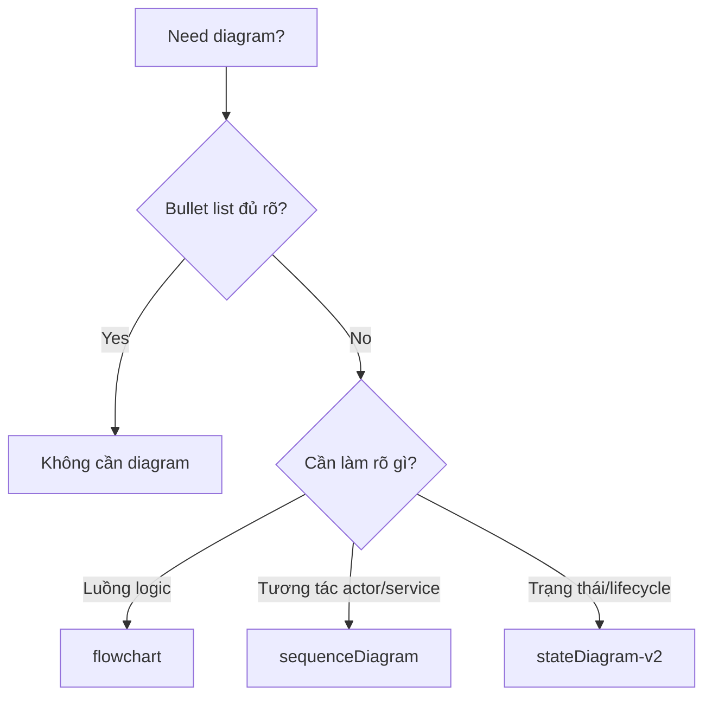

## Audit Summary
- Observation: `AGENTS.md` hiện chỉ nói: khi spec liên quan architecture, data flows, state machines, hoặc complex interactions thì thêm Mermaid nếu nó giúp làm rõ.
- Observation: Chưa có default set diagram, chưa có rule chọn diagram theo tình huống, nên người viết spec dễ lúng túng hoặc lạm dụng kiểu UML khó đọc.
- Observation: `AGENTS.md` hiện còn có `Sync Rule` yêu cầu mirror guideline cốt lõi sang `CLAUDE.md`.
- User decision: Áp dụng **Option A** làm chuẩn và **bỏ Sync Rule**, đồng thời **xóa `CLAUDE.md`** để repo chỉ còn một nguồn guideline là `AGENTS.md`.
- Decision: Spec sẽ gom 2 việc cùng lúc: chuẩn hóa Mermaid trong `AGENTS.md` và đơn giản hóa nguồn guideline bằng cách bỏ mirror + xóa `CLAUDE.md`.

## Root Cause Confidence
**High** — Vì evidence trực tiếp nằm ngay trong guideline hiện tại: có yêu cầu “dùng Mermaid khi cần” nhưng thiếu taxonomy, thiếu quick selector, thiếu default diagram set. Ngoài ra còn có duplication risk do `Sync Rule` + `CLAUDE.md`, dễ gây lệch guideline về sau.

## TL;DR kiểu Feynman
- Hiện guideline có nói “nên vẽ Mermaid khi cần”, nhưng chưa nói **nên vẽ loại nào**.
- Mình sẽ chuẩn hóa 3 loại mặc định dễ hiểu nhất: **Flowchart, Sequence, State**.
- Mỗi loại sẽ có rule rất ngắn: dùng khi nào, không dùng khi nào.
- Đồng thời bỏ cơ chế phải mirror sang `CLAUDE.md` vì dễ trùng và lệch.
- Repo sau đó chỉ giữ **một nguồn sự thật** là `AGENTS.md`.

## Proposal
### 1) Chuẩn hóa default Mermaid set trong `AGENTS.md`
Thêm một mục guideline mới, theo đúng tinh thần Option A:
- `flowchart` cho luồng logic tổng thể, nhánh quyết định, pipeline xử lý.
- `sequenceDiagram` cho tương tác giữa UI / API / DB / service theo thời gian.
- `stateDiagram-v2` cho lifecycle, status, state transition.

Kèm các nguyên tắc ngắn:
- Nếu bullet list đã đủ rõ thì **không cần vẽ**.
- Tránh lạm dụng `classDiagram` và `usecase` trong spec dev hằng ngày.
- Mỗi diagram phải trả lời được đúng 1 câu hỏi chính: luồng gì, tương tác gì, hay trạng thái gì.
- Tên node/participant ngắn, dễ scan trong terminal.

### 2) Thêm quick selector để dev ít nền UML vẫn dùng được ngay
Sẽ thêm một bảng/chunk hướng dẫn rất ngắn kiểu:
- “Muốn giải thích luồng tổng thể?” → `flowchart`
- “Muốn giải thích ai gọi ai?” → `sequenceDiagram`
- “Muốn giải thích object đổi trạng thái ra sao?” → `stateDiagram-v2`

### 3) Bỏ `Sync Rule`
Xóa rule:
- “Nếu sửa guideline cốt lõi ở AGENTS.md thì mirror sang CLAUDE.md trong cùng task.”

Lý do:
- Một guideline ở hai nơi dễ drift.
- Không tăng clarity nhưng tăng chi phí bảo trì.
- User đã chọn chỉ giữ `AGENTS.md`.

### 4) Xóa `CLAUDE.md`
Vì sau khi bỏ `Sync Rule`, `CLAUDE.md` không còn vai trò cần thiết trong repo theo quyết định của bạn.

## Mermaid minh họa cho chính guideline mới

Legend:
- “Luồng logic” = branch, pipeline, xử lý tổng thể
- “Tương tác” = UI/API/DB/service gọi nhau
- “Trạng thái” = draft/published/archived, idle/loading/success/error, ...

## Files Impacted
### Guideline
- `AGENTS.md`
  - Vai trò hiện tại: nguồn guideline chính của repo.
  - Sửa: thêm section chuẩn hóa Mermaid default set + quick selector + guardrails tránh lạm dụng UML nặng.
  - Sửa: xóa `Sync Rule` đang yêu cầu mirror sang `CLAUDE.md`.

### Cleanup
- `CLAUDE.md`
  - Vai trò hiện tại: bản guideline trùng lặp với `AGENTS.md`.
  - Xóa: loại bỏ file để tránh duplication và drift, theo quyết định của user.

## Execution Preview
1. Đọc lại `AGENTS.md` để đặt section mới đúng vị trí, giữ văn phong hiện có.
2. Chèn guideline Mermaid theo Option A: Flowchart / Sequence / State.
3. Thêm quick selector và rule “khi nào không cần vẽ”.
4. Xóa `Sync Rule` khỏi `AGENTS.md`.
5. Xóa `CLAUDE.md` khỏi repo.
6. Tự review tĩnh để bảo đảm guideline ngắn, rõ, không lặp ý.

## Nội dung đề xuất chèn vào AGENTS.md
Có thể theo wording gần như sau:

> # Mermaid Diagram Defaults
> - Khi spec cần biểu đồ, ưu tiên 3 loại mặc định:
>   - `flowchart` cho luồng logic tổng thể, decision branches, pipeline xử lý.
>   - `sequenceDiagram` cho tương tác giữa nhiều actor/service theo thời gian.
>   - `stateDiagram-v2` cho lifecycle, status và transition.
> - Quick selector:
>   - Nếu câu hỏi là “luồng chạy ra sao?” → dùng `flowchart`.
>   - Nếu câu hỏi là “ai gọi ai, theo thứ tự nào?” → dùng `sequenceDiagram`.
>   - Nếu câu hỏi là “trạng thái đổi khi nào?” → dùng `stateDiagram-v2`.
> - Nếu bullet list đã đủ rõ thì không cần diagram.
> - Tránh lạm dụng `classDiagram` và `usecase` cho task dev hằng ngày; chỉ dùng khi thật sự cần domain modeling hoặc BA-level analysis.
> - Tên participant/node ngắn, dưới ~20 ký tự, để render tốt trong terminal.

## Acceptance Criteria
- `AGENTS.md` có rule rõ ràng về 3 Mermaid default diagrams.
- Dev mới đọc vào biết chọn diagram nào cho 3 case chính: flow / interaction / state.
- `AGENTS.md` không còn `Sync Rule`.
- `CLAUDE.md` bị xóa khỏi repo.
- Guideline sau chỉnh sửa vẫn ngắn, thực dụng, không biến thành tài liệu UML dài dòng.

## Out of Scope
- Không mở rộng sang full UML taxonomy.
- Không thêm guideline cho ER/C4/class/use case ngoài mức nhắc “không phải default”.
- Không thay đổi các rule coding khác ngoài phần Mermaid + Sync Rule cleanup.

## Risk / Rollback
- Risk: Nếu có tooling hoặc thói quen nội bộ nào còn phụ thuộc `CLAUDE.md`, việc xóa file có thể làm mất một điểm tham chiếu cũ.
- Mitigation: Giữ toàn bộ guideline chuẩn trong `AGENTS.md` sau khi hợp nhất.
- Rollback: Có thể restore `CLAUDE.md` từ git nếu phát hiện dependency ngoài dự kiến.

## Verification Plan
- Review tĩnh nội dung `AGENTS.md` sau sửa để chắc rằng section mới rõ, ngắn, không trùng ý cũ.
- Kiểm tra `AGENTS.md` không còn nhắc mirror sang `CLAUDE.md`.
- Kiểm tra repo không còn `CLAUDE.md`.
- Không có runtime/test/build vì đây là thay đổi guideline, không phải code app.