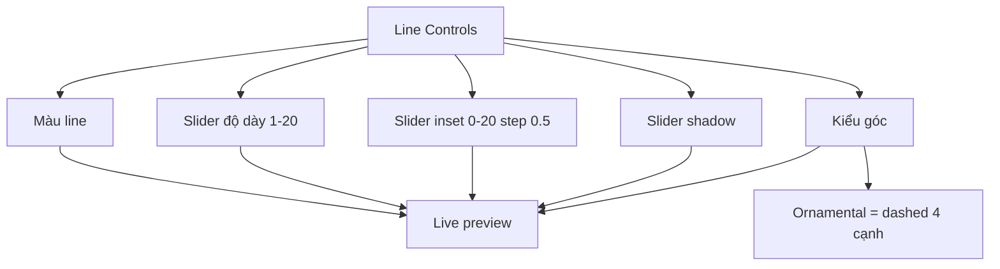

## TL;DR kiểu Feynman
- Kiểu `Ornamental` sẽ đổi sang **nét đứt đều 4 cạnh** giống ảnh chụp, không nhấn khối ở 4 góc nữa.
- `Shadow` sẽ bỏ kiểu nhập chuỗi CSS khó hiểu, thay bằng **slider cường độ** để user phổ thông kéo là thấy ngay.
- `Inset` sẽ tăng độ mịn: bước nhỏ nhất `0.5`, tối đa `20`.
- `Độ dày` sẽ tăng tối đa lên `20` để user có biên độ chỉnh rộng hơn.
- UI phần `Khung line` sẽ được tinh lại để dễ đọc, ít kỹ thuật hơn, ưu tiên preview tức thì.

## Audit Summary
### Observation
1. UI `Khung line` hiện đã có slider cho `Độ dày` và `Inset`, nhưng range còn hẹp: độ dày max `12`, inset max `15`, inset step `1`.
2. `Shadow` vẫn đang là ô nhập chuỗi CSS (`0 0 6px rgba(...)`), đây là format kỹ thuật mà người dùng phổ thông gần như không tự chỉnh nổi.
3. `Ornamental` hiện render bằng dashed border cộng thêm block ở 4 góc, nhưng user đã chốt muốn giống ảnh chụp hơn: **nét đứt đều 4 cạnh**.
4. Preview đã là realtime, nên phù hợp để chuyển các control kỹ thuật sang slider/preset trực quan.

### Root Cause Confidence
**High** — vấn đề chính là abstraction của control chưa phù hợp với user phổ thông: input đang thiên về kỹ thuật thay vì thao tác trực quan.

### Counter-Hypothesis
- Không cần đổi schema/backend: `shadow` vẫn có thể tiếp tục lưu dưới dạng string như cũ, chỉ thay UI mapping slider → CSS string.
- Không cần thêm loại frame mới: chỉ refine UX và logic render cho `line_generator`.
- Không cần hỏi thêm về fit mode hay loại góc khác; user đã chốt rõ 3 yêu cầu mới.

## Elaboration & Self-Explanation
Mục tiêu ở đây là làm cho khu vực `Khung line` giống một công cụ chỉnh trực quan hơn là form kỹ thuật. User chỉ nên cần trả lời những câu đơn giản như: đường viền đậm hay nhẹ, sát mép hay lùi vào, bóng nhiều hay ít. Phần khó như chuỗi CSS shadow sẽ để hệ thống tự sinh từ slider. Với `Ornamental`, vì user muốn giống ảnh chụp, cách đúng là dùng dash đều quanh cả 4 cạnh, thay vì thêm các khối góc làm cảm giác khác hẳn mẫu mong muốn.

## Concrete Examples & Analogies
- Ví dụ: `Inset = 0.5` cho phép tinh chỉnh rất nhỏ khi user thấy line đang hơi sát mép nhưng chưa cần lùi hẳn `1%`.
- Ví dụ: `Độ dày = 18` sẽ giúp tạo kiểu line nổi bật cho banner sale hoặc khung seasonal mạnh hơn.
- Ví dụ: `Shadow intensity = 0` thì không có bóng; `50` thì bóng vừa; `100` thì bóng mạnh — user không cần biết `rgba(...)` là gì.
- Analogy: giống app chỉnh ảnh trên mobile, thanh kéo “đổ bóng” dễ dùng hơn bắt người dùng nhập công thức ánh sáng.

## Files Impacted
### UI
- **Sửa:** `app/admin/settings/_components/ProductFrameManager.tsx`  
  Vai trò hiện tại: form tạo/sửa khung và preview realtime.  
  Thay đổi: đổi `Shadow` từ text input sang slider cường độ; nới range `Độ dày` lên `20`; nới range `Inset` lên `20` với step `0.5`; tinh lại microcopy của line controls để bớt kỹ thuật.

### Shared render
- **Sửa:** `components/shared/ProductImageFrameBox.tsx`  
  Vai trò hiện tại: render visual của `line_generator`.  
  Thay đổi: cập nhật `ornamental-light` để ưu tiên dashed border đều 4 cạnh giống ảnh mẫu; bỏ accent block ở góc đang làm sai cảm giác thị giác.

## Execution Preview
1. Refactor khối `Khung line` trong create panel:
   - `Độ dày`: slider `min 1`, `max 20`, `step 0.5`.
   - `Inset`: slider `min 0`, `max 20`, `step 0.5`.
   - `Shadow`: slider cường độ thay cho text input; hiển thị giá trị thân thiện.
2. Áp dụng cùng pattern trên edit drawer của line frame để create/edit nhất quán.
3. Tạo helper nhỏ để map `shadow intensity` → CSS drop-shadow string ổn định, dễ predict.
4. Chỉnh `renderLineFrame()` để `ornamental-light` thành dashed border 4 cạnh giống ảnh chụp, không dùng corner blocks nữa.
5. Giữ preview realtime hiện có để user thấy ngay thay đổi khi kéo slider.
6. Tự review tĩnh các edge cases: shadow = 0, inset = 20, strokeWidth = 20, ornamental + rounded/sharp không phá layout.

## Acceptance Criteria
- `Ornamental` nhìn theo style dashed đều 4 cạnh, gần ảnh chụp hơn hiện tại.
- `Shadow` không còn là ô nhập CSS string; user chỉnh bằng slider dễ hiểu.
- `Inset` cho phép bước `0.5` và kéo tối đa tới `20`.
- `Độ dày` kéo tối đa tới `20`.
- Preview line cập nhật tức thì khi kéo `Shadow`, `Inset`, `Độ dày` hoặc đổi kiểu góc.

## Verification Plan
- Repro thủ công tại `/admin/settings/product-frames` với `frameType = line`.
- Kiểm tra 4 ca chính:
  1. `Ornamental` hiển thị dashed 4 cạnh như mong muốn.
  2. `Shadow slider` từ thấp đến cao tạo bóng tăng dần, không cần nhập text.
  3. `Inset` chấp nhận `0.5`, `1.5`, `19.5`, `20`.
  4. `Độ dày` kéo được tới `20` và preview không vỡ.
- Theo AGENTS.md: không chạy lint/unit/build; chỉ static self-review và type path reasoning trong spec phase.

## Out of Scope
- Không đổi schema Convex.
- Không thêm preset shadow phức tạp ngoài slider, trừ khi sau này user yêu cầu.
- Không redesign các loại khung `logo` hay `custom`.

## Risk / Rollback
- Rủi ro nhỏ: nếu mapping shadow intensity quá mạnh, preview có thể hơi “gắt”.
- Giảm rủi ro: dùng curve nhẹ, ví dụ blur/spread tăng vừa phải và opacity cap thấp.
- Rollback: revert riêng `ProductFrameManager.tsx` và `ProductImageFrameBox.tsx`.

## Root Cause Questions Coverage
1. Triệu chứng: UI line controls còn kỹ thuật, ornamental chưa đúng gu ảnh mẫu.
2. Phạm vi: `/admin/settings/product-frames`, riêng flow `line_generator`.
3. Tái hiện: ổn định, thấy ngay trên preview hiện tại.
4. Mốc thay đổi gần nhất: line UX vừa được đơn giản hóa nhưng chưa đủ khớp yêu cầu mới.
5. Thiếu dữ liệu: không thiếu dữ liệu kỹ thuật nào để ra quyết định.
6. Giả thuyết thay thế: có thể dùng preset shadow thay slider, nhưng user đã chọn slider.
7. Rủi ro fix sai: ornamental vẫn lệch kỳ vọng, user tiếp tục khó dùng shadow.
8. Pass/fail: đạt khi user kéo slider dễ hiểu và ornamental nhìn đúng kiểu dashed 4 cạnh.