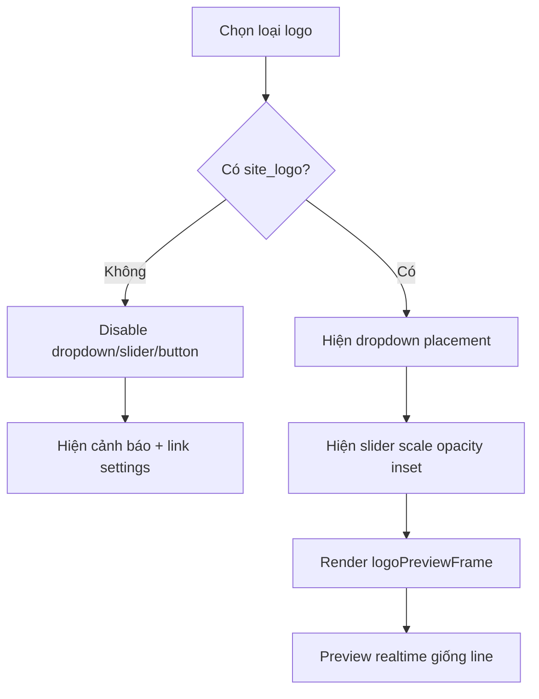

## Audit Summary
- Observation: `app/admin/settings/_components/ProductFrameManager.tsx` hiện có preview realtime cho `line` qua `linePreviewFrame`, nhưng `logo` chưa có preview tương đương dưới form tạo.
- Observation: form `logo` đang dùng `Input type="number"` cho `scale`, `opacity`, `inset`; còn `placement` là dropdown. UX này lệch pattern khung line, nơi user thao tác chủ yếu bằng dropdown + thanh trượt.
- Observation: theo yêu cầu của bạn, form logo cần dễ dùng hơn, tránh text nhập số để giảm xung đột dữ liệu và nên “học khung line”.
- Decision: giữ `Tên khung logo` là text input duy nhất; chuyển toàn bộ control số của logo sang slider, giữ `Vị trí` là dropdown, thêm preview realtime ngay dưới form tạo giống line; khi chưa có `site_logo` thì disable toàn bộ control logo và hiện cảnh báo/link sang `Cài đặt chung`.

## Root Cause Confidence
- High — vì thiếu preview và dùng numeric input trực tiếp là nguyên nhân rõ nhất khiến flow logo kém trực quan hơn flow line. Evidence nằm ngay trong cùng file: `line` đã có `linePreviewFrame` + range input, còn `logo` chưa có preview riêng và vẫn nhập số tay.

## TL;DR kiểu Feynman
- Khung line dễ dùng vì có preview sống và kéo thanh trượt được ngay.
- Khung logo hiện chưa giống vậy nên khó chỉnh hơn.
- Mình sẽ làm khung logo giống khung line: dropdown cho vị trí, slider cho các thông số số học, preview realtime ngay bên dưới.
- Chỉ giữ lại ô tên khung, bỏ kiểu nhập số bằng text.
- Nếu chưa có logo trong settings thì khóa control luôn và chỉ đường cho admin upload đúng chỗ.

## Elaboration & Self-Explanation
Hiện tại user muốn tinh chỉnh khung logo nhưng lại phải nhập số bằng tay cho tỉ lệ, opacity, inset. Cách này vừa chậm, vừa dễ nhập giá trị lẻ khó kiểm soát, vừa không cho cảm giác “thấy ngay kết quả”. Trong khi khung line đã giải bài toán này khá ổn: người dùng kéo slider, nhìn preview đổi ngay, nên ít sai hơn và tự tin hơn.

Vì vậy hướng sửa phù hợp nhất là không đổi schema hay data flow lớn, mà chỉ đổi UI/interaction của block logo cho đồng bộ với block line. Nghĩa là giữ model `logoConfig` như cũ, nhưng render control bằng slider + dropdown và dựng thêm một `logoPreviewFrame` cục bộ để preview realtime. Đây là thay đổi nhỏ, dễ rollback, nhưng cải thiện UX rõ.

## Concrete Examples & Analogies
- Ví dụ cụ thể: hiện `lineStrokeWidth` hiển thị nhãn giá trị + `input type="range"`; logo cũng nên có kiểu tương tự cho `scale`, `opacity`, `inset` thay vì `Input type="number"`.
- Analogy: line đang giống app chỉnh ảnh có thanh kéo sáng/tối; logo hiện giống phải tự gõ thông số Photoshop. User đang muốn logo cũng chuyển sang kiểu kéo-thấy-ngay.

## Files Impacted
- **Sửa:** `app/admin/settings/_components/ProductFrameManager.tsx`  
  Vai trò hiện tại: chứa toàn bộ UI create/edit/preview cho product frames, trong đó khung line đã có preview riêng còn khung logo thì chưa.  
  Thay đổi: thêm `logoPreviewFrame`, đổi numeric inputs của logo sang range sliders, giữ `placement` dropdown, thêm preview realtime dưới form tạo logo, và disable toàn bộ control logo khi thiếu `site_logo`.
- **Không đổi:** `convex/productImageFrames.ts`  
  Vai trò hiện tại: định nghĩa schema/mutation cho `logoConfig`.  
  Thay đổi: không cần sửa vì shape dữ liệu `placement/scale/opacity/inset/logoUrl` vẫn giữ nguyên.
- **Không đổi:** `lib/products/product-frame.ts`  
  Vai trò hiện tại: type cho `ProductImageFrameLogoConfig`.  
  Thay đổi: không cần sửa vì chỉ đổi cách nhập liệu, không đổi contract.

## Execution Preview
1. Tạo `logoPreviewFrame` bằng `useMemo`, tương tự `linePreviewFrame`, dùng `siteLogoUrl` + state hiện tại của form logo.
2. Thay 3 ô nhập số `scale`, `opacity`, `inset` trong form tạo logo bằng slider có label giá trị ở bên phải.
3. Giữ `placement` dưới dạng dropdown.
4. Thêm `ProductImageFrameBox` preview ngay dưới nút tạo khi có `previewImage` và `siteLogoUrl`.
5. Áp cùng pattern slider/dropdown cho drawer sửa `logo_generator` để create/edit thống nhất.
6. Nếu thiếu `site_logo`, disable dropdown + slider + button và hiện callout/link sang `/admin/settings/general`.
7. Tự review tĩnh để đảm bảo giá trị min/max/step hợp lý và không xung đột với data cũ.

## Acceptance Criteria
- Block `Tạo khung logo` có preview realtime dưới form giống trải nghiệm khung line.
- `placement` vẫn là dropdown.
- `scale`, `opacity`, `inset` không còn nhập số bằng text; chuyển sang slider có hiển thị giá trị.
- Chỉ còn `Tên khung logo` là text input trong block tạo logo.
- Drawer sửa khung logo cũng theo cùng pattern dropdown + slider.
- Khi chưa có `site_logo`, toàn bộ control logo bị disable và có cảnh báo/link sang `Cài đặt chung`.
- Không đổi schema/data contract và không ảnh hưởng flow line/custom.

## Verification Plan
- Static review: kiểm tra block logo không còn `Input type="number"` cho `scale/opacity/inset`, preview memo không truy cập `siteLogoUrl` null thiếu guard.
- Typecheck plan: sau khi implement sẽ chạy `bunx tsc --noEmit`.
- Manual repro plan cho tester:
  1. Có `site_logo` + có `previewImage`: vào `/admin/settings/product-frames`, chọn `logo`, kéo slider và đổi dropdown để xác nhận preview đổi realtime.
  2. Mở drawer sửa 1 logo frame có sẵn, xác nhận control cũng là slider/dropdown.
  3. Xóa `site_logo`, quay lại trang, xác nhận control logo bị disable và hiện cảnh báo đúng.

## Out of Scope
- Không đổi công thức render logo frame ở frontend site.
- Không bỏ ô `Tên khung logo`.
- Không thêm preset logo mới hay logic tự sinh tên frame.

## Risk / Rollback
- Rủi ro thấp: chủ yếu là mapping sai min/max/step slider làm UX chưa mượt; không ảnh hưởng schema.
- Rollback dễ: revert trong `ProductFrameManager.tsx` là đủ.

Nếu bạn duyệt spec này, mình sẽ implement đúng scope: thêm preview logo realtime và chuẩn hóa control logo theo pattern khung line, không mở rộng sang schema hay logic runtime khác.