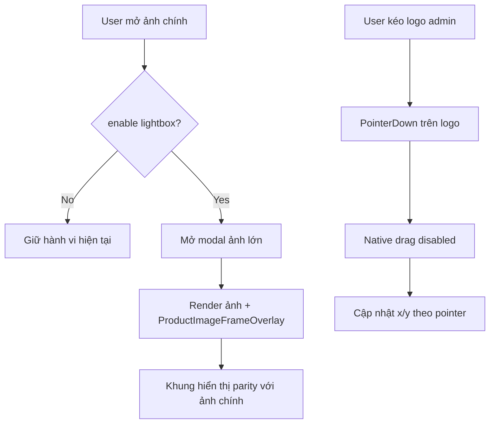

## Audit Summary
- Observation: `LogoDragPreview` trong `app/admin/settings/_components/ProductFrameManager.tsx` đang kéo bằng pointer events trên chính ``, nhưng chưa chặn browser-native image drag (`draggable` + `onDragStart`), nên khi kéo nhanh sẽ xuất hiện cảm giác “kéo cả ảnh”.
- Observation: Trong `app/(site)/products/[slug]/page.tsx` và `components/experiences/previews/ProductDetailPreview.tsx`, ảnh chính có `ProductImageFrameOverlay`, nhưng lightbox mở ảnh lớn lại render ảnh riêng, chưa ghép overlay frame tương ứng => khung bị mất khi “Mở ảnh toàn màn hình”.
- Inference: Đây là 2 bug độc lập nhưng cùng surface ở UX ảnh sản phẩm: (1) drag handle bị nhiễu bởi default drag behavior, (2) lightbox dùng pipeline render riêng chưa gắn frame.
- Decision: (A) Hard-disable native drag tại preview draggable; (B) chuẩn hóa lightbox để luôn render ảnh trong wrapper có `ProductImageFrameOverlay`, parity 1:1 với ảnh chính.

## Root Cause Confidence
- High — có evidence trực tiếp từ code path hiện tại: drag preview thiếu `draggable={false}`/`preventDefault` và lightbox path render ảnh không qua overlay wrapper.

## TL;DR kiểu Feynman
- Kéo logo bị giật vì trình duyệt đang hiểu là kéo ảnh HTML.
- Lightbox mất khung vì đang render ảnh “trần”, không chồng frame như ảnh chính.
- Sửa bằng cách khóa kéo ảnh mặc định của browser.
- Đồng thời render lightbox theo đúng cơ chế overlay frame hiện tại.
- Kết quả: kéo mượt hơn, và phóng to ảnh vẫn giữ khung giống ảnh chính.

## Elaboration & Self-Explanation
Bug kéo logo thực ra không phải do thuật toán tính `x/y`, mà do hành vi mặc định của thẻ ảnh: browser cho drag image preview (ghost image). Khi pointer di chuyển nhanh hoặc di chuyển theo góc, native drag có thể tranh chấp với pointer capture, khiến người dùng thấy như kéo cả ảnh nền hoặc thao tác không ổn định.

Bug lightbox là do kiến trúc render tách đôi: ảnh chính đi qua component có overlay frame, còn ảnh phóng to đi qua modal image thuần. Vì không dùng chung primitive render, lightbox không nhận frame. Để đúng parity, lightbox phải dùng cùng frame contract và overlay component.

## Concrete Examples & Analogies
- Ví dụ bug #1: giữ vào logo rồi rê mạnh sang trái, browser có thể hiện ghost image và pointer cảm giác trượt khỏi handle.
- Ví dụ bug #2: ảnh chính có logo frame góc trái, mở lightbox thì logo mất hẳn.
- Analogy: ảnh chính là “bản có watermark”, lightbox lại đang mở “file gốc chưa watermark”.

## Files Impacted
- **Sửa:** `app/admin/settings/_components/ProductFrameManager.tsx`  
  Vai trò hiện tại: UI kéo-thả logo trong preview admin.  
  Thay đổi: thêm guard chống native drag (`draggable={false}`, `onDragStart={e=>e.preventDefault()}`), và đảm bảo chỉ kéo khi nắm đúng logo (không bắt drag từ nền).
- **Sửa:** `app/(site)/products/[slug]/page.tsx`  
  Vai trò hiện tại: runtime product detail + lightbox behavior cho site thật.  
  Thay đổi: render lightbox image qua wrapper có `ProductImageFrameOverlay` để khung giữ nguyên khi fullscreen.
- **Sửa:** `components/experiences/previews/ProductDetailPreview.tsx`  
  Vai trò hiện tại: preview product-detail trong /system experiences.  
  Thay đổi: áp cùng logic lightbox parity (ảnh lớn cũng có frame overlay).
- **Có thể sửa nhẹ (nếu thiếu helper chung):** `components/shared/ProductImageFrameBox.tsx`  
  Vai trò hiện tại: primitive overlay frame.  
  Thay đổi: tái sử dụng/không bắt buộc thay đổi lớn; chỉ dùng lại đúng cách trong lightbox path.

## Execution Preview
1. Ở `LogoDragPreview`, thêm `draggable={false}` cho cả ảnh nền và ảnh logo.
2. Thêm `onDragStart` preventDefault cho ảnh logo để triệt native drag ghost.
3. Giữ pointer events chỉ trên logo, không thêm gesture ở nền để đúng yêu cầu “chỉ kéo khi giữ logo”.
4. Tại runtime product detail (`app/(site)/products/[slug]/page.tsx`), tìm block lightbox image hiện tại và bọc bằng container `relative` + `ProductImageFrameOverlay frame={frameConfig.frame}`.
5. Đồng bộ y hệt ở `ProductDetailPreview` để preview /system giống site thật.
6. Review z-index/overlay order để frame luôn nổi đúng trên ảnh lightbox.
7. Static review null-safety khi frame null hoặc lightbox disabled.

## Acceptance Criteria
- Trong admin product-frames, kéo logo không còn hiện tượng kéo ghost image hoặc kéo “cả ảnh”.
- Chỉ khi nắm vào logo mới kéo được; rê trên nền ảnh không làm thay đổi tọa độ.
- Ở `/system/experiences/product-detail`, bật “Mở ảnh toàn màn hình”, nhấn ảnh chính mở lightbox vẫn thấy khung giống ảnh chính.
- Ở site runtime (`/products/[slug]`), lightbox cũng giữ frame parity.
- Không regression cho line/custom frame và các tương tác thumbnail/lightbox điều hướng.

## Verification Plan
- Static review: xác nhận `draggable={false}` + `onDragStart preventDefault` có trên logo drag preview.
- Static review: lightbox render path dùng `ProductImageFrameOverlay` thay vì ảnh trần.
- Typecheck plan: `bunx tsc --noEmit` sau implement.
- Manual repro:
  1. Admin: kéo logo nhanh/chéo nhiều lần, xác nhận mượt và không ghost drag.
  2. Experience preview: mở fullscreen từ ảnh chính, xác nhận frame còn nguyên.
  3. Site runtime: mở fullscreen, đổi ảnh next/prev, frame vẫn hiển thị ổn.

## Out of Scope
- Không thay đổi thuật toán x/y hiện tại hay thêm snap/grid.
- Không redesign lightbox UI/animation.

## Risk / Rollback
- Rủi ro thấp: chủ yếu ở layering/z-index lightbox overlay.
- Rollback dễ: revert các chỉnh sửa tại 2 path lightbox + 1 path drag preview.

Nếu bạn duyệt spec này, mình sẽ implement full theo đúng 2 mục bạn nêu: kéo không kéo theo ảnh và lightbox giữ khung như ảnh chính.