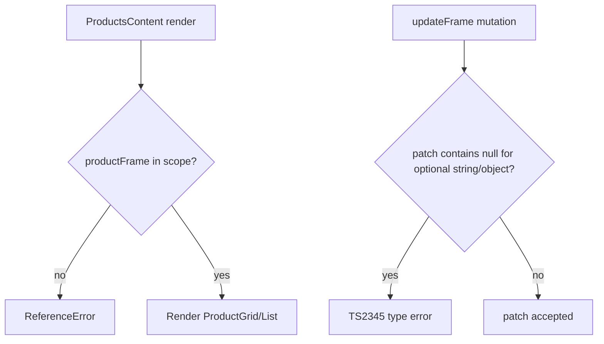

## Audit Summary
- **Observation:** `convex/productImageFrames.ts` đang truyền `patch` chứa `null` cho các field optional không chấp nhận `null` (`overlayImageUrl`, `lineConfig`, `logoConfig`, `seasonKey`) tại `ctx.db.patch(...)`.
- **Observation:** `lib/modules/configs/products.config.ts` import `@/lib/products/image-aspect-ratio` gây lỗi resolve trong luồng typecheck của Convex.
- **Observation:** Runtime lỗi `productFrame is not defined` ở `app/(site)/products/page.tsx` do biến frame được khai báo sai scope (đang nằm ở component khác, không nằm trong `ProductsContent` nơi dùng).
- **Inference:** Đây là lỗi wiring/scope và typing sau khi thêm feature, không phải lỗi kiến trúc tổng thể.
- **Decision:** Chỉ fix tối thiểu đúng 3 điểm lỗi, không mở rộng thêm scope.

## Root Cause Confidence
- **High**
  - `convex/productImageFrames.ts:107` báo rõ mismatch `string | null` vs `string | undefined`.
  - `products.config.ts:3` báo không resolve được alias module trong bối cảnh typecheck hiện tại.
  - Runtime stacktrace chỉ đúng dòng truyền `frame={productFrame}` trong `ProductsContent`.

## TL;DR kiểu Feynman
- Lỗi 1: gửi `null` vào chỗ chỉ nhận `string` hoặc `undefined`.
- Lỗi 2: đường dẫn import dùng alias không chạy trong luồng typecheck hiện tại.
- Lỗi 3: biến `productFrame` khai báo nhầm chỗ, dùng ở chỗ khác nên bị `undefined`.
- Sửa 3 chỗ này là app chạy lại được, không cần đụng thêm logic lớn.

## Elaboration & Self-Explanation
Feature khung viền đã đúng hướng, nhưng khi nối vào hệ thống có 3 “lỗi nối dây”:
1) Convex patch nhận object đã sanitize, nhưng hiện payload còn `null` ở vài key optional -> TypeScript chặn.
2) File config của module products đang import theo alias, còn môi trường typecheck hiện tại không resolve alias đó -> báo thiếu module.
3) Ở trang `/products`, props `frame` được truyền xuống `ProductGrid/ProductList`, nhưng biến nguồn (`productFrame`) lại không nằm cùng scope với `ProductsContent` -> runtime ReferenceError.

## Concrete Examples & Analogies
- Ví dụ lỗi 1: `overlayImageUrl = null` giống như đưa “thẻ rỗng” vào ô chỉ nhận “chuỗi ký tự hoặc bỏ trống kiểu undefined”.
- Ví dụ lỗi 3: khai báo biến ở phòng A nhưng dùng ở phòng B, nên lúc chạy phòng B không thấy biến.

## Files Impacted
- **Sửa:** `convex/productImageFrames.ts`  
  Vai trò hiện tại: mutation update frame.  
  Thay đổi: normalize patch trước `ctx.db.patch` để map `null -> undefined` cho các field optional không nullable (`overlayImageUrl`, `lineConfig`, `logoConfig`, `seasonKey`).

- **Sửa:** `lib/modules/configs/products.config.ts`  
  Vai trò hiện tại: định nghĩa settings module products.  
  Thay đổi: đổi import `PRODUCT_IMAGE_ASPECT_RATIO_OPTIONS` sang đường dẫn relative ổn định với typecheck hiện tại.

- **Sửa:** `app/(site)/products/page.tsx`  
  Vai trò hiện tại: render products list/grid.  
  Thay đổi: đảm bảo `const { frame: productFrame, overlayFit } = useProductFrameConfig()` nằm trong `ProductsContent` (đúng scope sử dụng), và không còn khai báo nhầm ở component khác.

## Execution Preview
1. Sửa mutation `updateFrame` để sanitize payload nullable.
2. Sửa import path trong `products.config.ts`.
3. Dời/đặt đúng khai báo `productFrame` trong `ProductsContent`.
4. Review nhanh static diff đảm bảo không đổi behavior ngoài lỗi.

## Acceptance Criteria
- `bunx convex dev` không còn 2 lỗi TypeScript đã nêu.
- Trang `/products` không còn `ReferenceError: productFrame is not defined`.
- Không phát sinh thay đổi behavior ngoài phạm vi fix lỗi.

## Verification Plan
- Chạy lại `bunx convex dev` để xác nhận sạch 2 lỗi typecheck.
- Mở `/products` để xác nhận hết runtime error.
- Spot-check nhanh grid/list vẫn render ảnh + overlay như trước.

## Out of Scope
- Refactor lại toàn bộ product frame manager.
- Tối ưu UX/UI thêm cho preset/line/logo.
- Mở rộng logic quyền hoặc lifecycle mới.

## Risk / Rollback
- **Risk thấp:** chỉ sửa wiring/typing cục bộ 3 file.
- **Rollback:** revert từng file độc lập nếu có regressions.