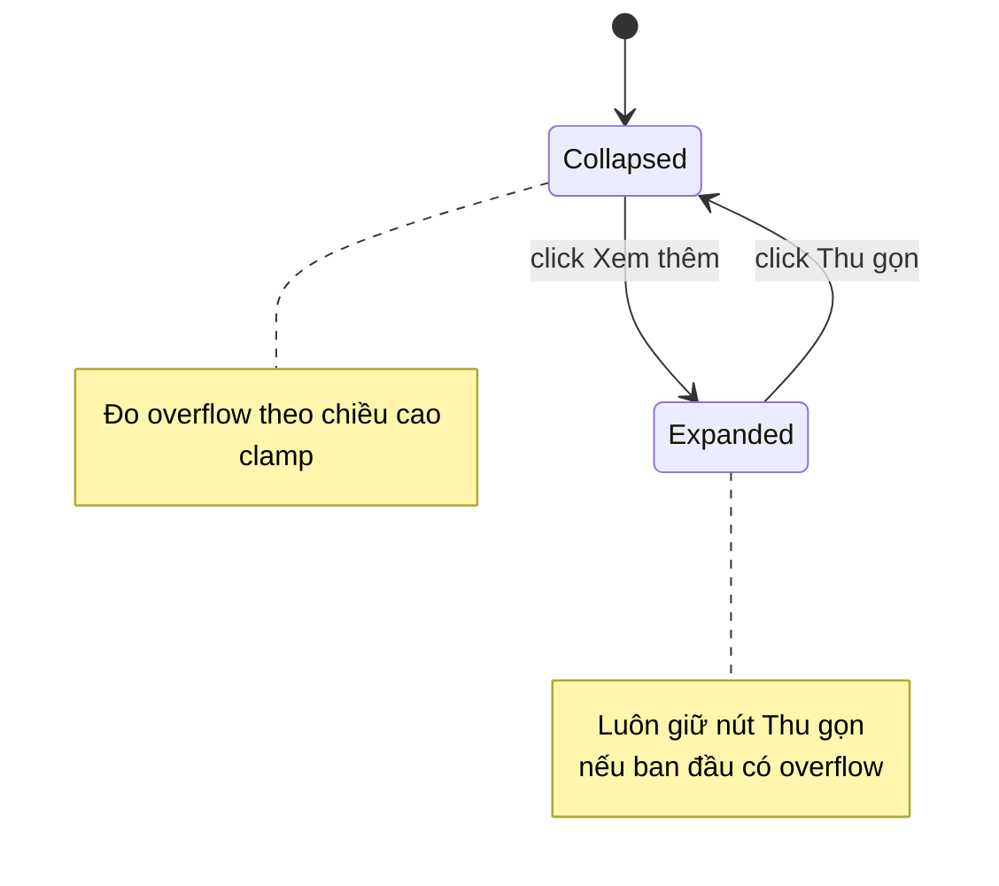

# TL;DR kiểu Feynman
- Trang chi tiết sản phẩm đã có cơ chế cắt ngắn mô tả khi quá dài.
- Khi bấm `Xem thêm`, khối mô tả bung ra hết chiều cao thật.
- Nhưng logic đang dùng chính `clientHeight` của khối đã bung để quyết định có còn hiện nút hay không.
- Kết quả: sau khi bung, component nghĩ là “không còn overflow”, nên nút biến mất luôn.
- Cách sửa đúng là đo overflow theo trạng thái thu gọn, không đo theo trạng thái đã bung.
- Vì component này dùng chung, sửa 1 chỗ sẽ đồng bộ cho classic / modern / minimal.

## Audit Summary
### Observation
- Route user nêu tương ứng với trang chi tiết sản phẩm ở `app/(site)/products/[slug]/page.tsx`.
- Có component dùng chung `ExpandableProductDescriptionBlock` tại chính file này, đang render ở nhiều vị trí mô tả sản phẩm.
- Nút hiện tại dùng label `Xem thêm` / `Thu gọn`.
- Logic hiện tại:
  - state `expanded`
  - state `canExpand`
  - `checkOverflow()` đang set `canExpand(element.scrollHeight > element.clientHeight + 1)`
  - khi `expanded = true`, class giới hạn chiều cao bị bỏ đi, nên `clientHeight` gần bằng `scrollHeight`.

### Evidence
- File: `app/(site)/products/[slug]/page.tsx`
- Dòng gần `1199-1234`:
  - `const [expanded, setExpanded] = useState(false);`
  - `const [canExpand, setCanExpand] = useState(false);`
  - `setCanExpand(element.scrollHeight > element.clientHeight + 1);`
  - `className={expanded ? '' : 'max-h-[640px] overflow-hidden md:max-h-[860px]'}`
  - `{canExpand && <button ...>{expanded ? 'Thu gọn' : 'Xem thêm'}</button>}`

## Root Cause Confidence
**High** — vì bug khớp trực tiếp với điều kiện hiển thị nút hiện tại.
- Expected: sau khi mở rộng vẫn phải còn nút `Thu gọn` để quay lại trạng thái gọn.
- Actual: sau khi mở rộng, `canExpand` bị tính lại thành `false`, nút biến mất.
- Counter-hypothesis đã xem xét:
  1. `RichContent` render sai hoặc nuốt button: không thấy evidence.
  2. CSS z-index/overflow che button: không khớp vì button phụ thuộc `canExpand` và thật sự không render.
  3. ResizeObserver lỗi: kể cả observer hoạt động đúng thì công thức đo vẫn sai ở trạng thái expanded.

## Elaboration & Self-Explanation
Hiện tại component đang hỏi: “nội dung có dài hơn cái khung đang nhìn thấy không?”.

Câu hỏi này đúng khi khối đang ở trạng thái thu gọn, vì lúc đó khung có `max-height` nên nếu `scrollHeight > clientHeight` thì đúng là còn phần bị ẩn.

Nhưng sau khi bấm `Xem thêm`, khối không còn `max-height` nữa. Khi đó `clientHeight` nở ra gần bằng toàn bộ chiều cao thật. Component lại đi đo tiếp bằng cùng công thức cũ, nên kết luận sai rằng nội dung không còn vượt khung. Vì `canExpand` thành `false`, nút biến mất luôn, thành ra user không có đường quay lại.

Nói ngắn gọn: code đang dùng “chiều cao khối hiện tại” để quyết định có nút hay không, trong khi sau khi bung ra thì chiều cao đó không còn đại diện cho trạng thái thu gọn nữa.

## Concrete Examples & Analogies
### Ví dụ cụ thể bám sát repo
- Nội dung mô tả dài 1400px.
- Ở trạng thái gọn desktop, khối bị giới hạn `max-h-[860px]`.
- Khi đó:
  - `scrollHeight = 1400`
  - `clientHeight = 860`
  - `canExpand = true`
- User bấm `Xem thêm`, class max-height bị bỏ.
- Lúc này:
  - `scrollHeight = 1400`
  - `clientHeight = 1400`
  - `canExpand = false`
- Button biến mất dù thực tế ta vẫn cần nút `Thu gọn`.

### Analogy đời thường
Giống như một cuộn giấy đang buộc dây:
- Lúc còn buộc, bạn nhìn thấy giấy dài hơn dây buộc nên biết cần nút “mở ra”.
- Nhưng vừa tháo dây xong, bạn lại dùng chính chiều dài đã tháo hết để kết luận “không cần dây nữa”.
- Thực ra vẫn cần cơ chế buộc lại nếu muốn quay về trạng thái gọn.

## Problem Graph
1. [Mất nút Thu gọn] <- depends on 1.1, 1.2
   1.1 [Điều kiện render button dựa vào canExpand] <- depends on 1.1.1
      1.1.1 [ROOT CAUSE] canExpand được đo bằng clientHeight của trạng thái hiện tại
   1.2 [expanded bỏ max-height] -> làm phép đo overflow sai sau khi mở rộng

## Proposal
### Hướng sửa đề xuất (Recommend) — Confidence 92%
Sửa `ExpandableProductDescriptionBlock` để tách rõ:
1. `hasOverflowWhenCollapsed`: chỉ phản ánh việc nội dung có vượt quá chiều cao clamp hay không.
2. `expanded`: chỉ phản ánh trạng thái UI hiện tại.

Cụ thể:
- Không dùng `element.clientHeight` của trạng thái expanded để tính việc có render button nữa.
- Thay vào đó, đo overflow theo trạng thái collapsed cố định.
- Có thể triển khai bằng một trong hai cách, nhưng em recommend cách ít xâm lấn nhất:
  - giữ DOM hiện tại
  - trong `checkOverflow`, tạm tính ngưỡng clamp theo breakpoint (`640` mobile, `860` md+) rồi so với `scrollHeight`
  - render button khi `hasOverflowWhenCollapsed === true`
  - text button dựa vào `expanded ? 'Thu gọn' : 'Xem thêm'`

Lý do recommend:
- Sửa nhỏ, rollback dễ.
- Không phải thay đổi API component.
- Không ảnh hưởng `RichContent` hay 3 layout gọi component.
- Giữ đúng behavior user mong đợi trên mọi layout đang reuse component.

## Files Impacted
- `Sửa: app/(site)/products/[slug]/page.tsx`
  - Vai trò hiện tại: chứa toàn bộ UI product detail và component dùng chung `ExpandableProductDescriptionBlock`.
  - Thay đổi: chỉnh logic đo overflow/hiển thị nút trong `ExpandableProductDescriptionBlock` để sau khi expanded vẫn còn `Thu gọn` nếu nội dung ban đầu vượt ngưỡng clamp.

## Execution Preview
1. Đọc lại block `ExpandableProductDescriptionBlock` và các chỗ reuse trong cùng file.
2. Tách logic “có overflow khi collapsed không” khỏi state `expanded`.
3. Dùng ngưỡng clamp tương ứng mobile/desktop để xác định có cần render toggle hay không.
4. Giữ label theo yêu cầu user: `Xem thêm` / `Thu gọn`.
5. Static review lại 3 layout đang dùng chung để chắc không có case nào mất nút hoặc hiện sai.
6. Nếu có thay đổi code TS, trước commit sẽ chạy `bunx tsc --noEmit` theo guideline repo; không chạy lint/build/test.
7. Commit local sau khi hoàn tất.

## Acceptance Criteria
### Pass
- Với mô tả ngắn hơn ngưỡng clamp: không hiện nút toggle.
- Với mô tả dài hơn ngưỡng clamp: ban đầu hiện `Xem thêm`.
- Bấm `Xem thêm`: mô tả bung ra đầy đủ và nút đổi thành `Thu gọn`.
- Bấm `Thu gọn`: mô tả quay lại trạng thái gọn ban đầu.
- Áp dụng đồng bộ cho mọi layout product detail đang dùng `ExpandableProductDescriptionBlock`.
- Không làm thay đổi nội dung render của `RichContent`.

### Fail
- Sau khi expanded, nút biến mất.
- Nút vẫn hiện với mô tả ngắn.
- Thu gọn lại nhưng chiều cao không quay về trạng thái cũ.
- Chỉ một layout hết lỗi, layout khác vẫn tái hiện bug.

## Verification Plan
- Static verification:
  - soát lại điều kiện render button trong `ExpandableProductDescriptionBlock`
  - soát lại state transition `collapsed -> expanded -> collapsed`
  - soát các callsite ở các layout classic / modern / minimal trong cùng file
- Type verification:
  - chạy `bunx tsc --noEmit` nếu có sửa code TypeScript
- Repro verification thủ công (để tester/user xác nhận):
  1. mở product detail có mô tả dài như URL user nêu
  2. xác nhận thấy `Xem thêm`
  3. bấm `Xem thêm`
  4. xác nhận thấy `Thu gọn`
  5. bấm `Thu gọn`
  6. xác nhận mô tả về lại trạng thái gọn ban đầu

## Out of Scope
- Đổi animation mở/đóng.
- Đổi threshold clamp 640/860.
- Refactor tách component ra file riêng.
- Sửa behavior các khối `Xem thêm` khác như comment list hay related products.

## Risk / Rollback
- Rủi ro chính: tính threshold theo viewport có thể lệch nếu sau này class clamp đổi mà logic JS không cập nhật theo.
- Mức rủi ro: thấp, vì scope chỉ trong 1 component local.
- Rollback: revert riêng phần logic `ExpandableProductDescriptionBlock` là đủ.

Nếu anh/chị duyệt spec này, em sẽ tiến hành sửa đồng bộ cho tất cả layout product detail và commit local sau khi xong.