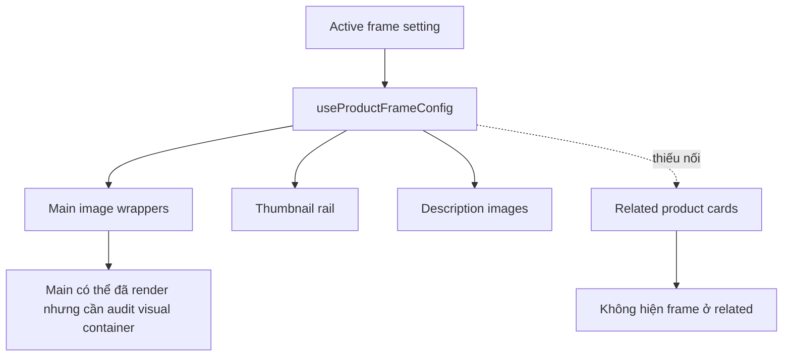

## TL;DR kiểu Feynman
- Trang chi tiết sản phẩm hiện đang gọi frame ở ảnh chính, thumbnail và gallery mô tả, nhưng card `Sản phẩm liên quan` chưa bọc frame nên nhìn như “không hiện khung”.
- Anh đã chốt muốn áp dụng **đồng nhất main + related**, và triệu chứng chính là **không hiện frame**.
- Em sẽ không đổi schema hay setting; chỉ sửa luồng render ở frontend để mọi vùng ảnh sản phẩm dùng cùng contract frame active hiện tại.
- Với ảnh chính, em sẽ audit thêm vùng bao ngoài để tránh trường hợp frame có render nhưng bị che bởi stacking/overflow ở một số layout.
- Trọng tâm là sửa nhỏ, dễ rollback, bám pattern sẵn có từ `ProductImageFrameOverlay`/`useProductFrameConfig`.

## Audit Summary
### Observation
1. File `app/(site)/products/[slug]/page.tsx` đã import `ProductImageFrameOverlay` và `useProductFrameConfig` ngay từ đầu.
2. Ảnh chính desktop/mobile đang đi qua các wrapper có overlay frame:
   - `BlurredProductImage()` có `ProductImageFrameOverlay frame={frame}`.
   - `MobileImageCarousel()` có overlay cho từng ảnh.
   - `ThumbnailRail()` có overlay cho thumbnail.
   - `ProductDescriptionImages()` cũng có overlay.
3. `RelatedProductsSection()` hiện render card ảnh bằng `next/image` thuần, **không có** `useProductFrameConfig()` và **không có** `ProductImageFrameOverlay`.
4. User xác nhận scope mong muốn là: **đồng nhất main + related**, và symptom gần nhất là **không hiện frame**.

### Root Cause Confidence
**High** — nguyên nhân rõ nhất có evidence là khu vực `Sản phẩm liên quan` chưa hề render frame overlay, nên không thể hiện khung dù global active frame đang bật.

### Counter-Hypothesis
- Ảnh chính có thể đang render frame rồi nhưng bị cảm giác “không hiện” do line frame mảnh, màu nhạt, hoặc bị lẫn vào nền ảnh/surface.
- Một số layout detail (`classic`, `modern`, `minimal`) có thể khác nhau về `overflow`, `rounded`, `z-index`, khiến cùng 1 overlay nhìn ổn ở vùng này nhưng kém rõ ở vùng khác.
- Tuy nhiên, riêng related products thì không phải giả thuyết: code hiện tại đúng là chưa apply overlay.

## Elaboration & Self-Explanation
Hiện có 2 trạng thái khác nhau trong cùng một trang:
- Nhóm ảnh chính đang dùng “hệ khung sản phẩm”.
- Nhóm ảnh liên quan lại dùng ảnh thường không có khung.

Vì vậy người dùng nhìn vào sẽ thấy trải nghiệm không đồng nhất, và rất dễ kết luận rằng “khung không áp dụng tốt”. Với phần related, đây là bug wiring rõ ràng: quên bọc overlay. Với phần main image, do code đã có overlay, nên hướng xử lý đúng là không thay đổi lớn mà chỉ rà lại lớp chứa ảnh để đảm bảo khung luôn nằm đúng trên ảnh và không bị che/lost visual emphasis.

## Concrete Examples & Analogies
- Ví dụ hiện tại: ảnh chính có thể có line frame mảnh ở ngoài cùng, nhưng card `Sản phẩm liên quan` thì hoàn toàn không có viền cùng style, nên người xem cảm giác feature hoạt động nửa vời.
- Ví dụ sau khi sửa: khi active một khung line đỏ hoặc ornamental, cả ảnh chính lẫn ảnh ở related cards đều cùng có khung đó, nhìn đồng bộ như cùng một “bộ theme sản phẩm”.
- Analogy: giống như một website đã bật theme button bo góc ở phần hero nhưng tới section sản phẩm bên dưới lại quay về button mặc định — technically không crash, nhưng UX nhìn như bị “quên áp dụng theme”.

## Root Cause Questions Coverage
1. Triệu chứng quan sát được là gì?  
   Expected: ảnh chính và related đều hiện cùng khung active. Actual: related không hiện; main theo cảm nhận user cũng chưa “áp dụng tốt”.
2. Phạm vi ảnh hưởng?  
   Trang `/products/[slug]`, gồm ảnh chính và section `Sản phẩm liên quan` của site storefront.
3. Có tái hiện ổn định không?  
   Có, từ reading code thấy related luôn thiếu overlay; symptom này ổn định nếu feature frame đang bật.
4. Mốc thay đổi gần nhất?  
   Hệ frame vừa được triển khai/đơn giản hoá gần đây, nhưng wiring của related section chưa được nối đồng bộ.
5. Dữ liệu nào đang thiếu?  
   Chưa có screenshot riêng để xác nhận main image bị mất frame hoàn toàn hay chỉ là frame nhìn yếu; nhưng không chặn việc ra spec vì bug related đã rõ.
6. Có giả thuyết thay thế hợp lý nào chưa bị loại trừ?  
   Có: main image bị che bởi stacking/overflow hoặc frame line quá khó nhìn trên nền ảnh.
7. Rủi ro nếu fix sai nguyên nhân?  
   Nếu chỉ sửa related mà không rà main container, user vẫn thấy “chưa tốt” ở ảnh chính.
8. Tiêu chí pass/fail sau khi sửa?  
   Cả main image và related cards đều hiển thị cùng frame active một cách rõ ràng, không bị crop/che/lệch.

## Files Impacted
### UI / Site
- **Sửa:** `app/(site)/products/[slug]/page.tsx`  
  Vai trò hiện tại: render toàn bộ trang chi tiết sản phẩm cho cả 3 style `classic/modern/minimal`, gồm ảnh chính, thumbnail, gallery mô tả và related products.  
  Thay đổi: nối frame config vào `RelatedProductsSection`; chuẩn hoá wrapper ảnh related để overlay nằm đúng lớp; rà lại main image containers để đảm bảo overlay không bị mất hiệu lực thị giác.

### Shared (khả năng giữ nguyên, chỉ dùng lại)
- **Giữ nguyên hoặc chỉ đọc đối chiếu:** `components/shared/ProductImageFrameBox.tsx`  
  Vai trò hiện tại: cung cấp `useProductFrameConfig` và `ProductImageFrameOverlay`.  
  Thay đổi dự kiến: ưu tiên không sửa nếu contract hiện tại đã đủ; chỉ dùng lại để tránh mở rộng scope.

## Execution Preview
1. Audit nhanh trong `page.tsx` các vùng render ảnh của `classic/modern/minimal` để xác định container nào đang dùng overlay và container nào chưa dùng.
2. Refactor `RelatedProductsSection()`:
   - thêm `const { frame } = useProductFrameConfig()`;
   - bọc ảnh related trong container `relative overflow-hidden` nhất quán;
   - render `ProductImageFrameOverlay frame={frame}` trên ảnh card.
3. Review main image wrappers (`BlurredProductImage`, `MobileImageCarousel`, `ThumbnailRail`) để đảm bảo overlay bám đúng parent `relative`, không bị lớp blur hoặc image che sai thứ tự hiển thị.
4. Nếu cần, chỉnh rất nhỏ `className`/`z-index` ở wrapper ảnh chính để frame luôn nổi phía trên ảnh mà không phá layout hiện có.
5. Static self-review theo từng layout `classic/modern/minimal` để chắc rằng không vùng nào bị bỏ sót.

## Acceptance Criteria
- Khi bật product frame active, card `Sản phẩm liên quan` hiển thị cùng khung với ảnh chính.
- Ảnh chính trên trang detail tiếp tục hiển thị frame rõ ràng ở cả mobile carousel và desktop main image.
- Thumbnail/galleries không bị regress sau khi chuẩn hoá overlay.
- Không đổi schema, setting, Convex query/mutation.
- Không phát sinh khác biệt hành vi giữa các layout detail ngoài việc frame hiển thị đồng nhất hơn.

## Verification Plan
- Repro thủ công ở route chi tiết sản phẩm có frame active.
- Kiểm tra theo checklist:
  1. Ảnh chính desktop có frame.
  2. Ảnh chính mobile carousel có frame.
  3. Thumbnail rail có frame.
  4. `Sản phẩm liên quan` có frame trên từng card.
  5. Thử ít nhất 2 kiểu frame: line và overlay/logo để đảm bảo related cards đều hiển thị đúng.
- Theo AGENTS.md: không chạy lint/unit/build; chỉ static review và reasoning theo code path.

## Out of Scope
- Không redesign layout product detail.
- Không đổi thuật toán fit/crop của ảnh nếu không có evidence rõ ràng là bug riêng.
- Không thêm cấu hình riêng cho frame của related products; giữ đúng quyết định “đồng nhất main + related”.

## Risk / Rollback
- Rủi ro nhỏ: nếu related card không có đủ padding/visual breathing room, một số loại frame có thể trông sát mép hơn kỳ vọng.
- Rủi ro trung bình: nếu main image đang phụ thuộc stacking hiện tại, việc chỉnh overlay class sai có thể ảnh hưởng badge sale hoặc interaction zoom.
- Rollback: revert riêng `app/(site)/products/[slug]/page.tsx` là đủ để quay về hành vi cũ.

## Execution Decision
- **Option A (Recommend)** — Confidence 90%: chỉ sửa `page.tsx`, reuse `useProductFrameConfig` + `ProductImageFrameOverlay`, nối thêm cho related và rà nhẹ main wrappers. Phù hợp nhất vì evidence cho thấy bug nằm ở wiring UI, không cần đụng shared contract.
- **Option B** — Confidence 60%: tạo helper/wrapper dùng chung cho mọi image slot của detail page rồi thay các call site. Phù hợp nếu muốn refactor sạch hơn, nhưng rộng scope hơn yêu cầu fix hiện tại.

Em recommend **Option A** vì sửa nhỏ, đúng nguyên nhân có evidence, dễ rollback và ít rủi ro regress nhất.