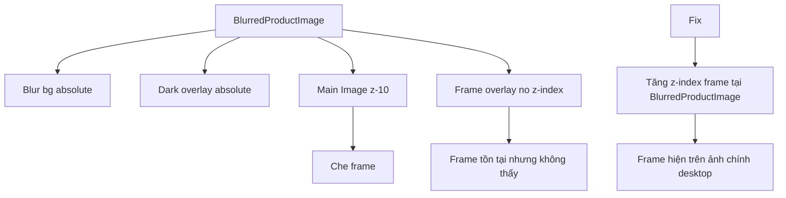

## TL;DR kiểu Feynman
- Em đã audit kỹ hơn và tìm được root cause mạnh hơn cho ảnh chính desktop: frame có render, nhưng đang nằm **dưới ảnh** nên mắt thường thấy như “không có khung”.
- `Sản phẩm liên quan` là một bug wiring riêng và đã được xác định trước đó; còn bug lần này tập trung vào **ảnh chính desktop**.
- Cụ thể, trong `BlurredProductImage`, ảnh chính dùng `Image` với `z-10`, còn `ProductImageFrameOverlay` không có `z-index`, nên overlay bị ảnh đè lên.
- Anh đã chốt hướng fix tối thiểu: **chỉ sửa đúng chỗ ở `BlurredProductImage`**, không đụng shared overlay toàn cục.
- Đây là thay đổi nhỏ, đúng nguyên nhân, ít rủi ro regress nhất.

## Audit Summary
### Observation
1. Trong `app/(site)/products/[slug]/page.tsx`, ảnh chính desktop của cả các style detail đang đi qua `BlurredProductImage(...)`.
2. `BlurredProductImage` hiện render theo thứ tự:
   - nền blur absolute,
   - lớp phủ tối absolute,
   - `Image ... className="relative z-10 object-contain"`,
   - `ProductImageFrameOverlay frame={frame}`.
3. `ProductImageFrameOverlay` trong `components/shared/ProductImageFrameBox.tsx` render `svg/img` với `className="absolute inset-0 ..."` nhưng **không có z-index**.
4. Vì `Image` có `z-10` còn overlay không có z-index, frame nằm dưới ảnh ở desktop main image; user vì thế thấy “ảnh chính vẫn không có khung”.
5. Mobile carousel và thumbnail rail không dùng cùng stacking pattern này, nên khả năng cao vấn đề nổi bật nhất là desktop main image.

### Root Cause Confidence
**High** — có evidence trực tiếp từ code path và stacking order: overlay render sau nhưng không thắng được phần tử có `z-10`, nên bị che.

### Counter-Hypothesis
- Có thể một số loại frame màu quá nhạt vẫn khó nhìn trên vài ảnh nền tối/sáng.
- Có thể badge sale ở góc trên trái cạnh tranh thị giác với frame ở một số case.
- Nhưng dù các giả thuyết này có tồn tại, root cause “frame bị ảnh đè lên” vẫn là nguyên nhân rõ ràng và cần fix trước.

## Elaboration & Self-Explanation
Vấn đề này không phải là hệ thống không lấy được frame, cũng không phải query setting sai. Frame đã được gọi đúng ở `BlurredProductImage`, nhưng thứ tự layer trên giao diện đang sai.

Hiểu đơn giản:
- ảnh chính đang được đặt ở lớp nổi hơn (`z-10`),
- khung thì ở lớp mặc định,
- nên khung bị ảnh che mất.

Giống như mình đã treo khung tranh lên tường nhưng lại đặt bức ảnh phủ lên trên cái khung, nên từ ngoài nhìn vào chỉ thấy ảnh chứ không thấy viền. Vì anh chọn hướng fix nhỏ nhất, em sẽ chỉ nâng layer của frame ngay trong `BlurredProductImage`, thay vì sửa shared component dùng toàn hệ thống.

## Concrete Examples & Analogies
- Ví dụ hiện tại: `line frame` màu đỏ vẫn được render ra DOM, nhưng vì ảnh `z-10` nằm trên, user nhìn không thấy đường viền.
- Ví dụ sau khi sửa: cùng một frame đó, không đổi config nào cả, nhưng chỉ cần overlay lên lớp cao hơn ảnh là viền xuất hiện lại ở main image desktop.
- Analogy: như subtitle của video đã bật nhưng layer subtitle nằm sau video canvas; dữ liệu có đó nhưng người dùng vẫn tưởng “không có”.

## Root Cause Questions Coverage
1. Triệu chứng quan sát được là gì?  
   Expected: ảnh chính desktop hiện frame active. Actual: ảnh chính nhìn như không có frame.
2. Phạm vi ảnh hưởng?  
   Product detail main image desktop trong các layout dùng `BlurredProductImage`.
3. Có tái hiện ổn định không?  
   Có, từ code path hiện tại thì mọi nơi dùng `BlurredProductImage` đều có cùng stacking risk.
4. Mốc thay đổi gần nhất?  
   Sau khi wiring frame được thêm vào product detail, related đã fix, nhưng desktop main image còn thiếu chuẩn hoá layer.
5. Dữ liệu nào đang thiếu?  
   Không thiếu dữ liệu quan trọng để ra spec; screenshot user + code evidence đã đủ.
6. Có giả thuyết thay thế hợp lý nào chưa bị loại trừ?  
   Có: màu frame khó nhìn, nhưng không phủ định root cause z-index.
7. Rủi ro nếu fix sai nguyên nhân?  
   Nếu sửa shared quá rộng hoặc sửa nhầm container, có thể ảnh hưởng thumbnail/overlay/logo ở nơi khác.
8. Tiêu chí pass/fail sau khi sửa?  
   Ảnh chính desktop hiện frame rõ ràng; mobile/thumbnail/related không bị regress.

## Files Impacted
### UI / Site
- **Sửa:** `app/(site)/products/[slug]/page.tsx`  
  Vai trò hiện tại: chứa `BlurredProductImage` và toàn bộ render product detail.  
  Thay đổi: nâng layer của `ProductImageFrameOverlay` riêng trong `BlurredProductImage` để frame nằm trên `Image z-10`.

### Shared
- **Giữ nguyên:** `components/shared/ProductImageFrameBox.tsx`  
  Vai trò hiện tại: shared overlay contract cho frame sản phẩm.  
  Thay đổi: không sửa theo quyết định của anh để tránh mở rộng ảnh hưởng toàn cục.

## Execution Preview
1. Mở `BlurredProductImage` trong `app/(site)/products/[slug]/page.tsx`.
2. Bọc `ProductImageFrameOverlay` trong một `div` absolute inset-0 với `z-index` cao hơn ảnh, hoặc thêm lớp nổi tương đương ngay tại call site.
3. Giữ nguyên `pointer-events-none` để không ảnh hưởng zoom/click/lightbox.
4. Soát lại thứ tự layer với incoming image transition để đảm bảo frame vẫn nổi trên cả ảnh hiện tại lẫn ảnh đang fade-in.
5. Static review các call site khác của `BlurredProductImage` trong cùng file để chắc classic/modern/minimal đều hưởng fix.

## Acceptance Criteria
- Ảnh chính desktop ở trang chi tiết sản phẩm hiện frame active rõ ràng.
- Ảnh chuyển slide/fade vẫn giữ frame hiển thị phía trên.
- Mobile carousel, thumbnail rail và related cards không bị regress.
- Không đổi shared contract và không ảnh hưởng các trang khác ngoài product detail main image.

## Verification Plan
- Repro tại trang chi tiết sản phẩm đang bật frame active.
- Kiểm tra:
  1. Desktop main image có frame.
  2. Đổi thumbnail để ảnh chính chuyển ảnh, frame vẫn còn.
  3. Mobile carousel vẫn hiển thị frame như cũ.
  4. Related cards vẫn giữ frame sau fix.
- Theo AGENTS.md: không chạy lint/unit/build; chỉ static review và reasoning từ code path.

## Out of Scope
- Không đổi `ProductImageFrameOverlay` toàn cục.
- Không chỉnh màu/độ dày frame nếu chưa có evidence là vấn đề khác.
- Không refactor lại toàn bộ image wrappers.

## Risk / Rollback
- Rủi ro thấp: badge sale hoặc lớp fade transition có thể chồng lấn nếu chọn z-index không phù hợp.
- Giảm thiểu: chọn z-index chỉ cao hơn ảnh, giữ nguyên pointer-events none.
- Rollback: revert đúng file `app/(site)/products/[slug]/page.tsx`.

## Execution Decision
- **Option A (Recommend)** — Confidence 95%: fix local trong `BlurredProductImage` bằng cách nâng layer overlay. Tốt nhất vì đúng root cause, scope nhỏ, ít rủi ro.
- **Option B** — Confidence 55%: thêm z-index trong shared `ProductImageFrameOverlay`. Phù hợp khi muốn ép toàn hệ thống luôn nổi, nhưng rủi ro side effects cao hơn và anh đã không chọn hướng này.

Em recommend **Option A** và sẽ bám đúng hướng fix local mà anh vừa chốt.