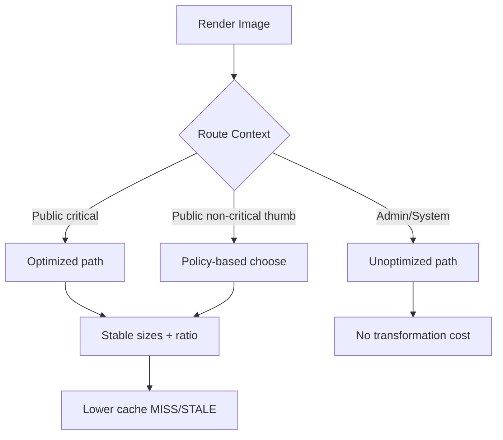

## TL;DR kiểu Feynman
- Lỗi `402` hiện tại là do chạm quota **Image Optimization Transformations** (cache MISS/STALE) trên Hobby.
- Dự án đang dùng `next/image` rất nhiều ở cả **public** và **admin/system**; đây là nguồn tiêu thụ chính.
- Cách giảm mạnh nhất nhưng ít ảnh hưởng UX: **tắt optimize gần như toàn bộ admin/system**, giữ optimize chọn lọc cho public.
- Với public, ưu tiên giảm số biến thể ảnh (size/ratio) và cache ổn định để giảm transformations lặp lại.
- Convex realtime hiện “ổn”; không cần đụng mạnh realtime lúc này, tập trung vào ảnh sẽ hiệu quả hơn.

## Audit Summary
### Observation (bằng chứng)
1. `next.config.ts` hiện **chưa có chiến lược phân tầng** cho ảnh (chỉ cấu hình `remotePatterns`), tức mặc định `next/image` sẽ optimize ở mọi nơi có dùng `Image`.
2. Toàn repo có mật độ `next/image` cao ở cả public + admin (nhiều file trong `app/admin/**`, `app/system/**`, `components/site/**`, `components/experiences/**`).
3. Nhiều list/card ảnh (products/blog/services/wishlist/cart/admin media) => dễ tạo nhiều kích thước optimize khác nhau nếu `sizes` không ổn định hoặc layout đa mode.
4. Có một số chỗ đã dùng `unoptimized` (ví dụ logo ngân hàng), chứng tỏ codebase đã chấp nhận pattern này.
5. Convex đang dùng `useQuery` rộng, nhưng user xác nhận realtime hiện tại vẫn ổn và vấn đề cấp bách là 402 từ image optimization.

### Inference
- Nút thắt lớn nhất là **ảnh optimize phía Vercel**, không phải realtime Convex.
- Tối ưu ROI cao nhất: cắt quota ở admin/system trước (nội bộ, ít cần “pixel perfect”), rồi tinh chỉnh public theo hướng cache-friendly.

### Decision
- Chọn chiến lược 2 pha:
  1) **Pha A (đập ngay quota):** tắt optimize gần như toàn bộ admin/system.
  2) **Pha B (giữ mượt public):** chuẩn hoá ảnh public để giảm transformation nhưng không làm UX “ngu”.

## Root Cause Confidence
**High** — vì triệu chứng 402 khớp trực tiếp policy của Vercel Hobby khi vượt image optimization limits, và codebase có footprint `next/image` rất lớn trên các trang list + admin.

## Elaboration & Self-Explanation
Hiện tại mỗi khi ảnh vào đường đi optimize của Vercel và bị cache miss/stale, hệ thống sẽ tính vào quota transformations. Dự án mình có rất nhiều nơi render ảnh, nhất là list/grid (nhiều item, nhiều viewport). Điều này giống như bạn có một máy nén ảnh chung cho toàn hệ thống nhưng lại bắt nó nén cả ảnh nội bộ quản trị — nơi người dùng không thực sự cần chất lượng tối ưu cao. Kết quả: quota bị đốt rất nhanh, đến ngưỡng thì trả 402.

Giải pháp đúng là tách “ảnh nào cần optimize thật” và “ảnh nào không cần”. Ảnh public-facing (hero, PDP, PLP) giữ optimize có kiểm soát để vẫn đẹp và nhanh. Ảnh admin/system thì ưu tiên tiết kiệm: render trực tiếp file gốc hoặc dùng bản đã nén từ upload pipeline.

## Concrete Examples & Analogies
- Ví dụ trong repo: các trang admin media/list/users/... đang dùng `next/image`; nếu đổi sang `unoptimized` cho các thumbnail nội bộ thì giảm đáng kể transformations mà hầu như không ảnh hưởng trải nghiệm quản trị.
- Analogy đời thường: giống dùng điều hoà trung tâm cho cả phòng khách lẫn kho chứa đồ. Phòng khách cần mát chuẩn (public pages), kho thì chỉ cần thông gió (admin pages). Tách mức ưu tiên là tiết kiệm điện lớn nhất.

## Problem Graph
1. [402 Image lỗi] <- depends on 1.1, 1.2
   1.1 [next/image phủ rộng toàn app] <- depends on 1.1.1, 1.1.2
      1.1.1 [ROOT CAUSE] Admin/System cũng bị optimize không cần thiết
      1.1.2 Public list/card tạo nhiều biến thể size
   1.2 [Cache churn] <- depends on 1.2.1
      1.2.1 sizes/layout chưa được chuẩn hoá triệt để

## Execution Preview
1. Đọc/chốt danh sách component ảnh trong `app/admin/**`, `app/system/**`, `components/**`.
2. Thêm wrapper `AppImage` (hoặc helper tương đương) để bật `unoptimized` theo context route/usage.
3. Áp dụng nhanh cho admin/system: set `unoptimized` mặc định cho thumbnail/preview nội bộ.
4. Public: giữ optimize cho ảnh “hero/primary”; giảm biến thể ở card/list bằng chuẩn `sizes` + ratio cố định theo loại component.
5. Chuẩn hoá fallback ảnh lỗi để tránh degrade UX.
6. Review tĩnh toàn bộ callsites quan trọng.

## Files Impacted (dự kiến)
### Shared
- **Thêm:** `components/shared/AppImage.tsx` — Vai trò: lớp bọc thống nhất policy ảnh; Thay đổi: centralize rule `optimized vs unoptimized` theo ngữ cảnh.
- **Sửa:** `next.config.ts` — Vai trò: cấu hình ảnh toàn app; Thay đổi: tinh chỉnh thông số liên quan cache/deviceSizes/imageSizes (nếu cần) theo policy mới.

### UI - Admin/System
- **Sửa (batch):** `app/admin/**/*.tsx`, `app/system/**/*.tsx`, một số `components/...` dùng riêng cho admin preview — Vai trò hiện tại: render ảnh nội bộ; Thay đổi: chuyển sang `AppImage` hoặc thêm `unoptimized` trực tiếp.

### UI - Public Site
- **Sửa (chọn lọc):** `components/site/**`, `app/(site)/**` (đặc biệt list/card pages) — Vai trò hiện tại: ảnh user-facing; Thay đổi: giữ optimize cho ảnh chính, chuẩn hoá `sizes` để giảm biến thể phát sinh.

## Data flow (sau tối ưu)

## Verification Plan
- So sánh định tính trước/sau ở dashboard Vercel:
  - Image Transformations/day
  - Cache Writes/day
- Kiểm tra UX thủ công theo nhóm trang:
  - Public: homepage, product list/detail, blog list/detail.
  - Admin/System: media list, entity list có thumbnail, uploader preview.
- Tiêu chí không degrade:
  - Không vỡ layout ảnh.
  - Không tăng thời gian hiển thị ảnh quá rõ rệt ở public critical.
  - Không phát sinh lỗi ảnh 404/alt bất thường.

## Acceptance Criteria
- Sau rollout, tốc độ tăng quota image giảm rõ rệt (mục tiêu thực tế: giảm mạnh consumption trend, ưu tiên loại bỏ 402).
- Admin/system không còn là nguồn đốt transformations chính.
- Public vẫn giữ cảm giác mượt ở các trang bán hàng chính.

## Out of Scope
- Không thay đổi kiến trúc realtime Convex ở vòng này (vì chưa phải bottleneck hiện tại).
- Không đụng logic nghiệp vụ sản phẩm/đơn hàng.

## Risk / Rollback
- Rủi ro: một số ảnh admin có thể hiển thị kém nét hơn khi phóng lớn.
- Rollback: wrapper `AppImage` cho phép bật lại optimize theo từng màn hoặc từng component rất nhanh.

---
Nếu bạn duyệt plan này, mình sẽ triển khai theo thứ tự: **Admin/System trước (quick win)** rồi mới tối ưu chọn lọc cho Public để giữ UX tốt.