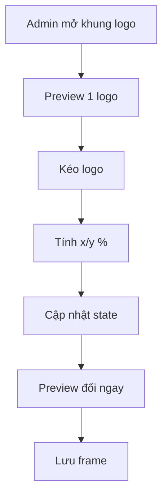

## Audit Summary
- Observation: `ProductImageFrameBox` hiện render logo theo 2 mode `center`/`corners`, trong đó `corners` tạo 4 logo → không phù hợp yêu cầu “1 logo”.
- Observation: `ProductImageFrameLogoConfig` chỉ có `placement/scale/opacity/inset`, chưa có tọa độ tự do để kéo-thả.
- Decision: bỏ `corners`, bỏ `inset`, chuyển sang lưu `x/y` (tọa độ tương đối) và render 1 logo duy nhất; admin kéo logo trực tiếp trong preview để cập nhật `x/y`.

## Root Cause Confidence
- High — nguyên nhân nằm ở contract dữ liệu và renderer: `placement='corners'` luôn tạo 4 logo và không có tọa độ tự do để kéo.

## TL;DR kiểu Feynman
- Hệ thống chỉ biết logo ở giữa hoặc 4 góc.
- Bạn muốn 1 logo và kéo đến đâu thì nằm ở đó.
- Cần đổi model: bỏ `corners`/`inset`, thêm `x/y`.
- Preview admin sẽ cho kéo logo và lưu tọa độ.
- Khung cũ `corners` sẽ map về góc trên trái.

## Elaboration & Self-Explanation
Hiện renderer buộc phải nhân logo theo `placement`. Nếu chỉ ẩn dropdown thì dữ liệu cũ vẫn render 4 logo. Do đó phải đổi contract sang tọa độ kéo-thả (`x/y`). Khi user kéo trong preview, ta chuyển pixel sang phần trăm của khung ảnh để lưu; cách này đảm bảo responsive giữa preview/admin và runtime. `Inset` bị loại bỏ để tránh xung đột với `x/y`.

## Concrete Examples & Analogies
- Ví dụ: kéo logo tới vị trí ~12% từ trái, 8% từ trên → lưu `x=12`, `y=8` và render đúng vị trí đó.
- Analogy: trước đây chọn “đậu xe ở giữa hoặc 4 góc”; giờ kéo marker trên bản đồ để ghim vị trí cụ thể.

## Files Impacted
- **Sửa:** `lib/products/product-frame.ts`  
  Vai trò: type `ProductImageFrameLogoConfig`.  
  Thay đổi: bỏ `placement/inset`, thêm `x/y`.
- **Sửa:** `convex/productImageFrames.ts`  
  Vai trò: validator/mutation cho `logoConfig`.  
  Thay đổi: cập nhật schema nhận `x/y`, bỏ `placement/inset`, kèm normalize dữ liệu cũ khi update.
- **Sửa:** `convex/schema.ts`  
  Vai trò: schema tổng của `productImageFrames`.  
  Thay đổi: đồng bộ `logoConfig` mới.
- **Sửa:** `components/shared/ProductImageFrameBox.tsx`  
  Vai trò: render logo frame.  
  Thay đổi: render 1 logo theo `x/y/scale/opacity`.
- **Sửa:** `app/admin/settings/_components/ProductFrameManager.tsx`  
  Vai trò: UI create/edit logo frame.  
  Thay đổi: bỏ dropdown `4 góc/giữa`, bỏ slider `Inset`, thêm draggable preview để set `x/y`.

## Execution Preview
1. Đổi type `ProductImageFrameLogoConfig` sang `{ logoUrl, scale, opacity, x, y }`.
2. Cập nhật Convex validators và schema cho `logoConfig` mới.
3. Normalize dữ liệu cũ: `placement='corners'` → `x=0,y=0` (góc trên trái), `placement='center'` → `x=50,y=50`.
4. Update `ProductImageFrameBox` render 1 logo theo `x/y` (top/left theo %).
5. Trong `ProductFrameManager`, thêm draggable preview: tính toán `x/y` theo % khi kéo, giới hạn không vượt khỏi khung ảnh.
6. Áp dụng cho cả create và edit drawer.
7. Static review đảm bảo không còn nhánh render `corners` và không còn `Inset`.

## Acceptance Criteria
- Không còn option `4 góc` và không còn render 4 logo.
- Chỉ còn 1 logo, kéo được trong preview.
- Sau khi kéo và lưu, mở lại vẫn đúng vị trí.
- `Inset` bị loại bỏ hoàn toàn khỏi create/edit logo.
- Dữ liệu cũ `corners` tự về góc trên trái.

## Verification Plan
- Static review: không còn `corners`/`Inset` trong UI và renderer.
- Typecheck: `bunx tsc --noEmit` sau khi implement.
- Manual repro:
  1) Tạo logo mới, kéo vị trí, lưu, reload → vị trí giữ nguyên.
  2) Mở frame cũ `corners` → thấy logo ở góc trên trái.
  3) Mở frame cũ `center` → thấy logo giữa và kéo lại được.

## Out of Scope
- Không hỗ trợ nhiều logo hoặc snapping/grid.
- Không đổi flow upload/logo source (vẫn dùng `site_logo`).

## Risk / Rollback
- Rủi ro: normalize dữ liệu cũ sai dẫn đến lệch vị trí.
- Rollback: revert các file type/schema/render/UI logo.

## Open Questions
- Mặc định lưu `x/y` theo % của khung ảnh để đảm bảo responsive. Nếu bạn không phản đối, mình sẽ chốt theo cách này khi triển khai.