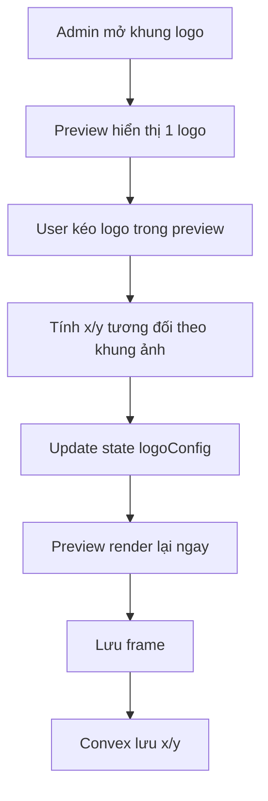

## Audit Summary
- Observation: `components/shared/ProductImageFrameBox.tsx` hiện render logo theo 2 mode cứng: `center` hoặc `corners`; mode `corners` tạo 4 ảnh logo cùng lúc, đúng như bạn nói là không hợp lý cho UX hiện tại.
- Observation: contract hiện tại trong `lib/products/product-frame.ts` và `convex/productImageFrames.ts` chỉ có `placement`, `scale`, `opacity`, `inset`; chưa có tọa độ tự do để lưu vị trí kéo-thả.
- Observation: bạn muốn bỏ hẳn tùy chọn 4 góc, chỉ còn 1 logo, kéo trực tiếp trong preview cho trực quan hơn, và bỏ `Inset` để tránh chồng chéo dữ liệu.
- Decision: đổi model logo frame từ `placement + inset` sang `x + y` (tọa độ tương đối), giữ `scale` và `opacity`; UI admin sẽ có preview draggable để kéo logo và tự cập nhật tọa độ, không còn dropdown `4 góc/giữa` nữa.

## Root Cause Confidence
- High — root cause nằm ở chính data model hiện tại: `placement='corners'` buộc renderer tạo 4 logo, nên dù UI có sửa nhẹ vẫn không giải quyết được bản chất. Muốn “1 logo kéo-thả” thì phải đổi contract lưu vị trí.

## TL;DR kiểu Feynman
- Bây giờ hệ thống chỉ biết logo ở giữa hoặc 4 góc.
- Bạn muốn 1 logo duy nhất và kéo nó đến đâu thì nằm ở đó.
- Muốn vậy phải đổi cách lưu dữ liệu: bỏ `corners` và `inset`, thêm tọa độ X/Y.
- Preview admin sẽ cho kéo logo trực tiếp trên ảnh mẫu.
- Khung cũ đang là `corners` sẽ được đổi về góc trên trái mặc định.

## Elaboration & Self-Explanation
Hiện renderer đang làm đúng theo dữ liệu cũ: nếu `placement='corners'` thì nó nhân logo thành 4 bản. Vì thế nếu chỉ xóa option khỏi dropdown mà không đổi schema, dữ liệu cũ vẫn có thể tạo ra 4 logo, và ta vẫn bị lệ thuộc vào 2 mode cứng. Cách đúng là chuyển tư duy từ “logo nằm ở preset nào” sang “logo nằm tại tọa độ nào trên ảnh”.

Khi đã lưu tọa độ `x/y`, preview admin có thể cho kéo-thả trực tiếp. Mỗi lần kéo, state cập nhật và preview render lại ngay. Lúc bấm tạo/lưu, tọa độ đó được lưu vào `logoConfig`. Điều này trực quan hơn nhiều, và cũng loại bỏ nhu cầu giữ `Inset` vì `Inset` chỉ là cách mô phỏng khoảng cách mép ảnh trong mô hình cũ.

## Concrete Examples & Analogies
- Ví dụ mới: thay vì chọn `center` hoặc `corners`, admin kéo logo đến khoảng 12% từ trái và 8% từ trên; hệ thống lưu `x=12`, `y=8` và luôn render đúng vị trí đó.
- Analogy: trước đây giống chọn chỗ đậu xe theo 2 ô cố định “giữa sân” hoặc “4 góc sân”; giờ là kéo marker trên bản đồ và ghim đúng chỗ muốn đậu.

## Files Impacted
- **Sửa:** `lib/products/product-frame.ts`  
  Vai trò hiện tại: định nghĩa `ProductImageFrameLogoConfig` với `placement` và `inset`.  
  Thay đổi: bỏ `placement`/`inset`, thêm tọa độ `x` và `y` cho 1 logo duy nhất.
- **Sửa:** `convex/productImageFrames.ts`  
  Vai trò hiện tại: schema/mutation validation cho `logoConfig`.  
  Thay đổi: cập nhật validator để nhận `x/y`, bỏ `placement/inset`, đồng thời chuẩn bị tương thích dữ liệu cũ khi patch/update.
- **Sửa:** `convex/schema.ts`  
  Vai trò hiện tại: schema Convex tổng cho `productImageFrames.logoConfig`.  
  Thay đổi: đồng bộ contract mới `x/y` thay cho `placement/inset`.
- **Sửa:** `components/shared/ProductImageFrameBox.tsx`  
  Vai trò hiện tại: render logo ở giữa hoặc 4 góc.  
  Thay đổi: render đúng 1 logo theo tọa độ `x/y` và `scale/opacity`.
- **Sửa:** `app/admin/settings/_components/ProductFrameManager.tsx`  
  Vai trò hiện tại: form create/edit logo frame với dropdown placement và slider inset.  
  Thay đổi: bỏ option 4 góc/giữa và bỏ slider inset; thêm preview draggable để kéo logo trực tiếp, tự cập nhật `x/y`; migrate state cũ sang mặc định góc trên trái khi dữ liệu là `corners`.

## Execution Preview
1. Audit chỗ dùng `ProductImageFrameLogoConfig` để xác định toàn bộ impact type/schema/render.
2. Đổi type + Convex validator từ `placement/inset` sang `x/y`.
3. Viết helper normalize dữ liệu cũ: nếu gặp `placement='corners'` thì map sang `x=0, y=0`; nếu `center` thì map sang `x=50, y=50` theo anchor center hoặc giá trị tương đương đã quy ước.
4. Cập nhật `ProductImageFrameBox` chỉ render 1 logo duy nhất theo tọa độ.
5. Trong `ProductFrameManager`, bỏ dropdown placement và slider inset; thêm lớp preview có drag handle cho logo.
6. Khi kéo trong preview, chuyển vị trí pixel của chuột thành tọa độ tương đối rồi set state `logoX/logoY`.
7. Áp cùng pattern kéo-thả cho drawer sửa logo frame.
8. Tự review tĩnh để đảm bảo null-safety, không bị drag ra ngoài khung và dữ liệu cũ không vỡ.

## Acceptance Criteria
- Không còn tùy chọn `4 góc` và không còn render 4 logo trong preview/render mới.
- Khung logo chỉ render 1 logo duy nhất.
- Admin có thể kéo logo trực tiếp trên preview để đổi vị trí.
- Sau khi kéo, tọa độ được lưu lại và mở sửa lại vẫn thấy đúng vị trí cũ.
- `Inset` bị loại bỏ hoàn toàn khỏi create/edit logo frame.
- Dữ liệu cũ có `placement='corners'` khi mở sửa sẽ tự về vị trí góc trên trái mặc định.
- Flow line/custom không bị ảnh hưởng.

## Verification Plan
- Static review: kiểm tra không còn branch render `corners` trong `ProductImageFrameBox`, không còn UI dropdown placement/inset ở logo form.
- Typecheck plan: sau khi implement sẽ chạy `bunx tsc --noEmit`.
- Manual repro plan cho tester:
  1. Tạo logo frame mới, kéo logo đến vị trí bất kỳ, lưu, reload trang, xác nhận vị trí giữ nguyên.
  2. Mở 1 frame cũ có `corners`, xác nhận tự hiện 1 logo ở góc trên trái.
  3. Mở 1 frame cũ có `center`, xác nhận normalize hợp lý và vẫn kéo tiếp được.
  4. Kiểm tra preview active và render danh sách khung vẫn hiển thị đúng 1 logo.

## Out of Scope
- Không làm drag/resize đa logo.
- Không thêm snapping, guides hay grid editor nâng cao.
- Không đổi logic upload/logo source; vẫn dùng `site_logo` như flow đã chốt trước đó.

## Risk / Rollback
- Rủi ro chính: migrate dữ liệu cũ nếu normalize không nhất quán giữa admin preview và runtime render.
- Rủi ro phụ: tính toán tọa độ theo preview có thể lệch nếu không dùng hệ quy chiếu tương đối.
- Rollback: có thể revert cụm type/schema/render/UI logo frame; phạm vi chủ yếu ở 5 file nêu trên.

## Open Questions
- Mình sẽ mặc định lưu `x/y` theo phần trăm tương đối của khung ảnh vì đây là cách hợp lý nhất để responsive giữa preview và runtime. Nếu bạn không phản đối thì mình sẽ tự chốt theo hướng này khi implement.

Nếu bạn duyệt spec này, mình sẽ triển khai theo hướng đổi contract logo frame sang tọa độ kéo-thả, bỏ hẳn `4 góc` và `Inset`, đồng thời normalize dữ liệu cũ về vị trí góc trên trái.