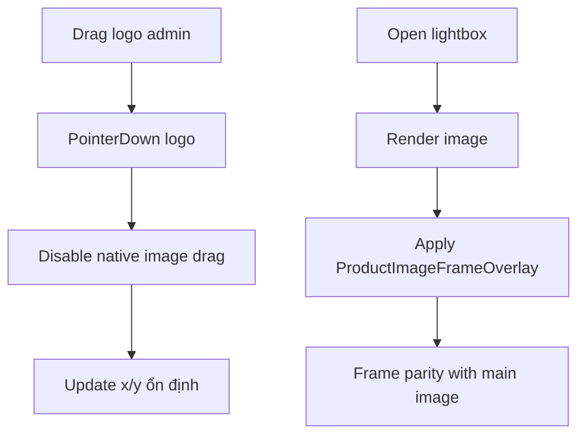

## Audit Summary
- Observation: `LogoDragPreview` đang kéo bằng pointer events trên ảnh logo nhưng chưa chặn native image drag của browser, gây cảm giác kéo cả ảnh khi drag nhanh.
- Observation: lightbox của product detail render ảnh lớn theo path riêng, chưa ghép `ProductImageFrameOverlay`, nên mất khung khi fullscreen.
- Inference: có 2 lỗi UX độc lập cùng nằm ở bề mặt ảnh sản phẩm (admin drag + site/preview lightbox parity).
- Decision: khóa hoàn toàn native drag ở preview logo, và chuẩn hóa render lightbox dùng cùng overlay contract với ảnh chính.

## Root Cause Confidence
- **High**: evidence trực tiếp từ flow hiện tại: thiếu `draggable={false}`/`onDragStart.preventDefault` ở drag preview và lightbox không đi qua wrapper overlay frame.

## TL;DR kiểu Feynman
- Browser đang tự hiểu là kéo ảnh HTML nên drag logo bị nhiễu.
- Lightbox đang mở ảnh “trần” nên không có khung.
- Sửa 1: tắt native drag ở ảnh logo + ảnh nền.
- Sửa 2: lightbox render ảnh kèm `ProductImageFrameOverlay` như ảnh chính.
- Kết quả: kéo mượt, fullscreen vẫn giữ khung.

## Elaboration & Self-Explanation
- Vấn đề kéo logo không nằm ở công thức tọa độ mà ở hành vi mặc định của thẻ `img`: khi rê chuột, browser có thể tạo ghost drag image. Vì vậy pointer gesture của app bị tranh chấp với native drag.
- Vấn đề lightbox mất khung là do kiến trúc render tách đôi: ảnh chính có overlay frame, ảnh fullscreen thì không. Cách an toàn nhất là ép lightbox dùng cùng primitive render frame để đảm bảo parity.

## Concrete Examples & Analogies
- Ví dụ 1: admin giữ logo rồi kéo mạnh sang chéo, trước fix sẽ có cảm giác kéo cả ảnh.
- Ví dụ 2: ảnh chính có frame, bấm fullscreen frame biến mất.
- Analogy: ảnh chính là bản đã đóng khung, lightbox đang mở bản chưa đóng khung.

## Files Impacted
- **Sửa:** `app/admin/settings/_components/ProductFrameManager.tsx`  
  Vai trò: drag logo trong preview admin.  
  Thay đổi: thêm `draggable={false}` + `onDragStart={preventDefault}` cho ảnh liên quan; giữ rule chỉ kéo khi nắm logo.

- **Sửa:** `app/(site)/products/[slug]/page.tsx`  
  Vai trò: product detail runtime + lightbox site.  
  Thay đổi: lightbox image render qua wrapper `relative` có `ProductImageFrameOverlay` để parity với ảnh chính.

- **Sửa:** `components/experiences/previews/ProductDetailPreview.tsx`  
  Vai trò: preview experience product-detail.  
  Thay đổi: đồng bộ cùng logic lightbox frame như site runtime.

- **Có thể sửa nhẹ (nếu cần tái dùng helper):** `components/shared/ProductImageFrameBox.tsx`  
  Vai trò: primitive render frame overlay.  
  Thay đổi: chỉ điều chỉnh tối thiểu nếu cần để tái sử dụng nhất quán.

## Execution Preview
1. Đọc chính xác 3 file mục tiêu để chốt pattern hiện tại.
2. Chỉnh `ProductFrameManager.tsx` để disable native drag hoàn toàn ở preview logo.
3. Chỉnh lightbox runtime trong `app/(site)/products/[slug]/page.tsx` để render overlay frame.
4. Chỉnh lightbox preview trong `ProductDetailPreview.tsx` theo đúng contract runtime.
5. Static self-review: null-safety, z-index/layer order, không mở rộng scope.
6. Chạy `bunx tsc --noEmit` (theo rule repo khi có đổi code TS).
7. Commit toàn bộ thay đổi (kèm `.factory/docs` nếu có) với message rõ ràng.

## Acceptance Criteria
- Kéo logo admin không còn ghost drag / cảm giác kéo cả ảnh.
- Chỉ giữ vào logo mới kéo được, không kéo từ nền.
- Lightbox ở experience preview giữ khung giống ảnh chính.
- Lightbox ở site runtime giữ khung giống ảnh chính.
- Không làm hỏng hành vi thumbnail/lightbox điều hướng hiện có.

## Verification Plan
- Static review: xác nhận có `draggable={false}` + `preventDefault` đúng chỗ.
- Static review: lightbox render path có `ProductImageFrameOverlay`.
- Typecheck: `bunx tsc --noEmit`.
- Manual repro nhanh trên admin + preview + runtime như acceptance criteria.

## Out of Scope
- Không đổi thuật toán drag (snap/grid/inertia).
- Không redesign UI lightbox.

## Risk / Rollback
- Rủi ro thấp, chủ yếu là z-index/overlay order trong modal.
- Rollback đơn giản bằng revert 3 file code chính.

Nếu bạn confirm plan này, mình sẽ implement full ngay.