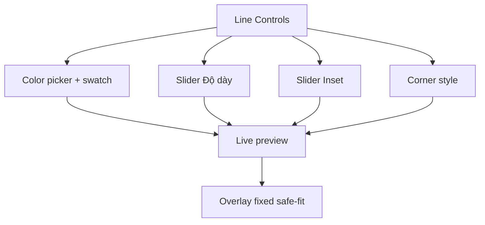

## TL;DR kiểu Feynman
- Ta sẽ bỏ hoàn toàn lựa chọn `Contain/Cover` khỏi admin settings và cố định render overlay theo safe-fit (`contain`) để user không phải quyết định khó hiểu.
- Form tạo/sửa **khung line** sẽ chuyển sang controls trực quan: color picker + swatch, slider độ dày, slider inset, label ngắn.
- Preview line sẽ phản hồi tức thì theo từng thay đổi (màu/độ dày/inset/corner), không chờ save.
- Corner style sẽ render khác biệt rõ: `sharp` (nét vuông cứng), `rounded` (bo mềm), `ornamental-light` (nhấn mạnh ornamental bằng pattern góc rõ ràng hơn).
- Scope chính chỉ tập trung vào 2 file UI/render chính để thay đổi nhỏ, dễ rollback.

## Audit Summary
### Observation
1. `ProductFrameManager` hiện vẫn đọc/ghi `productFrameOverlayFit`, có state `draftOverlayFit` và dropdown fit mode.
2. `ProductImageFrameBox`/`useProductFrameConfig` đang dùng `overlayFit` union `'contain' | 'cover'` và apply trực tiếp vào `objectFit` của overlay image.
3. Render line frame hiện chỉ khác biệt ornamental bằng `strokeDasharray='8 6'`, nên khó phân biệt với `sharp` trong nhiều ảnh.
4. Form line hiện có nhiều text và input chưa trực quan (đặc biệt ý nghĩa inset và màu line).

### Root Cause Confidence
**High** — vấn đề nằm ở trải nghiệm control → visual feedback chưa đủ mạnh và lựa chọn `Contain/Cover` tạo quyết định không cần thiết, không phải do data/schema.

### Counter-Hypothesis (đã loại trừ)
- Không phải lỗi từ Convex schema: schema hiện đã hỗ trợ đầy đủ line config/corner style.
- Không phải thiếu dữ liệu preview: đã có `previewProducts` + `linePreviewFrame` cho realtime preview.
- Không cần đổi backend để đạt yêu cầu UX; chủ yếu là refactor UI và render logic frontend.

## Elaboration & Self-Explanation
Hiện tại user phải hiểu nhiều thuật ngữ kỹ thuật trước khi thấy kết quả, nên thao tác chậm và dễ sai. Cách xử lý là giảm quyết định dư thừa (bỏ fit mode), đồng thời làm mọi control “chạm là thấy” ngay trong preview. Khi corner style khác nhau đủ rõ bằng hình học/pattern, user không cần đọc mô tả dài vẫn chọn đúng style.

## Concrete Examples & Analogies
- Ví dụ: kéo `Inset` từ `2%` lên `8%` thì đường viền lùi vào trong rõ ràng, không còn cảm giác viền dính mép ảnh.
- Ví dụ: đổi `Corner style` từ `rounded` sang `sharp` thì góc vuông ngay lập tức; sang `ornamental-light` sẽ có accent ở góc nhìn rõ hơn dash thường.
- Analogy: như chỉnh filter ảnh trên điện thoại — mỗi slider thay đổi là ảnh đổi ngay, không cần đọc hướng dẫn dài.

## Files Impacted
### UI
- **Sửa:** `app/admin/settings/_components/ProductFrameManager.tsx`  
  Vai trò hiện tại: quản lý toàn bộ create/edit/preview và settings frame.  
  Thay đổi: bỏ state/query/save cho `overlayFit`; bỏ control `Contain/Cover`; tối giản microcopy cho khung line; tăng trực quan controls (color + slider + hint inset).

### Shared render
- **Sửa:** `components/shared/ProductImageFrameBox.tsx`  
  Vai trò hiện tại: source-of-truth render overlay và cấp config (`enabled/frame/overlayFit`).  
  Thay đổi: cố định fit an toàn (`contain`) trong hook/component; bỏ dependency `overlayFit` khỏi API public; nâng cấp render `ornamental-light` để khác biệt rõ với `sharp`/`rounded`.

### Shared type
- **Sửa (nhỏ):** `lib/products/product-frame.ts`  
  Vai trò hiện tại: định nghĩa type frame và `ProductFrameOverlayFit`.  
  Thay đổi: nếu không còn chỗ dùng hợp lệ, loại bỏ/thu hẹp `ProductFrameOverlayFit` để phản ánh contract mới; giữ backward-compatible cho `cornerStyle`.

## Execution Preview
1. Refactor `ProductFrameManager` để loại bỏ hoàn toàn `overlayFitSetting`, `draftOverlayFit`, save mutation tương ứng và UI dropdown fit.
2. Chuẩn hóa controls line (create + edit):
   - màu line bằng color input + hex sync,
   - slider độ dày (px) + value badge,
   - slider inset (%) + hint “sát mép ↔ vào trong”.
3. Giữ nguyên flow preview realtime bằng `linePreviewFrame`, chỉ cải thiện layout/nhãn để nhìn nhanh hơn.
4. Refactor `ProductImageFrameBox`:
   - `useProductFrameConfig()` trả về `{ enabled, frame }` (hoặc giữ overlayFit nội bộ cố định contain để tránh break diện rộng),
   - `ProductImageFrameOverlay`/`ProductImageFrameBox` bỏ prop `overlayFit` ở call sites đã kiểm soát.
5. Cải tiến `renderLineFrame` cho `ornamental-light`: thêm pattern nhấn góc rõ hơn (không chỉ dash toàn viền), vẫn nhẹ và không quá lòe.
6. Rà static type toàn bộ nơi dùng `useProductFrameConfig`/`ProductImageFrameOverlay` để sửa compile errors do đổi signature.
7. Tự review tĩnh null-safety/edge cases, chuẩn bị commit theo quy định repo.

## Acceptance Criteria
- Không còn xuất hiện control `Contain/Cover` ở `/admin/settings/product-frames`.
- Đổi màu line có swatch trực quan và preview đổi ngay.
- Đổi độ dày/inset bằng slider và preview cập nhật realtime.
- `sharp`, `rounded`, `ornamental-light` khác biệt thị giác rõ trên cùng ảnh preview.
- Overlay image vẫn hiển thị an toàn theo safe-fit cố định (không phát sinh lựa chọn fit cho user).

## Verification Plan
- Repro thủ công trên route `/admin/settings/product-frames`:
  1) tạo line frame mới bằng color/slider,  
  2) chỉnh line frame hiện có trong edit panel,  
  3) so sánh 3 corner styles trên cùng config.
- Repro thủ công ở vài nơi tiêu thụ `ProductImageFrameOverlay` (products list/detail/home preview) để xác nhận không regression hiển thị overlay.
- Theo AGENTS.md: **không chạy lint/unit/build**; chỉ self-review tĩnh + kiểm tra logic/types qua code path.

## Out of Scope
- Không đổi schema Convex, không thêm loại frame mới.
- Không redesign toàn trang settings ngoài khu vực frame line/preview.

## Risk / Rollback
- Rủi ro chính: thay signature `useProductFrameConfig` có thể ảnh hưởng nhiều call sites.
- Giảm rủi ro: thực hiện theo hướng compatibility trước (cố định contain nội bộ), rồi mới dọn type nếu còn dư.
- Rollback: revert 2 file chính `ProductFrameManager.tsx` + `ProductImageFrameBox.tsx` (và type file nếu đã chỉnh).