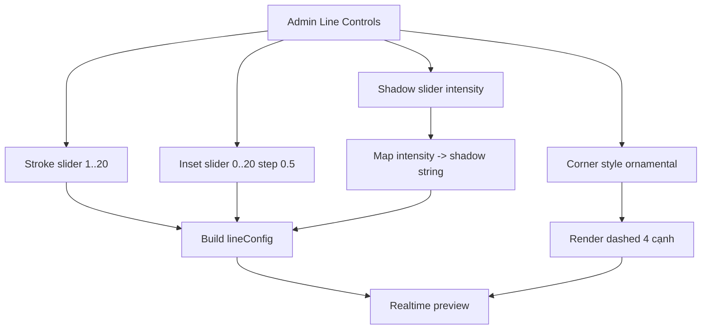

## TL;DR kiểu Feynman
- Em sẽ sửa đúng 2 file chính để hoàn thành toàn bộ yêu cầu trong spec: form control ở admin và logic render line frame ở preview/site.
- `Shadow` sẽ đổi từ input chuỗi CSS sang slider cường độ dễ dùng; hệ thống tự map sang `drop-shadow(...)`.
- `Độ dày` tăng max lên `20`; `Inset` tăng max `20` và step `0.5` (cả create + edit).
- `Ornamental` sẽ hiển thị nét đứt đều 4 cạnh, bỏ các block ở góc để giống ảnh mẫu.
- Không đổi schema/backend; dữ liệu vẫn lưu `lineConfig.shadow` dạng string để tương thích ngược.

## Audit Summary
### Observation
1. `ProductFrameManager.tsx` đang có slider cho `Độ dày`/`Inset`, nhưng range chưa đạt yêu cầu mới (`max 12` và `max 15`, `step 1` cho inset).
2. `Shadow` trong create/edit của `line_generator` đang là text input CSS khó dùng cho user phổ thông.
3. `ProductImageFrameBox.tsx` với `ornamental-light` đang vẽ dashed + 4 góc fill block, khác kỳ vọng “nét đứt đều 4 cạnh”.
4. Preview hiện đã realtime, phù hợp chuyển qua UX slider không cần đổi kiến trúc.

### Root Cause Confidence
**High** — UI control đang thiên về thông số kỹ thuật (string CSS) thay vì interaction trực quan; render ornamental có chi tiết góc dư so với yêu cầu thị giác.

### Counter-Hypothesis
- Không cần thay đổi Convex schema/mutation: chỉ đổi cách nhập liệu và cách render.
- Không cần thêm `cornerStyle` mới: giữ `ornamental-light`, chỉ đổi biểu diễn.
- Không cần thay đổi flow active frame hoặc preview plumbing.

## Elaboration & Self-Explanation
Bài toán này giống việc đổi từ “nhập công thức” sang “kéo thanh chỉnh”. Người dùng không cần biết `rgba(...)` hay cú pháp `drop-shadow`, họ chỉ cần kéo mạnh/nhẹ và thấy preview đổi ngay. Về ornamental, cái user muốn là “đường nét đứt đồng đều” quanh viền; 4 block góc làm cảm giác nặng và lệch mẫu, nên phải bỏ để hình đúng trực giác hơn.

## Concrete Examples & Analogies
- Ví dụ: Shadow = 0 → không bóng; Shadow = 40 → bóng nhẹ; Shadow = 100 → bóng đậm hơn, nhưng vẫn cap để không gắt.
- Ví dụ: Inset = 0.5 giúp fine-tune nửa bước, tránh bị “nhảy cóc” khi cần căn sát mép.
- Ví dụ: Stroke = 20 dùng cho layout campaign cần viền nổi bật, trước đây max 12 chưa đủ.
- Analogy: giống app chỉnh ảnh trên điện thoại, thanh “độ bóng” luôn dễ dùng hơn nhập công thức ánh sáng.

## Files Impacted
### UI
- **Sửa:** `app/admin/settings/_components/ProductFrameManager.tsx`  
  Vai trò hiện tại: quản lý create/edit frame + preview realtime.  
  Thay đổi: thêm helper parse/build shadow intensity; đổi Shadow input thành slider cho create/edit; mở rộng range `strokeWidth` và `inset`; giữ payload `lineConfig.shadow` tương thích string.

### Shared
- **Sửa:** `components/shared/ProductImageFrameBox.tsx`  
  Vai trò hiện tại: render overlay frame cho product image.  
  Thay đổi: cập nhật `renderLineFrame()` cho `ornamental-light` chỉ dashed 4 cạnh, bỏ corner blocks.

## Execution Preview
1. Trong `ProductFrameManager.tsx`: thêm hằng số/range cho line controls (`stroke/inset/shadow`).
2. Thêm 2 helper cục bộ:
   - parse shadow string cũ -> intensity (để edit frame cũ vẫn hiển thị slider hợp lý).
   - intensity -> shadow string chuẩn (để lưu lại vào `lineConfig.shadow`).
3. Update create form `line`: thay `<Input Shadow>` bằng `<input type='range'>` + label giá trị.
4. Update edit drawer `line`: áp dụng cùng UX slider và mapping.
5. Trong `ProductImageFrameBox.tsx`: bỏ render `cornerPoints`/`corner rects`; giữ dashed stroke cho ornamental.
6. Static self-review: kiểu dữ liệu, tương thích frame cũ không shadow, biên range, preview behavior.

## Acceptance Criteria
- `Ornamental` hiển thị dashed đều 4 cạnh, không còn block góc.
- `Shadow` create/edit là slider, không còn bắt nhập chuỗi CSS.
- `Độ dày` kéo được đến `20`.
- `Inset` kéo đến `20` với bước `0.5`.
- Preview cập nhật tức thì khi đổi các control line.
- Không phát sinh thay đổi schema/mutation backend.

## Verification Plan
- Manual repro tại `/admin/settings/product-frames`, chọn tạo/sửa `Khung line`.
- Checklist:
  1. Kéo `Độ dày` tới 20 và quan sát preview.
  2. Kéo `Inset` các giá trị lẻ `.5` (0.5, 7.5, 19.5, 20).
  3. Kéo `Shadow` từ 0 -> max, preview bóng tăng dần.
  4. Chọn `Ornamental`, xác nhận dashed 4 cạnh và không có block góc.
- Theo AGENTS.md: không chạy lint/test/build; chỉ static review + kiểm tra logic và type tại chỗ.

## Out of Scope
- Không đổi data model Convex hoặc migration dữ liệu.
- Không thêm preset shadow nhiều mode (soft/hard/inner) ngoài slider intensity.
- Không chỉnh UX cho frame type khác (`custom`, `logo`) ngoài phạm vi liên quan.

## Risk / Rollback
- Rủi ro chính: mapping intensity -> CSS shadow có thể hơi mạnh/yếu so với cảm nhận.
- Giảm thiểu: dùng curve tuyến tính nhẹ + cap opacity để an toàn thị giác.
- Rollback nhanh: revert từng file độc lập (`ProductFrameManager.tsx`, `ProductImageFrameBox.tsx`).

Nếu anh duyệt plan này, em sẽ implement full ngay theo đúng phạm vi trên.