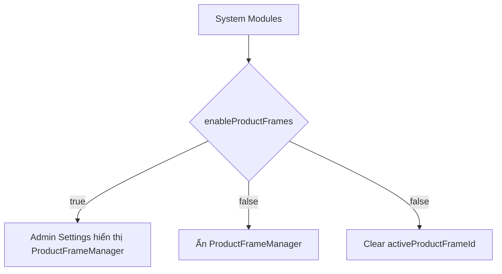

## Audit Summary
- **Observation:** `/admin/settings/page.tsx` đang render `ProductFrameManager` cố định khi `activeTab === 'site'`, không phụ thuộc `enableProductFrames`.
- **Observation:** `ProductFrameManager` hiện tự đọc `enableProductFrames`, nhưng chỉ dùng để đổi trạng thái nút/toggle bên trong, chưa tự ẩn toàn block.
- **Observation:** `convex/admin/modules.ts:setModuleSetting` đã có pattern xử lý side-effect cho settings của `products` (ví dụ đổi aspect ratio thì cleanup frame active), nên việc clear `activeProductFrameId` khi tắt feature nên đặt ở đây để dữ liệu nhất quán toàn hệ thống.
- **Inference:** Đây là lỗi contract UI + dữ liệu chưa đồng bộ: System đã tắt feature nhưng Admin Settings vẫn lộ màn hình quản lý feature đó.
- **Decision:** Ẩn toàn bộ block `ProductFrameManager` ở `/admin/settings` khi `enableProductFrames !== true`, đồng thời clear `activeProductFrameId` tại mutation `setModuleSetting` khi người dùng tắt feature.

## Root Cause Confidence
- **High** — Evidence trực tiếp ở:
  - `app/admin/settings/page.tsx:873` render `<ProductFrameManager />` vô điều kiện theo tab.
  - `app/admin/settings/_components/ProductFrameManager.tsx` vẫn query và render toàn bộ UI dù `isEnabled` false.
  - `convex/admin/modules.ts` đã có sẵn nhánh side-effect cho settings `products`, phù hợp để gắn cleanup `activeProductFrameId`.

## TL;DR kiểu Feynman
- Hiện tại hệ thống chỉ “tắt công tắc”, nhưng chưa “cất cái bảng điều khiển” đi.
- Vì vậy anh tắt ở `/system/modules/products` rồi mà `/admin/settings` vẫn thấy block khung viền.
- Cách sửa đúng là: chỗ render `/admin/settings` phải kiểm tra setting trước khi hiện block.
- Đồng thời khi tắt thì xóa luôn `activeProductFrameId` để tránh giữ state cũ.
- Đây là fix nhỏ, đúng scope, ít rủi ro và dễ rollback.

## Elaboration & Self-Explanation
Vấn đề ở đây không phải logic khung viền render ngoài site, mà là phần admin settings đang hiển thị một màn hình quản lý của feature đã bị tắt.

Nói đơn giản:
1. `enableProductFrames` là source-of-truth để biết feature có đang bật hay không.
2. `/admin/settings` hiện chưa hỏi source-of-truth này, nên cứ vào tab `site` là nó render `ProductFrameManager`.
3. Vì thế UI bị lệch kỳ vọng: feature off nhưng màn hình config của nó vẫn còn.
4. Ngoài ra, nếu tắt feature mà vẫn giữ `activeProductFrameId`, dữ liệu active cũ vẫn treo trong DB; tuy không dùng ngay, nhưng là state mồ côi.

Hướng sửa tốt nhất là khóa ở 2 lớp:
- **UI gate:** không render block nếu setting off.
- **Data cleanup:** khi toggle off thì clear `activeProductFrameId`.

## Concrete Examples & Analogies
- **Ví dụ cụ thể:** Admin vào `http://localhost:3000/system/modules/products`, tắt `Bật khung viền sản phẩm`. Sau đó vào `/admin/settings`, tab `Chung` sẽ **không còn** block quản lý khung viền nữa.
- **Ví dụ dữ liệu:** nếu trước đó `activeProductFrameId = abc123`, lúc tắt feature mutation sẽ đổi giá trị này về `null`.
- **Analogy:** giống như tắt tính năng “máy lạnh trung tâm” thì trong bảng điều khiển phòng cũng phải ẩn luôn cụm chỉnh nhiệt độ, không thể để bảng điều khiển còn đó nhưng máy đã bị ngắt tổng.

## Files Impacted
- **Sửa:** `app/admin/settings/page.tsx`  
  Vai trò hiện tại: render các block trong tab settings admin.  
  Thay đổi: query `enableProductFrames` và chỉ render `ProductFrameManager` khi setting này bật.

- **Sửa:** `convex/admin/modules.ts`  
  Vai trò hiện tại: mutation source-of-truth cho module settings và side-effects liên quan.  
  Thay đổi: thêm nhánh khi `moduleKey === "products" && settingKey === "enableProductFrames" && value === false` thì clear `activeProductFrameId` về `null`.

- **Có thể không cần sửa:** `app/admin/settings/_components/ProductFrameManager.tsx`  
  Vai trò hiện tại: UI quản lý frame.  
  Thay đổi dự kiến: không bắt buộc nếu gate đặt ở page; chỉ sửa nếu cần thêm guard return `null` để chống render lệch trong tương lai.

## Execution Preview
1. Đọc pattern query settings trong `app/admin/settings/page.tsx` để gắn thêm query `products.enableProductFrames`.
2. Bọc điều kiện render `ProductFrameManager` theo `activeTab === 'site' && enableProductFrames === true`.
3. Sửa `convex/admin/modules.ts` để clear `activeProductFrameId` khi feature bị tắt.
4. Review tĩnh xem có ảnh hưởng flow đang có của aspect ratio cleanup không.
5. Chạy `bunx tsc --noEmit` để xác nhận không phát sinh lỗi type.
6. Review diff và commit local theo quy ước repo.

## Acceptance Criteria
- Khi `enableProductFrames = false` trong `/system/modules/products`, tab `Chung` ở `/admin/settings` không còn hiển thị `ProductFrameManager`.
- Khi tắt feature, `activeProductFrameId` được reset về `null`.
- Khi bật lại feature, block quản lý khung viền hiện lại bình thường.
- Không làm thay đổi các settings khác trong `/admin/settings`.

## Verification Plan
- Toggle OFF tại `/system/modules/products` rồi mở `/admin/settings` để xác nhận block bị ẩn.
- Kiểm tra dữ liệu setting `activeProductFrameId` được clear sau khi toggle OFF.
- Toggle ON lại để xác nhận block xuất hiện lại.
- Chạy `bunx tsc --noEmit` để verify typing.

## Out of Scope
- Ẩn riêng từng control bên trong `ProductFrameManager`.
- Xóa toàn bộ records trong `productImageFrames` khi tắt feature.
- Thay đổi UX của màn settings ngoài phần khung viền sản phẩm.

## Risk / Rollback
- **Risk thấp:** thay đổi cục bộ ở 1 gate UI + 1 side-effect mutation.
- **Rollback:** revert 2 file là quay về hành vi cũ.

## Problem Graph
1. [Main] UI admin settings vẫn hiện manager khi feature off <- depends on 1.1, 1.2
   1.1 [Sub] `/admin/settings` render vô điều kiện `ProductFrameManager`
   1.2 [Sub] state active frame không được clear khi feature off
      1.2.1 [ROOT CAUSE] mutation `setModuleSetting` chưa có cleanup cho `enableProductFrames=false`

## Execution (with reflection)
1. Solving 1.1...
   - Thought: gate ở page-level là đúng contract nhất vì tránh mount component không cần thiết.
   - Action: thêm query setting và điều kiện render block.
   - Reflection: ✓ Valid, scope nhỏ và không đụng UI nội bộ.
2. Solving 1.2.1...
   - Thought: cleanup nên nằm ở source-of-truth mutation để dù đổi setting từ đâu cũng nhất quán.
   - Action: patch `activeProductFrameId` về `null` khi tắt feature.
   - Reflection: ✓ Valid, khớp pattern side-effect đang có.

Nếu anh duyệt spec này, tôi sẽ implement đúng theo plan trên.