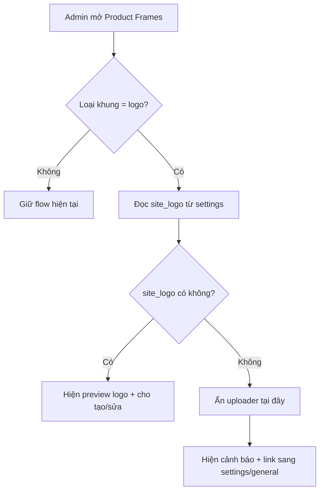

## Audit Summary
- Observation: `app/admin/settings/_components/ProductFrameManager.tsx` hiện giữ state riêng `logoUrl`/`editLogoUrl` và dùng `SettingsImageUploader` cho flow `logo_generator`, tức là admin phải upload logo riêng trong `/admin/settings/product-frames`.
- Observation: `app/admin/settings/_components/SettingsPageShell.tsx` đã có nguồn logo chuẩn là `form.site_logo` và còn có pattern tái sử dụng asset sẵn có (`site_favicon` có nút “Dùng logo hiện tại”).
- Observation: schema/data layer hiện lưu `logoConfig.logoUrl` bắt buộc trong `convex/productImageFrames.ts` và `lib/products/product-frame.ts`, nên UI chỉ cần cấp đúng URL; không cần đổi schema nếu vẫn snapshot URL tại lúc tạo/sửa.
- Inference: vấn đề là lệch nguồn dữ liệu và UX thừa bước upload, không phải do thiếu khả năng render logo frame.
- Decision: đổi UI khung logo sang đọc `site_logo` từ settings làm nguồn mặc định/duy nhất trong admin; nếu chưa có `site_logo` thì chặn tạo/sửa và hiện CTA nhắc admin upload logo ở `/admin/settings/general`.

## Root Cause Confidence
- High — evidence rõ ở `ProductFrameManager.tsx` đang upload logo vào folder `product-frames`, trong khi `SettingsPageShell.tsx` đã quản lý `site_logo` ở folder `settings`. Hai flow song song cho cùng một concept “logo thương hiệu” gây lệch dữ liệu và thao tác thừa.

## TL;DR kiểu Feynman
- Hiện có 2 chỗ quản lý logo: 1 chỗ trong cài đặt chung, 1 chỗ trong khung sản phẩm.
- Điều này làm admin phải upload lại cùng một logo.
- Cách đúng hơn là khung logo chỉ lấy logo từ cài đặt chung.
- Nếu cài đặt chung chưa có logo thì báo rõ: vào `/admin/settings/general` để upload trước.
- Không đổi cách render khung ngoài site; chỉ đổi nguồn logo trong màn hình admin product frames.

## Elaboration & Self-Explanation
Màn hình khung sản phẩm đang coi “logo dùng cho khung” là một file riêng, nên nó mở uploader riêng và lưu URL riêng. Nhưng trong dự án đã có khái niệm logo chính thức của website là `site_logo`. Về mặt nghiệp vụ, đây là cùng một logo thương hiệu, nên việc cho upload lần nữa ở product frames làm dữ liệu dễ lệch: đổi logo ở settings nhưng khung cũ vẫn dùng logo cũ.

Vì render frame hiện chỉ cần một `logoUrl`, ta không cần đụng schema lớn. Chỉ cần đổi cách lấy giá trị ở UI admin: khi tạo hoặc sửa frame logo thì `logoUrl` sẽ tự lấy từ `site_logo`. Nếu `site_logo` chưa có, thay vì cho upload tại đây, ta khóa flow và báo admin qua trang settings chung để upload đúng chỗ.

## Concrete Examples & Analogies
- Ví dụ trong repo: `site_favicon` đã có nút “Dùng logo hiện tại”, nghĩa là repo đã chấp nhận pattern tái sử dụng `site_logo` cho asset liên quan. Khung logo nên theo cùng pattern đó.
- Analogy: giống như công ty có 1 con dấu chính thức. Nếu mỗi phòng tự upload một con dấu riêng thì rất dễ lệch mẫu; đúng hơn là mọi phòng đều dùng con dấu từ kho trung tâm.

## Files Impacted
- **Sửa:** `app/admin/settings/_components/ProductFrameManager.tsx`  
  Vai trò hiện tại: quản lý toàn bộ UI tạo/sửa/chọn product frame, gồm flow upload logo riêng cho `logo_generator`.  
  Thay đổi: đọc thêm `site_logo` từ settings query hoặc reuse query sẵn có, bỏ uploader ở create/edit logo frame, thay bằng preview + thông báo dùng logo từ cài đặt chung; chặn save khi chưa có `site_logo`.
- **Có thể sửa nhẹ:** `app/admin/settings/_components/SettingsPageShell.tsx`  
  Vai trò hiện tại: quản lý `site_logo` trong settings chung.  
  Thay đổi: không bắt buộc; chỉ tham chiếu pattern UX để giữ wording/CTA nhất quán nếu cần copy microcopy.
- **Không đổi logic data:** `convex/productImageFrames.ts`  
  Vai trò hiện tại: lưu `logoConfig.logoUrl` cho frame logo.  
  Thay đổi: dự kiến không sửa, vẫn lưu snapshot `site_logo` URL khi tạo/cập nhật frame để giữ impact nhỏ và rollback dễ.

## Execution Preview
1. Đọc query/settings pattern trong `ProductFrameManager` để lấy `site_logo`.
2. Thay form tạo `logo_generator`: bỏ `SettingsImageUploader`, hiển thị logo hiện tại từ settings nếu có.
3. Thay form sửa `logo_generator`: bỏ chỉnh tay `editLogoUrl`, chuyển sang read-only theo `site_logo`.
4. Cập nhật `handleCreateLogo` và `handleSaveEdit` để inject `site_logo` vào `logoConfig.logoUrl`.
5. Thêm empty-state/callout: nếu chưa có logo, hiện link sang `/admin/settings/general` và disable action tạo/sửa logo frame.
6. Tự review tĩnh để đảm bảo null-safety, không vỡ frame cũ và copy text nhất quán.

## Acceptance Criteria
- Tại `/admin/settings/product-frames`, chọn loại `logo` không còn thấy uploader logo riêng.
- Nếu `site_logo` đã có: preview hiện đúng logo đó và tạo frame thành công.
- Nếu `site_logo` chưa có: nút tạo/sửa frame logo bị chặn và UI báo vào `/admin/settings/general` để upload logo.
- Flow overlay và line không bị ảnh hưởng.
- Frame logo đã lưu trước đó vẫn render bình thường vì schema không đổi.

## Verification Plan
- Static review: kiểm tra `ProductFrameManager` không còn đường dẫn upload cho logo frame, các branch create/edit đều xử lý `site_logo` null an toàn.
- Typecheck plan: sau khi implement sẽ chạy `bunx tsc --noEmit` theo quy ước repo khi có thay đổi TS/code.
- Manual repro plan cho tester:
  1. Case A: settings có `site_logo` → vào product-frames tạo/sửa frame logo, xác nhận dùng đúng logo hiện tại.
  2. Case B: xóa `site_logo` → vào product-frames, xác nhận thấy cảnh báo + không upload tại đây.
  3. Case C: mở frame cũ/overlay/line để chắc không regression.

## Out of Scope
- Không migrate dữ liệu frame cũ sang reference động theo `site_logo`.
- Không đổi schema Convex sang mô hình “tham chiếu settings realtime”.
- Không sửa runtime render ngoài admin trừ khi cần vì type/UI contract.

## Risk / Rollback
- Rủi ro chính: frame logo đã lưu sẽ vẫn snapshot logo cũ nếu sau này admin đổi `site_logo`; đây là tradeoff chấp nhận để giữ thay đổi nhỏ.
- Rollback dễ: revert chủ yếu ở `ProductFrameManager.tsx`, không đụng schema/data migration.

Nếu bạn duyệt spec này, mình sẽ implement theo hướng trên với thay đổi nhỏ nhất, không mở rộng scope.