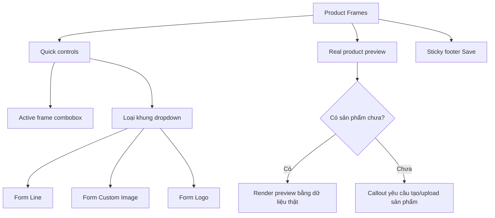

## TL;DR kiểu Feynman
- Bỏ toàn bộ preset mùa/sự kiện để giảm nhiễu.
- Khu “Tạo khung” đổi thành **1 dropdown chọn loại** (line / custom ảnh / logo), chọn 1 thì chỉ hiện đúng form đó.
- Tăng preview cho line và dùng **sản phẩm thực tế** để preview; nếu chưa có sản phẩm thì hiện cảnh báo yêu cầu admin tạo/upload 1 sản phẩm.
- Trang `/admin/settings/product-frames` và 3 trang settings còn lại đều có **nút Lưu riêng** + **sticky footer save** giống pattern `/admin/products/[id]/edit`.
- Mục tiêu: gọn, dễ hiểu với user không kỹ thuật nhưng vẫn đủ tính năng cho dev/admin.

## Audit Summary
### Observation
1. Triệu chứng: `/admin/settings/product-frames` đang có quá nhiều khối cùng lúc (preset, 3 form tạo, list, edit), gây rối ngay khi mở trang.
2. Phạm vi ảnh hưởng: trải nghiệm thao tác ở trang Product Frames và tính nhất quán giữa 4 trang settings.
3. Tái hiện: ổn định, chỉ cần vào route là thấy nhiều quyết định UI đồng thời.
4. Mốc thay đổi gần nhất: route đã tách thành 4 trang, nhưng chưa đồng bộ pattern save/footer và chưa tối giản flow tạo khung.
5. Dữ liệu thiếu trước đó: đã được bạn chốt rõ (bỏ preset, dropdown 1 loại, preview thực tế, sticky save từng trang).
6. Giả thuyết thay thế chưa phù hợp: chỉ đổi spacing/typography không giải quyết gốc rễ IA (information architecture).
7. Rủi ro nếu sửa sai nguyên nhân: giao diện vẫn dài/rối dù nhìn “đẹp” hơn.
8. Pass/fail: user vào trang hiểu ngay 3 thao tác chính (chọn active, tạo mới, sửa) mà không bị ngợp.

## Root Cause Confidence
**High** — vấn đề chính là **phơi toàn bộ controls cùng lúc** thay vì progressive disclosure + thiếu pattern lưu cố định như các màn CRUD lớn.

## Elaboration & Self-Explanation
Hiện tại trang giống “bảng điều khiển kỹ thuật mở hết nắp”: ai cũng nhìn thấy mọi tùy chọn cùng lúc nên phải tự suy nghĩ thứ tự thao tác. Với chuẩn SaaS, mình sẽ chia ra:
- Vùng thao tác chính gọn ở trên (active frame, fit, loại tạo khung).
- Form tạo theo loại chỉ hiện khi được chọn.
- Chỉnh sửa mở riêng bằng drawer bên phải.
- Lưu bằng sticky footer cố định cuối màn hình để user luôn thấy hành động chính.
Như vậy người mới không bị ngợp, còn người kỹ thuật vẫn đủ quyền chi tiết.

## Concrete Examples & Analogies
- Ví dụ cụ thể: thay vì hiển thị cùng lúc “Tạo overlay”, “Tạo line”, “Tạo logo”, ta dùng 1 dropdown “Loại khung”:
  - Chọn `line` => chỉ hiện form line + preview line nhiều biến thể.
  - Chọn `custom ảnh` => chỉ hiện upload ảnh overlay + tên.
  - Chọn `logo` => chỉ hiện upload logo + thông số placement/scale/opacity.
- Analogy đời thường: giống form checkout SaaS — chỉ mở phần “Invoice details” khi user chọn xuất hóa đơn, không show tất cả tùy chọn từ đầu.

## Files Impacted
### UI
- **Sửa:** `app/admin/settings/_components/ProductFrameManager.tsx`  
  Vai trò hiện tại: quản lý toàn bộ logic frame nhưng hiển thị dàn trải.  
  Thay đổi: bỏ UI preset seasonal; thêm dropdown chọn 1 loại khung; chỉ render form tương ứng; tăng preview line; thêm real-product preview fallback; chuyển edit sang drawer phải; giữ mutation contract hiện có.

- **Sửa:** `app/admin/settings/product-frames/page.tsx`  
  Vai trò hiện tại: wrapper route + guard enableProductFrames.  
  Thay đổi: bổ sung sticky save/footer integration cho page khung sản phẩm (nếu footer đặt ở page-level) và microcopy hướng dẫn ngắn.

- **Sửa:** `app/admin/settings/_components/SettingsPageShell.tsx`  
  Vai trò hiện tại: render 3 trang settings (general/contact/seo) với nút lưu inline cuối content.  
  Thay đổi: chuẩn hóa thành sticky footer save riêng từng trang (giữ hasChanges/isSaving/status), bám pattern class từ `/admin/products/[id]/edit`.

- **Sửa (nếu cần primitive có sẵn):** `app/admin/components/ui.tsx`  
  Vai trò hiện tại: chứa Dialog/Popover và components dùng chung.  
  Thay đổi: chỉ bổ sung primitive tối thiểu cho drawer/combobox searchable nếu chưa có pattern tương đương để tái dùng.

## Execution Preview
1. Refactor IA trong `ProductFrameManager`: chia quick controls / create-by-type / list / edit drawer.
2. Xóa toàn bộ seasonal preset UI và logic createPreset khỏi flow hiển thị.
3. Thêm dropdown “Loại khung” (single-select), map ra 3 form độc quyền.
4. Bổ sung preview line nâng cao + preview bằng sản phẩm thật từ data hiện có; fallback callout nếu chưa có sản phẩm.
5. Chuẩn hóa sticky footer save cho product-frames.
6. Áp dụng sticky footer save cho 3 trang còn lại qua `SettingsPageShell`.
7. Static review: type-safety, null-safety, quyền edit/view, không đổi schema/query backend.

## Acceptance Criteria
- Không còn block preset mùa/sự kiện trên UI.
- “Tạo khung” chỉ có 1 dropdown loại; mỗi lần chỉ hiện 1 form tương ứng.
- Chỉnh sửa khung mở bằng drawer bên phải.
- Có preview từ sản phẩm thật; nếu không có sản phẩm thì có cảnh báo hướng admin tạo/upload sản phẩm.
- Cả 4 trang settings (`general/contact/seo/product-frames`) đều có sticky footer save riêng, dễ thấy và nhất quán.
- Luồng CRUD frame hiện tại vẫn hoạt động (tạo/chọn active/sửa/xóa/clone).

## Verification Plan
- Repro thủ công từng route settings, xác nhận sticky footer hiển thị đúng và save đúng scope trang.
- Repro product-frames: create theo từng loại dropdown, edit drawer, activate frame, delete, clone.
- Kiểm tra branch “không có sản phẩm” để đảm bảo callout xuất hiện rõ ràng.
- Kiểm tra quyền: user thiếu `products.edit` không thao tác mutation.
- Theo AGENTS.md: không chạy lint/unit/build tự động.

## Out of Scope
- Không thay đổi schema Convex/backend contract.
- Không thêm loại frame mới ngoài line/custom ảnh/logo.

## Risk / Rollback
- Rủi ro: state management giữa dropdown loại khung, drawer edit và hasChanges của sticky footer có thể lệch.
- Rollback: revert theo cụm file UI settings (ProductFrameManager + SettingsPageShell + product-frames page), không ảnh hưởng data layer.