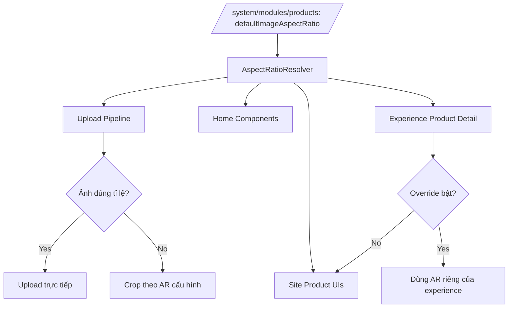

## Audit Summary
- **Observation:** Hiện tại AR ảnh sản phẩm đang bị phân tán: `product-detail` có AR riêng (experience setting), upload crop chỉ hỗ trợ `1:1`, nhiều UI khác hardcode `aspect-square`/`aspect-[4/3]`.
- **Inference:** Chưa có contract dùng chung toàn hệ thống nên khó đồng bộ khi đổi AR; upload và render đang lệch logic.
- **Decision:** Đưa **module products** thành nguồn mặc định duy nhất (global default), các bề mặt khác được **override riêng** nếu cần; rollout **áp chung ngay** cho toàn bộ ảnh sản phẩm như anh đã chọn.

## Root Cause Confidence
- **High** — vì đã có evidence rõ ở các điểm chính:
  - `lib/modules/configs/products.config.ts`: mới có `enableImageCrop` dạng 1:1.
  - `lib/image/uploadPipeline.ts`: chỉ có `cropImageToSquare`.
  - `app/system/experiences/product-detail/page.tsx` + `components/site/products/detail/_lib/image-aspect-ratio.ts`: AR riêng cho product-detail.
  - `app/(site)/products/page.tsx`, `components/experiences/previews/ProductDetailPreview.tsx`, các preview home-components: nhiều chỗ hardcode tỉ lệ.

## TL;DR kiểu Feynman
- Ta sẽ chọn **1 nơi duy nhất** lưu AR mặc định: `/system/modules/products`.
- Mặc định toàn site dùng AR này; chỗ nào cần khác thì bật override riêng.
- Upload ảnh sẽ kiểm tra tỉ lệ: đúng thì upload thẳng, lệch thì crop theo AR đang cấu hình (không còn cố định 1:1).
- Các UI nhiều nơi (products page, related products, home-components, preview) sẽ đọc chung AR để đồng bộ.
- Ảnh cũ giữ nguyên; chỉ ảnh upload mới áp rule crop mới.

## Elaboration & Self-Explanation
Hiện hệ thống giống như mỗi phòng tự dùng một loại thước đo ảnh: nơi dùng 1:1, nơi 4:3, nơi cho chỉnh riêng. Khi đổi quy chuẩn thì chỗ đúng chỗ sai, gây lệch UX. Hướng xử lý là đặt một “thước chuẩn” ở module Products (global default). Tất cả nơi hiển thị ảnh sản phẩm sẽ đọc thước này trước. Nếu một màn hình đặc biệt cần khác (ví dụ layout hero riêng), nó có thể override nhưng mặc định vẫn quay về chuẩn chung. Với upload cũng tương tự: thay vì chỉ crop vuông, ta crop theo đúng thước chuẩn đang chọn (1:1, 4:5, 3:4, 2:3, 3:2, 4:3, 16:9). Nhờ vậy dữ liệu mới tạo ra sẽ nhất quán với cách render.

## Concrete Examples & Analogies
- **Ví dụ trong repo:** Admin đổi AR mặc định thành `3:2` ở `/system/modules/products`.
  - `/products` grid/list và related products trong product detail sẽ render khung `3:2`.
  - Home components hiển thị sản phẩm cũng dùng `3:2` mặc định.
  - Khi upload ảnh mới: nếu ảnh đã đúng `3:2` thì upload ngay; nếu lệch thì crop theo khung `3:2`.
- **Analogy đời thường:** Giống quy định cỡ ảnh thẻ trong toàn công ty: HR ban hành 1 chuẩn, các phòng ban dùng theo chuẩn đó; chỉ tài liệu đặc biệt mới xin ngoại lệ.

## Files Impacted
### Shared / config
- **Sửa:** `lib/modules/configs/products.config.ts`  
  Vai trò hiện tại: khai báo settings module Products.  
  Thay đổi: thêm setting `defaultImageAspectRatio` (select) với các option: `1:1, 4:5, 3:4, 2:3, 3:2, 4:3, 16:9`; giữ `1:1` là mặc định.

- **Thêm:** `lib/products/image-aspect-ratio.ts`  
  Vai trò hiện tại: chưa có file chuẩn dùng chung toàn app cho AR sản phẩm.  
  Thay đổi: tạo source constants/types/map CSS ratio + parser + helper so sánh ratio để dùng chung upload/render.

- **Sửa:** `lib/image/uploadPipeline.ts`  
  Vai trò hiện tại: pipeline xử lý upload + crop vuông 1:1.  
  Thay đổi: tổng quát hoá crop theo AR bất kỳ (không chỉ square), thêm check “đúng tỉ lệ thì skip crop”, vẫn giữ backward compatibility cho flow cũ.

### Admin upload surfaces
- **Sửa:** `app/admin/components/ImageUpload.tsx`  
  Vai trò hiện tại: upload 1 ảnh, crop dialog 1:1 khi bật.  
  Thay đổi: nhận `cropAspectRatio` động từ module setting, đổi label/logic crop từ “vuông 1:1” thành “theo AR cấu hình”.

- **Sửa:** `app/admin/components/MultiImageUploader.tsx`  
  Vai trò hiện tại: upload nhiều ảnh, crop 1:1 khi bật.  
  Thay đổi: dùng AR động + skip crop nếu ảnh đúng tỉ lệ, crop theo AR nếu lệch.

- **Sửa:** `app/admin/products/create/page.tsx`  
  Vai trò hiện tại: đọc `enableImageCrop` và truyền `enableSquareCrop`.  
  Thay đổi: đọc thêm `defaultImageAspectRatio`, truyền xuống uploader dưới dạng AR chuẩn.

- **Sửa:** `app/admin/products/[id]/edit/page.tsx`  
  Vai trò hiện tại: tương tự create.  
  Thay đổi: tương tự create để đồng bộ upload flow.

### Site / experiences / home components
- **Sửa:** `app/(site)/products/page.tsx`  
  Vai trò hiện tại: nhiều card dùng `aspect-square`/kích thước cố định.  
  Thay đổi: đọc AR mặc định module products và áp cho product cards (grid/list/catalog), đảm bảo đồng nhất.

- **Sửa:** `app/(site)/products/[slug]/page.tsx`  
  Vai trò hiện tại: product detail có AR từ experience, related products đang vuông.  
  Thay đổi: thêm resolver `module default + override riêng`; related products cũng theo resolver để đồng bộ.

- **Sửa:** `app/system/experiences/product-detail/page.tsx`  
  Vai trò hiện tại: tự lưu `imageAspectRatio` riêng.  
  Thay đổi: thêm cơ chế **inherit module default** (mặc định), chỉ dùng AR riêng khi bật override.

- **Sửa:** `components/experiences/previews/ProductDetailPreview.tsx`  
  Vai trò hiện tại: preview dùng AR truyền vào, related products đang vuông.  
  Thay đổi: nhận AR sau resolver và áp đồng bộ cả related section.

- **Sửa:** `components/site/ProductListSection.tsx`, `components/site/HomepageCategoryHeroSection.tsx` (và các product home sections liên quan)  
  Vai trò hiện tại: render ảnh sản phẩm ở home surfaces, nhiều chỗ hardcode ratio.  
  Thay đổi: thay hardcode ratio bằng helper/resolver AR mặc định module products.

- **Sửa:** `app/admin/home-components/product-list/_components/ProductListPreview.tsx`, `app/admin/home-components/category-products/_components/CategoryProductsPreview.tsx` (và preview tương tự)  
  Vai trò hiện tại: preview hardcode 1:1/4:3.  
  Thay đổi: preview đọc cùng AR mặc định để admin thấy đúng với site runtime.

## Execution Preview
1. Chuẩn hoá model AR dùng chung (type/options/map/helper) ở shared lib.
2. Bổ sung setting global AR trong products module config.
3. Nâng upload pipeline + uploader components sang crop theo AR động + skip crop nếu ảnh đã đúng tỉ lệ.
4. Wiring create/edit product để truyền AR module vào uploader.
5. Thêm resolver `module default -> optional override` cho product detail experience/site.
6. Áp AR resolver cho products page, related products, home-components runtime + preview.
7. Static self-review null-safety/backward compatibility; chạy `bunx tsc --noEmit` trước commit (không chạy lint/unit theo guideline repo).

## Verification Plan
- **Typecheck:** `bunx tsc --noEmit` sau khi hoàn tất code TS.
- **Repro checklist thủ công:**
  1. Đổi AR mặc định tại `/system/modules/products` qua từng giá trị trong danh sách.
  2. Upload ảnh mới ở create/edit product: ảnh đúng ratio phải upload thẳng; ảnh lệch ratio phải crop theo ratio đang set.
  3. Kiểm tra `/products`, `/products/[slug]` (main + related), home-components preview/runtime đồng bộ khung ảnh.
  4. Bật override ở product-detail experience: chỉ màn này đổi AR, các nơi khác vẫn dùng module default.
- **Pass/Fail:** pass khi toàn bộ surface ảnh sản phẩm mặc định theo module AR, override hoạt động độc lập, và không vỡ data cũ.

## Acceptance Criteria
- Có setting global AR trong `/system/modules/products` với đúng 7 lựa chọn và default `1:1`.
- Upload ảnh sản phẩm mới hỗ trợ crop theo AR cấu hình, không còn cố định 1:1.
- Nếu ảnh upload đã đúng AR cấu hình thì không ép crop lại.
- Các surface ảnh sản phẩm chính (products page, product detail, related products, home-components có ảnh sản phẩm + preview) dùng AR mặc định thống nhất.
- Product detail vẫn có override riêng; mặc định inherit từ module.
- Ảnh cũ không bị biến đổi dữ liệu; chỉ ảnh upload mới theo rule crop mới.

## Out of Scope
- Không làm migration/crop lại hàng loạt ảnh cũ.
- Không tối ưu media CDN/transforms ngoài phạm vi AR.
- Không thay đổi business logic giá/bán hàng/variant ngoài phần liên quan hiển thị ảnh.

## Risk / Rollback
- **Risk:** đổi AR global có thể làm bố cục một số card chật hơn hoặc cao hơn ở vài breakpoint.
- **Mitigation:** triển khai theo resolver chung + override cục bộ; kiểm tra thủ công các breakpoint chính.
- **Rollback:** revert commit hoặc tạm đưa `defaultImageAspectRatio` về `1:1`; vì thay đổi nhỏ theo từng layer nên rollback dễ.