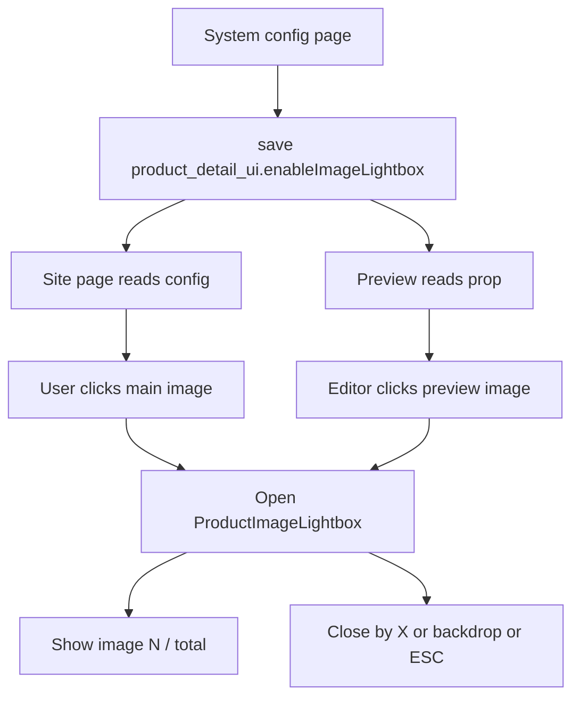

## Audit Summary
- Observation: Trang cấu hình `app/system/experiences/product-detail/page.tsx` đang lưu config chung trong key `product_detail_ui`, với các field global như `imageAspectRatio`, `showAllProductImagesSection`, `showBuyNow`; chỉ một phần config mới nằm trong `layouts` theo từng style.
- Observation: Trang thật `app/(site)/products/[slug]/page.tsx` là nơi render 3 layout product-detail và đang quản lý ảnh theo danh sách chung (`buildProductImages(product)`), nên đây là điểm đúng để mở modal xem ảnh lớn.
- Observation: Preview `components/experiences/previews/ProductDetailPreview.tsx` đã có state ảnh đang chọn và badge kiểu `1/N` ở mobile, nên có thể nối thêm lightbox preview để parity với site.
- Observation: Repo đã có pattern lightbox/modal full-screen trong `components/site/ComponentRenderer.tsx` (GalleryLightbox, CertificateModal): backdrop, click ra ngoài để đóng, nút X, ESC, counter, khóa scroll body.
- Decision: Thêm **1 toggle global dùng chung cho cả 3 layout** để bật/tắt tính năng click ảnh chính mở modal full-screen; khi bật thì áp dụng nhất quán cho site thật và preview, không tạo config riêng cho từng layout.

## Root Cause Confidence
- High — vì evidence cho thấy kiến trúc config hiện tại đã hỗ trợ field global trong `product_detail_ui`, và các pattern modal/lightbox cần thiết đã tồn tại sẵn trong repo; yêu cầu chỉ thiếu wiring + 1 field cấu hình chung.

## TL;DR kiểu Feynman
- Hiện giờ ảnh sản phẩm chỉ hiển thị tại chỗ, chưa có chế độ xem to toàn màn hình.
- Chỗ lưu cấu hình đã có dạng “một setting dùng chung”, nên mình có thể thêm 1 nút bật/tắt cho cả 3 layout cùng lúc.
- Chỗ render trang sản phẩm thật đã có danh sách ảnh, nên chỉ cần thêm state mở modal và biết ảnh nào đang được xem.
- Repo cũng đã có sẵn kiểu modal full màn hình với backdrop, nút X, ESC và số thứ tự ảnh.
- Kế hoạch là tận dụng pattern đó để làm lightbox riêng cho product-detail, rồi nối cả site thật lẫn preview để không bị lệch.

## Elaboration & Self-Explanation
Vấn đề bạn muốn giải quyết là: khi người dùng bấm vào ảnh chính của sản phẩm, họ cần xem ảnh lớn hơn theo kiểu gallery hiện đại, full màn hình, tối nền xung quanh, nhìn rõ ảnh và biết mình đang ở ảnh số mấy trên tổng bao nhiêu ảnh.

Điểm quan trọng là tính năng này không nên cài đặt riêng cho từng layout Classic/Modern/Minimal, vì hành vi xem ảnh là một capability chung của product-detail. Kiến trúc hiện tại của experience product-detail đã đúng hướng cho việc đó: có một object config tổng, trong đó một số field là global áp dụng cho mọi layout. Vì vậy, cách đúng và gọn là thêm một field global mới như `enableImageLightbox`.

Sau đó, ở trang product-detail thật, mỗi layout vẫn giữ cách hiển thị ảnh riêng của nó, nhưng cùng nhận thêm một prop chung kiểu `enableImageLightbox` và `onOpenLightbox(index)`. Khi người dùng bấm ảnh chính, layout chỉ báo cho page biết “hãy mở modal ở ảnh số N”. Còn modal full-screen sẽ do page quản lý tập trung. Cách này tránh copy logic state 3 lần và dễ rollback.

Ở preview cũng làm tương tự để cấu hình trong `/system/experiences/product-detail` phản ánh đúng hành vi thực tế. Như vậy người chỉnh giao diện sẽ thấy ngay: bật option thì click ảnh trong preview mở lightbox, tắt option thì không mở.

## Concrete Examples & Analogies
### Ví dụ cụ thể trong repo
- Nếu `product_detail_ui.enableImageLightbox = true`:
  - User vào `/products/slug-a`
  - Ở layout Classic, bấm ảnh chính thứ 2
  - Mở modal full-screen, hiển thị ảnh 2 trên tổng 10 ảnh, có backdrop tối, nút X, click backdrop để đóng
  - Bấm mũi tên phải thì chuyển sang 3/10
- Nếu `product_detail_ui.enableImageLightbox = false`:
  - Bấm ảnh chính không mở modal, giao diện giữ nguyên như hiện tại

### Analogy đời thường
- Giống như xem ảnh trong app thương mại điện tử lớn: ngoài trang chi tiết sản phẩm thì ảnh chỉ là “cửa sổ nhỏ”, còn khi bấm vào thì mở “phòng trưng bày” toàn màn hình để xem rõ từng ảnh. Cái công tắc bạn muốn thêm chính là bật/tắt “phòng trưng bày” đó cho toàn bộ kiểu trình bày sản phẩm.

## Problem Graph
1. [Main] Thêm lightbox xem ảnh full-screen cho Product Detail <- depends on 1.1, 1.2, 1.3
   1.1 [ROOT CAUSE] Chưa có config global để bật/tắt hành vi click ảnh mở lightbox
   1.2 [Sub] Trang thật và preview chưa có state lightbox dùng chung theo danh sách ảnh
   1.3 [Sub] Chưa tách component modal ảnh riêng cho product-detail dựa trên pattern lightbox có sẵn

## Files Impacted
### UI / experience config
- Sửa: `E:\NextJS\study\admin-ui-aistudio\system-vietadmin-nextjs\app\system\experiences\product-detail\page.tsx`
  - Vai trò hiện tại: trang cấu hình experience product-detail, lưu `product_detail_ui` và truyền props xuống preview.
  - Thay đổi: thêm field global `enableImageLightbox` vào config mặc định/serverConfig/save flow + thêm `ToggleRow` trong nhóm cấu hình hiển thị + truyền prop này xuống `ProductDetailPreview`.

### Site thật
- Sửa: `E:\NextJS\study\admin-ui-aistudio\system-vietadmin-nextjs\app\(site)\products\[slug]\page.tsx`
  - Vai trò hiện tại: render trang product-detail thật cho 3 layout và đọc config experience từ settings.
  - Thay đổi: mở rộng type/config reader để đọc `enableImageLightbox`; thêm state lightbox cấp page; nối click ảnh chính/thumbnails để mở modal; render modal full-screen dùng chung cho cả 3 layout.

### Preview
- Sửa: `E:\NextJS\study\admin-ui-aistudio\system-vietadmin-nextjs\components\experiences\previews\ProductDetailPreview.tsx`
  - Vai trò hiện tại: preview 3 layout trong experience editor với ảnh mock và state ảnh đang chọn.
  - Thay đổi: nhận prop `enableImageLightbox`; thêm preview lightbox parity với site; click ảnh chính mở modal khi toggle bật.

### Shared component
- Thêm: `E:\NextJS\study\admin-ui-aistudio\system-vietadmin-nextjs\components\site\products\detail\_components\ProductImageLightbox.tsx`
  - Vai trò hiện tại: chưa có component lightbox chuyên cho product-detail.
  - Thay đổi: tạo component reusable bám pattern `GalleryLightbox`/`CertificateModal`: full-screen, backdrop, X, ESC, counter `1/N`, arrow điều hướng, lock body scroll.

### Seed / default data
- Sửa: `E:\NextJS\study\admin-ui-aistudio\system-vietadmin-nextjs\convex\seed.ts`
  - Vai trò hiện tại: seed dữ liệu mặc định của hệ thống.
  - Thay đổi: đảm bảo `product_detail_ui` mặc định có field `enableImageLightbox` để dữ liệu mới/cold start không thiếu key.
- Sửa: `E:\NextJS\study\admin-ui-aistudio\system-vietadmin-nextjs\convex\seeders\settings.seeder.ts`
  - Vai trò hiện tại: khai báo setting seed mặc định.
  - Thay đổi: bổ sung field `enableImageLightbox` vào payload seed tương ứng nếu file này đang là nguồn seed thực tế của key `product_detail_ui`.

## Proposal
### Hướng triển khai được recommend
- Option A (Recommend) — Confidence 90%: tạo `ProductImageLightbox` riêng cho product-detail, nhưng mượn UX pattern từ `ComponentRenderer.tsx`.
  - Vì sao tốt nhất: giữ scope nhỏ, không cần refactor component lightbox cũ đang nằm trong file rất lớn; dễ kiểm soát API đúng với use case product-detail; rollback dễ.
  - Tradeoff: có một ít logic UI trùng với lightbox cũ, nhưng đổi lại ít rủi ro hơn việc tách/chung hóa component ở scope rộng.
- Option B — Confidence 65%: refactor `GalleryLightbox` trong `ComponentRenderer.tsx` thành shared component rồi tái dùng cho product-detail.
  - Phù hợp khi muốn chuẩn hóa lightbox trên toàn repo.
  - Tradeoff: scope lớn hơn yêu cầu, dễ phát sinh ảnh hưởng chéo tới các home-component/gallery hiện có.

Tôi recommend Option A vì đúng tinh thần thay đổi nhỏ, dễ rollback, không mở rộng scope ngoài yêu cầu.

## Mermaid

## Execution Preview
1. Đọc kỹ type/config hiện tại ở `app/system/experiences/product-detail/page.tsx`, `app/(site)/products/[slug]/page.tsx`, `ProductDetailPreview.tsx` để match naming/style.
2. Thêm field config global `enableImageLightbox` vào type, default config, server merge, save payload và seed mặc định.
3. Tạo component `ProductImageLightbox` full-screen với props tối thiểu: `images`, `initialIndex/currentIndex`, `open`, `onClose`, `onIndexChange`, `brandColor?` nếu cần.
4. Nối site thật: thêm state lightbox cấp page, pass handler xuống 3 layout, mở lightbox khi click ảnh chính/thumbnails.
5. Nối preview: thêm lightbox mock parity với site và chỉ bật khi toggle global đang on.
6. Tự review tĩnh: typing, null-safety, ảnh rỗng/1 ảnh/nhiều ảnh, backdrop close, ESC, body scroll cleanup.
7. Sau khi bạn duyệt spec và cho phép execute, tôi sẽ implement rồi commit theo rule repo.

## Acceptance Criteria
- Trong `/system/experiences/product-detail` có **1 toggle global** để bật/tắt tính năng xem ảnh full-screen, không nằm trong config riêng từng layout.
- Toggle này khi lưu sẽ áp dụng chung cho Classic, Modern, Minimal ở site thật và preview.
- Khi toggle bật, click ảnh chính của product-detail sẽ mở modal full-screen có backdrop tối.
- Modal có nút X để đóng, click vào backdrop cũng đóng, và `Esc` cũng đóng.
- Modal hiển thị chỉ báo thứ tự ảnh theo dạng `1/10`, `2/10`.
- Khi có nhiều ảnh, user có thể xem ảnh kế tiếp/trước đó trong modal.
- Khi toggle tắt, click ảnh không mở modal.
- Không làm thay đổi cơ chế lưu layout riêng hiện có; field mới chỉ là global trong `product_detail_ui`.

## Verification Plan
- Review tĩnh types và merge logic để chắc field mới không phá dữ liệu cũ thiếu key.
- Repro thủ công sau khi implement:
  1. Bật toggle trong `/system/experiences/product-detail`, lưu.
  2. Kiểm tra preview cả 3 layout: click ảnh chính mở full-screen, có X/backdrop/counter.
  3. Kiểm tra site thật với slug mẫu: cả 3 layout mở lightbox đúng ảnh đang chọn.
  4. Tắt toggle, lưu; xác nhận site + preview không còn mở modal khi click ảnh.
- Theo rule repo trong AGENTS.md: không tự chạy lint/unit test/build; chỉ tự review tĩnh và để tester phụ trách verification runtime/integration.

## Out of Scope
- Không thay đổi zoom/crop logic ảnh ngoài yêu cầu mở modal.
- Không thiết kế thêm gesture swipe/mobile carousel mới nếu hiện tại chưa có.
- Không chuẩn hóa lightbox cho toàn repo ở bước này.

## Risk / Rollback
- Rủi ro chính: wiring click ảnh giữa 3 layout có thể không đồng đều nếu mỗi layout đang giữ selected image khác nhau.
- Giảm rủi ro: đặt state lightbox ở page-level, chỉ truyền callback xuống layout; component modal nhận mảng ảnh normalize sẵn.
- Rollback: bỏ field `enableImageLightbox`, gỡ render `ProductImageLightbox`, giữ nguyên gallery hiện tại; đây là thay đổi cô lập nên rollback đơn giản.

## Post-Audit
- Root cause thay thế đã xem xét: có thể dùng thẳng `Dialog` shadcn thay vì lightbox custom, nhưng phương án đó không tối ưu cho gallery full-screen nhiều ảnh và counter kiểu e-commerce.
- Quyết định cuối: giữ modal theo pattern lightbox chuyên biệt sẽ sát best practice SaaS/ecommerce hơn, đồng thời đáp ứng đúng yêu cầu “xem ảnh dễ hơn kiểu 1/10, 2/10”.
