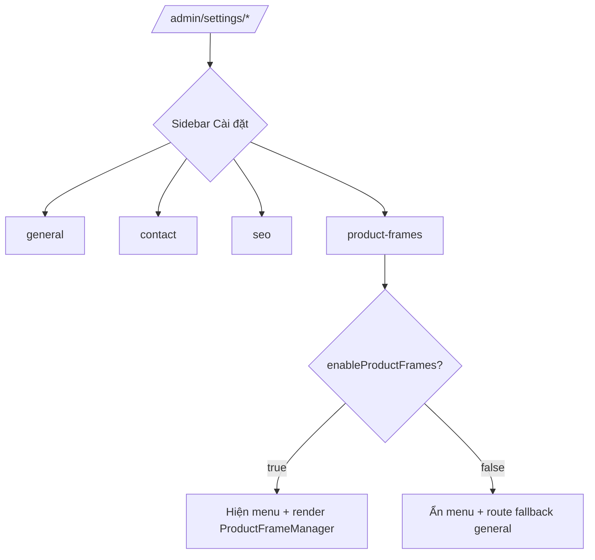

## TL;DR kiểu Feynman
- Hiện tại `/admin/settings` đang gom mọi thứ vào 1 page + tab nên dài và khó quét.
- Mình sẽ tách thành 4 route riêng: `general`, `contact`, `seo`, `product-frames`.
- Sidebar mục **Cài đặt** sẽ đổi sang dạng dropdown chứa đúng 4 mục này.
- Mục **Khung sản phẩm** chỉ hiện khi `enableProductFrames` đang bật ở module products.
- Vùng nội dung settings sẽ nới từ `max-w-4xl` lên `max-w-7xl` để thoáng hơn.

## Audit Summary
**Observation**
1. Triệu chứng: page `app/admin/settings/page.tsx` đang dùng tab nội bộ (`activeTab`, `visibleTabs`) và render toàn bộ field trong 1 route.
2. Phạm vi: ảnh hưởng UI/UX khu vực `/admin/settings` và sidebar admin.
3. Repro ổn định: vào `/admin/settings` luôn thấy layout dồn dọc + tab trong content thay vì tách trang.
4. Mốc thay đổi gần: file hiện tại đã có logic `ProductFrameManager` phụ thuộc `products.enableProductFrames`.
5. Gap dữ liệu đã chốt: bạn đã chọn URL chuẩn và độ rộng mong muốn.
6. Giả thuyết thay thế đã loại trừ: giữ query `?tab=` không phù hợp yêu cầu “dropdown sidebar + 4 trang riêng”.
7. Rủi ro nếu fix sai: đứt navigation cũ `/admin/settings`, mất điều kiện hiển thị khung sản phẩm.
8. Pass/fail: sidebar có 4 trang đúng route, product-frames ẩn/hiện theo setting, layout rộng hơn dễ đọc.

**Decision đã chốt với bạn**
- Route: `/admin/settings/general|contact|seo|product-frames`
- Width: `max-w-7xl`

## Root Cause Confidence
**High** — Nguyên nhân chính nằm ở kiến trúc UI hiện tại: settings đang thiết kế theo tab trong cùng 1 page (không route-based), cộng thêm wrapper `max-w-4xl` làm không gian hiển thị hẹp dù màn rộng.

## Problem Graph
1. [Main] UX settings khó dùng <- depends on 1.1, 1.2, 1.3
   1.1 [Sub] Tab nội bộ trong 1 page (không deep-link, khó điều hướng) <- depends on 1.1.1
      1.1.1 [ROOT CAUSE] Kiến trúc settings chưa tách route theo nhóm
   1.2 [Sub] Sidebar chưa có submenu cho Cài đặt
   1.3 [Sub] Content container hẹp (`max-w-4xl`) trên màn rộng

## Concrete Examples & Analogies
- Ví dụ thực tế trong repo: hiện đang có `activeTab === 'site'` mới render `ProductFrameManager`; sau khi tách route thì logic này chuyển thành route `/admin/settings/product-frames`, tránh phải mở đúng tab mới thấy.
- Analogy đời thường: thay vì để 4 ngăn hồ sơ trong 1 túi rồi lật tab tay, mình đổi thành 4 ngăn tủ riêng có nhãn ngoài cửa (sidebar), mở phát vào đúng ngăn luôn.

## Files Impacted
### UI
- **Sửa:** `app/admin/components/Sidebar.tsx`  
  Vai trò hiện tại: render toàn bộ menu/sidebar admin, có logic điều kiện module/setting.  
  Thay đổi: đổi mục **Cài đặt** thành menu có `subItems` 4 route; item `product-frames` chỉ push vào khi `enableProductFrames=true`.

- **Sửa:** `app/admin/settings/page.tsx`  
  Vai trò hiện tại: page settings monolithic + tab switch nội bộ.  
  Thay đổi: chuyển thành redirect nhẹ sang `/admin/settings/general` để giữ backward compatibility link cũ.

- **Thêm:** `app/admin/settings/_components/SettingsPageShell.tsx` (tên dự kiến)  
  Vai trò hiện tại: chưa có.  
  Thay đổi: tách toàn bộ logic form/save/render field từ page cũ vào component dùng chung, nhận prop `section: 'site'|'contact'|'seo'|'product-frames'` và container `max-w-7xl`.

- **Thêm:** `app/admin/settings/general/page.tsx`  
  Vai trò hiện tại: chưa có route.  
  Thay đổi: render `SettingsPageShell` cho nhóm `site`.

- **Thêm:** `app/admin/settings/contact/page.tsx`  
  Vai trò hiện tại: chưa có route.  
  Thay đổi: render `SettingsPageShell` cho nhóm `contact` (kèm social block như hiện tại).

- **Thêm:** `app/admin/settings/seo/page.tsx`  
  Vai trò hiện tại: chưa có route.  
  Thay đổi: render `SettingsPageShell` cho nhóm `seo`.

- **Thêm:** `app/admin/settings/product-frames/page.tsx`  
  Vai trò hiện tại: chưa có route.  
  Thay đổi: render riêng `ProductFrameManager`; guard ẩn/fallback khi `enableProductFrames=false`.

## Execution Preview
1. Tách logic settings hiện tại thành shell dùng chung (giữ nguyên mutation/query/validation).
2. Tạo 4 route page theo URL bạn chọn, mỗi route truyền đúng `section`.
3. Chuyển `ProductFrameManager` khỏi phụ thuộc tab, sang route riêng có điều kiện bật/tắt module setting.
4. Update Sidebar: mục Cài đặt thành dropdown 4 item, active-state theo pathname.
5. Nới container settings sang `max-w-7xl`, rà lại spacing để tránh dồn trên màn rộng.
6. Tạo redirect từ `/admin/settings` -> `/admin/settings/general`.
7. Self-review tĩnh (typing/null-safety/pathname guards), không chạy lint/unit theo quy ước repo.

## Acceptance Criteria
- Truy cập `/admin/settings/general`, `/contact`, `/seo`, `/product-frames` đều vào đúng trang.
- Sidebar hiển thị mục **Cài đặt** dạng dropdown với đúng 4 item.
- Item **Khung sản phẩm** chỉ xuất hiện khi `System > Modules > Products > enableProductFrames = true`.
- `/admin/settings` tự chuyển về `/admin/settings/general`.
- Layout settings dùng `max-w-7xl`, giao diện thoáng hơn, không còn cảm giác dồn cột hẹp.
- Luồng lưu settings hiện có không đổi behavior (dữ liệu save và validation giữ nguyên).

## Verification Plan
- Repro thủ công theo từng route settings và trạng thái bật/tắt `enableProductFrames`.
- So sánh trước/sau ở 3 điểm: navigation, visibility khung sản phẩm, độ rộng layout.
- Static review: kiểm tra type, null-check query Convex, điều kiện active menu, fallback redirect.
- Theo quy ước repo trong `AGENTS.md`: không chạy lint/unit/build tự động.

## Out of Scope
- Không đổi schema Convex, không thêm field setting mới.
- Không redesign component form field ngoài việc tách route và nới chiều rộng.

## Risk / Rollback
- Rủi ro chính: sót active state sidebar hoặc route fallback khi product-frames bị tắt.
- Rollback nhanh: trả Sidebar về link đơn `/admin/settings` + restore page tab cũ (1 file chính + route files mới có thể remove).