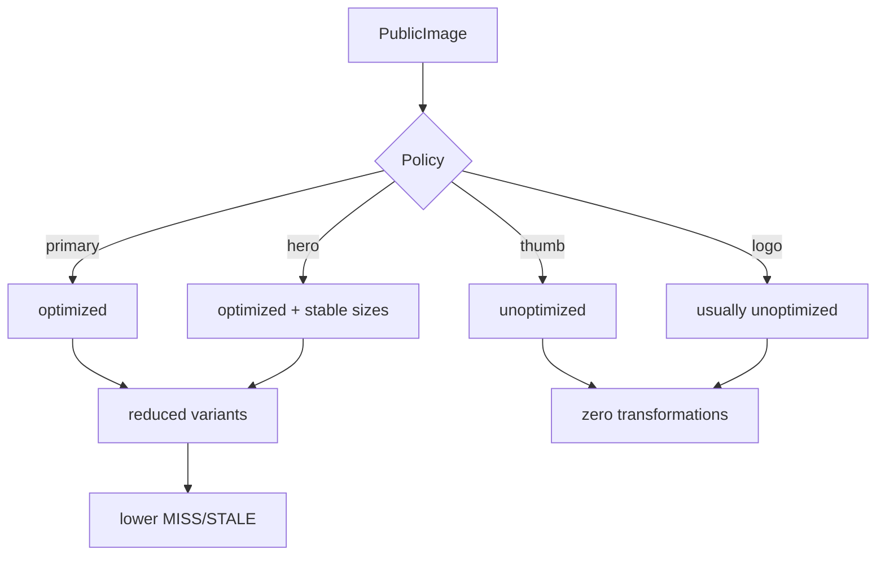

## TL;DR kiểu Feynman
- Ưu tiên public theo yêu cầu: **PLP/PDP + search autocomplete** vì đốt quota lớn nhất.
- Theo pattern SaaS lớn: **thumbnail nhỏ tắt optimize**, ảnh chính giữ optimize.
- Giữ chất lượng cao, giảm quota vừa phải bằng cách **chuẩn hoá sizes** và giảm biến thể.
- Không đụng realtime Convex trong vòng này.

## Audit Summary
### Observation
1. Public dùng `next/image` dày ở `app/(site)/products/page.tsx`, `app/(site)/products/[slug]/page.tsx`, `components/site/HeaderSearchAutocomplete.tsx`, `components/site/BlogSection.tsx`, `components/site/Header.tsx`.
2. Nhiều layout/style khác nhau → nhiều `sizes` khác nhau → tăng transformations/cache writes.
3. Thumbnail rất nhỏ (36x36/64px) vẫn đi qua optimizer.

### Inference
- Cắt optimize ở thumbnail nhỏ sẽ giảm quota nhanh nhất mà ít ảnh hưởng UX.
- Chuẩn hoá `sizes` cho card/list/hero giảm cache churn.

### Decision
Triển khai nhanh 1 lần theo 3 lớp:
1) Thumbnail nhỏ: **unoptimized**.
2) PLP/PDP ảnh chính: **optimized** + `sizes` ổn định.
3) Blog/home/logo: tối ưu chọn lọc theo tác động.

## Root Cause Confidence
**High** — nhiều callsite `next/image` + `sizes` đa dạng ở public khiến quota tăng theo mỗi biến thể ảnh.

## Elaboration & Self-Explanation
Ảnh public hiện đang bị “đối xử ngang nhau”. SaaS lớn thường phân nhóm ảnh: hero/primary (giữ optimize), thumbnail/rail (tắt optimize). Làm vậy giảm transformations mà cảm giác premium vẫn giữ ở vùng quan trọng.

## Concrete Examples & Analogies
- `HeaderSearchAutocomplete.tsx`: ảnh 36x36 → tắt optimize, user gần như không thấy khác biệt nhưng quota giảm rõ.
- `products/[slug]/page.tsx`: ảnh chính và gallery đầu trang giữ optimize.
- Analogy: khách sạn 5 sao — sảnh chính dùng đồ xịn, kho hậu cần dùng đồ bền/rẻ.

## Problem Graph
1. [Quota public cao] <- depends on 1.1, 1.2
   1.1 [Thumbnail nhỏ vẫn optimize] <- 1.1.1
      1.1.1 [ROOT CAUSE] Search/list/rail chưa có policy riêng
   1.2 [PLP/PDP nhiều biến thể size] <- 1.2.1
      1.2.1 `sizes` chưa chuẩn hoá theo component family

## Files Impacted
### Shared
- **Thêm:** `components/shared/PublicImage.tsx` — wrapper policy `hero|primary|thumb|logo|decorative`.
- **Sửa:** `next.config.ts` — cân nhắc `deviceSizes/imageSizes` gọn hơn để giảm biến thể.

### Public critical
- **Sửa:** `app/(site)/products/page.tsx` — card/list nhỏ dùng `thumb` unoptimized.
- **Sửa:** `app/(site)/products/[slug]/page.tsx` — hero/gallery chính giữ optimize; rail thumbnail tắt optimize.
- **Sửa:** `components/site/HeaderSearchAutocomplete.tsx` — thumbnail tắt optimize.

### Public secondary
- **Sửa:** `components/site/BlogSection.tsx` — featured giữ optimize, card nhỏ tắt optimize.
- **Sửa:** `components/site/Header.tsx` — logo policy `logo` (thường unoptimized).
- **Sửa:** `components/site/ProductListSection.tsx`, `components/site/HomepageCategoryHeroSection.tsx`, `components/site/home/sections/HeroRuntimeSection.tsx` — phân loại ảnh chính/phụ.

## Execution Preview
1. Tạo `PublicImage` wrapper policy.
2. Áp dụng cho PLP/PDP/search trước.
3. Chuẩn hoá `sizes` theo family card/list/hero.
4. Cắt optimize thumbnail/rail/logo.
5. Mở rộng sang blog/home.
6. Review tĩnh tránh vỡ layout.

## Data flow

## Verification Plan
- Dashboard Vercel: Transformations/day, Cache Writes/day.
- Manual UX check: PLP/PDP/search/blog/home.

## Acceptance Criteria
- Thumbnail nhỏ không còn là nguồn đốt transformations chính.
- PLP/PDP vẫn giữ cảm giác premium.
- Quota public giảm rõ rệt.

## Out of Scope
- Không đụng realtime Convex.
- Không đổi upload pipeline backend.

## Risk / Rollback
- Rủi ro: ảnh card lớn nếu tắt optimize sai chỗ sẽ giảm chất lượng.
- Rollback: đổi policy từng mode trong `PublicImage`.

Nếu anh duyệt plan này, em sẽ triển khai theo đúng thứ tự ưu tiên **PLP/PDP + search autocomplete** trước.