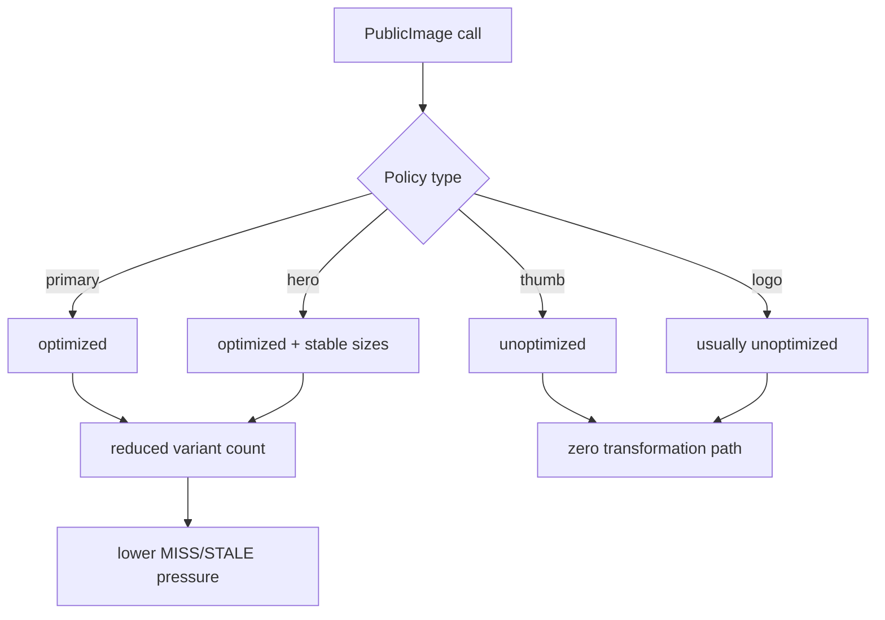

## TL;DR kiểu Feynman
- Public đang nên ưu tiên tối ưu ở **PLP/PDP + search autocomplete** vì đây là nơi ảnh xuất hiện nhiều và lặp nhiều nhất.
- Theo pattern của các SaaS lớn, không phải ảnh nào cũng đáng đi qua optimizer: **thumbnail nhỏ** nên bỏ optimize, ảnh chính mới giữ optimize.
- Mục tiêu phù hợp với yêu cầu của anh là: **giữ chất lượng cao, giảm quota vừa phải**, không hy sinh cảm giác premium.
- Cách thắng lớn nhất là giảm số lần tạo biến thể ảnh: chuẩn hoá `sizes`, tách policy ảnh nhỏ/ảnh chính, và tránh optimize cho thumbnail phụ.
- Không cần đụng realtime Convex trong vòng này; bottleneck vẫn là image transformations/cache writes.

## Audit Summary
### Observation
1. `next.config.ts` hiện mới khai báo `remotePatterns`, chưa có policy phân tầng cho public image theo loại component.
2. Public dùng `next/image` dày đặc ở các điểm đốt quota mạnh:
   - `app/(site)/products/page.tsx` có nhiều grid/list card với `fill` + `sizes` khác nhau.
   - `app/(site)/products/[slug]/page.tsx` có gallery, mobile carousel, thumbnail rail, full image list — rất dễ tạo nhiều transformations.
   - `components/site/HeaderSearchAutocomplete.tsx` dùng thumbnail 36x36 nhưng vẫn đi qua `next/image` optimize.
   - `components/site/BlogSection.tsx` có nhiều style/layout khác nhau, mỗi style sinh thêm nhiều size ảnh.
   - `components/site/Header.tsx` logo site đang qua `next/image`, nhưng logo thường không cần optimizer mạnh nếu asset ổn định.
3. `app/layout.tsx` đang `revalidate = 60`, tức phần root khá tươi, nhưng bản thân quota image vẫn chủ yếu bị quyết định bởi cache MISS/STALE của ảnh chứ không chỉ bởi HTML revalidate.
4. Từ best practice của các hệ thống SaaS/resource-constrained: họ thường phân nhóm ảnh thành `hero / primary media / thumbnail / decorative`, chỉ giữ optimizer cho nhóm đầu.

### Inference
- ROI cao nhất là **tách image policy theo intent**, không tối ưu “đồng đều”.
- `PLP/PDP/search` là nơi cần xử lý đầu tiên vì vừa traffic cao vừa có nhiều ảnh lặp theo session.
- Thumbnail nhỏ và rail ảnh phụ là nơi nên cắt transformations gần như ngay lập tức.

### Decision
Triển khai nhanh một lần theo 3 lớp:
1. **Thumbnail nhỏ public**: tắt optimize.
2. **PLP/PDP ảnh chính**: vẫn optimize nhưng chuẩn hoá `sizes` + giảm biến thể.
3. **Homepage/blog/logo/decorative**: tối ưu chọn lọc theo tác động thực tế.

## Root Cause Confidence
**High** — vì evidence trong code cho thấy nhiều callsite `next/image` ở public với nhiều layout/size khác nhau, và yêu cầu quota của Vercel Hobby bị ảnh hưởng trực tiếp bởi cache MISS/STALE trên từng biến thể ảnh.

## Elaboration & Self-Explanation
Nếu nói đơn giản: hiện app đang đối xử gần như mọi ảnh public theo cùng một mức “VIP”. Nhưng thực tế, ảnh product chính trên PDP rất đáng được optimize; còn thumbnail 36x36 trong autocomplete hay thumbnail phụ trong rail ảnh thì không đáng tiêu cùng loại tài nguyên.

Các team SaaS lớn thường không dùng một rule cho tất cả ảnh. Họ chia ảnh thành nhóm:
- Ảnh bán hàng chính: cần đẹp, giữ optimize.
- Ảnh phụ/thumbnail/search result: ưu tiên rẻ và ổn định, thường bỏ optimize hoặc dùng policy rất chặt.
- Ảnh trang trí/logo: nếu file đã đủ tốt và ít thay đổi, không cần để optimizer phải tham gia nhiều.

Mục tiêu ở repo này không phải “giảm quota bằng mọi giá”, mà là **giảm ở chỗ người dùng khó nhận ra nhất**, giữ chất lượng ở chỗ người dùng nhìn kỹ nhất.

## Concrete Examples & Analogies
- `HeaderSearchAutocomplete.tsx`: ảnh 36x36 trong dropdown tìm kiếm. Đây là trường hợp textbook của việc **tắt optimize** vì ảnh quá nhỏ, người dùng không phân biệt được chất lượng chênh lệch, nhưng quota vẫn bị đốt.
- `products/[slug]/page.tsx`: ảnh chính sản phẩm và gallery đầu trang nên vẫn optimize vì đây là vùng quyết định cảm nhận chất lượng sản phẩm.
- Analogy: giống một khách sạn 5 sao — sảnh chính cần đèn đẹp và nội thất xịn, nhưng kho hậu cần thì không cần dùng cùng loại đèn trang trí đắt tiền.

## Problem Graph
1. [Quota public cao] <- depends on 1.1, 1.2, 1.3
   1.1 [Thumbnail nhỏ vẫn optimize] <- depends on 1.1.1
      1.1.1 [ROOT CAUSE] Search/list/rail ảnh nhỏ chưa có policy riêng
   1.2 [PLP/PDP sinh nhiều biến thể size] <- depends on 1.2.1
      1.2.1 `sizes` chưa được chuẩn hoá theo component family
   1.3 [Layout đa style tạo cache churn] <- depends on 1.3.1
      1.3.1 Blog/home sections dùng nhiều pattern ảnh khác nhau nhưng chưa gom policy

## Files Impacted
### Shared
- **Thêm:** `components/shared/PublicImage.tsx` — Vai trò hiện tại: chưa có; Thay đổi: tạo wrapper policy cho public image với mode `hero | primary | thumb | logo | decorative`.
- **Sửa:** `next.config.ts` — Vai trò hiện tại: cấu hình image domains; Thay đổi: cân nhắc bổ sung `deviceSizes`/`imageSizes` gọn hơn để giảm số biến thể phát sinh.

### UI - Public critical
- **Sửa:** `app/(site)/products/page.tsx` — Vai trò hiện tại: PLP nhiều grid/list card; Thay đổi: thumbnail card chuyển policy `thumb`, giữ `primary` cho card lớn nếu cần.
- **Sửa:** `app/(site)/products/[slug]/page.tsx` — Vai trò hiện tại: PDP/gallery/lightbox/mobile carousel; Thay đổi: giữ optimize cho hero/gallery chính, bỏ optimize cho rail thumbnail và ảnh phụ nhỏ.
- **Sửa:** `components/site/HeaderSearchAutocomplete.tsx` — Vai trò hiện tại: thumbnail search result nhỏ; Thay đổi: chuyển sang `thumb` unoptimized.

### UI - Public secondary
- **Sửa:** `components/site/BlogSection.tsx` — Vai trò hiện tại: nhiều card/list/featured layouts; Thay đổi: thumbnail/list nhỏ dùng `thumb`, featured image giữ optimize.
- **Sửa:** `components/site/Header.tsx` — Vai trò hiện tại: logo/header branding; Thay đổi: logo sang policy `logo`, thường unoptimized nếu asset ổn định.
- **Sửa:** `components/site/ProductListSection.tsx`, `components/site/HomepageCategoryHeroSection.tsx`, `components/site/home/sections/HeroRuntimeSection.tsx` — Vai trò hiện tại: section public nhiều ảnh; Thay đổi: phân tách ảnh chính vs ảnh phụ để dùng policy đúng.

## Execution Preview
1. Tạo `PublicImage` wrapper với policy rõ ràng.
2. Áp dụng ngay cho `PLP/PDP/search autocomplete` theo ưu tiên anh chọn.
3. Chuẩn hoá `sizes` cho family card/list/hero để tránh mỗi chỗ một kiểu.
4. Cắt optimize ở thumbnail nhỏ/rail phụ/logo.
5. Mở rộng sang blog/home sections theo cùng policy.
6. Review tĩnh để tránh vỡ layout hoặc mismatch prop.

## Data flow

## SaaS-style engineering rules áp vào repo này
1. **Thumbnail is cheap path** — ảnh nhỏ không đi vào expensive pipeline.
2. **One component family, one size contract** — cùng loại card phải dùng cùng contract `sizes`.
3. **Hero earns optimization** — chỉ vùng quan trọng mới được “xài quota”.
4. **Stable inputs reduce cache churn** — ít variation width/ratio hơn thì ít transformations hơn.
5. **Decorative assets should be boring** — logo, icon-like image, tiny avatar nên đi đường rẻ.

## Verification Plan
- So sánh trước/sau trên Vercel dashboard:
  - Image Transformations/day
  - Cache Writes/day
  - Nếu có thể, đối chiếu các route: `/products`, `/products/[slug]`, search flow.
- Kiểm tra UX thủ công:
  - PLP grid/list: ảnh card vẫn sắc nét đủ dùng.
  - PDP: ảnh chính sản phẩm vẫn premium, thumbnail rail mượt.
  - Search autocomplete: dropdown mở nhanh, ảnh nhỏ không lỗi.
  - Blog/home: featured image vẫn đẹp, card nhỏ không degrade rõ rệt.
- Review kỹ HTML/layout để tránh CLS hoặc vỡ aspect ratio.

## Acceptance Criteria
- Thumbnail nhỏ public không còn là nguồn đốt transformations chính.
- PLP/PDP vẫn giữ cảm giác cao cấp, không bị “ngu” như yêu cầu.
- Tổng tốc độ tiêu hao quota image trên public giảm rõ rệt, đặc biệt ở search + list-heavy routes.
- Codebase có một policy ảnh public thống nhất, dễ mở rộng về sau.

## Out of Scope
- Không đụng realtime Convex trong vòng này.
- Không redesign UI/UX ngoài image policy.
- Không thay đổi upload pipeline backend ở vòng đầu nếu chưa thật sự cần.

## Risk / Rollback
- Rủi ro: nếu cắt optimize quá tay ở một số card ảnh lớn, cảm giác visual có thể giảm nhẹ.
- Rollback: `PublicImage` wrapper cho phép đổi từng mode từ `unoptimized` sang `optimized` rất nhanh mà không phải sửa logic phân tán.

Nếu anh duyệt plan này, bước implement hợp lý nhất sẽ là: **`HeaderSearchAutocomplete` + `PLP` + `PDP thumbnail rail` trước**, vì đây là combo giảm quota tốt nhất với rủi ro UX thấp nhất.