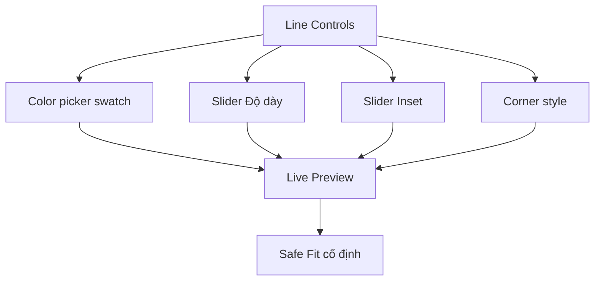

## TL;DR kiểu Feynman
- Bỏ hẳn `Contain/Cover`, cố định `Safe Fit` để khung không phạm vào ảnh.
- Tối giản chữ ở form line: đổi label ngắn + thêm hint trực quan ngay cạnh preview.
- Màu line đổi sang color picker có ô nhìn màu thật (không chỉ text hex).
- Inset/Độ dày/Corner style phải thấy hiệu ứng ngay tức thì trên preview lớn.
- Sửa lại logic `sharp` vs `ornamental` để nhìn khác biệt rõ, không bị “như nhau”.

## Audit Summary
### Observation
1. Từ screenshot bạn gửi: `Contain` và `Cover` cho kết quả gần như tương đương, vẫn xấu và khó hiểu mục đích.
2. “Màu line” hiện nhập text nên không trực quan.
3. Inset, độ dày, corner style thiếu feedback rõ ràng; user không hiểu inset tác động vùng nào.
4. `sharp` và `ornamental-light` đang khác biệt yếu (ornamental chỉ dash nhẹ), khó nhận biết bằng mắt.
5. Trang đang có quá nhiều chữ kỹ thuật; microcopy chưa thân thiện cho người thao tác nhanh.
6. Yêu cầu mới đã chốt: **bỏ fit mode**, ưu tiên preview tức thì + controls rõ nghĩa.

### Root Cause Confidence
**High** — vấn đề chính nằm ở mapping UI-control ↔ visual feedback chưa đủ mạnh, không phải do thiếu tính năng.

## Elaboration & Self-Explanation
Bạn đang gặp đúng pain phổ biến: có nhiều thông số nhưng UI không “dạy” user thấy tác động ngay. Cách sửa là biến các thông số thành thao tác trực quan:
- Color: chọn màu là thấy line đổi ngay.
- Thickness: kéo slider là đường viền dày/mỏng ngay.
- Inset: kéo slider là khung tiến vào/ra rõ ràng.
- Corner style: mỗi style phải khác hình học thật sự (không chỉ dash nhẹ).
Đồng thời bỏ `contain/cover` để tránh decision vô nghĩa, luôn render theo safe-fit để hình đẹp ổn định.

## Concrete Examples & Analogies
- Ví dụ cụ thể: `Inset 0%` = line sát mép ngoài; `Inset 8%` = line lùi sâu vào trong, phần ảnh không bị line đè viền mép.
- Analogy: như app chỉnh ảnh trên điện thoại — thanh trượt nào cũng có preview tức thì, không cần đọc mô tả dài.

## Files Impacted
### UI
- **Sửa:** `app/admin/settings/_components/ProductFrameManager.tsx`  
  Vai trò hiện tại: form line + preview + cài đặt chung.  
  Thay đổi: bỏ dropdown fit mode; chuyển controls line sang compact UI (color swatch/picker + slider inset/độ dày + label ngắn); thêm live preview lớn, hiển thị giá trị trực quan (%/px).

- **Sửa:** `components/shared/ProductImageFrameBox.tsx`  
  Vai trò hiện tại: render overlay line/logo/custom với `overlayFit` truyền vào.  
  Thay đổi: bỏ phụ thuộc `overlayFit` ở flow admin settings (fixed safe-fit), tăng khác biệt corner style (`sharp` vuông cứng, `rounded` bo tròn, `ornamental` có pattern góc/độ ngắt rõ hơn).

- **Sửa:** `lib/products/product-frame.ts`  
  Vai trò hiện tại: định nghĩa type/preset liên quan frame.  
  Thay đổi: chuẩn hóa naming/label style cho dễ hiểu ở UI (nếu cần map hiển thị), giữ type contract ổn định.

## Execution Preview
1. Gỡ control `Contain/Cover` khỏi product-frames page, fixed Safe Fit trong preview/render.
2. Refactor khối line form: giảm text, thêm color input + hex sync, slider `Độ dày (px)` + `Inset (%)`.
3. Bổ sung legend ngắn cho inset (sát mép ↔ vào trong).
4. Nâng cấp rendering corner style trong `ProductImageFrameBox` để 3 style khác nhau rõ.
5. Rà lại preview line realtime khi thay đổi input (không cần save mới thấy).
6. Static self-review: type/null-safety, không đổi contract mutation.

## Acceptance Criteria
- Không còn mục `Contain/Cover` trên UI.
- Màu line chọn bằng control nhìn màu trực tiếp (có swatch/color input).
- Inset và độ dày thay đổi là preview cập nhật tức thì, dễ nhìn rõ.
- `sharp` và `ornamental` nhìn khác biệt rõ trên cùng một ảnh preview.
- Khung line không phạm vào ảnh theo tiêu chí Safe Fit cố định.
- UI chữ ngắn gọn hơn, thao tác nhanh hơn cho user.

## Verification Plan
- Repro thủ công trên `/admin/settings/product-frames` với ít nhất 1 sản phẩm có ảnh.
- Kiểm tra 3 ca: đổi màu, đổi độ dày, đổi inset và quan sát preview realtime.
- Kiểm tra so sánh visual giữa `sharp/rounded/ornamental` trên cùng config còn lại.
- Kiểm tra không còn control fit mode trong màn hình.
- Theo AGENTS.md: không chạy lint/unit/build.

## Out of Scope
- Không đổi schema Convex.
- Không thêm loại khung mới.

## Risk / Rollback
- Rủi ro: nếu style ornamental làm quá mạnh có thể “lòe loẹt”.
- Rollback: revert riêng `ProductFrameManager.tsx` + `ProductImageFrameBox.tsx` để quay về baseline nhanh.