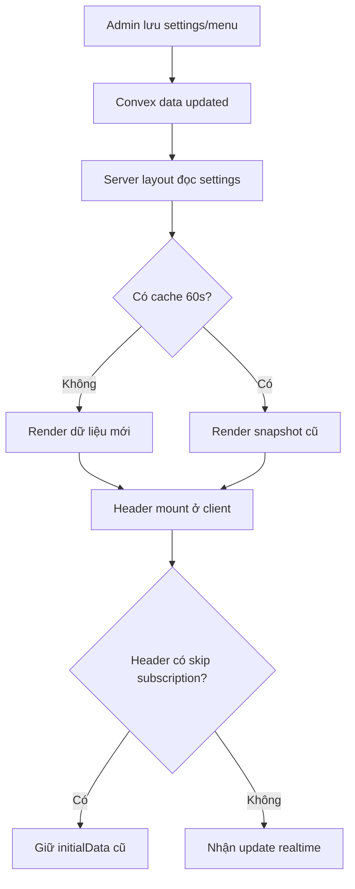

## Audit Summary
- Observation: repo hiện tại đang cache phần public shell ở cả `app/layout.tsx` và `app/(site)/layout.tsx` với `revalidate = 60`.
- Observation: `lib/get-settings.ts` đang dùng `cache(...)` của React để gom `getPublicSettings`, nên site/seo/contact/social có thể bị giữ snapshot trên server.
- Observation: `components/site/Header.tsx` đang `useQuery(..., 'skip')` khi đã có `initialData`, tức là lúc SSR đã có dữ liệu thì client không subscribe realtime cho menu/header/contact/module flags.
- Observation: repo tham chiếu `E:\NextJS\job\kdc` đã xử lý đúng vấn đề này ở 2 commit ngày 2026-04-10, trọng tâm là `13f02fc feat(site): restore realtime public shell updates`; commit `893bc3d chore(settings): remove unused normalizers` chỉ là cleanup nhỏ đi kèm.
- Inference: nguyên nhân chính không phải chi phí subscription, mà là trải nghiệm “đã lưu nhưng web chưa đổi ngay” làm khách non-tech hiểu là hệ thống lỗi.
- Decision: áp pattern kdc gần như 1-1 cho 5 file tương đương trong repo hiện tại, ưu tiên realtime cho public shell thay vì tối ưu cache 60s.

## Root Cause Confidence
- High — vì có evidence trực tiếp ở cả 3 lớp gây stale:
  1. Time-based route cache: `app/layout.tsx`, `app/(site)/layout.tsx`.
  2. Server memoization: `lib/get-settings.ts`.
  3. Client subscription bị skip: `components/site/Header.tsx`.
- Counter-hypothesis đã xem xét: có thể chỉ cần bỏ `revalidate = 60` là đủ. Nhưng không đủ, vì nếu `Header` vẫn skip `useQuery` và `getPublicSettings` vẫn cache thì dữ liệu shell vẫn có thể cũ.

## TL;DR kiểu Feynman
- Hiện tại web giống như ảnh chụp lại mỗi 60 giây, nên vừa lưu xong chưa chắc ngoài site đổi ngay.
- Khách không rành kỹ thuật sẽ nghĩ “sao lưu rồi mà chưa cập nhật”.
- Repo kdc đã sửa bằng cách bỏ ảnh chụp 60 giây và để header luôn nghe dữ liệu mới.
- Em sẽ làm dự án này theo đúng hướng đó: bỏ cache shell, bỏ skip subscription, giữ `initialData` chỉ làm fallback lúc mới render.
- Kết quả mong đợi: đổi logo/menu/contact/module bật-tắt ngoài site phản ánh ngay hơn, không phải chờ 60 giây.

## Elaboration & Self-Explanation
Vấn đề ở đây không phải hệ thống không lưu được, mà là dữ liệu public shell đang đi qua nhiều lớp “giữ tạm” để tiết kiệm request. Mỗi lớp riêng lẻ có vẻ hợp lý, nhưng khi cộng lại thì người dùng sửa trong admin xong vẫn thấy header/menu/logo/contact chưa đổi ngay ngoài site.

Repo kdc đã chứng minh cách xử lý phù hợp với bài toán này: coi public shell là phần cần phản hồi tức thời hơn là phần cần cache 60 giây. Nghĩa là server không giữ snapshot 60 giây cho layout chính nữa, hàm đọc settings không dùng `cache(...)` cho nhóm public settings nữa, và phía client vẫn subscribe Convex bình thường kể cả khi đã có `initialData` từ server. `initialData` chỉ còn vai trò giúp lần render đầu không bị trống.

Nói ngắn gọn: hiện tại mình đang “đưa dữ liệu cũ sẵn có và ngừng nghe cập nhật”; hướng sửa là “vẫn đưa dữ liệu ban đầu để render nhanh, nhưng tiếp tục nghe cập nhật realtime để thay ngay khi admin lưu”.

## Concrete Examples & Analogies
### Ví dụ bám sát repo
- Admin đổi `site_logo` hoặc `contact_phone` trong settings.
- Hiện tại:
  - `app/(site)/layout.tsx` có thể render bằng snapshot 60s.
  - `getPublicSettings()` có thể trả lại object đã cache.
  - `Header.tsx` thấy có `initialData` nên `useQuery(..., 'skip')`, không mở subscription mới.
- Kết quả: ngoài site vẫn hiện logo/số điện thoại cũ một lúc, khách tưởng chưa lưu.
- Sau khi áp pattern kdc:
  - layout shell không giữ cache 60s,
  - getter settings query trực tiếp,
  - Header luôn subscribe,
  - nên thay đổi sẽ nổi ra ngay khi Convex có dữ liệu mới.

### Analogy đời thường
Giống bảng giá điện tử trong cửa hàng:
- Cách cũ: cứ 60 giây nhân viên mới chụp ảnh bảng mới và treo lên.
- Cách mới: bảng được nối trực tiếp với hệ thống, giá đổi là bảng đổi ngay.

## Problem Graph
1. [Main] Public shell cập nhật chậm <- depends on 1.1, 1.2, 1.3
   1.1 [Sub] Route/layout cache 60s <- `app/layout.tsx`, `app/(site)/layout.tsx`
   1.2 [Sub] Public settings bị memoize <- `lib/get-settings.ts`
   1.3 [Sub] Header không subscribe realtime khi có SSR data <- `components/site/Header.tsx`
      1.3.1 [ROOT CAUSE] `useQuery(..., 'skip')` làm mất realtime path

## Files Impacted
### UI / shell
- Sửa: `E:\NextJS\study\admin-ui-aistudio\system-vietadmin-nextjs\app\layout.tsx`
  - Vai trò hiện tại: root layout cấp metadata base, font, provider và đang `revalidate = 60`.
  - Thay đổi: chuyển sang `export const dynamic = "force-dynamic"` theo kdc để root shell/metadata không giữ snapshot 60s.

- Sửa: `E:\NextJS\study\admin-ui-aistudio\system-vietadmin-nextjs\app\(site)\layout.tsx`
  - Vai trò hiện tại: site layout build metadata, preload public settings/menu/module flags rồi truyền `initialHeaderData`.
  - Thay đổi: bỏ `revalidate = 60`; đổi metadata/data loading từ `getPublicSettings()` sang các getter riêng (`getSiteSettings`, `getSEOSettings`, `getContactSettings`, `getSocialSettings` hoặc `getAllPublicSettings` non-cached tùy cách triển khai cuối) để không đi qua aggregate cache cũ; giữ `initialHeaderData` làm fallback SSR.

- Sửa: `E:\NextJS\study\admin-ui-aistudio\system-vietadmin-nextjs\components\site\Header.tsx`
  - Vai trò hiện tại: render header và quyết định subscribe Convex hay skip khi có `initialData`.
  - Thay đổi: bỏ toàn bộ gating `shouldFetch*` + `'skip'` cho menu/header/contact/module flags; luôn gọi `useQuery(...)`; `initialData` chỉ dùng fallback bằng `query ?? initialData`.

- Sửa: `E:\NextJS\study\admin-ui-aistudio\system-vietadmin-nextjs\components\site\SiteShell.tsx`
  - Vai trò hiện tại: defer footer/cart drawer/header interactive ở homepage để tối ưu tải ban đầu.
  - Thay đổi: cân chỉnh theo kdc để tránh defer làm hành vi shell khó đoán; nhiều khả năng chuyển về render trực tiếp `Header`, `CartDrawer`, `DynamicFooter`. Phần này em đánh dấu Medium confidence vì không phải root cause chính, nhưng nên đồng bộ theo commit tham chiếu để giảm nhiễu khi debug realtime.

### Shared settings layer
- Sửa: `E:\NextJS\study\admin-ui-aistudio\system-vietadmin-nextjs\lib\get-settings.ts`
  - Vai trò hiện tại: normalize public settings và đang dùng `cache(...)` cho `getSettingsByKeys` + `getPublicSettings`.
  - Thay đổi: bỏ `cache` import và các wrapper cached; mỗi getter query trực tiếp theo nhóm key; `getAllPublicSettings` ghép từ 4 getter realtime. Có thể giữ lại các hàm normalize đang tồn tại vì repo hiện tại đang dùng tốt, không cần cleanup theo `893bc3d` nếu không thật sự cần.

## Execution Preview
1. Đối chiếu chính xác diff kdc vào 5 file tương đương của repo này.
2. Gỡ `revalidate = 60` ở root/site shell theo pattern realtime-first.
3. Refactor `lib/get-settings.ts` để public settings không còn đi qua React cache.
4. Refactor `Header.tsx` để luôn subscribe Convex và chỉ fallback về `initialData` khi query chưa có.
5. Đồng bộ `SiteShell.tsx` với pattern render trực tiếp nếu cần để tránh defer làm khó quan sát realtime.
6. Tự review tĩnh: typing, null-safety, fallback data cũ, tránh đổi ngoài scope.
7. Tạo commit local sau khi hoàn tất, không push.

## Pre-Audit / 8 câu bắt buộc
1. Triệu chứng: khách lưu settings/menu nhưng site chưa đổi ngay; expected là đổi gần realtime, actual là có độ trễ ~60s hoặc tới khi reload/re-subscribe.
2. Phạm vi ảnh hưởng: public shell của site, đặc biệt header/menu/logo/contact/module flags; ảnh hưởng người dùng cuối và admin đang preview thay đổi.
3. Tái hiện: có thể tái hiện ổn định khi sửa public settings trong admin rồi kiểm tra site ngay sau khi lưu.
4. Mốc thay đổi gần nhất: repo hiện tại đang chủ động đặt `revalidate = 60`; kdc đã bỏ ở commit `13f02fc` ngày 2026-04-10.
5. Dữ liệu thiếu: chưa có metric subscription cost thực tế sau khi bỏ cache; nhưng user đã xác nhận cost không phải nỗi đau chính.
6. Giả thuyết thay thế: có thể do client hooks site settings riêng cũng stale; tuy vậy evidence mạnh nhất hiện nằm ở layout cache + cached getter + skip subscription.
7. Rủi ro fix sai nguyên nhân: tăng request nhưng vẫn stale ở 1 lớp khác, dẫn tới vừa tốn tài nguyên vừa chưa hết complaint.
8. Tiêu chí pass/fail: sau sửa, đổi header/menu/logo/contact/module enable trong admin phải phản ánh ngoài site mà không cần chờ 60s.

## Post-Audit
- Nếu sau khi bỏ 3 lớp stale chính mà vẫn còn chậm, điểm cần audit tiếp theo là các hook client như `useSiteSettings()` hoặc các query trong `DynamicFooter`/component con có đang tự cache/fallback sai không.
- Hiện confidence vẫn High vì mapping repo kdc và repo hiện tại gần như trùng path 1-1.

## Acceptance Criteria
- Pass: không còn `revalidate = 60` ở `app/layout.tsx` và `app/(site)/layout.tsx` cho public shell.
- Pass: `lib/get-settings.ts` không còn dùng `cache(...)` cho public settings path.
- Pass: `Header.tsx` không còn skip `useQuery` chỉ vì có `initialData`.
- Pass: `initialHeaderData` vẫn dùng được làm fallback để tránh blank state lúc đầu.
- Pass: có 1 commit local mô tả việc restore realtime public shell theo pattern kdc.
- Fail: còn bất kỳ lớp cache/skip nào khiến thay đổi shell phải chờ ~60s mới thấy.

## Verification Plan
- Static verify: review diff từng file so với kdc, rà typing/null-safety/fallback data.
- Typecheck: theo rule repo, chỉ chạy `bunx tsc --noEmit` trước commit nếu có thay đổi TS/code.
- Repro thủ công để tester/user xác nhận: đổi logo/menu/contact/header config trong admin rồi refresh hoặc quan sát site; kỳ vọng cập nhật ngay, không chờ 60s.
- Không chạy lint/build vì AGENTS.md của repo cấm.

## Risk / Rollback
- Rủi ro chính: tăng số lần query/subscription cho public shell.
- Tradeoff chấp nhận được trong ngữ cảnh này vì pain lớn hơn là trust issue với khách non-tech.
- Rollback đơn giản: revert commit nếu cần quay lại cache-first behavior.

## Out of Scope
- Không tối ưu subscription cost sâu hơn.
- Không đụng các route content SEO như `features`, `solutions`, `guides` đang có `revalidate` riêng.
- Không refactor rộng ngoài public shell/settings path.

## Proposal
Em đề xuất triển khai đúng pattern của kdc commit `13f02fc`, còn phần cleanup từ `893bc3d` chỉ áp nếu trong lúc sửa thấy thật sự có normalizer dư thừa. Đây là hướng tốt nhất vì bám evidence từ repo anh đưa, đổi ít file, rollback dễ, và giải quyết trực tiếp pain “lưu rồi mà khách chưa thấy cập nhật”.