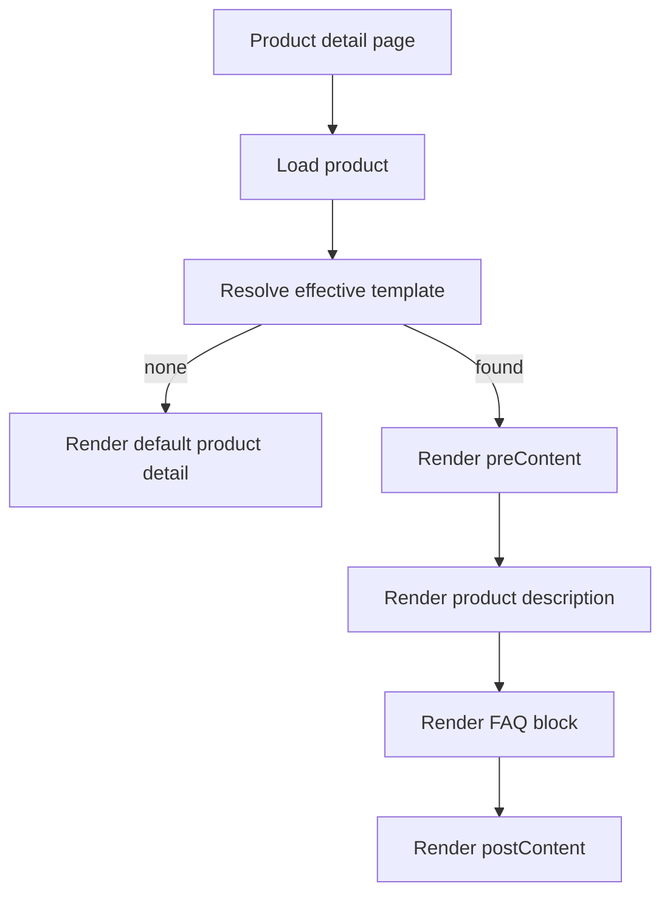

# I. Primer

## 1. TL;DR kiểu Feynman
- Bạn muốn thêm một feature mới cho module `products`: bộ “khung nội dung bổ sung” dùng lại cho nhiều trang chi tiết sản phẩm.
- Mỗi khung nội dung có 3 phần cố định: `nội dung đầu`, `FAQ`, `nội dung cuối`; trong đó FAQ được kéo thả sắp xếp, còn đầu/cuối bị khóa vị trí.
- Feature này phải bật/tắt từ `/system/modules/products`; bật thì hiện form liên quan, tắt thì ẩn hết giống pattern `Phiên bản sản phẩm`.
- Khi bật, admin có thêm 1 trang settings riêng nằm dưới `Khung sản phẩm`, dữ liệu lưu bảng riêng giống `productImageFrames`, không nhét vào từng product.
- Mỗi template có thể áp cho nhiều sản phẩm hoặc nhiều danh mục, nhưng theo rule bạn chốt: `cấm chồng hoàn toàn`, tức một sản phẩm không được match hơn 1 template effective.
- Seed Wizard cần thêm 1 step riêng cho products để hỏi luôn 2 thứ: `Khung viền sản phẩm` và `Nội dung bổ sung`; mặc định cả hai đều tắt.

## 2. Elaboration & Self-Explanation
Bài toán thật sự ở đây không chỉ là “thêm vài field text”, mà là tạo một lớp nội dung dùng chung cho nhiều sản phẩm. Khách của bạn có nhu cầu lặp lại những cụm nội dung quen thuộc trên hàng loạt trang sản phẩm, ví dụ phần mô tả đầu bài, mô tả cuối bài, và FAQ tiêu chuẩn theo nhóm hàng. Nếu mỗi sản phẩm sửa tay riêng thì vừa cực vừa dễ lệch nội dung.

Pattern hợp lý nhất trong repo này là đi theo cách `Product Frames` đang làm:
- có toggle ở module config,
- có trang settings riêng trong admin,
- có bảng dữ liệu riêng cho các record,
- runtime site đọc dữ liệu đó rồi render vào chi tiết sản phẩm.

Với feature mới, mỗi “khung nội dung bổ sung” sẽ là một template riêng. Template đó không gắn cứng vào 1 sản phẩm, mà có thể áp cho nhiều sản phẩm hoặc nhiều danh mục. Tuy nhiên để tránh xung đột, bạn đã chốt rule an toàn nhất: một sản phẩm chỉ được ăn đúng một template effective. Nghĩa là backend phải chặn từ lúc lưu, không cho tồn tại trạng thái mà một sản phẩm bị dính 2 template cùng lúc.

Về giao diện nội dung, cách chia 3 phần là hợp lý:
- `Nội dung đầu` nằm trước phần mô tả sản phẩm.
- `FAQ` nằm ở giữa, có thể có nhiều câu và kéo thả reorder.
- `Nội dung cuối` nằm sau phần mô tả.

Về editor, repo đã có `LexicalEditor` dùng thống nhất cho products/posts/services. Đây là rich editor chuẩn sẵn có, nên nên reuse cho `nội dung đầu` và `nội dung cuối`. FAQ thì có pattern từ home-component FAQ: danh sách item, add/remove, kéo thả reorder. Phần này có thể học lại gần như nguyên pattern.

Về preview/admin settings page, bạn muốn giống `product-frames`: có route riêng kiểu `/admin/settings/product-frames`, nằm ngay dưới nó, lưu riêng, và có preview bằng 1 sản phẩm thật của web. Nếu web chưa có sản phẩm nào thì UI phải báo rõ “hãy thêm 1 sản phẩm để preview”. Điều này hợp với pattern hiện tại của `ProductFrameManager`, vốn cũng lấy 1 sản phẩm thật để preview.

## 3. Concrete Examples & Analogies
Ví dụ bám sát nhu cầu thật:
- Shop bán mỹ phẩm có 40 sản phẩm thuộc danh mục “Kem chống nắng”. Chủ shop muốn tất cả trang chi tiết đều có:
  - đầu bài: đoạn giới thiệu chuẩn về cách chọn SPF,
  - FAQ: “dùng cho da dầu được không?”, “bôi lại sau bao lâu?”,
  - cuối bài: lưu ý bảo quản và cảnh báo kích ứng.
- Thay vì copy-paste 40 lần, họ tạo 1 template và gán cho danh mục “Kem chống nắng”.
- Nếu một sản phẩm cụ thể đã được gán template riêng khác thì backend phải chặn, vì bạn chọn rule `cấm chồng hoàn toàn`.

Analogy đời thường:
- Giống như một cửa hàng có nhiều biển nội quy chuẩn. Bạn không muốn mỗi quầy tự viết nội quy khác nhau, mà muốn tạo vài “bộ biển” dùng lại. Nhưng mỗi quầy chỉ được treo đúng 1 bộ hiệu lực, không được treo chồng 2 bộ lên nhau vì khách sẽ rối.

# II. Audit Summary (Tóm tắt kiểm tra)
- Observation:
  - `lib/modules/configs/products.config.ts` đang là nguồn metadata cho settings module products; pattern `dependsOn` đã dùng tốt ở `variantEnabled` và mới dùng cho `enableProductFrames`.
  - `app/admin/settings/product-frames/page.tsx` + `app/admin/settings/_components/ProductFrameManager.tsx` là pattern hoàn chỉnh cho “module toggle + admin route riêng + preview sản phẩm thật”.
  - `app/admin/components/Sidebar.tsx` đang conditionally inject sub-item `Khung sản phẩm` dựa trên `enableProductFrames`.
  - `app/admin/components/LexicalEditor.tsx` là rich editor dùng chung cho products/posts/services/seo.
  - `app/admin/home-components/faq/_components/FaqForm.tsx` đang có pattern FAQ list với HTML5 drag/drop đủ gần với nhu cầu reorder FAQ.
  - `components/data/SeedWizardDialog.tsx` + `components/data/seed-wizard/types.ts` + step `ProductVariantsStep.tsx` cho thấy seed wizard đã có pattern step products-specific với toggle bật/tắt feature.
  - `app/(site)/products/[slug]/page.tsx` có điểm chèn hợp lý quanh `resolveProductContent(product)` để render content bổ sung trước/sau mô tả.
  - `convex/admin/modules.ts` đang là chỗ xử lý side effects của product settings, ví dụ khi tắt `enableProductFrames` thì clear `activeProductFrameId`.
- Web research summary:
  - Shopify metaobjects docs + Accentuate materials đều nhấn mạnh structured reusable content blocks là pattern phù hợp cho product pages quy mô lớn.
  - Các tài liệu FAQ/product schema 2026 nhấn mạnh governance-first: reusable block thì tốt, nhưng phải quản rule assignment và tránh duplicate/conflicting content.
  - Google FAQPage guidance ngày nay khá chặt; FAQ nên là nội dung thực sự hữu ích/on-page, không nhồi vô tội vạ. Điều này ủng hộ việc quản template tập trung và validation kỹ.
- Inference:
  - Feature nên được model như một “registry records + module setting toggle + dedicated admin page”, không nên nhét vào từng product record.
  - Validation conflict phải đặt ở backend mutations; client chỉ hỗ trợ chọn nhanh và hiển thị lỗi.
- Decision:
  - Chọn kiến trúc gần `Product Frames` nhất để giảm rủi ro và đồng bộ repo conventions.

# III. Root Cause & Counter-Hypothesis (Nguyên nhân gốc & Giả thuyết đối chứng)
- Root Cause Confidence: High
- Reason:
  - Nhu cầu thật là reusable content ở mức nhiều sản phẩm/danh mục, nên nếu lưu trực tiếp vào từng product sẽ không giải quyết bản chất vấn đề “quản lý tập trung + dùng lại + tránh xung đột”.
  - Repo đã có evidence mạnh cho pattern bảng riêng + settings route riêng ở `productImageFrames`.

- Trả lời 5/8 câu bắt buộc theo protocol:
  1. Triệu chứng quan sát được là gì (expected vs actual)?
     - Expected: có cách bật/tắt một feature nội dung bổ sung dùng lại cho nhiều product detail pages, có route admin riêng, có preview, có validation assignment.
     - Actual: hiện chưa có feature nào như vậy; nội dung product detail chủ yếu lấy từ mô tả của từng product.
  2. Phạm vi ảnh hưởng?
     - Module products, admin settings, sidebar settings navigation, site product detail runtime, seed wizard, schema/mutations Convex, có thể thêm preview cho experience product-detail.
  3. Có tái hiện ổn định không? điều kiện tái hiện tối thiểu?
     - Có: hiện tại vào `/system/modules/products`, `/admin/settings/product-frames`, `SeedWizardDialog`, và product detail runtime đều cho thấy các điểm nối hiện hữu nhưng chưa có feature này.
  4. Mốc thay đổi gần nhất (commit/config/dependency/data)?
     - Không cần 1 mốc bug cụ thể; đây là feature mới. Evidence hiện tại đủ để xác định integration surfaces.
  5. Dữ liệu nào đang thiếu để kết luận chắc chắn?
     - Chưa thấy existing assignment engine tương đương để reuse 1:1; do đó phần validation conflict cần thiết kế mới theo pattern Convex unique-check.
  6. Có giả thuyết thay thế hợp lý nào chưa bị loại trừ?
     - Giả thuyết thay thế: lưu 3 field trực tiếp vào từng product. Chưa phù hợp vì không giải quyết được nhu cầu bulk reusable content và conflict governance.
  7. Rủi ro nếu fix sai nguyên nhân là gì?
     - Nếu model dữ liệu sai, về sau sẽ bị chồng template, khó migrate, UI seed wizard/preview lệch runtime, và khách hàng càng nhiều càng khó quản.
  8. Tiêu chí pass/fail sau khi sửa?
     - Pass khi bật feature sẽ có route admin riêng, tạo được nhiều template, chọn nhanh product/category, chặn xung đột, render đúng trên product detail, seed wizard hỏi đúng 2 feature products mới.

- Counter-Hypothesis (Giả thuyết đối chứng)
  - Giả thuyết: chỉ cần thêm 3 field vào form product edit là đủ.
  - Bác bỏ:
    - Không đáp ứng nhu cầu “khách hay thêm 1 cụm gì đó quen thuộc cho hàng loạt sản phẩm”.
    - Không có trung tâm quản trị reusable template.
    - Không có assignment rule theo product/category.
    - Không tương đồng pattern `Product Frames` mà bạn muốn noi theo.

# IV. Proposal (Đề xuất)
## 1. Tên feature và chiến lược tổng thể
- Thêm group setting mới trong module `products`, đề xuất label: `Nội dung bổ sung chi tiết sản phẩm`.
- Toggle gốc: `enableProductSupplementalContent`.
- Các setting con chỉ hiện khi toggle này bật, theo pattern `dependsOn`, giống `Phiên bản sản phẩm`.
- Khi bật, sidebar admin settings có thêm route riêng đặt ngay dưới `Khung sản phẩm`, ví dụ:
  - `/admin/settings/product-supplemental-content`
- Dữ liệu template lưu bảng riêng, không lưu trong `products` table.

## 2. Cấu trúc dữ liệu đề xuất
### a) Module settings trong `products`
- `enableProductSupplementalContent`: bật/tắt feature
- `productSupplementalConflictMode`: có thể chưa cần expose UI, mặc định backend rule là `strict_single_effective`
- Có thể thêm setting ẩn/internal nếu cần mở rộng sau, nhưng YAGNI: giai đoạn này chỉ cần toggle gốc.

### b) Bảng riêng mới trong Convex schema
Đề xuất table riêng, ví dụ `productSupplementalContents`:
- `name: string`
- `status: 'active' | 'inactive'`
- `preContentHtml?: string`
- `postContentHtml?: string`
- `faqItems: Array<{ id: string; question: string; answer: string; order: number }>`
- `assignmentMode: 'products' | 'categories'`
- `productIds?: Id<'products'>[]`
- `categoryIds?: Id<'productCategories'>[]`
- `quickAccessProductIds?: Id<'products'>[]` hoặc có thể hợp nhất vào `productIds` nhưng UI group riêng để chọn nhanh
- `createdBy`, `updatedBy`
- `metadata?`

Lý do giữ `assignmentMode` chỉ là `products | categories` ở phase 1:
- đúng với nhu cầu bạn nói: chọn sản phẩm áp dụng, quick access, combobox, chọn nhanh danh mục.
- tránh mở thêm tầng `global` làm conflict rule phức tạp hơn ngay từ đầu.
- vẫn cho phép “một template áp cho nhiều sản phẩm” hoặc “một template áp cho một/many category”.

Nếu muốn phủ toàn catalog sau này, có thể thêm mode `all_products`, nhưng hiện tại chưa cần.

## 3. Rule validation chống xung đột
Bạn đã chốt: `A - Cấm chồng hoàn toàn`.

Vậy backend mutation cần enforce:
- Một `productId` chỉ được nằm effective trong đúng 1 template active.
- Nếu tạo template gán theo `categoryIds`, backend phải kiểm xem các category đó hiện có product nào đã bị template product-level hoặc category-level khác chiếm chưa.
- Nếu tạo template gán theo `productIds`, backend phải kiểm chính các product đó có đang thuộc category đã được template khác quản hay không.
- Khi sửa template, phải exclude current record khỏi conflict check.
- Nếu conflict, throw error rõ kiểu:
  - `Sản phẩm X đang thuộc template Y`
  - `Danh mục Z gây chồng với template Y`

Đề xuất rule effective đơn giản phase 1:
- active template theo `products` và active template theo `categories` không được overlap trên cùng product.
- inactive template được phép tồn tại, nhưng khi chuyển sang active phải chạy conflict check đầy đủ.

## 4. UI admin settings page riêng
### a) Route + guard
Tạo route riêng tương tự `product-frames`:
- `app/admin/settings/product-supplemental-content/page.tsx`
- Guard `ModuleGuard moduleKey="settings"`
- Query `products.enableProductSupplementalContent`
- Nếu OFF thì redirect về `/admin/settings/general`

### b) Sidebar placement
Trong `app/admin/components/Sidebar.tsx`:
- đọc thêm setting `enableProductSupplementalContent`
- nếu bật thì inject sub-item mới ngay dưới `Khung sản phẩm`
- label đề xuất: `Nội dung bổ sung SP`

### c) Manager component
Tạo manager riêng tương tự `ProductFrameManager`, ví dụ `ProductSupplementalContentManager`.
Manager nên có 3 cột/khối chính:
1. Danh sách template đã tạo
2. Form tạo/sửa template
3. Preview sản phẩm thật

### d) Preview bằng sản phẩm thật
- Query `api.products.listAll({ limit: 1 })` hoặc tốt hơn là có picker chọn 1 sản phẩm preview từ data hiện có.
- Nếu không có sản phẩm nào:
  - hiển thị callout rõ: `Chưa có sản phẩm để preview. Hãy tạo ít nhất 1 sản phẩm trước.`
- Vì bạn muốn “nền dùng 1 sản phẩm của web nếu không có thì kêu thêm 1 sp”, đây là behavior nên chốt trong manager page.

## 5. Form editor cho template
### a) Section assignment
- `Tên template`
- `Trạng thái active/inactive`
- `Kiểu áp dụng`:
  - `Theo sản phẩm`
  - `Theo danh mục`
- Nếu theo sản phẩm:
  - multi-select products bằng combobox/search
  - quick-access products list để thêm nhanh
- Nếu theo danh mục:
  - multi-select categories bằng `ProductCategoryCombobox` pattern mở rộng
  - có thể có quick create category nếu muốn reuse modal hiện tại

### b) Section content blocks
Thứ tự cứng trong UI preview và runtime:
1. `Nội dung đầu mô tả sản phẩm` — rich editor
2. `FAQ` — list item kéo thả
3. `Nội dung cuối mô tả sản phẩm` — rich editor

### c) FAQ behavior
- Học từ `FaqForm.tsx` của home-component
- FAQ items có:
  - `question`
  - `answer`
  - `order`
- Kéo thả reorder chỉ áp cho FAQ items
- `Nội dung đầu` và `Nội dung cuối` là khối fixed, không được drag

### d) Rich text editor
- Reuse `app/admin/components/LexicalEditor.tsx`
- Normalize bằng `normalizeRichText`
- Áp cho:
  - `preContentHtml`
  - `postContentHtml`
  - FAQ `answer` cũng nên dùng rich editor theo yêu cầu của bạn: “giống mấy thằng mô tả sản phẩm hay bài viết, dịch vụ”

Lưu ý: FAQ answer dùng `LexicalEditor` sẽ nặng hơn pattern FAQ home-component hiện tại, nhưng đây là yêu cầu explicit của bạn nên spec sẽ bám theo.

## 6. Runtime product detail wiring
Chèn block mới vào `app/(site)/products/[slug]/page.tsx` theo flow:
1. Load product hiện tại
2. Resolve template effective cho product
3. Nếu có template active:
   - render `preContentHtml` trước mô tả sản phẩm
   - render FAQ block sau mô tả chính hoặc giữa pre/post theo cấu trúc cứng
   - render `postContentHtml` sau FAQ
4. Nếu không có template thì không render gì thêm

Thứ tự đề xuất:
- `preContent`
- mô tả sản phẩm hiện có (`resolveProductContent(product)`)
- `FAQ`
- `postContent`

Lý do:
- đúng ý “đầu bài / cuối bài”
- FAQ nằm giữa sẽ dễ hiểu hơn và gần user intent khi đọc PDP

## 7. Resolve template effective
Vì bạn chọn `cấm chồng hoàn toàn`, runtime resolve có thể rất đơn giản:
- query template active match theo `productIds`
- nếu không có thì query template active match theo `categoryId`
- do backend đã chặn xung đột, runtime chỉ nên tìm thấy tối đa 1 template effective

Điều này vừa gọn vừa giảm rủi ro runtime ambiguity.

## 8. Seed Wizard
### a) Mục tiêu
Khi bật module products trong wizard, thêm 1 step mới hỏi luôn:
- `Bật khung viền sản phẩm?`
- `Bật nội dung bổ sung chi tiết sản phẩm?`
- mặc định cả 2 = `false`

### b) Đề xuất step mới
Thay vì nhét vào `QuickConfigStep`, nên làm 1 step products-specific riêng, ví dụ:
- `ProductEnhancementsStep`

Lý do:
- 2 feature này là decision về capability, không phải quick numeric config
- bám đúng pattern `ProductVariantsStep`
- sau này dễ mở rộng thêm toggle products khác

### c) Wiring trong wizard
- Update `WizardState` thêm:
  - `productFramesEnabled: boolean`
  - `productSupplementalContentEnabled: boolean`
- Update `DEFAULT_STATE` mặc định cả 2 là false
- `steps` khi `hasProducts` thì chèn thêm step mới, ví dụ sau `variants`
- `handleSeed()` set module settings tương ứng:
  - `enableProductFrames`
  - `enableProductSupplementalContent`
- Chưa cần auto-seed template nội dung; phase 1 chỉ bật/tắt feature là đủ, tránh scope creep.

## 9. Preview trong experience editor
Bạn có nhắc “preview nhìn được” và muốn dùng sản phẩm thật. Có 2 tầng preview khác nhau:
- preview trong trang admin settings riêng
- preview của experience `/system/experiences/product-detail`

Đề xuất phase 1:
- Bắt buộc có preview trong trang admin settings riêng.
- Với experience product-detail editor, chỉ cần đảm bảo runtime path hỗ trợ; chưa bắt buộc expose config editing ở experience page nếu user chưa yêu cầu.

Lý do:
- đỡ scope quá rộng ngay đợt đầu
- vẫn đáp ứng nhu cầu xem thực tế bằng 1 sản phẩm thật

Nếu muốn parity mạnh hơn, có thể nối preview product-detail experience ở phase 2.

## 10. Web research implications vào design
Từ web research, có 3 nguyên tắc nên đưa vào feature này:
1. Reusable structured content blocks là pattern đúng cho ecommerce scale lớn.
2. FAQ/content phải có governance, tránh duplicate/conflicting assignment.
3. FAQ nên là nội dung thật sự hữu ích, không phải spam SEO, nên UI quản trị tập trung + validation strict là phù hợp.

# V. Files Impacted (Tệp bị ảnh hưởng)
## 1. UI / Admin
- Sửa: `lib/modules/configs/products.config.ts`
  - Vai trò hiện tại: khai báo settings/features/groups của module products.
  - Thay đổi: thêm group/toggle mới cho `Nội dung bổ sung chi tiết sản phẩm`, các setting con dùng `dependsOn` để OFF thì ẩn hết.

- Sửa: `app/admin/components/Sidebar.tsx`
  - Vai trò hiện tại: render điều hướng admin và conditionally show `Khung sản phẩm`.
  - Thay đổi: đọc thêm setting mới và thêm sub-item route cho trang quản trị nội dung bổ sung ngay dưới `Khung sản phẩm`.

- Thêm: `app/admin/settings/product-supplemental-content/page.tsx`
  - Vai trò hiện tại: chưa có.
  - Thay đổi: route settings riêng, guard theo toggle, redirect về general nếu feature tắt.

- Thêm: `app/admin/settings/_components/ProductSupplementalContentManager.tsx`
  - Vai trò hiện tại: chưa có.
  - Thay đổi: danh sách template + form create/edit + preview sản phẩm thật + empty state khi chưa có product.

- Thêm: các component con cho manager, ví dụ:
  - `ProductSupplementalAssignmentPicker.tsx`
  - `ProductSupplementalFaqEditor.tsx`
  - `ProductSupplementalPreview.tsx`
  - Vai trò hiện tại: chưa có.
  - Thay đổi: tách nhỏ UI để bám pattern modular, tránh file manager quá to.

## 2. Server / Schema
- Thêm: `convex/productSupplementalContents.ts`
  - Vai trò hiện tại: chưa có.
  - Thay đổi: query/mutation cho CRUD template, list preview, validation conflict.

- Sửa: `convex/schema.ts`
  - Vai trò hiện tại: định nghĩa tables Convex.
  - Thay đổi: thêm table `productSupplementalContents` và indexes phục vụ query/validation.

- Sửa: `convex/admin/modules.ts`
  - Vai trò hiện tại: lưu module settings và side effects liên quan settings products.
  - Thay đổi: thêm side effect khi tắt feature thì admin route/setting state liên quan trở về an toàn nếu cần.

## 3. Runtime site
- Sửa: `app/(site)/products/[slug]/page.tsx`
  - Vai trò hiện tại: render product detail runtime.
  - Thay đổi: resolve template effective và render `preContent`, `FAQ`, `postContent` đúng vị trí.

- Thêm: có thể cần `lib/products/product-supplemental-content.ts`
  - Vai trò hiện tại: chưa có.
  - Thay đổi: helper types + resolve logic shared giữa admin preview và runtime site.

## 4. Seed Wizard
- Sửa: `components/data/seed-wizard/types.ts`
  - Vai trò hiện tại: khai báo `WizardState`.
  - Thay đổi: thêm 2 boolean mới cho `productFramesEnabled` và `productSupplementalContentEnabled`.

- Sửa: `components/data/SeedWizardDialog.tsx`
  - Vai trò hiện tại: orchestration toàn bộ wizard.
  - Thay đổi: chèn step mới, save 2 setting products mới khi seed.

- Thêm: `components/data/seed-wizard/steps/ProductEnhancementsStep.tsx`
  - Vai trò hiện tại: chưa có.
  - Thay đổi: step hỏi 2 feature products, mặc định đều tắt.

## 5. Shared editor patterns
- Sửa/Thêm: reuse từ `app/admin/components/LexicalEditor.tsx`
  - Vai trò hiện tại: rich editor dùng chung.
  - Thay đổi: dùng lại cho pre/post và FAQ answer trong manager feature mới.

# VI. Execution Preview (Xem trước thực thi)
1. Audit lại product frames + seed wizard + product detail runtime để chốt naming chuẩn.
2. Thêm metadata setting mới vào module products, nối `dependsOn` để bật/tắt gọn giống variants.
3. Thiết kế schema/table và CRUD mutations cho reusable templates.
4. Viết backend validation strict chống chồng template product/category.
5. Tạo route admin settings riêng + manager UI + preview sản phẩm thật.
6. Reuse `LexicalEditor` cho pre/post/FAQ answer và FAQ drag-drop pattern từ home-component.
7. Nối runtime render vào product detail page.
8. Thêm step mới vào Seed Wizard, default OFF cho cả product frames và supplemental content.
9. Static review toàn bộ luồng để đảm bảo naming, data flow, null-safety, fallback khi chưa có product.
10. Commit local theo rule repo.

# VII. Verification Plan (Kế hoạch kiểm chứng)
- Verification tĩnh theo code path vì repo cấm tự chạy lint/unit test theo AGENTS.md.
- Checklist kiểm chứng:
  - `products.config.ts` có toggle mới và form con ẩn/hiện đúng bằng `dependsOn`.
  - Sidebar chỉ hiện route mới khi setting bật.
  - Route admin mới redirect về general khi feature OFF.
  - Nếu không có product, manager page hiển thị empty state yêu cầu thêm sản phẩm.
  - Tạo template theo product/category đều đi qua validation backend strict.
  - Runtime product detail render đúng thứ tự: pre → description → FAQ → post.
  - Seed wizard có step mới khi `hasProducts`, và default cả 2 toggle = false.

- Repro mong đợi sau khi implement:
  1. Vào `/system/modules/products`, bật `Nội dung bổ sung chi tiết sản phẩm`.
  2. Các form liên quan hiện ra; tắt thì ẩn hết.
  3. Vào `/admin/settings`, thấy mục mới dưới `Khung sản phẩm`.
  4. Tạo 1 template, chọn sản phẩm hoặc danh mục, nhập pre/post bằng rich editor, thêm FAQ và drag reorder.
  5. Nếu cố gán chồng template khác cho cùng product effective thì bị chặn.
  6. Mở 1 product detail thật, thấy nội dung render đúng vị trí.
  7. Mở Seed Wizard với products, thấy step hỏi 2 toggle mới và cả hai mặc định OFF.

# VIII. Todo
- [ ] Thêm setting group/toggle mới cho products supplemental content
- [ ] Thêm table + CRUD + validation strict cho template nội dung bổ sung
- [ ] Tạo route admin settings riêng và manager UI có preview sản phẩm thật
- [ ] Reuse LexicalEditor cho pre/post/FAQ answer và FAQ drag-drop editor
- [ ] Nối runtime product detail render block mới
- [ ] Thêm step mới vào Seed Wizard cho `Khung viền sản phẩm` + `Nội dung bổ sung`
- [ ] Static review toàn bộ flow và commit local

# IX. Acceptance Criteria (Tiêu chí chấp nhận)
- Trong `/system/modules/products`, có group/feature mới cho `Nội dung bổ sung chi tiết sản phẩm`.
- Khi toggle OFF, toàn bộ form liên quan ẩn hết; khi ON, form hiện lại như pattern `Phiên bản sản phẩm`.
- Có route admin settings riêng dưới `Khung sản phẩm`, chỉ hiện khi feature bật.
- Trang settings riêng cho phép tạo nhiều template nội dung bổ sung.
- Mỗi template có 3 phần cố định:
  - nội dung đầu
  - FAQ
  - nội dung cuối
- FAQ hỗ trợ drag/drop reorder; nội dung đầu/cuối không kéo thả.
- Rich editor cho pre/post và FAQ answer dùng cùng pattern editor như products/posts/services.
- Có thể chọn nhiều sản phẩm hoặc nhiều danh mục để áp dụng qua UI chọn nhanh/combobox.
- Backend chặn tuyệt đối mọi trường hợp 1 sản phẩm match hơn 1 template effective.
- Preview dùng sản phẩm thật của web; nếu không có sản phẩm thì hiển thị empty state hướng dẫn thêm sản phẩm.
- Seed Wizard có step mới cho products, mặc định OFF cả `Khung viền sản phẩm` và `Nội dung bổ sung chi tiết sản phẩm`.
- Product detail runtime render đúng vị trí các block nội dung bổ sung.

# X. Risk / Rollback (Rủi ro / Hoàn tác)
- Rủi ro:
  - Validation conflict product/category là phần nhạy nhất; nếu thiết kế index/query chưa chặt có thể lọt trạng thái chồng.
  - Dùng `LexicalEditor` cho từng FAQ answer có thể làm form nặng hơn nếu một template có quá nhiều FAQ.
  - Nếu nối runtime quá sớm vào product-detail experience preview có thể mở rộng scope ngoài nhu cầu chính.
- Mitigation:
  - Đặt validation cứng ở backend mutation, không chỉ ở client.
  - Phase 1 ưu tiên preview tại admin settings page trước, experience preview để sau nếu chưa thật sự cần.
  - Giữ data model tối giản `products|categories`, chưa thêm `all_products`.
- Rollback:
  - Tắt setting `enableProductSupplementalContent` sẽ ẩn toàn bộ UI điều hướng và runtime render.
  - Có thể xóa route/sidebar wiring trước, giữ data table nếu cần rollback từng phần.

# XI. Out of Scope (Ngoài phạm vi)
- Auto-generate FAQ/content bằng AI.
- Structured data/schema markup output riêng cho FAQ trong giai đoạn này.
- Hỗ trợ stacking nhiều template theo priority.
- Rule apply toàn bộ catalog (`all_products`) nếu chưa có nhu cầu thực tế rõ ràng.
- Expose editor của template này trực tiếp bên trong từng product edit page.
- Refactor sâu experience product-detail editor nếu chưa cần.

# XII. Open Questions (Câu hỏi mở)
- Không còn ambiguity lớn để bắt đầu implement spec phase 1.
- Điểm duy nhất cần tự quyết khi code là naming cuối cùng cho route/key/table, nhưng hướng kiến trúc đã rõ.

Nếu bạn duyệt spec này, mình sẽ bám đúng phase 1 an toàn: feature cho chi tiết sản phẩm, bảng riêng, route admin riêng, validation cấm chồng tuyệt đối, seed wizard có step mới mặc định OFF cho cả 2 toggle products.