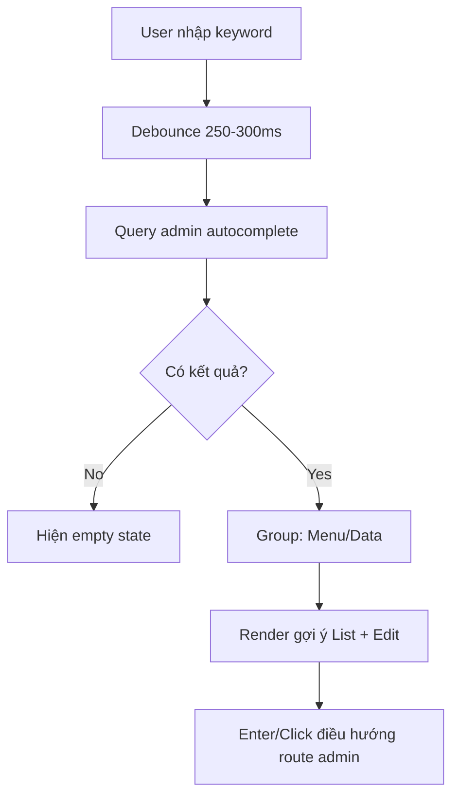

## TL;DR kiểu Feynman
- Header admin đang hơi “thoáng”, em sẽ giảm chiều cao/padding dọc khoảng 15% cho gọn.
- Ô search hiện chỉ là input tĩnh, chưa gọi query nên không có chức năng thật.
- Em sẽ làm search autocomplete fuzzy theo pattern global search public, nhưng trả kết quả theo ngữ cảnh admin.
- Kết quả sẽ có cả hướng đi list và edit (theo yêu cầu “cả list + edit”).
- Scope phase 1 tối ưu tốc độ: ưu tiên Menu admin + các nhóm dữ liệu chính có route rõ (Posts/Products/Services/Users).

## Audit Summary
### Observation
1. `app/admin/components/Header.tsx` đang dùng input tìm kiếm tĩnh, không có state/query/submit logic autocomplete.
2. Public đã có pattern autocomplete chạy Convex + fuzzy tại `components/site/HeaderSearchAutocomplete.tsx` và `convex/search.ts`.
3. Admin có route list/edit rõ cho nhiều entity; evidence mạnh nhất: posts/products/services/users (và thêm nhiều entity khác đã map).
4. Search index backend hiện tốt nhất cho posts/products/services; users chưa có search index chuyên biệt.

### Inference
- Root cause chính của “search không hoạt động”: thiếu component search chuyên dụng + thiếu query admin autocomplete.
- Nếu mở quá rộng phạm vi entity ngay phase đầu, chi phí query tăng và độ trễ cao (vì nhiều bảng chưa có search index).

### Decision
- Triển khai theo pattern public search, nhưng đóng gói cho admin và ưu tiên hiệu năng.
- Kết quả grouped theo loại; mỗi mục có khả năng đi list/edit như bạn yêu cầu.

## Root Cause Confidence
**High** — vì file Header admin hiện tại chỉ render input UI (không event/query), và đã đối chiếu trực tiếp với implementation public đang hoạt động.

## Elaboration & Self-Explanation
Vấn đề hiện tại là search ở header admin mới là “vỏ giao diện”: có icon, có ô input, nhưng không có phần “não” xử lý. Để nó hoạt động thật, cần 2 lớp:
1) Lớp frontend: debounce, mở dropdown, chọn item, điều hướng.
2) Lớp backend query: nhận keyword, tìm gần đúng (fuzzy), trả danh sách gợi ý.

Public site đã có đầy đủ pattern này, nên cách tốt nhất là học đúng pattern đó để tránh làm lại từ đầu. Khác biệt là admin cần route quản trị: vừa vào trang list, vừa vào trang edit nhanh.

## Concrete Examples & Analogies
- Ví dụ khi gõ `áo`:
  - Nhóm **Products** trả về `Áo sơ mi nam...` với 2 intent:
    - `Xem tất cả Products` → `/admin/products?search=áo`
    - `Sửa: Áo sơ mi nam...` → `/admin/products/{id}/edit`
- Ví dụ khi gõ `post`:
  - Nhóm **Menu** gợi ý nhanh `Bài viết` → `/admin/posts`.
- Analogy: giống “spotlight search” trong app desktop — gõ 1 chỗ, chọn để nhảy đúng màn cần làm việc.

## Problem Graph
1. Header admin chưa tối ưu <- depends on 1.1, 1.2
   1.1 Spacing dọc đang rộng hơn cần thiết
   1.2 Search chưa có logic thật
      1.2.1 [ROOT CAUSE] Header chỉ có input tĩnh, không query/autocomplete
      1.2.2 Cần map list/edit route + nguồn dữ liệu fuzzy

## Files Impacted
### UI
- **Sửa:** `app/admin/components/Header.tsx`
  - Vai trò hiện tại: render header + input tĩnh.
  - Thay đổi: giảm spacing dọc ~15%; thay input tĩnh bằng component search autocomplete admin.

- **Thêm:** `app/admin/components/AdminHeaderSearchAutocomplete.tsx`
  - Vai trò mới: quản lý query, debounce, dropdown, keyboard navigation, grouped suggestions.
  - Thay đổi: tái dùng pattern UI/logic từ public search nhưng route/nhóm dữ liệu theo admin.

### Server (Convex)
- **Thêm:** `convex/adminSearch.ts` *(hoặc bổ sung query mới trong file search hiện có, theo convention repo)*
  - Vai trò mới: trả kết quả fuzzy autocomplete cho admin.
  - Thay đổi: trả về 2 nhóm chính:
    - `menu` (route admin tĩnh)
    - `data` (posts/products/services/users) với `listUrl` + `editUrl`.

- **(Tùy chọn phase 2, không bắt buộc ngay):** `convex/schema.ts`
  - Chỉ thêm search index cho users nếu cần scale users-search tốt hơn.

## Execution Preview
1. Refactor nhẹ spacing header (height/padding dọc/icon button padding) để giảm ~15%.
2. Tạo `AdminHeaderSearchAutocomplete` với debounce + dropdown + keyboard (↑ ↓ Enter Esc).
3. Tạo query admin autocomplete theo fuzzy pattern hiện có (`rankByFuzzyMatches`).
4. Map kết quả theo 2 intent:
   - Item “Xem tất cả [Group]” -> list route + query param.
   - Item dữ liệu -> edit route cụ thể.
5. Gắn component vào `Header.tsx`, giữ dark mode và responsive behavior hiện tại.
6. Static self-review: null-safety, route hợp lệ, không phá breadcrumb/theme/menu mobile.

## Acceptance Criteria
- Header `/admin` giảm spacing dọc khoảng 15% (nhìn gọn hơn, không vỡ layout).
- Search header hoạt động thật: gõ keyword sẽ có dropdown autocomplete fuzzy.
- Có nhóm kết quả theo admin (ít nhất Menu + Data).
- Có cả đường đi list và edit theo cùng 1 ô search.
- Keyboard điều hướng cơ bản hoạt động: ↑ ↓ Enter Esc.

## Verification Plan
- Theo AGENTS.md hiện tại: **không tự chạy lint/unit test/build runtime**.
- Verify tĩnh bằng code review:
  - Kiểm tra debounce + điều kiện query skip.
  - Kiểm tra map route list/edit đúng format admin.
  - Kiểm tra dropdown đóng/mở đúng theo focus, click outside, escape.
  - Kiểm tra class spacing dọc giảm đúng phạm vi header.
- Manual checklist cho tester:
  1. Gõ từ khóa gần đúng (fuzzy) và có gợi ý.
  2. Chọn item list và item edit đều điều hướng đúng.
  3. Kiểm tra giao diện header desktop/mobile.

## Out of Scope
- Không làm full “search mọi module admin” ngay phase 1.
- Không đổi kiến trúc auth/permission.
- Không đụng UI sidebar trong task này.

## Risk / Rollback
- Risk trung bình: mở rộng entity quá nhiều có thể làm query chậm.
- Mitigation: phase 1 chỉ ưu tiên nhóm chính + giới hạn kết quả/collection.
- Rollback nhanh: revert commit ở `Header.tsx` + component/search query mới.