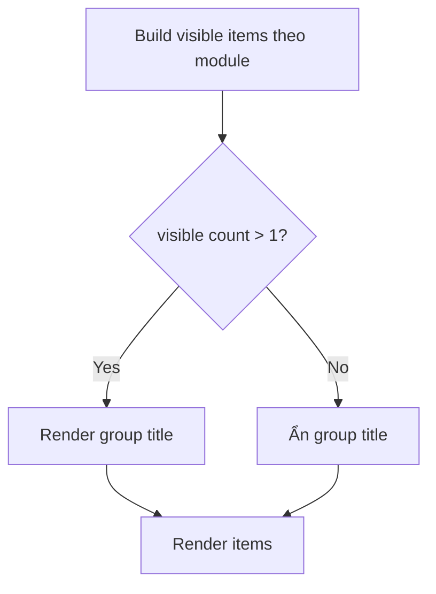

## TL;DR kiểu Feynman
- Sidebar hiện đang viết kiểu “hardcode từng khối”, nên title group luôn hiện dù group chỉ có 1 mục.
- Em sẽ thêm logic đếm số item hiển thị cho từng group, nếu chỉ có 1 thì ẩn title (khi sidebar chưa collapse).
- Em sẽ đổi label menu `Dashboard` thành `Tổng quan` cho thuần Việt.
- Em sẽ làm scrollbar dọc bên sidebar mảnh hơn nhưng chỉ áp dụng cho sidebar để tránh ảnh hưởng chỗ khác.
- Em sẽ giảm spacing khu vực toggle sidebar khoảng 20% (padding + gap, giữ vùng click an toàn).

## Audit Summary
### Observation
1. Sidebar groups/items và nhãn `Dashboard` nằm tại `app/admin/components/Sidebar.tsx`.
2. Group title đang render theo điều kiện `!isSidebarCollapsed`, chưa có rule “group chỉ 1 item thì ẩn”.
3. Scrollbar sidebar dùng class `scrollbar-thin` trên container cuộn; width hiện tại định nghĩa ở `app/globals.css`.
4. `/admin` redirect sang `/admin/dashboard` qua `app/admin/page.tsx`.

### Inference
- Nguyên nhân chính: thiếu lớp “section metadata + visible item count” nên không thể quyết định ẩn/hiện title theo số item.
- Nếu sửa trực tiếp `.scrollbar-thin` global có thể ảnh hưởng các nơi khác dùng chung utility.

### Decision
- Giữ thay đổi nhỏ và dễ rollback: chỉnh chủ yếu trong `Sidebar.tsx`, thêm class scrollbar riêng cho sidebar thay vì thay global utility.

## Root Cause Confidence
**High** — vì đã xác định trực tiếp dòng render title theo block hardcode trong `Sidebar.tsx`, không có điều kiện đếm item visible.

## Elaboration & Self-Explanation
Hiện sidebar giống như một danh sách được viết tay từng đoạn: “Tổng quan”, “Nội dung”, “Bán hàng”… Mỗi đoạn tự in tiêu đề nếu sidebar không thu gọn, nên dù đoạn đó chỉ còn 1 menu vẫn hiện tiêu đề. Muốn giao diện gọn thì phải biết đoạn đó có bao nhiêu mục thật sự đang hiện (sau khi lọc theo module bật/tắt), rồi mới quyết định in title hay không.

Phần `Dashboard` chỉ là text label trong item menu, nên đổi sang `Tổng quan` là thay đúng 1 chỗ. Scrollbar thì đang dùng class chung; để không làm thay đổi toàn app, em sẽ gắn class mảnh hơn chỉ cho vùng scroll của sidebar.

## Concrete Examples & Analogies
- Ví dụ cụ thể theo yêu cầu: group `Nội dung` chỉ còn `Quản lý bài viết` => title `NỘI DUNG` sẽ ẩn, chỉ còn item menu.
- Group `HỆ THỐNG` có nhiều item (`Người dùng`, `Website`, `Cài đặt`...) => vẫn giữ title.
- Analogy: giống mục lục sách — nếu một chương chỉ có đúng 1 mục con, thường người ta bỏ bớt một lớp tiêu đề để trang gọn hơn.

## Problem Graph
1. Sidebar chưa gọn <- depends on 1.1, 1.2, 1.3, 1.4
   1.1 [ROOT CAUSE] Group title render hardcode theo block, không đếm item visible
   1.2 Label menu chưa thuần Việt (`Dashboard`)
   1.3 Scrollbar đang dùng utility chung
   1.4 Khu vực toggle có spacing hơi rộng

## Files Impacted
### UI
- **Sửa:** `app/admin/components/Sidebar.tsx`
  - Vai trò hiện tại: định nghĩa toàn bộ cấu trúc menu sidebar, title group, item label, footer/toggle.
  - Thay đổi: thêm tính `visibleItemCount` theo group để ẩn title khi count = 1; đổi `Dashboard` -> `Tổng quan`; giảm spacing khu vực toggle khoảng 20%.

- **Sửa:** `app/globals.css` *(chỉ khi cần class scrollbar riêng)*
  - Vai trò hiện tại: chứa utility scrollbar global (`scrollbar-thin`).
  - Thay đổi: thêm selector/class riêng cho scrollbar sidebar mảnh hơn (không sửa trực tiếp utility global đang dùng nhiều nơi).

## Execution Preview
1. Đọc lại block sections trong `Sidebar.tsx`, gom điều kiện visible item cho từng group.
2. Thêm helper nhỏ: `shouldShowGroupTitle(count)` và áp dụng cho các group.
3. Đổi text item `Dashboard` thành `Tổng quan`.
4. Giảm spacing khu footer toggle (padding/gap) theo tỉ lệ ~20%, giữ target click ổn.
5. Áp class scrollbar mảnh riêng cho container sidebar scroll.
6. Static self-review: null-safety, điều kiện module, không đổi behavior collapse/expand ngoài yêu cầu.

## Acceptance Criteria
- `/admin` sidebar hiển thị item `Tổng quan` (không còn chữ `Dashboard`).
- Group title có đúng 1 item visible sẽ tự ẩn (ví dụ `NỘI DUNG` chỉ còn `Quản lý bài viết` thì ẩn).
- Group có nhiều item vẫn giữ title (`HỆ THỐNG` còn nhiều mục thì vẫn hiện).
- Scrollbar dọc sidebar nhìn mảnh hơn hiện tại.
- Khu vực toggle sidebar có spacing giảm ~20%, không vỡ layout, vẫn dễ bấm.

## Verification Plan
- Không chạy lint/test/build theo quy định repo (AGENTS.md cấm tự chạy).
- Verify tĩnh bằng code review tại chỗ:
  - Soát điều kiện render title theo `visibleItemCount`.
  - Soát active state `/admin` và `/admin/dashboard` không thay đổi.
  - Soát class spacing/toggle chỉ đổi đúng phạm vi sidebar.
  - Soát scrollbar class chỉ tác động sidebar.
- Manual repro checklist (để tester chạy):
  1. Bật/tắt module để tạo group 1 item và >1 item.
  2. Mở `/admin`, kiểm tra label `Tổng quan`.
  3. Kiểm tra scrollbar sidebar và toggle spacing trên desktop + mobile menu.

## Out of Scope
- Không thay đổi kiến trúc menu data-driven toàn bộ sidebar.
- Không chỉnh copy/đặt tên các menu khác ngoài `Dashboard`.
- Không đổi logic phân quyền/module ngoài phần hiển thị title.

## Risk / Rollback
- **Risk thấp:** sai sót đếm item visible có thể làm ẩn nhầm title của 1 số group.
- **Rollback nhanh:** revert 1 commit ở `Sidebar.tsx` (và `globals.css` nếu có) là về trạng thái cũ ngay.