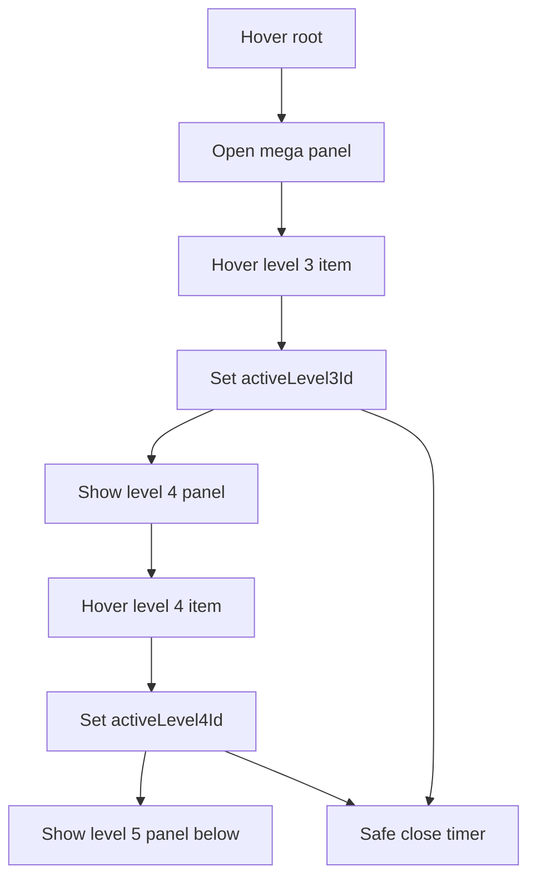

# I. Primer
## 1. TL;DR kiểu Feynman
- Bug hiện tại là interaction desktop chưa đúng: hover ở tầng 3 mà tầng 5 đã lộ ra, và rê chuột hơi lệch là menu dễ mất.
- Best practice cho mega menu nhiều tầng là không dùng chuỗi `group-hover` thuần, mà dùng state điều khiển rõ theo từng cấp.
- Em đề xuất: tầng 4 mở theo `activeLevel3Id`, tầng 5 mở theo `activeLevel4Id`, cộng thêm delay đóng và vùng “safe corridor”.
- Tầng 5 vẫn nằm **bên dưới tầng 4**, không bung sang phải để tránh chiếm ngang và tạo horizontal scroll.
- Scope ưu tiên là `components/site/Header.tsx`; sau khi ổn mới mirror sang preview.

## 2. Elaboration & Self-Explanation
Vấn đề anh vừa báo là một anti-pattern rất phổ biến của menu nhiều tầng: submenu sâu đang bị buộc vào hover chain, nên chỉ cần chuột nằm trong vùng tổ tiên là cấp sâu cũng hiện ra sớm. Điều này làm UI bị “rối thị giác” và tạo cảm giác menu tự chạy trước ý định của người dùng.

Theo research từ NN/g, Smashing Magazine và CSS-Tricks, với multi-level mega menu thì cần 3 lớp bảo vệ:
- **Progressive reveal (mở dần theo cấp)**: chỉ hiện cấp tiếp theo khi hover đúng item cha trực tiếp.
- **Hover intent (ý định hover)**: không đóng/ngắt ngay khi chuột chệch nhẹ.
- **Forgiving path / safe corridor (đường rê chuột an toàn)**: khi di chuột từ item cha sang panel con, menu không sập giữa đường.

Áp vào case của anh:
- Hover tầng 3 -> chỉ mở panel tầng 4.
- Hover item tầng 4 -> mới render panel tầng 5.
- Nếu chuột đi từ item tầng 4 xuống panel tầng 5 qua một khe nhỏ, menu vẫn giữ mở trong khoảng delay ngắn.

## 3. Concrete Examples & Analogies
- Ví dụ đúng sau khi sửa:
  - Hover `Tầng 3` -> `Tầng 4` xuất hiện.
  - `Tầng 5` chưa hiện.
  - Hover vào `Tầng 4` có con -> `Tầng 5` hiện bên dưới.
  - Rê chuột xuống panel tầng 5 qua khe 8–12px -> menu vẫn giữ.

- Analogy:
  - Hiện tại menu giống bậc thang tự động bật tất cả đèn từ xa.
  - Menu đúng nên là đèn cảm biến theo tầng: đứng ở tầng nào thì chỉ sáng đúng tầng liên quan, không sáng vượt trước.

# II. Audit Summary (Tóm tắt kiểm tra)
- Observation:
  - Interaction hiện tại vẫn còn dấu hiệu phụ thuộc CSS hover-chain ở desktop mega menu.
  - Tầng 5 đang có thể lộ sớm khi hover ở tầng trên, thay vì chờ hover đúng tầng 4.
  - Safe hover mới chủ yếu ở root menu; chưa có state machine riêng cho tầng 3/4/5.
- Evidence:
  - Screenshot user gửi: mới hover tầng 3 nhưng tầng 5 đã thấy.
  - Web search:
    - NN/g: `Timing Guidelines for Exposing Hidden Content`, `Menu-Design Checklist`.
    - Smashing: `User-Friendly Mega-Dropdowns`, `Safe Triangles`.
    - CSS-Tricks: `Forgiving Mouse Movement Paths`.
- Inference:
  - Root cause nằm ở interaction contract, không phải ở data depth.
- Decision:
  - Refactor logic mở/đóng submenu sâu sang explicit state + hover-safe zone.

# III. Root Cause & Counter-Hypothesis (Nguyên nhân gốc & Giả thuyết đối chứng)
- 1. Triệu chứng quan sát được là gì?
  - Expected: hover tầng 3 chỉ mở tầng 4; hover tầng 4 mới mở tầng 5.
  - Actual: tầng 5 mở sớm và mất dễ.
- 2. Phạm vi ảnh hưởng?
  - Desktop site header; preview desktop cần đồng bộ sau.
- 3. Có tái hiện ổn định không?
  - Có, với dataset 4–5 tầng.
- 4. Mốc thay đổi gần nhất?
  - Sau khi chuyển từ flyout ngang sang panel dưới, interaction vẫn chưa được state hóa đầy đủ.
- 5. Dữ liệu nào đang thiếu?
  - Không thiếu blocker để sửa.
- 6. Có giả thuyết thay thế hợp lý nào chưa bị loại trừ?
  - Không phải width/padding đơn thuần; vì bug là thứ tự hiện submenu.
- 7. Rủi ro nếu fix sai nguyên nhân?
  - Nếu chỉ tăng delay mà không tách state từng cấp, tầng 5 vẫn có thể hiện sớm.
- 8. Tiêu chí pass/fail sau khi sửa?
  - Hover tầng 3 không hiện tầng 5; hover tầng 4 mới hiện tầng 5; rê chuột qua khe nhỏ không mất menu.

**Root Cause Confidence (Độ tin cậy nguyên nhân gốc): High**
- Lý do: triệu chứng khớp trực tiếp với anti-pattern hover-chain mà research cũng cảnh báo.

# IV. Proposal (Đề xuất)
## 1. Interaction contract mới
### a) State rõ theo cấp
- Dùng state desktop riêng:
  - `hoveredRootId`
  - `activeLevel3Id`
  - `activeLevel4Id`
- Rule:
  - Enter root -> mở mega panel.
  - Enter item tầng 3 -> set `activeLevel3Id`, reset `activeLevel4Id`.
  - Enter item tầng 4 -> set `activeLevel4Id`.
  - Render tầng 5 chỉ khi `activeLevel4Id` khớp item đang hover.

### b) Safe corridor
- Bọc item tầng 4 + panel tầng 5 trong cùng hover zone.
- Dùng timeout đóng 250–350ms khi rời vùng.
- Nếu pointer quay lại panel trong thời gian đó thì cancel close.
- Chưa cần full geometric safe triangle ngay vòng đầu; ưu tiên vùng hover chung + delay vì đủ practical và rollback dễ.

### c) Layout tầng 5
- Tầng 5 anchor ở `top-full left-0`, nằm dưới item tầng 4.
- Có `max-width` theo viewport để không tràn ngang.
- Parent panel dùng `overflow-x-clip` hoặc cấu trúc tránh overflow ngang.

## 2. Best-practice mapping từ websearch
- NN/g timing guideline: hover-triggered hidden content cần delay đóng ngắn để user thấy kiểm soát.
- Smashing safe triangles: tránh đóng submenu khi pointer đang trên đường sang submenu.
- CSS-Tricks forgiving paths: thêm “bridge zone” hoặc vùng tha thứ để tránh mất hover vì khe nhỏ.

## 3. Phạm vi implement recommend
- **Phase 1:** sửa `components/site/Header.tsx` desktop classic/topbar/allbirds dùng chung logic helper.
- **Phase 2:** mirror cùng behavior sang `components/experiences/previews/HeaderMenuPreview.tsx`.
- Mobile giữ nguyên accordion, không đổi behavior.

# V. Files Impacted (Tệp bị ảnh hưởng)
## UI
- **Sửa:** `components/site/Header.tsx`
  - Vai trò hiện tại: render header thật desktop/mobile.
  - Thay đổi: bỏ phụ thuộc hover-chain cho tầng 4/5, thêm explicit hover state, close delay, safe hover zone.

- **Sửa:** `components/experiences/previews/HeaderMenuPreview.tsx`
  - Vai trò hiện tại: preview desktop/mobile của header experience.
  - Thay đổi: mirror logic hover-safe để preview không lệch production.

## Shared
- **Có thể thêm:** helper nhỏ nội bộ cho submenu desktop state/reset nếu code `Header.tsx` quá dài.
  - Vai trò hiện tại: chưa có abstraction riêng.
  - Thay đổi: gom logic state + timeout để dễ maintain.

# VI. Execution Preview (Xem trước thực thi)
1. Audit các block render tầng 3/4/5 ở `Header.tsx`.
2. Thay `group-hover` mở tầng 5 bằng state `activeLevel4Id`.
3. Thêm hover zone chung cho item tầng 4 và panel tầng 5.
4. Thêm close timer riêng cho submenu sâu.
5. Review overflow ngang và clamp width panel.
6. Đồng bộ `HeaderMenuPreview.tsx` nếu site thật đã ổn.
7. Static review + typecheck + commit local.

# VII. Verification Plan (Kế hoạch kiểm chứng)
- Hover tầng 1 -> mega panel mở.
- Hover tầng 3 -> chỉ thấy tầng 4.
- Hover đúng item tầng 4 -> tầng 5 mới thấy.
- Rê chuột từ tầng 4 xuống tầng 5 qua khe nhỏ -> menu vẫn còn.
- Rê chuột ra ngoài toàn vùng -> menu đóng sau delay ngắn.
- Không có horizontal scrollbar ở viewport desktop chuẩn.
- Preview desktop khớp site thật nếu phase 2 được làm luôn.

# VIII. Todo
- [ ] Refactor state hover tầng 3/4/5 trong `Header.tsx`.
- [ ] Thêm safe hover zone + close timer cho tầng sâu.
- [ ] Đảm bảo tầng 5 chỉ render khi hover tầng 4.
- [ ] Kiểm tra và chặn overflow ngang.
- [ ] Đồng bộ preview nếu cần.
- [ ] Typecheck và commit local.

# IX. Acceptance Criteria (Tiêu chí chấp nhận)
- Hover tầng 3 không làm tầng 5 hiện sớm.
- Hover tầng 4 mới làm tầng 5 hiện.
- Safe hover tốt hơn: rê chuột qua khe nhỏ không mất menu ngay.
- Không có horizontal scroll do mega menu.
- Độ rộng panel vẫn co theo số cột thực tế.

# X. Risk / Rollback (Rủi ro / Hoàn tác)
- Rủi ro:
  - State hover nhiều cấp có thể gây flicker nếu reset sai thứ tự.
  - Delay quá dài có thể tạo cảm giác menu “bám”.
- Rollback:
  - Revert commit interaction.
  - Giữ lại width/overflow fixes nếu chúng ổn, rollback riêng phần state logic.

# XI. Out of Scope (Ngoài phạm vi)
- Không đổi data model menus.
- Không đổi mobile accordion.
- Không redesign visual theme tổng thể ngoài interaction desktop.

# XII. Open Questions (Câu hỏi mở)
- Không còn ambiguity blocker. Em recommend làm luôn `Header.tsx` trước, sau đó mirror preview để tránh lệch hành vi.