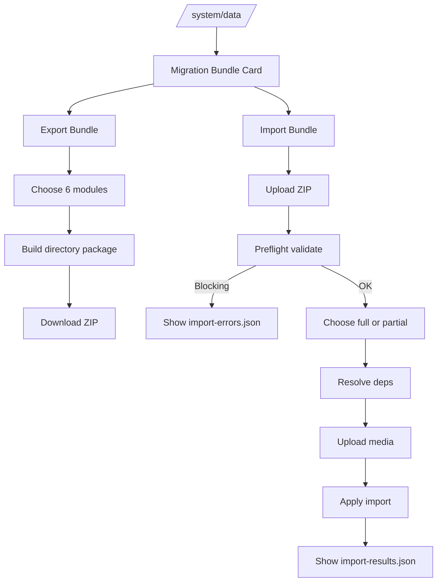

# I. Primer
## 1. TL;DR kiểu Feynman
- Tôi cập nhật scope thành 6 nhóm dữ liệu chính: `settings`, `products`, `services`, `posts`, `menus`, `home-components`.
- Nút `Export` và `Import` sẽ đặt rõ ở `http://localhost:3000/system/data`, cụ thể là trong `Data Command Center` hiện có.
- Format tôi vẫn recommend mạnh nhất là `thư mục chuẩn bên trong + ZIP bên ngoài`, vì vừa tiện vận chuyển vừa cực dễ cho AI agent đọc/sửa/debug.
- Bundle phải có `manifest`, `index`, `modules`, `media`, `reports`; lỗi phải chỉ rõ `module + file + recordKey + jsonPath + suggestion`.
- Import hỗ trợ `full` hoặc `partial`, nhưng partial sẽ tự kéo phụ thuộc cần thiết.
- Thiết kế này ưu tiên đúng workflow anh muốn: import lỗi thì chỉ cần ném bundle/report cho tôi, tôi vào khoanh và sửa rất nhanh.

## 2. Elaboration & Self-Explanation
Bây giờ scope không còn là 4 nhóm nữa mà là 6 nhóm “xương sống” của một project từ core này:
- settings
- products
- services
- posts
- menus
- home-components

Đây là một bộ rất hợp lý vì gần như đủ để dựng lại phần nội dung, cấu trúc điều hướng và homepage của một site cũ lên core mới mà chưa cần đụng các vùng khó hơn như orders/customers/comments.

Điểm quan trọng nhất tôi giữ nguyên là: đừng xem ZIP là format chính. ZIP chỉ là lớp đóng gói. Format chính phải là một thư mục chuẩn, có chia nhỏ, có index rõ, để:
- anh mở tay chỉnh được,
- AI agent quét nhanh được,
- lỗi import có thể trỏ đúng file cụ thể,
- và sau này khi core đổi thêm 1 ít schema, ta vẫn vá bundle rất nhanh.

Việc thêm `menus` và `home-components` làm bài toán thú vị hơn, vì 2 nhóm này thường là nơi dễ phát sinh dữ liệu lồng nhau, tree và config JSON khá sâu. Chính vì vậy lại càng cần structure AI-friendly thay vì một file JSON khổng lồ.

## 3. Concrete Examples & Analogies
### a) Ví dụ cụ thể bám sát 6 module
Một bundle hoàn chỉnh có thể gồm:
- `modules/settings/...`
- `modules/products/...`
- `modules/services/...`
- `modules/posts/...`
- `modules/menus/menus.json`
- `modules/menus/menu-items.chunk-001.json`
- `modules/home-components/components.chunk-001.json`
- `media/home-components/...`
- `reports/import-errors.json`

Nếu import menu lỗi, report có thể ghi:
- module: `menus`
- recordKey: `menu:header`
- file: `modules/menus/menu-items.chunk-001.json`
- jsonPath: `records[12].parentKey`
- errorCode: `MENU_PARENT_NOT_FOUND`
- suggestion: `Kiểm tra parentKey hoặc thứ tự tree trong menu-items`

Nếu import home-component lỗi:
- module: `home-components`
- recordKey: `homeComponent:hero:slug:hero-01`
- file: `modules/home-components/components.chunk-001.json`
- jsonPath: `records[2].config.slides[1].image`
- errorCode: `MEDIA_FILE_MISSING`
- suggestion: `Kiểm tra media/home-components/hero-01/... hoặc media.index.json`

### b) Analogy đời thường
Nó giống 1 bộ hồ sơ mở shop mới:
- `settings` là quy định cửa hàng,
- `products/services/posts` là hàng hóa và nội dung,
- `menus` là biển chỉ dẫn,
- `home-components` là mặt tiền và cách trưng bày.

Nếu mỗi thứ bỏ một chỗ thì cứu rất mệt. Nếu chia tab rõ ràng và có mục lục/index thì cả người lẫn AI đều lần cực nhanh.

# II. Audit Summary (Tóm tắt kiểm tra)
- Observation:
  - `components/data/DataCommandCenter.tsx` là nơi phù hợp nhất để thêm nút `Export`/`Import` tại `/system/data`.
  - Repo có `convex/menus.ts`, `convex/homeComponents.ts`, cùng admin surfaces `app/admin/menus/*` và `app/admin/home-components/*`, nên `menus` và `home-components` là 2 module có source of truth đủ rõ để đưa vào bundle.
  - `homeComponents` trong schema lưu `config: any`, nghĩa là rất cần cơ chế export/import có validator + index tốt để debug.
  - `menus` có cấu trúc `menus` + `menuItems` dạng tree, nên cần stable keys thay vì raw IDs.
- Inference:
  - Việc mở rộng lên 6 module là hợp lý và vẫn giữ được scope gọn.
  - `menus` và `home-components` càng củng cố nhu cầu `directory-first bundle` vì dữ liệu tree/config sâu sẽ rất khó xử nếu dồn một file blob.
- Decision:
  - Bổ sung 2 module `menus`, `home-components` vào bundle v1.
  - Mention rõ trong spec: nút `Export` và `Import` nằm ở `/system/data` trong `Data Command Center`.

# III. Root Cause & Counter-Hypothesis (Nguyên nhân gốc & Giả thuyết đối chứng)
## 1. Root Cause Confidence (Độ tin cậy nguyên nhân gốc): High
Lý do: khi core evolve và số project fork nhiều lên, pain chính không chỉ là copy data mà là copy data có thể debug/repair nhanh. Việc thêm `menus` và `home-components` càng làm nhu cầu về format AI-friendly trở nên rõ ràng hơn.

## 2. Audit theo 8 câu hỏi bắt buộc
### a) Triệu chứng quan sát được là gì?
- Expected: chuyển được 6 nhóm dữ liệu cốt lõi từ project cũ sang core mới, có import/export tiện ở `/system/data`, lỗi thì cực chi tiết để AI sửa nhanh.
- Actual: hiện chưa có cơ chế này.

### b) Phạm vi ảnh hưởng?
- `/system/data`
- 6 module: `settings`, `products`, `services`, `posts`, `menus`, `home-components`
- media pipeline
- preflight validation + report pipeline

### c) Có tái hiện ổn định không?
- Có. Đây là bài toán kiến trúc lặp lại ở mọi dự án sinh từ core.

### d) Mốc thay đổi gần nhất?
- Không phụ thuộc một commit cụ thể; là nhu cầu nền do mô hình phát triển nhiều dự án từ 1 core.

### e) Dữ liệu nào đang thiếu?
- Chưa đọc chi tiết hết internals của `convex/menus.ts` và `convex/homeComponents.ts`, nhưng đã đủ evidence để chốt kiến trúc bundle.
- Chưa xác nhận thư viện ZIP nào đã có sẵn trong repo.

### f) Có giả thuyết thay thế hợp lý nào chưa bị loại trừ?
- Có:
  1. Chỉ thêm exporter/importer tối giản cho từng module riêng lẻ.
  2. Dùng một file JSON duy nhất cho cả 6 module.
- Nhưng đều kém hơn về long-term maintainability và AI repairability.

### g) Rủi ro nếu fix sai nguyên nhân?
- Làm ra importer dùng được ở happy path nhưng mỗi lần lỗi tree/config/media lại cực khó cứu.

### h) Tiêu chí pass/fail sau khi sửa?
- Pass khi import/export 6 module qua `/system/data` hoạt động với report chi tiết, partial auto-deps, và AI có thể định vị lỗi cực nhanh.
- Fail nếu `menus` tree, `home-components config`, hoặc media không được map rõ ràng.

## 3. Counter-Hypothesis (Giả thuyết đối chứng)
### a) Chỉ làm 4 module như spec cũ
- Ưu: nhanh hơn.
- Nhược: chưa đủ “bộ xương” để tái dựng site cũ lên core mới, vì thiếu điều hướng và homepage.
- Kết luận: không còn phù hợp yêu cầu mới.

### b) Chia nhỏ thành nhiều importer độc lập, không có bundle chung
- Ưu: dễ code từng phần.
- Nhược: người dùng phải nhớ thứ tự, khó trace dependency, khó đóng gói media và debug một lần.
- Kết luận: không tiện bằng bundle chung.

# IV. Proposal (Đề xuất)
## 1. Recommendation
### Option A (Recommend) — Confidence 93%
`Directory-first Migration Bundle` cho 6 module, hỗ trợ import/export tại `/system/data`.

Vì sao tốt nhất:
- Giữ toàn bộ workflow tập trung một chỗ.
- Đủ giàu cấu trúc để chứa tree menus và config home-components.
- Tối ưu cho AI agent đọc/sửa/lần lỗi.
- Có thể scale thêm module khác sau này mà không phải đập lại format.

## 2. Nút Export / Import ở đâu?
Có, và tôi chốt rõ trong spec này:
- Nút `Export Bundle` và `Import Bundle` sẽ nằm ngay trong `Data Command Center` ở `http://localhost:3000/system/data`.
- Đây là surface duy nhất cho thao tác cấp system.
- Không thêm nút ở `/admin/menus` hay `/admin/home-components`.

## 3. Cấu trúc bundle 6 module
```text
migration-bundle/
  manifest.json
  README.agent.json
  index/
    modules.json
    dependencies.json
    media.index.json
    errors.schema.json
    records/
      settings.index.json
      products.index.json
      services.index.json
      posts.index.json
      menus.index.json
      home-components.index.json
  modules/
    settings/
      settings.json
      module-settings.json
      module-features.json
      module-fields.json
    products/
      categories.json
      products.chunk-001.json
      options.json
      option-values.json
      variants.chunk-001.json
      frames.json
      supplemental-contents.json
    services/
      categories.json
      services.chunk-001.json
    posts/
      categories.json
      posts.chunk-001.json
    menus/
      menus.json
      menu-items.chunk-001.json
    home-components/
      components.chunk-001.json
      component-order.json
  media/
    settings/
    products/
    services/
    posts/
    home-components/
  reports/
    export-warnings.json
    import-preview.json
    import-errors.json
    import-results.json
```

## 4. Stable keys cho 6 module
### a) Settings
- `settings:{group}:{key}`
- `moduleSettings:{moduleKey}:{settingKey}`
- `moduleFeatures:{moduleKey}:{featureKey}`
- `moduleFields:{moduleKey}:{fieldKey}`

### b) Products
- `productCategory:{slug}`
- `product:{sku}` ưu tiên, fallback `productSlug:{slug}`
- `productOption:{slug}`
- `productOptionValue:{optionSlug}:{value}`
- `productVariant:{productSku}:{normalizedOptionTuple}`
- `productFrame:{name}`
- `productSupplemental:{name}`

### c) Services
- `serviceCategory:{slug}`
- `service:{slug}`

### d) Posts
- `postCategory:{slug}`
- `post:{slug}`

### e) Menus
- `menu:{location}` ưu tiên, fallback `menu:{name}`
- `menuItem:{menuLocation}:{pathKey}`

Trong đó `pathKey` là key ổn định dạng cây, ví dụ:
- `gioi-thieu`
- `san-pham/dong-ho`
- `san-pham/dong-ho/cao-cap`

Như vậy importer không phụ thuộc `_id` cũ hay `parentId` cũ, mà rebuild tree từ `pathKey` / `parentPathKey`.

### f) Home-components
- `homeComponent:{type}:{titleSlug}:{orderHint}`

Vì `homeComponents` hiện có `type`, `title`, `order`, `config`, nên stable key nên pha trộn:
- type
- slug hóa title
- orderHint

Nếu cần chắc hơn có thể thêm `componentKey` sinh deterministic lúc export.

## 5. Menus contract
### a) File `modules/menus/menus.json`
Chứa menu containers:
- name
- location

### b) File `modules/menus/menu-items.chunk-001.json`
Chứa items với:
- `menuLocation`
- `label`
- `url`
- `icon`
- `active`
- `openInNewTab`
- `depth`
- `order`
- `pathKey`
- `parentPathKey`

### c) Vì sao contract này tốt
- Tree có thể rebuild deterministically.
- Lỗi menu parent mất sẽ rất dễ chỉ ra.
- AI có thể sửa đúng item theo `pathKey`.

## 6. Home-components contract
### a) File `modules/home-components/components.chunk-001.json`
Mỗi record nên có:
- `componentKey`
- `type`
- `title`
- `order`
- `active`
- `config`
- `mediaRefs[]`

### b) File `modules/home-components/component-order.json`
Chứa thứ tự authoritative toàn trang:
- `orderedComponentKeys[]`

### c) Vì sao tách thêm order file
- Dễ diff thứ tự hiển thị.
- Khi lỗi chỉ do ordering thì không cần đụng record config.
- AI đọc nhanh hơn nhiều so với parse mọi component để suy ra order.

## 7. Chỉ số (indexes) cho AI đọc nhanh
### a) `index/records/menus.index.json`
Map:
- recordKey
- chunkFile
- position
- parent dependencies
- related media refs

### b) `index/records/home-components.index.json`
Map:
- componentKey
- type
- chunkFile
- position
- mediaRefs
- configPointers

`configPointers` có thể gợi ý path đáng chú ý như:
- `config.image`
- `config.backgroundImage`
- `config.slides[0].image`

Đây là cực hữu ích cho AI khi debug media/config.

## 8. Error report contract cập nhật cho 6 module
Ví dụ menu lỗi:
```json
{
  "code": "MENU_PARENT_NOT_FOUND",
  "severity": "blocking",
  "module": "menus",
  "recordKey": "menuItem:header:san-pham/dong-ho",
  "file": "modules/menus/menu-items.chunk-001.json",
  "indexFile": "index/records/menus.index.json",
  "position": 12,
  "jsonPath": "records[12].parentPathKey",
  "value": "san-pham",
  "message": "Không tìm thấy parentPathKey để dựng tree menu",
  "suggestion": "Kiểm tra pathKey/parentPathKey trong menu-items hoặc regenerate export"
}
```

Ví dụ home-component lỗi:
```json
{
  "code": "HOME_COMPONENT_MEDIA_MISSING",
  "severity": "blocking",
  "module": "home-components",
  "recordKey": "homeComponent:hero:hero-trang-chu:1",
  "file": "modules/home-components/components.chunk-001.json",
  "indexFile": "index/records/home-components.index.json",
  "position": 2,
  "jsonPath": "records[2].config.slides[1].image",
  "value": "media/home-components/hero-trang-chu/slide-2.webp",
  "message": "Thiếu file media cho home component",
  "suggestion": "Kiểm tra media.index.json hoặc media/home-components/..."
}
```

## 9. UX tại /system/data
### a) Placement rõ ràng
Trong `Data Command Center` sẽ có thêm 1 khu mới, ví dụ card lớn tên:
- `Migration Bundle`

Bên trong có 2 action chính:
- `Export Bundle`
- `Import Bundle`

### b) Export UI
- Checkbox 6 module:
  - settings
  - products
  - services
  - posts
  - menus
  - home-components
- Hiển thị số record/media ước tính
- Nút `Export Bundle`
- Kết quả tải về: ZIP chứa thư mục bundle chuẩn

### c) Import UI
- Upload ZIP
- Preflight validate
- Xem preview:
  - selected modules
  - auto-included dependencies
  - blocking errors
  - warnings
- Chọn:
  - `Import all`
  - `Import selected modules`
- Nút `Start Import`
- Sau cùng cho tải hoặc xem:
  - `import-results.json`
  - `import-errors.json`



## 10. Dependency rules cập nhật
### a) products
Tự kéo:
- product categories
- options
- option values
- variants
- frames
- supplemental contents
- product-related settings nếu cần
- media

### b) posts
Tự kéo:
- post categories
- media

### c) services
Tự kéo:
- service categories
- media

### d) menus
Tự kéo:
- menu container + menu items tree
- không cần kéo module khác, trừ khi sau này menu URL có semantic validation

### e) home-components
Tự kéo:
- component order
- media
- có thể kèm warning nếu config tham chiếu tới entities không nằm trong bundle, ví dụ product/service/post cụ thể

Đây là điểm rất quan trọng: home-component có thể tham chiếu gián tiếp tới product/service/post. V1 nên xử lý như sau:
- nếu config chỉ là content tĩnh + media: import bình thường
- nếu config tham chiếu entity key không tồn tại ở target/bundle: block hoặc warning tùy mức critical, nhưng mặc định theo yêu cầu của anh thì nếu critical sẽ block với lỗi chi tiết

## 11. Pattern học từ SaaS lớn, áp vào 6 module
- Package + manifest như Optimizely: dùng cho compatibility/versioning.
- Structured export như Notion: hợp với package có nhiều loại data.
- Granular error mapping như Matrixify/Shopify: cực hợp cho products và cả menu/home-component configs.
- Tránh file đơn kiểu WXR/XML làm chuẩn chính: không tối ưu cho AI-assisted repair.

# V. Files Impacted (Tệp bị ảnh hưởng)
## 1. UI
- Sửa: `components/data/DataCommandCenter.tsx`
  - Vai trò hiện tại: seed/clear/reset hub cho `/system/data`.
  - Thay đổi: thêm `Migration Bundle` card với 2 nút rõ ràng `Export Bundle` và `Import Bundle`.
- Thêm: `components/data/import-export/MigrationBundleCard.tsx`
  - Vai trò mới: card chứa toàn bộ flow import/export ở `/system/data`.
  - Thay đổi: hiển thị chọn 6 module, upload ZIP, preview, action buttons.
- Thêm: `components/data/import-export/BundleReportViewer.tsx`
  - Vai trò mới: render import preview/errors/results.
  - Thay đổi: nhấn mạnh file path, record key, json path.

## 2. Convex / server
- Thêm: `convex/migrationBundles.ts`
  - Vai trò mới: export/preflight/apply cho 6 modules.
  - Thay đổi: API trung tâm của migration bundle.
- Thêm: `convex/lib/migration-bundle/manifest.ts`
  - Vai trò mới: manifest contract.
  - Thay đổi: version/capabilities/checksums.
- Thêm: `convex/lib/migration-bundle/readme-agent.ts`
  - Vai trò mới: AI-friendly metadata helper.
  - Thay đổi: hướng dẫn machine-readable cho agent.
- Thêm: `convex/lib/migration-bundle/indexers.ts`
  - Vai trò mới: sinh indexes cho cả 6 module.
  - Thay đổi: hỗ trợ record lookup nhanh.
- Thêm: `convex/lib/migration-bundle/exporters.ts`
  - Vai trò mới: serialize 6 modules ra package.
  - Thay đổi: bỏ raw IDs, map stable keys.
- Thêm: `convex/lib/migration-bundle/validators.ts`
  - Vai trò mới: preflight validator.
  - Thay đổi: lỗi cực chi tiết cho menus/home-components/media.
- Thêm: `convex/lib/migration-bundle/importers.ts`
  - Vai trò mới: apply import with auto dependencies.
  - Thay đổi: rebuild menu tree, restore home-components order/config.
- Thêm: `convex/lib/migration-bundle/media.ts`
  - Vai trò mới: media embed/checksum/remap.
  - Thay đổi: quản lý media cho 5 nhóm có ảnh.

## 3. Shared
- Thêm: `lib/migration-bundle/types.ts`
  - Vai trò mới: types dùng chung cho bundle/report/index.
  - Thay đổi: hỗ trợ 6 module.

# VI. Execution Preview (Xem trước thực thi)
1. Rà kỹ `menus` và `homeComponents` để chốt stable keys và dependency rules.
2. Mở rộng bundle contract từ 4 lên 6 module.
3. Chốt placement UI tại `DataCommandCenter` trong `/system/data`.
4. Thiết kế indexes và report contract cho menu tree + home-component config.
5. Thiết kế exporter/importer/preflight cho 6 module.
6. Gắn UI `Export Bundle` / `Import Bundle` vào `/system/data`.
7. Review tĩnh TypeScript, edge cases, compatibility.

# VII. Verification Plan (Kế hoạch kiểm chứng)
- Static verification:
  - `bunx tsc --noEmit` sau khi có thay đổi code TS.
- Repro checklist:
  - export/import full cả 6 module
  - partial import chỉ menus
  - partial import chỉ home-components
  - cố tình làm sai parentPathKey trong menu
  - cố tình xóa media của home-component
  - cố tình tạo config home-component tham chiếu entity thiếu
- Pass về AI-friendliness nếu:
  - chỉ cần `manifest.json`, `README.agent.json`, `reports/import-errors.json` là đủ để khoanh lỗi nhanh
  - report luôn chỉ ra được file + recordKey + jsonPath

# VIII. Todo
1. Chốt contract 6 module.
2. Chốt stable keys riêng cho menus và home-components.
3. Chốt UI `Export Bundle` / `Import Bundle` trong `/system/data`.
4. Chốt error contracts cho menu tree và home-component config/media.
5. Thiết kế importer/exporter/preflight phase 1.
6. Review tĩnh và chuẩn bị triển khai.

# IX. Acceptance Criteria (Tiêu chí chấp nhận)
- Bundle hỗ trợ đủ 6 module: `settings`, `products`, `services`, `posts`, `menus`, `home-components`.
- `Export Bundle` và `Import Bundle` xuất hiện rõ trong `http://localhost:3000/system/data`.
- Bundle tồn tại dạng thư mục chuẩn bên trong và có thể tải về dưới dạng ZIP.
- `menus` import lại được tree đúng mà không phụ thuộc `_id` cũ.
- `home-components` import lại được `type/title/order/active/config/media`.
- Partial import hoạt động và tự kéo phụ thuộc cần thiết.
- Lỗi import phải cực chi tiết để AI có thể sửa nhanh.

# X. Risk / Rollback (Rủi ro / Hoàn tác)
## 1. Rủi ro
- `home-components.config` có thể rất đa dạng, validator v1 cần đủ chặt nhưng không nên overfit.
- `menus` tree sai một node có thể kéo theo nhiều lỗi con.
- Bundle nhiều file hơn nên cần naming/index cực nhất quán.

## 2. Giảm rủi ro
- Stable key deterministic.
- Indexes authoritative.
- Report phân biệt root error và cascade error.
- Preflight block trước khi ghi.

## 3. Rollback
- V1 ưu tiên chặn trước khi ghi hơn là rollback sau ghi.
- Có thể thêm snapshot-before-import ở phase sau nếu cần.

# XI. Out of Scope (Ngoài phạm vi)
- orders, customers, carts, comments, promotions
- code sync/cherry-pick giữa các project
- auto self-healing hoàn toàn không cần người/AI xem report

# XII. Open Questions (Câu hỏi mở)
- Không còn ambiguity lớn cho v1 sau khi mở rộng thành 6 module và chốt placement ở `/system/data`.

## Kết luận ngắn
Spec này đã cập nhật đúng 2 ý anh vừa nhắc:
1. thêm `menus` và `home-components` thành tổng 6 module,
2. mention rõ và chốt luôn nút `Export Bundle` / `Import Bundle` ở `http://localhost:3000/system/data` trong `Data Command Center`.

Nếu anh duyệt, tôi sẽ bám đúng spec này để triển khai phase 1.