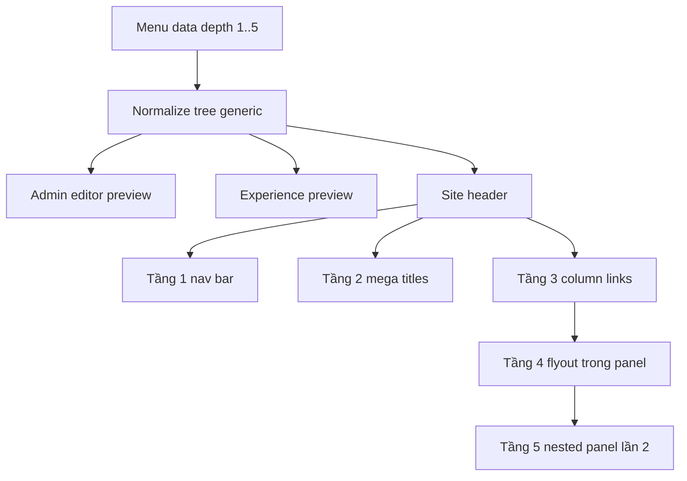

# I. Primer
## 1. TL;DR kiểu Feynman
- Nếu menu có 4-5 tầng thì không nên dùng dropdown dây chuyền kiểu cũ nữa, vì rất dễ vỡ layout và khó rê chuột.
- Với depth sâu, pattern đúng là **mega menu**: tầng 1 ở thanh nav, tầng 2 là nhóm lớn trong panel, tầng 3 là link/nhóm trong từng cột.
- Với tầng 4-5, em sẽ không thả vô hạn theo chiều ngang; thay vào đó dùng **nested flyout có kiểm soát bên trong mega menu** để vẫn xem được mà không rối.
- Admin/system/site cần dùng cùng một contract depth để tránh cấu hình một kiểu, render một kiểu.
- Hướng này phù hợp hơn yêu cầu mới của anh: vẫn cho xem tầng 4-5 ở site thật, nhưng theo cách “gọn và premium” hơn dropdown thường.

## 2. Elaboration & Self-Explanation
Khái niệm `mega menu` là một menu mở rộng theo dạng **panel lớn**, thường chiếm bề ngang đáng kể dưới header, thay vì chỉ là một danh sách nhỏ rơi xuống. Nó hợp với site có nhiều nhóm nội dung vì người dùng nhìn được nhiều nhánh cùng lúc.

Nếu site chỉ có 2-3 tầng, dropdown/flyout truyền thống vẫn dùng được. Nhưng khi lên 4-5 tầng thì sẽ gặp 3 vấn đề:
- Người dùng khó điều khiển chuột qua nhiều lớp menu lồng nhau.
- Bố cục dễ tràn màn hình hoặc che nội dung.
- Code render hard-code rất dễ lệch giữa preview và site thật.

Vì vậy, em đề xuất chuyển tư duy từ “dropdown nhiều lớp” sang “mega menu có hierarchy (phân cấp) rõ ràng” như sau:
- **Tầng 1**: item trên thanh menu ngang.
- **Tầng 2**: tiêu đề nhóm trong mega menu panel.
- **Tầng 3**: danh sách link hiển thị trực tiếp trong từng cột.
- **Tầng 4**: khi hover/focus vào item tầng 3 có con, mở một dropdown/flyout nhỏ ngay cạnh item đó nhưng vẫn nằm trong vùng mega menu.
- **Tầng 5**: khi item tầng 4 có con, hiển thị tiếp panel cấp hai nhỏ hơn, theo pattern hiện tại của sub-menu cấp 3 nhưng bị giới hạn trong container an toàn.

Nói ngắn gọn: thay vì làm menu “đâm ngang mãi”, ta làm một khung lớn có các cột chính, còn nhánh sâu chỉ bung thêm ở phạm vi nhỏ trong khung đó.

## 3. Concrete Examples & Analogies
- Ví dụ menu:
  - Tầng 1: Sản phẩm
  - Tầng 2: Điện thoại
  - Tầng 3: iPhone
  - Tầng 4: iPhone 16 Series
  - Tầng 5: Phụ kiện tương thích

  Khi user hover `Sản phẩm`, mega menu mở ra.
  - Cột 1 có tiêu đề `Điện thoại`.
  - Dưới đó có `iPhone`, `Samsung`, `Xiaomi`.
  - Hover vào `iPhone` thì một panel nhỏ mở cạnh cột, chứa `iPhone 16 Series`, `iPhone 15 Series`.
  - Hover vào `iPhone 16 Series` thì panel nhỏ cấp 2 hiện `Phụ kiện tương thích`, `Màu sắc`, `Bản dung lượng`.

- Analogy đời thường:
  - Dropdown thường giống mở từng ngăn kéo nối tiếp nhau.
  - Mega menu giống một tủ hồ sơ lớn: tầng 2 là ngăn chính, tầng 3 là tập tài liệu trong ngăn, tầng 4-5 là các tab phụ mở cạnh đó. Người dùng đỡ bị “lạc chuột” hơn nhiều.

# II. Audit Summary (Tóm tắt kiểm tra)
- Observation:
  - `lib/modules/configs/menus.config.ts` đang để `maxDepth` là number tự do.
  - `components/site/Header.tsx` và `components/experiences/previews/HeaderMenuPreview.tsx` đang build tree hard-code tới depth 2.
  - `app/admin/menus/page.tsx` đang thụt lề theo depth nhưng UX chỉ thực sự tối ưu cho 2-3 cấp.
  - `convex/menus.ts` chưa enforce contract depth đầy đủ ở mọi đường ghi.
- Inference:
  - Vấn đề chính là data model cho phép sâu hơn khả năng render hiện tại.
- Decision:
  - Nếu đã chấp nhận depth 4-5, phải nâng render contract sang mega menu thay vì chỉ clamp UI đơn giản.

# III. Root Cause & Counter-Hypothesis (Nguyên nhân gốc & Giả thuyết đối chứng)
- 1. Triệu chứng quan sát được là gì?
  - Expected: depth 4-5 vẫn xem được ở site thật và hợp mắt.
  - Actual: render hiện tại chỉ ổn đến khoảng 3 tầng.
- 2. Phạm vi ảnh hưởng?
  - `/system/modules/menus`, `/admin/menus`, `Header.tsx`, `HeaderMenuPreview.tsx`, data menu Convex.
- 3. Có tái hiện ổn định không?
  - Có. Chỉ cần dữ liệu depth >= 3 là site hiện tại bắt đầu không biểu diễn đúng hierarchy sâu.
- 4. Mốc thay đổi gần nhất?
  - Không cần truy commit để kết luận vì evidence nằm ngay trong source logic tree hiện tại.
- 5. Dữ liệu nào đang thiếu?
  - Không thiếu để ra spec. Chỉ thiếu số lượng cụ thể record depth sâu nếu rollout thật.
- 6. Có giả thuyết thay thế hợp lý nào chưa bị loại trừ?
  - Có thể CSS cũng góp phần khó dùng, nhưng không phải nguyên nhân gốc; gốc vẫn là tree/render contract hard-code.
- 7. Rủi ro nếu fix sai nguyên nhân?
  - Nếu chỉ đổi UI system thành dropdown 1..5 mà không refactor mega menu render thì tầng 4-5 vẫn không dùng được.
- 8. Tiêu chí pass/fail sau khi sửa?
  - Tạo depth 1..5 xong, site thật xem được đầy đủ; admin/preview/site đồng bộ cùng logic.

**Root Cause Confidence (Độ tin cậy nguyên nhân gốc): High**
- Lý do: evidence trực tiếp từ code tree builder + nhu cầu mới yêu cầu behavior vượt khả năng hiện tại.

# IV. Proposal (Đề xuất)
## 1. Mapping depth -> UI contract
### a) Desktop
- **Depth 0 / Tầng 1**
  - Hiển thị trên thanh menu ngang như hiện tại.
- **Depth 1 / Tầng 2**
  - Hiển thị thành tiêu đề cột hoặc group title trong mega menu panel.
- **Depth 2 / Tầng 3**
  - Hiển thị thành danh sách item trong cột.
- **Depth 3 / Tầng 4**
  - Nếu item tầng 3 có con, hover/focus sẽ mở flyout nhỏ ở cạnh phải của item đó, nhưng vẫn nằm trong vùng panel mega menu.
- **Depth 4 / Tầng 5**
  - Nếu item tầng 4 có con, mở thêm panel cấp 2 nhỏ hơn, theo pattern sub-menu hiện tại nhưng giới hạn chiều rộng/vị trí để không tràn viewport.

### b) Mobile
- Không dùng mega menu desktop.
- Dùng accordion đệ quy 1..5 tầng.
- Mỗi tầng tăng indent và có vùng bấm riêng; không hover.

## 2. Nguyên tắc UX mega menu
- Tầng 2 phải là group title lớn, dễ scan.
- Tầng 3 là nội dung chính người dùng nhìn thấy đầu tiên.
- Tầng 4-5 chỉ bung khi item có children, không bung đại trà từ đầu.
- Flyout tầng sâu phải nằm trong “safe hover area” để tránh rê chuột lệch là mất menu.
- Giới hạn chiều rộng và chiều cao; nếu quá dài thì scroll cục bộ trong panel, không đẩy vỡ header.
- Keyboard/focus-visible phải đi được qua các cấp.

## 3. Quyết định kỹ thuật
- Chuyển tree builder sang generic recursion/stack-based thay vì hard-code 3 tầng.
- Tạo helper chung để site thật và experience preview dùng cùng 1 tree transform.
- Admin preview đổi từ linear indent đơn giản sang preview hierarchy có label cấp rõ hơn.
- System config `maxDepth` đổi sang dropdown `1..5`.
- Backend clamp depth ở mọi mutation ghi; dữ liệu cũ depth >5 auto clamp về 5 UI level.

## 4. Counter-hypothesis
- Nếu anh chỉ cần “thấy được” depth 4-5 mà không cần đẹp, có thể dùng accordion hết cả desktop.
- Em không recommend vì xấu, không premium, và không hợp pattern site thương mại/sản phẩm.
- Phương án mega menu là cân bằng nhất giữa khả năng xem sâu và UI đẹp.

# V. Files Impacted (Tệp bị ảnh hưởng)
## UI
- **Sửa:** `components/site/Header.tsx`
  - Vai trò hiện tại: render header thật của site.
  - Thay đổi: thay dropdown 3 tầng hiện tại bằng mega menu contract 1..5 theo mapping mới.

- **Sửa:** `components/experiences/previews/HeaderMenuPreview.tsx`
  - Vai trò hiện tại: preview header trong experience editor.
  - Thay đổi: đồng bộ hoàn toàn pattern mega menu desktop + accordion mobile với site thật.

- **Sửa:** `app/admin/menus/page.tsx`
  - Vai trò hiện tại: menu editor cho header menu.
  - Thay đổi: làm rõ depth UI 1..5, preview/admin hint bám theo mega menu contract.

- **Sửa:** `app/admin/menus/SimpleMenuPreview.tsx`
  - Vai trò hiện tại: preview đơn giản theo margin-left.
  - Thay đổi: đổi sang preview cây/menu map dễ hiểu hơn cho mega menu.

## Shared / config
- **Sửa:** `lib/modules/configs/menus.config.ts`
  - Vai trò hiện tại: định nghĩa setting/feature của module menus.
  - Thay đổi: `maxDepth` từ number sang select 1..5.

- **Thêm hoặc Sửa:** helper dùng chung cho menu tree (có thể đặt gần `Header.tsx` hoặc shared lib menu)
  - Vai trò hiện tại: chưa có helper chung đủ tổng quát.
  - Thay đổi: gom normalize/build-tree để tránh logic lệch giữa site và preview.

## Server / data
- **Sửa:** `convex/menus.ts`
  - Vai trò hiện tại: CRUD menu/menuItems.
  - Thay đổi: clamp depth khi create/update/bulk save; thêm mutation normalize data cũ > 4.

# VI. Execution Preview (Xem trước thực thi)
1. Đọc lại contract depth hiện tại ở system/admin/site.
2. Đổi `maxDepth` sang select 1..5.
3. Thêm helper normalize depth + tree builder generic.
4. Áp helper vào site header thật.
5. Áp helper vào header experience preview.
6. Cập nhật admin menu preview/editor cho đúng semantics của mega menu.
7. Bổ sung clamp backend + migration normalize dữ liệu cũ.
8. Tự review tĩnh typing/null-safety/edge case hover-positioning.
9. Commit local.

# VII. Verification Plan (Kế hoạch kiểm chứng)
- Static verification:
  - type-safe ở các node children sâu 4-5.
  - không còn đoạn hard-code chỉ đến `depth === 2` trong path render chính.
- Manual repro checklist:
  - Chọn `maxDepth = 5` ở `/system/modules/menus`.
  - Tạo menu mẫu đủ 5 tầng ở `/admin/menus`.
  - Site desktop:
    - tầng 1 ở navbar;
    - tầng 2 là title/group trong mega panel;
    - tầng 3 hiển thị trong cột;
    - tầng 4 mở flyout trong panel;
    - tầng 5 mở panel lần 2.
  - Site mobile:
    - accordion mở đủ 5 tầng.
  - Experience preview:
    - cấu trúc giống site thật.
  - Data cũ:
    - depth >5 được normalize về depth 5 UI contract.

# VIII. Todo
- [ ] Đổi system setting `maxDepth` sang dropdown 1..5.
- [ ] Xây helper normalize/build menu tree generic.
- [ ] Refactor `Header.tsx` sang mega menu contract 1..5.
- [ ] Refactor `HeaderMenuPreview.tsx` đồng bộ với site thật.
- [ ] Cập nhật admin preview/editor để giải thích đúng semantics tầng 1..5.
- [ ] Clamp depth ở Convex mutations + normalize dữ liệu cũ.
- [ ] Static self-review.
- [ ] Commit local sau khi hoàn tất.

# IX. Acceptance Criteria (Tiêu chí chấp nhận)
- Có thể cấu hình menu sâu tới 5 tầng mà site thật vẫn xem được đầy đủ.
- Desktop dùng mega menu đúng mapping anh yêu cầu:
  - tầng 1: navbar
  - tầng 2: tiêu đề mega menu
  - tầng 3: nội dung cột
  - tầng 4: dropdown/flyout từ item tầng 3
  - tầng 5: panel lần 2 từ tầng 4
- Mobile hiển thị được đủ 5 tầng bằng accordion.
- Admin preview, experience preview, site thật dùng cùng contract depth.
- Không còn input number tự do cho `maxDepth`.

# X. Risk / Rollback (Rủi ro / Hoàn tác)
- Rủi ro:
  - Hover interaction tầng 4-5 có thể khó nếu vùng bắt chuột không đủ an toàn.
  - Mega menu sâu có thể phức tạp hơn cho accessibility nếu không xử lý focus đúng.
  - Dữ liệu menu cũ sắp xếp không chặt có thể sinh tree ngoài ý muốn.
- Rollback:
  - Revert commit.
  - Giữ clamp backend nếu muốn bảo toàn contract depth, rollback riêng phần mega menu UI nếu cần.

# XI. Out of Scope (Ngoài phạm vi)
- Không redesign toàn bộ system header style unrelated với menu depth.
- Không đổi business model của `menuItems` ngoài phần normalize depth/render contract.
- Không đụng footer/sidebar trừ khi anh mở scope sau.

# XII. Open Questions (Câu hỏi mở)
- Nếu anh duyệt spec này, lúc implement em sẽ ưu tiên desktop mega menu cho style `classic` trước, rồi đồng bộ `topbar` và `allbirds` theo cùng tree contract nhưng khác visual shell. Điều này giúp thay đổi nhỏ hơn và rollback dễ hơn.