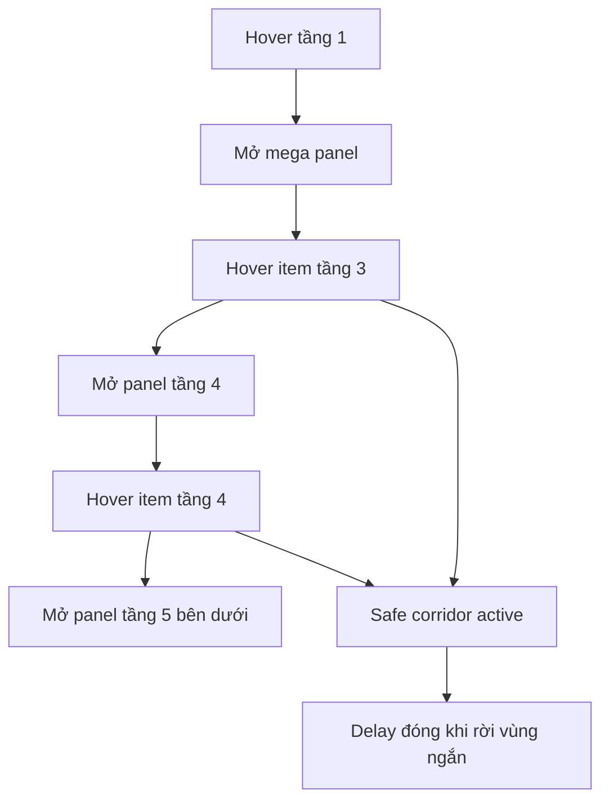

# I. Primer
## 1. TL;DR kiểu Feynman
- Vấn đề hiện tại không còn là data depth nữa, mà là **interaction model** của mega menu desktop chưa chuẩn.
- Theo best practice, menu nhiều tầng không nên chỉ dựa vào `group-hover` thuần vì rất dễ mở nhầm tầng sâu và rất dễ sập khi rê chuột lệch nhẹ.
- Em đề xuất đổi sang mô hình **progressive reveal + hover intent + safe corridor**.
- Kết quả mong muốn: tầng 4 chỉ hiện khi hover đúng item tầng 3; tầng 5 chỉ hiện khi hover đúng item tầng 4; rê chuột qua vùng chuyển tiếp không làm menu tự đóng.
- Đồng thời panel phải tự co theo số cột, không tạo horizontal scroll.

## 2. Elaboration & Self-Explanation
Hiện ảnh anh gửi cho thấy một lỗi UX rất điển hình của multi-level menu: khi user chỉ đang hover ở tầng 3, tầng 5 đã “lộ diện” hoặc cảm giác menu quá nhạy. Đây là dấu hiệu của việc menu con đang phụ thuộc vào CSS hover chain hoặc vùng hover bị dính quá rộng.

Best practice từ NN/g, Smashing Magazine và các tài liệu về `safe triangle / pointer corridor` nói chung đều xoay quanh 3 ý:
- **Progressive reveal**: chỉ hiện cấp kế tiếp khi người dùng thật sự đi vào item cha tương ứng.
- **Hover intent**: không phản ứng tức thì với mọi movement nhỏ; có delay mở/đóng hợp lý để người dùng thấy kiểm soát được UI.
- **Forgiving mouse path**: khi user rê chuột từ item cha sang panel con, phải có “hành lang an toàn” để menu không đóng giữa đường.

Tức là ở case của anh:
- Hover tầng 3 -> chỉ được mở tầng 4.
- Hover đúng item tầng 4 -> mới mở tầng 5.
- Nếu rê chuột từ item tầng 4 xuống panel tầng 5 qua khoảng trắng nhỏ, menu vẫn giữ mở trong thời gian ngắn.

## 3. Concrete Examples & Analogies
- Ví dụ đúng:
  - Hover `Tầng 3` -> panel `Tầng 4` hiện.
  - Chưa hover vào `Tầng 4` thì `Tầng 5` chưa được render visible.
  - Khi rê chuột từ `Tầng 4` xuống panel `Tầng 5`, dù chuột lướt qua khe 8–16px, panel vẫn còn mở.

- Analogy:
  - Menu hiện tại giống công tắc cảm ứng quá nhạy, lướt qua là bật/tắt lung tung.
  - Menu chuẩn nên giống cửa tự động có cảm biến “thông minh”: bạn đang đi đúng hướng thì nó giữ mở, không đóng vào mặt bạn giữa chừng.

# II. Audit Summary (Tóm tắt kiểm tra)
- Observation:
  - Site đang dùng pattern hover-based nested panel trong `components/site/Header.tsx`.
  - Tầng sâu hiện phụ thuộc mạnh vào `group-hover/menu-node` nên dễ mở/đóng ngoài ý muốn.
  - Safe hover hiện mới chỉ là delay đóng root menu (`handleMenuLeave`), chưa có state machine riêng cho level 4/5.
  - Panel đã được co chiều rộng tốt hơn trước, nhưng interaction vẫn chưa đủ “forgiving”.
- Evidence:
  - User report + screenshot: hover tầng 3 nhưng tầng 5 đã hiện hoặc mất quá dễ.
  - WebSearch best-practice sources:
    - NN/g: timing for exposed content, menu design checklist.
    - Smashing: safe triangles / hover menu failures.
    - CSS-Tricks: forgiving mouse movement paths.
- Decision:
  - Cần refactor interaction từ CSS hover-chain sang controlled hover state cho desktop mega menu.

# III. Root Cause & Counter-Hypothesis (Nguyên nhân gốc & Giả thuyết đối chứng)
- 1. Triệu chứng quan sát được là gì?
  - Expected: tầng 5 chỉ hiện khi hover item tầng 4, và menu không mất quá dễ.
  - Actual: tầng sâu mở sớm hoặc mất khi rê chuột không chuẩn tuyệt đối.
- 2. Phạm vi ảnh hưởng?
  - Chủ yếu desktop site header; preview có thể cần đồng bộ sau để tránh lệch cảm nhận.
- 3. Có tái hiện ổn định không?
  - Có, nhất là với dataset 4–5 tầng và khoảng trống giữa các panel.
- 4. Mốc thay đổi gần nhất?
  - Sau khi chuyển sang mega menu + flyout dưới panel, interaction vẫn còn dựa nhiều vào CSS hover chain.
- 5. Dữ liệu nào đang thiếu?
  - Không thiếu blocker; nếu cần tối ưu sâu hơn có thể đo pointer path thật bằng session replay, nhưng chưa cần cho fix này.
- 6. Có giả thuyết thay thế hợp lý nào chưa bị loại trừ?
  - Không phải do width panel đơn thuần; gốc là state interaction chưa đủ explicit.
- 7. Rủi ro nếu fix sai nguyên nhân?
  - Nếu chỉ tăng delay đóng mà không đổi logic mở theo parent item, menu vẫn mở sai tầng.
- 8. Tiêu chí pass/fail sau khi sửa?
  - Hover tầng 3 không làm tầng 5 hiện sớm.
  - Hover tầng 4 mới hiện tầng 5.
  - Rê chuột vào vùng chuyển tiếp không làm đóng menu ngoài ý muốn.

**Root Cause Confidence (Độ tin cậy nguyên nhân gốc): High**
- Reason: triệu chứng khớp trực tiếp với anti-pattern hover-chain và thiếu pointer-safe logic.

# IV. Proposal (Đề xuất)
## 1. Interaction model mới
### a) Progressive reveal rõ ràng
- Root menu dùng `hoveredRootId` như hiện tại.
- Trong mega panel, thêm state riêng:
  - `activeLevel3Id`
  - `activeLevel4Id`
- Quy tắc:
  - Hover item tầng 3 -> set `activeLevel3Id`, reset `activeLevel4Id`.
  - Hover item tầng 4 -> set `activeLevel4Id`.
  - Tầng 5 render dựa trên `activeLevel4Id`, không dựa vào CSS chain.

### b) Safe hover / forgiving movement
- Thêm `closeIntentTimeout` riêng cho panel con.
- Dùng wrapper chung bao item cha + panel con để onMouseLeave không bị cắt sớm.
- Nếu chuột rời vùng ngắn < 250–350ms thì chưa đóng ngay.
- Có thể thêm `pointer corridor` đơn giản bằng một bridge element hoặc bounding-zone chung thay vì full safe-triangle geometry ngay từ đầu.

### c) Width & responsive rules
- Mega panel level 2–3 tiếp tục co theo số cột thực tế.
- Panel tầng 5 hiển thị **bên dưới item tầng 4**, width giới hạn theo viewport.
- Cấm overflow ngang:
  - `max-w-[min(...)]`
  - `overflow-x-hidden/clip`
  - panel anchor ưu tiên trái thay vì cộng dồn sang phải.

## 2. Best-practice mapping từ research
- NN/g timing guideline: delay đóng menu 0.3–0.5s hợp lý hơn đóng tức thì.
- Smashing safe triangle: user đang đi về phía submenu thì menu không nên đóng ngay.
- CSS-Tricks forgiving path: thêm vùng chuyển tiếp / pseudo-element bridge để tránh mất hover do khe nhỏ.

## 3. Scope thực thi recommend
- Ưu tiên sửa **site thật desktop** trước.
- Sau khi interaction ổn mới đồng bộ `HeaderMenuPreview.tsx` để preview khớp production.
- Không mở rộng sang mobile vì mobile hiện dùng accordion, không gặp bug này.

# V. Files Impacted (Tệp bị ảnh hưởng)
## UI
- **Sửa:** `components/site/Header.tsx`
  - Vai trò hiện tại: render desktop mega menu + mobile menu cho site thật.
  - Thay đổi: thay nested `group-hover` cho tầng sâu bằng controlled hover state, delay đóng và safe corridor.

- **Sửa (follow-up đồng bộ):** `components/experiences/previews/HeaderMenuPreview.tsx`
  - Vai trò hiện tại: preview interaction/header trong system experience.
  - Thay đổi: mirror logic interaction desktop để preview phản ánh đúng production.

## Shared
- **Có thể thêm nhỏ:** helper hover-intent/safe-close trong `Header.tsx` hoặc util nội bộ nếu cần tách logic gọn hơn.
  - Vai trò hiện tại: chưa có abstraction riêng cho submenu intent.
  - Thay đổi: gom timeout/reset/open state logic cho dễ maintain.

# VI. Execution Preview (Xem trước thực thi)
1. Audit đoạn render tầng 3/4/5 ở `Header.tsx`.
2. Thay CSS hover-chain bằng state control cho active level 3/4.
3. Gói item cha + panel con vào hover-safe zone.
4. Tinh chỉnh delay đóng và reset state đúng thứ tự.
5. Giữ panel tầng 5 mở xuống dưới thay vì sang phải.
6. Review overflow ngang ở viewport hẹp desktop.
7. Đồng bộ preview nếu cần.
8. Static review + typecheck + commit local.

# VII. Verification Plan (Kế hoạch kiểm chứng)
- Manual desktop checks:
  - Hover tầng 1 -> mở mega panel.
  - Hover item tầng 3 -> chỉ hiện tầng 4.
  - Hover item tầng 4 -> mới hiện tầng 5.
  - Rê chuột từ item tầng 4 xuống panel tầng 5 qua khe nhỏ -> menu vẫn giữ.
  - Di chuột ra ngoài toàn bộ vùng -> menu đóng sau delay ngắn.
  - Không xuất hiện horizontal scroll ở viewport desktop chuẩn.
- Preview checks:
  - Nếu đồng bộ preview, behavior nhìn tương đương production.
- Static checks:
  - Không còn phụ thuộc hoàn toàn vào `group-hover` cho mở tầng 5.

# VIII. Todo
- [ ] Refactor interaction tầng 3/4/5 trong `Header.tsx` sang controlled hover state.
- [ ] Thêm close delay + hover-safe zone cho submenu sâu.
- [ ] Verify panel tầng 5 chỉ mở khi hover tầng 4.
- [ ] Đảm bảo không có horizontal overflow.
- [ ] Đồng bộ preview nếu cần.
- [ ] Typecheck và commit local.

# IX. Acceptance Criteria (Tiêu chí chấp nhận)
- Hover tầng 3 không làm tầng 5 hiện sớm.
- Hover tầng 4 mới làm tầng 5 hiện.
- Rê chuột qua khoảng trắng nhỏ giữa tầng 4 và tầng 5 không làm submenu mất ngay.
- Không có horizontal scrollbar do menu gây ra.
- Panel vẫn gọn, rộng theo số cột cần thiết.

# X. Risk / Rollback (Rủi ro / Hoàn tác)
- Rủi ro:
  - State hover sâu nếu quản lý không gọn có thể tạo flicker.
  - Nếu delay quá lớn sẽ gây cảm giác menu “lì”.
- Rollback:
  - Revert commit interaction.
  - Giữ nguyên phần width fix nếu muốn, rollback riêng hover-state logic.

# XI. Out of Scope (Ngoài phạm vi)
- Không đổi data model menu.
- Không đổi mobile accordion ngoài các guard overflow nếu phát sinh.
- Không redesign visual theme tổng thể của header.

# XII. Open Questions (Câu hỏi mở)
- Không còn ambiguity blocker; hướng recommend là controlled hover state + safe corridor đơn giản trước, chưa cần full geometric safe-triangle algorithm ở vòng này.