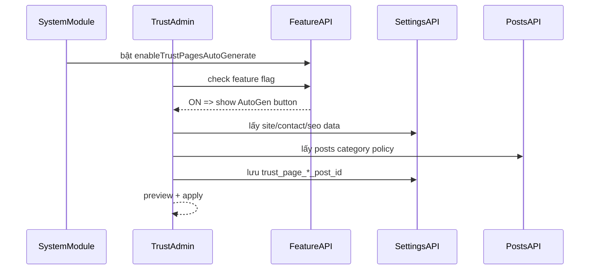

# I. Primer
## 1. TL;DR kiểu Feynman
- Chốt theo ý bạn: Trust Pages quản trị ở **`/admin/trust-pages`**, thuộc **Settings ownership**, hiển thị trong nhóm **Website**.
- Bổ sung ở `/system` (module settings) một feature toggle mới: **`enableTrustPagesAutoGenerate`**.
- Khi toggle này bật, trong `/admin/trust-pages` sẽ hiện nút **“Sinh tự động từ dữ liệu thực”** để admin học chuẩn vận hành.
- Nút auto-generate không sinh nội dung cứng: nó lấy dữ liệu thật (site/contact/seo/social + posts policy hiện có) để đề xuất/mapping.
- Pattern tham chiếu sát thị trường: Shopify có policy generator trong admin; Haravan/Sapo gom policy vào khu quản trị website, ưu tiên thao tác đơn giản.

## 2. Elaboration & Self-Explanation
Bạn muốn admin “ngu ngơ vẫn làm được”, nên giải pháp không phải bắt admin viết từ đầu hoặc nhét cứng trong IA. Cách đúng là tạo một màn quản trị đơn giản theo slot (`about/privacy/terms/...`) và có nút auto-generate học theo dữ liệu thật. Toggle ở System giúp team chủ động bật/tắt tính năng nâng cao theo giai đoạn rollout. Khi bật module feature ở System thì nút mới hiện ở Admin (đúng contract 1-way dependency đang dùng trong repo).

## 3. Concrete Examples & Analogies
- Ví dụ: shop đã có `site_name`, `contact_email`, `contact_address`, `shipping` policy trong post cũ.
  - Admin vào `/admin/trust-pages`, bấm “Sinh tự động từ dữ liệu thực”.
  - Hệ thống gợi ý map bài phù hợp cho `/privacy`, `/shipping`, `/terms`; chỗ thiếu thì tạo draft post policy từ template + dữ liệu thật.
  - Admin chỉ review nhanh và publish.
- Analogy: giống “điền form thuế có auto-fill” — hệ thống tự điền phần chắc chắn, người dùng chỉ duyệt và sửa nhẹ.

# II. Audit Summary (Tóm tắt kiểm tra)
- Observation (evidence):
  - `app/system/ia/page.tsx` đang hard-code `TRUST_PAGES` và chỉ toggle boolean.
  - `lib/ia/settings.ts` hiện lưu `ia_page_*` theo bật/tắt, chưa có ownership nội dung.
  - `lib/modules/configs/settings.config.ts` đã có pattern feature toggle cho Settings (`enableContact`, `enableSEO`, `enableSocial`).
  - `app/admin/components/Sidebar.tsx` đang gate sub-item theo `moduleKey`, phù hợp để gắn thêm `/admin/trust-pages`.
  - Convex đã có mặt bằng settings key-value (`convex/settings.ts`) + module feature toggles (`convex/admin/modules.ts`).
- Web research (2026):
  - Shopify Help: hỗ trợ generate return/privacy/terms/shipping policies trong admin.
  - Haravan Help: quản trị các trang chính sách như phần vận hành website.
  - Sapo: định hướng quản trị website theo cụm cấu hình + nội dung, giảm độ khó cho người mới.
- Inference: mô hình tốt nhất là slot trust chuẩn + auto-generate từ dữ liệu thật + review trước publish.

# III. Root Cause & Counter-Hypothesis (Nguyên nhân gốc & Giả thuyết đối chứng)
- Root cause:
  1. Triệu chứng: Trust Pages ở `/system/ia` đang thiên kỹ thuật, admin khó vận hành nội dung thực tế.
  2. Phạm vi: ảnh hưởng đội admin nội dung, SEO trust routes, và onboarding user mới.
  3. Tái hiện: ổn định — hiện chỉ có toggle route, không có luồng tạo/mapping nội dung thân thiện.
  4. Mốc liên quan: IA hub đã thêm gần đây nhưng trust vẫn hard-code theo key boolean.
  5. Gap dữ liệu: chưa có feature-level toggle để bật/tắt auto-generate theo môi trường đội vận hành.
  6. Giả thuyết thay thế đã loại: tạo module Policies riêng (quá nặng), hoặc giữ hard-code + toggle (không giải quyết vận hành).
  7. Rủi ro fix sai nguyên nhân: thêm UI mới nhưng vẫn bắt admin thao tác nặng, không đạt mục tiêu “dễ học”.
  8. Pass/fail: admin bấm 1 nút có thể tạo/gợi ý trust pages từ dữ liệu thật và publish được.
- **Root Cause Confidence (Độ tin cậy nguyên nhân gốc): High** — có bằng chứng trực tiếp từ code + pattern module feature sẵn có + benchmark SaaS.

# IV. Proposal (Đề xuất)
## 1. Kiến trúc chốt
- Admin vận hành chính: **`/admin/trust-pages`**.
- Ownership: **Settings module**.
- System toggle mới: `settings.enableTrustPagesAutoGenerate` (bật ở `/system/modules/settings`).
- Khi toggle ON => hiện nút auto-generate ở admin; OFF => ẩn nút, vẫn cho chỉnh tay.

## 2. Data model & contract
- Giữ key cũ để tương thích: `ia_page_about`, `ia_page_terms`, ...
- Thêm mapping keys:
  - `trust_page_about_post_id`
  - `trust_page_terms_post_id`
  - `trust_page_privacy_post_id`
  - `trust_page_return_policy_post_id`
  - `trust_page_shipping_post_id`
  - `trust_page_payment_post_id`
  - `trust_page_faq_post_id`
- Optional trạng thái học/đề xuất:
  - `trust_page_last_autogen_at`
  - `trust_page_last_autogen_by`

## 3. Auto-generate từ dữ liệu thực (không cứng nhắc)
- Input nguồn thật:
  - Settings: site/contact/seo/social keys.
  - Posts: category policy (nếu đã có).
  - IA toggles hiện tại.
- Logic:
  1) Ưu tiên map post policy đã tồn tại theo heuristic title/slug (`privacy`, `điều khoản`, `vận chuyển`, ...).
  2) Slot nào chưa có thì tạo draft post từ template động (điền biến thật từ settings).
  3) Trả về preview diff: “đã map”, “đã tạo draft”, “cần admin review”.
- Guardrails:
  - Không auto-publish bắt buộc (mặc định tạo draft để admin học + duyệt).
  - Có chế độ “Auto publish” riêng (phase 2, nếu cần).

## 4. UX tối giản cho admin lạ
- Màn `/admin/trust-pages` gồm 7 card slot chuẩn.
- Mỗi slot có:
  - URL cố định (không cho đổi bừa),
  - toggle enable,
  - chọn bài mapped,
  - badge trạng thái (Mapped / Missing / Draft).
- Nút nổi bật:
  - `Sinh tự động từ dữ liệu thực` (chỉ hiện khi feature ON từ System),
  - `Xem trước thay đổi`,
  - `Áp dụng`.

## 5. Pattern SaaS tham chiếu đưa vào implement
- Shopify-style: generate policy từ dữ liệu cửa hàng, rồi cho admin review trong admin UI.
- Haravan/Sapo-style: policy nằm ở khu quản trị website, không ép thao tác kỹ thuật ở IA core.

```mermaid
flowchart TD
  A[System: enableTrustPagesAutoGenerate] -->|ON| B[/admin/trust-pages hiện nút AutoGen]
  A -->|OFF| C[/admin/trust-pages ẩn nút AutoGen]
  B --> D[AutoGen đọc Settings + Posts thật]
  D --> E{Có policy post sẵn?}
  E -->|Có| F[Map vào trust slots]
  E -->|Không| G[Tạo draft từ template động]
  F --> H[Preview diff]
  G --> H
  H --> I[Admin duyệt và áp dụng]
```



# V. Files Impacted (Tệp bị ảnh hưởng)
- **Sửa:** `lib/modules/configs/settings.config.ts`
  - Vai trò hiện tại: khai báo features/settings cho module settings.
  - Thay đổi: thêm feature `enableTrustPagesAutoGenerate` (label rõ cho System).

- **Sửa:** `convex/seed.ts` (phần seed moduleFeatures/settings)
  - Vai trò hiện tại: seed feature mặc định.
  - Thay đổi: seed feature mới cho settings module.

- **Sửa:** `app/admin/components/Sidebar.tsx`
  - Vai trò hiện tại: điều hướng/gate theo module.
  - Thay đổi: thêm sub-item `Trust Pages` trong nhóm Website, gated module `settings`.

- **Thêm:** `app/admin/trust-pages/page.tsx`
  - Vai trò mới: UI quản trị trust slots + auto-generate action + preview.
  - Thay đổi: build luồng thao tác đơn giản cho admin mới.

- **Sửa/Thêm:** Convex layer cho trust mappings (trong `convex/settings.ts` hoặc module liên quan)
  - Vai trò hiện tại: đọc/ghi key-value settings.
  - Thay đổi: read/write mapping keys + action auto-generate từ dữ liệu thực.

- **Sửa:** `lib/ia/settings.ts`
  - Vai trò hiện tại: đọc route mode + trust toggles.
  - Thay đổi: đọc thêm trust mapping ids để resolver public dùng.

- **Sửa:** `app/(site)/about/page.tsx`, `terms`, `privacy`, `return-policy`, `shipping`, `payment`, `faq`
  - Vai trò hiện tại: check toggle và render hiện trạng.
  - Thay đổi: resolve nội dung từ post mapped; fallback an toàn khi thiếu.

- **Sửa:** `app/system/ia/page.tsx`
  - Vai trò hiện tại: đang ôm phần trust toggles hard-code.
  - Thay đổi: giảm scope còn IA governance; thêm hint “quản trị nội dung trust tại /admin/trust-pages”.

# VI. Execution Preview (Xem trước thực thi)
1. Thêm feature toggle mới vào Settings module + seed.
2. Tạo admin route `/admin/trust-pages` với 7 slot chuẩn và luồng mapping.
3. Nối Convex action auto-generate đọc dữ liệu thật và trả preview diff.
4. Gắn visibility nút auto-generate theo feature toggle từ System.
5. Cập nhật resolver public trust pages dùng mapping post.
6. Thu gọn `/system/ia` để tránh chồng trách nhiệm.
7. Static self-review toàn bộ typing/null-safety/backward compatibility.

# VII. Verification Plan (Kế hoạch kiểm chứng)
- Trường hợp A (feature OFF): vào `/admin/trust-pages` không thấy nút auto-generate.
- Trường hợp B (feature ON): thấy nút, bấm được, có preview diff rõ.
- Trường hợp C: có sẵn post policy => auto-map đúng slot.
- Trường hợp D: thiếu post policy => auto-create draft dùng dữ liệu thật.
- Trường hợp E: apply xong, public `/privacy`… render đúng post mapped.
- Trường hợp F: disable slot => route tương ứng trả 404 đúng contract.

# VIII. Todo
1. Thêm feature `enableTrustPagesAutoGenerate` vào settings module + seed.
2. Tạo `/admin/trust-pages` (slot UI + mapping CRUD).
3. Xây action auto-generate từ dữ liệu thật (settings + posts policy).
4. Nối gate hiển thị nút auto-generate theo feature từ System.
5. Cập nhật trust routes public đọc mapping post.
6. Refactor nhẹ `/system/ia` chỉ còn IA control-plane.

# IX. Acceptance Criteria (Tiêu chí chấp nhận)
- Admin có màn quản trị trust tập trung tại `/admin/trust-pages`.
- Bật feature tại System thì nút auto-generate xuất hiện ở Admin; tắt thì ẩn.
- Auto-generate dùng dữ liệu thật, không hard-code nội dung tĩnh.
- Người mới có thể hoàn thành cấu hình trust pages với ít bước và có preview.
- Public trust URLs ổn định, nội dung linh hoạt theo mapping.

# X. Risk / Rollback (Rủi ro / Hoàn tác)
- Rủi ro: heuristic map sai bài policy.
- Giảm thiểu: luôn có preview diff + require confirm trước apply.
- Rollback: giữ mapping cũ, không overwrite khi chưa confirm; có nút restore mapping trước đó.

# XI. Out of Scope (Ngoài phạm vi)
- Không triển khai legal review engine hay kiểm định pháp lý nội dung.
- Không tạo module Policies riêng độc lập ở phase này.
- Không thêm workflow duyệt nhiều cấp/phê duyệt pháp chế.

# XII. Open Questions (Câu hỏi mở)
- Mặc định action auto-generate có nên chỉ tạo draft (an toàn) hay cho phép chọn “draft/publish” ngay trong dialog?
- Có cần khóa chỉ cho role nhất định dùng nút auto-generate không (vd. owner/admin chính)?