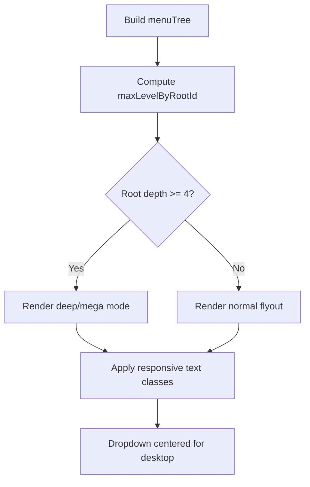

# I. Primer
## 1. TL;DR kiểu Feynman
- Mục tiêu: copy **đúng tinh thần 1:1** commit `8dd27d89` từ repo `kdc` sang repo hiện tại cho feature menu.
- Trọng tâm là 2 thứ: (a) xác định deep menu theo **từng root item** thay vì global, (b) cải thiện responsive cho text/menu dropdown.
- Runtime `components/site/Header.tsx` của repo hiện tại đã có phần lớn thay đổi này; preview `HeaderMenuPreview.tsx` còn lệch một phần hành vi.
- Kế hoạch: áp commit-level changes vào đúng 2 file tương ứng, giữ scope nhỏ, không mở rộng tính năng khác.
- Kết thúc bằng 1 commit squash theo yêu cầu bạn.

## 2. Elaboration & Self-Explanation
- Trước đây logic deep menu có thể dựa theo max depth toàn cục, dễ làm root A bị “deep mode” chỉ vì root B sâu hơn.
- Commit tham chiếu sửa bằng cách tính `maxLevelByRootId` trên cây menu và dùng `isDeepMenuForItem(rootId)` khi render dropdown.
- Nhờ đó root nào đủ sâu mới bật deep-mode; root nông vẫn giữ dropdown thường, tránh UI “nặng” không cần thiết.
- Song song, commit thêm class responsive (`min-w-0`, `whitespace-normal`, `break-words`, `leading-snug`, `gap-2`, `items-start`) và căn giữa dropdown (`left-1/2 -translate-x-1/2`) để text dài không vỡ layout.

## 3. Concrete Examples & Analogies
- Ví dụ cụ thể:
  - Root “Sản phẩm” có depth 4 → render mega/deep menu.
  - Root “Giới thiệu” chỉ depth 2 → render dropdown đơn giản.
  - Với logic per-root, 2 root này không còn bị ép cùng 1 mode.
- Analogy đời thường: như chia làn giao thông theo từng tuyến; tuyến đông mở thêm làn, tuyến ít xe giữ làn cơ bản — không ép mọi tuyến cùng cấu hình.

# II. Audit Summary (Tóm tắt kiểm tra)
- **Observation**
  1) Commit nguồn cần học: `feat(menu): enhance menu depth handling and improve layout responsiveness` (hash `8dd27d89`) trong `E:\NextJS\job\kdc`.
  2) Commit này đổi đúng 2 file: `components/site/Header.tsx` và `components/experiences/previews/HeaderMenuPreview.tsx`.
  3) Repo hiện tại có cùng 2 file tương ứng và cấu trúc rất gần.
- **Inference**
  - Có thể port gần như 1:1 theo patch logic/className mà không cần đổi schema/data/API.
- **Decision**
  - Bám tuyệt đối commit tham chiếu, scope chỉ 2 file UI, giữ một commit squash.

# III. Root Cause & Counter-Hypothesis (Nguyên nhân gốc & Giả thuyết đối chứng)
- **Root Cause chính**: hành vi deep menu và responsive layout chưa đồng nhất hoàn toàn với bản chuẩn commit tham chiếu (đặc biệt bề mặt preview).
- **Root Cause Confidence (Độ tin cậy nguyên nhân gốc): High**
  - Lý do: đã đối chiếu trực tiếp diff commit nguồn và file hiện tại, cùng vị trí logic (depth detection + dropdown/text class).
- **Counter-hypothesis (Giả thuyết đối chứng)**
  1) Không phải do dữ liệu menu bẩn/thiếu depth: vì commit nguồn sửa render logic thuần UI, không động vào data layer.
  2) Không phải do thiếu module/settings: thay đổi nằm ở cách render dropdown + class responsive, không thêm dependency mới.

# IV. Proposal (Đề xuất)
1. Port 1:1 các thay đổi từ commit `8dd27d89` vào repo hiện tại, giới hạn đúng 2 file tương ứng.
2. Đồng bộ các điểm chính:
   a) Per-root depth map (`maxLevelByRootId`, `isDeepMenuForItem`).
   b) `renderDesktopFlyoutNodes` nhận `deepMode` và propagate đúng ở các nhánh gọi đệ quy.
   c) Căn giữa dropdown desktop ở các block liên quan (`left-1/2 -translate-x-1/2`).
   d) Bổ sung responsive class cho label/link để chống vỡ layout text dài.
3. Giữ nguyên behavior ngoài phạm vi commit tham chiếu (không refactor thêm).
4. Sau khi xong: tự review tĩnh + `bunx tsc --noEmit` (theo rule repo), rồi commit squash 1 lần.

# V. Files Impacted (Tệp bị ảnh hưởng)
- **Sửa:** `components/site/Header.tsx`
  - Vai trò hiện tại: Header runtime của site, chứa logic dropdown/deep menu theo cây menu.
  - Thay đổi: đồng bộ hoàn toàn logic per-root depth + deep-mode propagation + responsive dropdown/text theo commit nguồn.
- **Sửa:** `components/experiences/previews/HeaderMenuPreview.tsx`
  - Vai trò hiện tại: Preview header trong experience editor để mô phỏng runtime UI.
  - Thay đổi: port 1:1 depth handling và responsive layout để preview parity với runtime theo commit tham chiếu.

# VI. Execution Preview (Xem trước thực thi)
1. Đọc lại 2 file hiện tại + diff commit nguồn.
2. Chỉnh `Header.tsx` theo patch commit (nếu chỗ nào đã có sẵn thì giữ nguyên, chỉ bổ sung phần còn thiếu).
3. Chỉnh `HeaderMenuPreview.tsx` theo patch commit tương ứng.
4. Review tĩnh: typing, null-safety, className consistency, parity runtime/preview.
5. Chạy `bunx tsc --noEmit`.
6. Commit 1 lần dạng squash theo yêu cầu.

# VII. Verification Plan (Kế hoạch kiểm chứng)
1. Type-level:
   - `bunx tsc --noEmit` phải pass.
2. Repro-level (manual check):
   - Menu root sâu >=4 bật deep mode; root nông không bật deep mode.
   - Text label dài không tràn/cắt xấu trong dropdown.
   - Dropdown desktop căn giữa đúng, không lệch trái cố định.
3. Parity-level:
   - `HeaderMenuPreview` và `Header` cho kết quả hành vi nhất quán ở các case depth 2/3/4+.

# VIII. Todo
1. Port patch 1:1 vào `components/site/Header.tsx`.
2. Port patch 1:1 vào `components/experiences/previews/HeaderMenuPreview.tsx`.
3. Static self-review theo checklist typing/null-safety/parity.
4. Chạy `bunx tsc --noEmit`.
5. Tạo single commit squash cho toàn bộ thay đổi.

# IX. Acceptance Criteria (Tiêu chí chấp nhận)
- Logic deep menu xác định theo **từng root item**, không theo max depth toàn cục.
- Các nhánh flyout deep-mode render đúng (không sai mode khi đệ quy).
- Text menu dài hiển thị wrap ổn định, không vỡ layout.
- Dropdown desktop dùng căn giữa ở các vị trí commit nguồn đã chỉnh.
- Preview và runtime nhất quán cho cùng bộ dữ liệu menu.
- Toàn bộ thay đổi nằm trong đúng phạm vi 2 file đã nêu.

# X. Risk / Rollback (Rủi ro / Hoàn tác)
- Rủi ro chính: thay đổi spacing/position dropdown có thể làm lệch nhẹ ở một số viewport hẹp.
- Giảm rủi ro: bám patch 1:1, không refactor ngoài scope.
- Rollback: revert commit squash duy nhất là quay lại trạng thái trước đó.

# XI. Out of Scope (Ngoài phạm vi)
- Không thay schema Convex/data/menu records.
- Không đổi logic mobile menu ngoài phạm vi commit tham chiếu.
- Không thêm feature UI mới ngoài depth handling + responsive layout của commit nguồn.

# XII. Open Questions (Câu hỏi mở)
- Không còn ambiguity; yêu cầu đã chốt: bám tuyệt đối commit nguồn và gói trong 1 commit squash.