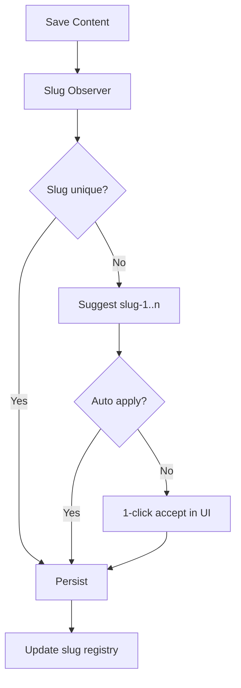
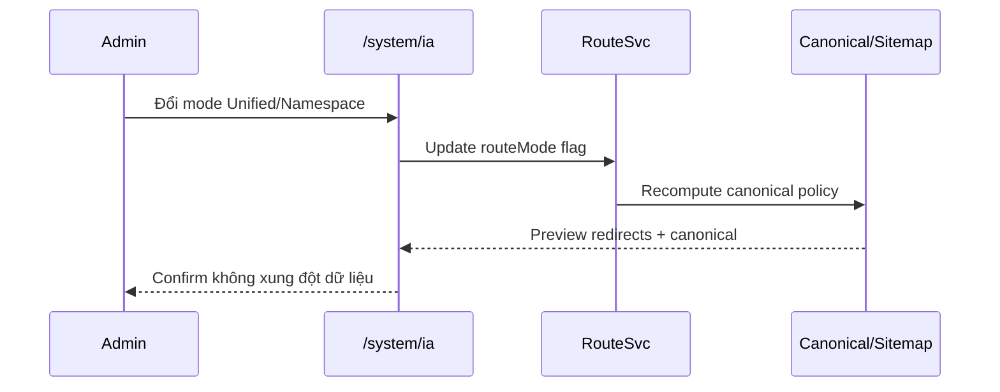

# I. Primer
## 1. TL;DR kiểu Feynman
- Mặc định sẽ là **Unified Mode** để URL public đi theo `/{category-slug}/{record-slug}` như bạn muốn.
- Hệ thống vẫn giữ **2 mode cấu hình được** (Unified/Namespace) nhưng chuyển mode không gây vỡ dữ liệu hay bắt admin xử lý thủ công.
- Thêm cơ chế **Slug Observer**: khi trùng slug thì tự gợi ý `-1/-2...`, admin chỉ cần click chọn hoặc auto-apply, không bị chặn bởi lỗi lặt vặt.
- Thêm trang **`/system/ia`** + entry sidebar để nhìn tổng thể cây IA thực tế, bật/tắt route mode, quản lý trust pages.
- Pha 1 sẽ có trust pages đầy đủ giá trị SEO/thương hiệu: About, Terms, Privacy, Return Policy, Shipping, Payment, FAQ.

## 2. Elaboration & Self-Explanation
- Ý chính của bạn là “đừng làm cho ngầu mà vô dụng” và “đừng làm admin khổ”. Nên spec này ưu tiên:
  - **Giảm ma sát vận hành** (auto-fix slug trùng, không bắt admin dò lỗi tay).
  - **Giữ ổn định SEO** (canonical rõ, redirect rõ, sitemap sạch).
  - **Có nơi quan sát tổng thể IA** (`/system/ia`) thay vì rải rác nhiều màn hình.
- Default Unified là khả thi nếu có 3 lớp bảo vệ:
  1) Global slug registry,
  2) Observer chống trùng,
  3) Canonical contract nhất quán khi đổi mode.
- “Không làm” cũng quan trọng: không thêm feature trang trí, không thêm workflow phức tạp không tạo giá trị index/crawl/conversion.

## 3. Concrete Examples & Analogies
- Ví dụ slug trùng:
  - Admin tạo category `seo`, đã có record slug `seo` ở module khác.
  - Observer phát hiện trùng, gợi ý ngay: `seo-1`, `seo-2`, nút “Dùng gợi ý tốt nhất”.
  - Admin click 1 lần, lưu xong.
- Khi đổi mode:
  - Unified canonical: `/seo/goi-seo-tong-the`
  - Namespace fallback vẫn truy cập được nhưng 301 về canonical (hoặc ngược lại nếu user đổi canonical mode).
- Analogy: như biển số xe cấp tự động, trùng số thì hệ thống cấp số kế, người dùng không phải tự thử 10 lần.

# II. Audit Summary (Tóm tắt kiểm tra)
- Đã có nền tảng IA/navigation:
  - `app/admin/menus/page.tsx` (tree depth + quick picker)
  - `app/system/experiences/menu/page.tsx`
- Public route hiện tại theo namespace:
  - List `/products|/posts|/services`
  - Detail `/{module}/{slug}`
- Category hiện lọc bằng query (`?category`, `?catpost`).
- SEO infra đã có tốt: `app/sitemap.ts`, `app/robots.ts`, `/system/seo`.
- Thiếu `app/(site)` pages cho nhóm policy/about (dù seed có URL footer mẫu).

# III. Root Cause & Counter-Hypothesis (Nguyên nhân gốc & Giả thuyết đối chứng)
- Root cause chính:
  1) Chưa có route resolution contract thống nhất cho đa module ở Unified path.
  2) Chưa có slug-governance tự động nên dễ tạo xung đột khi scale.
  3) Chưa có IA control-plane tập trung để vận hành SEO + trust pages.
- Counter-hypothesis bị loại:
  - “Chỉ cần đổi folder routes là xong” → Sai vì chưa giải quyết collision + canonical + sitemap duplication.
- Root Cause Confidence: **High**.

# IV. Proposal (Đề xuất)
## 1. Default mode và mode switch
- Mặc định hệ thống: **Unified Mode**.
- Có toggle tại `/system/ia`: `unified | namespace`.
- Mode switch **không mutate dữ liệu business**; chỉ đổi lớp route-resolution + canonical policy.

## 2. Slug Observer (admin-friendly, anti-lặt-vặt)
- Observer chạy ở create/update category/record cho posts/products/services.
- Luồng khi trùng slug:
  - Tự generate candidate: `slug`, `slug-1`, `slug-2`...
  - UI hiển thị nhẹ: “Slug trùng, đề xuất dùng `slug-1`” + nút `Áp dụng`.
  - Có tùy chọn “Tự áp dụng khi trùng” để admin khỏi nghĩ.
- Pattern tham chiếu thực tế:
  - WordPress `wp_unique_post_slug` (auto increment slug).
  - Shopify handle unique validation.

## 3. Route Resolution Contract
- Unified matcher:
  - `/{category}` => category hub (xác định module theo slug-map).
  - `/{category}/{record}` => detail (xác định module + record).
- Namespace matcher giữ tương thích cũ.
- Reserved static slugs ưu tiên cao: `about`, `terms`, `privacy`, `shipping`, `payment`, `faq`, ...

## 4. `/system/ia` (control-plane mới)
- Sidebar item mới: **IA**.
- Chức năng chính:
  - a) Route Mode + Canonical strategy.
  - b) Slug Collision Center (danh sách xung đột + 1-click resolve).
  - c) IA Tree Preview (header/footer/core public routes).
  - d) Trust Pages toggles + publish status.
- Mục tiêu: admin thao tác tối thiểu, quan sát tổng thể nhanh.

## 5. Trust pages pha 1 (có giá trị SEO thực)
- Thêm public pages:
  - `/about`, `/terms`, `/privacy`, `/return-policy`, `/shipping`, `/payment`, `/faq`.
- Chỉ thêm những trang có tín hiệu trust rõ cho user và search quality; không thêm trang “cho đủ bộ” mà không nội dung.

## 6. SEO migration policy (Google-aligned)
- Theo Google Search Central:
  - canonical rõ một chiều,
  - 301 rõ ràng khi URL đổi,
  - sitemap chỉ phát canonical URLs,
  - robots không chặn nhầm các hub public.

# V. Files Impacted (Tệp bị ảnh hưởng)
## 1. UI
- **Thêm:** `app/system/ia/page.tsx` — màn hình tổng hợp IA + mode + collision center.
- **Sửa:** `app/system/layout.tsx` — thêm sidebar entry `/system/ia`.
- **Sửa:** `app/admin/menus/page.tsx` — quick-picker hỗ trợ URL theo mode active.

## 2. Routing
- **Thêm:** unified route handlers (`/[categorySlug]`, `/[categorySlug]/[recordSlug]`) + resolver.
- **Sửa:** routes namespace hiện có để dùng chung canonical helper.

## 3. Convex / shared
- **Sửa/Thêm:** service slug registry + collision detection/resolution queries/mutations.
- **Sửa:** create/update flows posts/products/services để gọi Slug Observer.

## 4. SEO
- **Sửa:** `app/sitemap.ts` + split sitemap routes để chỉ xuất canonical URLs theo mode.
- **Sửa:** metadata generators tại list/detail để canonical nhất quán.

## 5. Trust pages
- **Thêm:** `app/(site)/about/page.tsx`, `terms`, `privacy`, `return-policy`, `shipping`, `payment`, `faq`.

# VI. Execution Preview (Xem trước thực thi)
1. Tạo route-mode config + default unified.
2. Build slug registry + observer (auto-suffix + one-click accept).
3. Implement unified routes + reserved slug priority.
4. Add `/system/ia` + sidebar + collision center.
5. Bổ sung trust pages pha 1.
6. Nối canonical/redirect/sitemap theo mode.
7. Static review: typing, null-safety, backward compatibility.

# VII. Verification Plan (Kế hoạch kiểm chứng)
- Check 1: Default vào Unified, route mới chạy ngay.
- Check 2: Tạo 2 slug trùng => observer đề xuất + apply thành công, không throw lỗi khó hiểu.
- Check 3: Đổi mode qua lại không làm mất record, không hỏng menu links.
- Check 4: canonical chỉ 1 URL/page; URL còn lại redirect đúng.
- Check 5: sitemap không duplicate URL nghĩa tương đương.
- Check 6: trust pages indexable, có trong internal links/footer.

# VIII. Todo
1. Route mode setting (default unified).
2. Slug observer + registry.
3. Unified resolver + reserved slug rules.
4. `/system/ia` control-plane + sidebar wiring.
5. Trust pages pha 1.
6. Canonical + redirect + sitemap alignment.

# IX. Acceptance Criteria (Tiêu chí chấp nhận)
- Default mode là Unified.
- Có thể đổi 2 mode tại `/system/ia` mà không vỡ dữ liệu.
- Admin không cần xử lý tay slug conflict nhiều bước; có auto/1-click resolve.
- URL detail chuẩn `/{category-slug}/{record-slug}` hoạt động cho 3 module.
- SEO surfaces (canonical/redirect/sitemap/robots) nhất quán, không duplicate indexable.
- Trust pages xuất hiện đầy đủ và đi vào IA tổng thể.

# X. Risk / Rollback (Rủi ro / Hoàn tác)
- Rủi ro: canonical sai khi chuyển mode, xung đột reserved slugs.
- Giảm thiểu: preview impact trước khi apply mode switch trong `/system/ia`.
- Rollback: chuyển về Namespace mode + giữ redirect map bảo toàn traffic.

# XI. Out of Scope (Ngoài phạm vi)
- Không viết content marketing dài cho từng policy page.
- Không triển khai automation SEO beyond core (không thêm “đồ ngầu” giá trị thấp).
- Không thay đổi schema business ngoài phần tối thiểu phục vụ route/slug governance.