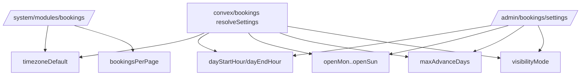

# I. Primer
## 1. TL;DR kiểu Feynman
- Bạn đúng: owner cấu hình đang lệch yêu cầu, cần kéo lại.
- `/system/modules/bookings` phải là nơi giữ **Timezone mặc định** + **Số lịch hẹn / trang**.
- `/admin/bookings/settings` chỉ giữ policy vận hành lịch: **giờ mở/đóng**, **ngày mở trong tuần**, **maxAdvanceDays**, và **visibilityMode** (theo xác nhận mới của bạn).
- Mình sẽ refactor lại backend `resolveSettings` để đọc đúng source owner theo phân quyền mới, không hardcode sai chỗ.
- Đồng thời rà toàn bộ microcopy UI booking để Việt hóa gọn, dễ hiểu, nhất quán.

## 2. Elaboration & Self-Explanation
Hiện tại code đang làm ngược ownership: system page bị rút quyền quá mức, còn admin settings lại cầm những field không đúng mong muốn của bạn. Kết quả là admin/system chồng chéo vai trò, khó vận hành.

Cách sửa đúng là tách **2 lớp cấu hình**:
- **System-level defaults** (toàn hệ thống): timezone + page size.
- **Booking operations policy** (vận hành lịch): giờ mở/đóng, ngày làm việc, giới hạn đặt trước, mức hiển thị lịch public.

Backend sẽ được chỉnh để khi tính availability/validate booking thì lấy policy từ `/admin/bookings/settings` (moduleSettings cùng moduleKey `bookings` nhưng đúng key), còn list admin pagination vẫn đọc `bookingsPerPage` từ system owner.

## 3. Concrete Examples & Analogies
- Ví dụ đúng sau khi sửa:
  - Vào `/system/modules/bookings`: chỉ thấy `Timezone mặc định`, `Số lịch hẹn / trang`.
  - Vào `/admin/bookings/settings`: thấy `Giờ mở cửa`, `Giờ đóng cửa`, `Mở Thứ 2...Chủ nhật`, `Số ngày đặt trước tối đa`, `Hiển thị lịch công khai`.
- Analogy: System giống “cài đặt nhà máy”, Admin Bookings Settings là “nội quy vận hành theo ca”.

# II. Audit Summary (Tóm tắt kiểm tra)
## 1. Observation (Quan sát)
- Ownership hiện tại đang sai với yêu cầu bạn vừa chốt.
- `resolveSettings` backend đang dùng default/fallback không khớp owner mới.
- UI text booking còn lẫn English (`Pending/Confirmed/Cancelled`) và wording chưa gọn.

## 2. Inference (Suy luận)
- Nếu không sửa owner trước, UI dù đẹp vẫn gây sai kỳ vọng vận hành.
- Cần một lần “realignment” rõ key nào thuộc system, key nào thuộc admin bookings settings.

## 3. Decision (Quyết định)
- Chốt theo yêu cầu mới của bạn:
  - System: `timezoneDefault`, `bookingsPerPage`.
  - Admin bookings settings: `dayStartHour`, `dayEndHour`, `openMon..openSun`, `maxAdvanceDays`, `visibilityMode`.

# III. Root Cause & Counter-Hypothesis (Nguyên nhân gốc & Giả thuyết đối chứng)
## 1. Root Cause Analysis
1) Triệu chứng: màn `/system/modules/bookings` vẫn giữ sai vai trò owner.
2) Phạm vi: system bookings config, admin bookings settings, convex bookings resolver, admin/public booking UI.
3) Tái hiện: ổn định qua route bạn report và cấu trúc key hiện tại.
4) Mốc thay đổi gần nhất: refactor trước đó đã dồn key quá tay sang một phía.
5) Dữ liệu thiếu: không thiếu, vì bạn đã chốt ownership rõ.
6) Giả thuyết thay thế: giữ như hiện tại và chỉ đổi label; không giải quyết gốc ownership.
7) Rủi ro fix sai nguyên nhân: config drift tiếp tục xảy ra, admin chỉnh sai chỗ.
8) Tiêu chí pass/fail: đúng owner đúng route, backend đọc đúng key, UI Việt hóa rõ ràng.

## 2. Counter-Hypothesis
- “Để tất cả key ở 1 trang cho đơn giản”: nhanh trước mắt nhưng trái yêu cầu và dễ vỡ phân quyền system/admin.

## 3. Root Cause Confidence
- **High** — yêu cầu bạn đã xác nhận cụ thể từng nhóm field.

# IV. Proposal (Đề xuất)
## 1. Ownership map sau khi sửa
- **System page owner**: `timezoneDefault`, `bookingsPerPage`.
- **Admin bookings settings owner**: `dayStartHour`, `dayEndHour`, `openMon..openSun`, `maxAdvanceDays`, `visibilityMode`.

## 2. Refactor kỹ thuật
- Khôi phục/điều chỉnh `bookingsModule` setting definitions để system page chỉ render 2 key system owner.
- Cập nhật `/admin/bookings/settings` để render đúng bộ policy owner bạn chốt.
- Cập nhật `convex/bookings.ts`:
  - `resolveSettings()` đọc `timezoneDefault` từ system owner key.
  - Đọc `maxAdvanceDays/dayStartHour/dayEndHour/openMon..openSun/visibilityMode` từ policy keys.
  - Bỏ fallback hardcoded gây override sai owner.
- Giữ nguyên UX month calendar admin/public, chỉ đồng bộ nhãn tiếng Việt và trạng thái hiển thị.

## 3. Việt hóa UI (gọn, dễ hiểu)
- Trạng thái: `Pending/Confirmed/Cancelled` → `Chờ xác nhận/Đã xác nhận/Đã hủy` (label UI; không đổi enum DB).
- Nút thao tác, mô tả, hint, empty state được rút chữ theo nguyên tắc clarity > decoration.

# V. Files Impacted (Tệp bị ảnh hưởng)
## 1. Sửa: UI
- `app/system/modules/bookings/page.tsx`  
Vai trò hiện tại: surface config module bookings trong system.  
Thay đổi: chỉ hiển thị 2 setting system owner (timezone, page size), bỏ phần không thuộc owner.

- `app/admin/bookings/settings/page.tsx`  
Vai trò hiện tại: cài đặt lịch admin.  
Thay đổi: nhận owner policy đầy đủ (giờ mở/đóng, open days, maxAdvanceDays, visibilityMode), microcopy Việt hóa.

- `app/admin/bookings/page.tsx`  
Vai trò hiện tại: vận hành lịch hẹn theo month calendar.  
Thay đổi: chuẩn hóa nhãn tiếng Việt trạng thái/filter/empty state.

- `app/(site)/book/page.tsx`  
Vai trò hiện tại: đặt lịch public theo month calendar + slot list.  
Thay đổi: Việt hóa kỹ wording và đồng bộ logic hiển thị theo visibilityMode.

## 2. Sửa: Shared/Config/Server
- `lib/modules/configs/bookings.config.ts`  
Vai trò hiện tại: định nghĩa settings module bookings.  
Thay đổi: tái phân bổ key theo owner map đã chốt.

- `convex/bookings.ts`  
Vai trò hiện tại: source of truth availability/create/list booking.  
Thay đổi: `resolveSettings` đọc đúng key theo owner, bỏ fallback gây lệch hành vi.

# VI. Execution Preview (Xem trước thực thi)
1. Audit lại key map trong `bookings.config.ts`.
2. Chỉnh system page render đúng 2 key owner.
3. Chỉnh admin settings page render đúng 5 nhóm policy owner.
4. Nối lại `setModuleSetting/listModuleSettings` theo key mới.
5. Sửa `resolveSettings` backend để map key chính xác.
6. Việt hóa toàn bộ text booking admin/public.
7. Static review + `bunx tsc --noEmit` + commit.

# VII. Verification Plan (Kế hoạch kiểm chứng)
- Vào `/system/modules/bookings`: chỉ thấy **Timezone mặc định**, **Số lịch hẹn / trang**.
- Vào `/admin/bookings/settings`: thấy đúng **giờ mở/đóng**, **openMon..openSun**, **maxAdvanceDays**, **visibilityMode**.
- `/admin/bookings` và `/book` vẫn chạy month calendar + slot list bình thường.
- Kiểm chứng behavior:
  - đóng Thứ 7/CN thì không chọn được ngày đó;
  - maxAdvanceDays giới hạn ngày hợp lệ;
  - visibilityMode ảnh hưởng UI public đúng kỳ vọng.
- `bunx tsc --noEmit` pass.

# VIII. Todo
1. Realign ownership key bookings theo map đã chốt.
2. Sửa system bookings config page (2 field owner).
3. Sửa admin bookings settings page (policy fields).
4. Cập nhật `convex/bookings.ts` resolveSettings.
5. Việt hóa microcopy booking admin/public.
6. Review tĩnh + typecheck.
7. Commit (kèm `.factory/docs`).

# IX. Acceptance Criteria (Tiêu chí chấp nhận)
- Owner đúng route đúng field theo yêu cầu bạn vừa xác nhận.
- Không còn tình trạng `/system/modules/bookings` nắm policy vận hành giờ/ngày.
- `/admin/bookings/settings` nắm đầy đủ policy vận hành lịch.
- UI tiếng Việt gọn, dễ hiểu, nhất quán ở admin/public booking.

# X. Risk / Rollback (Rủi ro / Hoàn tác)
- Rủi ro: map key sai có thể làm availability lệch 1-2 ngày/khung giờ.
- Giảm thiểu: verify theo checklist route + case Thứ 7/CN + maxAdvanceDays + visibilityMode.
- Rollback: tách commit theo lớp (config/page/backend/text) để revert cục bộ nhanh.

# XI. Out of Scope (Ngoài phạm vi)
- Không đổi schema DB bookings/services.
- Không thêm workflow notification/reminder.
- Không thay state machine booking enum trong DB.

# XII. Open Questions (Câu hỏi mở)
- Không còn: các quyết định owner đã được bạn chốt rõ.